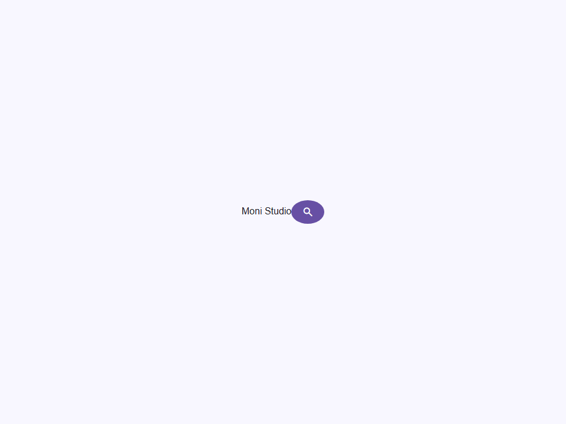

# App Bar

Componente Material Design 3 App Bar.

Las barras de aplicación proporcionan navegación y controles de acción en la parte superior (o inferior) de una
pantalla. Se posicionan fijas (sticky) por defecto para que permanezcan visibles mientras el
usuario hace scroll a través del contenido.

**Referencia de la especificación M3:** `m3-docs/components/app-bars/specs.md`

**Posicionamiento:**
- `top` (por defecto) — Encabezado de 64dp fijo arriba del contenido de la página. Usa `position: sticky`
  con `inset-block-start: 0` para que se mantenga en la parte superior del contenedor.
- `bottom` — Pie de navegación móvil anclado a la parte inferior de la ventana.
  Ideal para albergar iconos de navegación primarios y un botón FAB opcional.

**Variantes:**
- `standard` — Superficie plana (sin sombra) cuando el contenido está arriba. Ideal para la mayoría de UIs.
- `floating` — Siempre elevada con sombra `--elevate2`. Úsalo cuando la barra visualmente
  flota sobre el contenido independientemente de la posición del scroll.

**Tamaños:**
- `default` — 64dp (4rem) de alto. Estándar para la mayoría de casos de uso.
- `prominent` — 152dp (9.5rem) de alto. Úsalo cuando se necesita un subtítulo o un área expandida.
  El atributo `subtitle` solo se renderiza en este tamaño.

- Tag: `moni-app-bar`
- Clase: `MoniAppBar`
- Fuente: `src/components/moni-app-bar.ts`

## Cuándo usarlo

Usa `moni-app-bar` cuando la interfaz necesite el patrón que describe este componente. Antes de elegirlo, revisa sus estados, contenido permitido y comportamiento accesible; las capturas del final muestran el resultado real de cada variante.

## Uso básico

```html
<!-- Top app bar con icono de navegación y botones de acción -->
<moni-app-bar title="Ajustes">
  <moni-button slot="leading" shape="circle" variant="text" icon="menu"></moni-button>
  <moni-button slot="trailing" shape="circle" variant="text" icon="search"></moni-button>
  <moni-button slot="trailing" shape="circle" variant="text" icon="more_vert"></moni-button>
</moni-app-bar>
```

## Ejemplo práctico con Tailwind CSS v4

Tailwind controla composición, ancho, espaciado y responsividad alrededor del Web Component. Moni UI conserva el aspecto interno mediante Shadow DOM y design tokens.

```html
<div class="mx-auto flex w-full max-w-md flex-col gap-4 p-6">
  <moni-app-bar></moni-app-bar>
</div>
```

No necesitas un plugin de Tailwind. En tu CSS v4 importa ambas capas una sola vez:

```css
@import "tailwindcss";
@import "@moni-labs/moni-ui/styles";

@theme {
  --font-sans: Inter, ui-sans-serif, system-ui, sans-serif;
}
```

Las utilities aplicadas directamente al tag afectan su caja anfitriona. No uses selectores Tailwind para asumir acceso al DOM interno; personaliza únicamente con los CSS Parts y Custom Properties públicos enumerados más abajo.

## Recomendaciones

- Usa `moni-app-bar` para su propósito semántico; no lo sustituyas por un `div` estilizado.
- Aplica Tailwind al layout exterior. Para el interior del Shadow DOM usa las variables CSS y `::part()` documentados.
- Prueba los estados claro, oscuro, foco por teclado, deshabilitado y viewport móvil antes de publicar.

## Propiedades y atributos

| Atributo | Propiedad | Tipo | Default | Descripción |
|---|---|---|---|---|
| `placement` | `placement` | `'top' \| 'bottom'` | `'top'` | Determina si la barra se coloca en la parte superior o inferior de la pantalla.  - `'top'` (por defecto) — Encabezado pegajoso (sticky) en la parte superior del contenedor de scroll. - `'bottom'` — Pie fijo; usado principalmente para patrones de navegación inferior móvil. |
| `variant` | `variant` | `'standard' \| 'floating'` | `'standard'` | Variante visual de la app bar.  - `'standard'` (por defecto) — Superficie plana. Sin sombra en reposo; gana sombra   programáticamente a través del atributo `elevated` cuando el contenido se desplaza por debajo de ella. - `'floating'` — Permanentemente elevada con sombra `--elevate2`. |
| `size` | `size` | `'default' \| 'prominent'` | `'default'` | Variante de altura de la app bar.  - `'default'` — 64dp (4rem). Altura estándar de la top app bar de M3. - `'prominent'` — 152dp (9.5rem). Úsalo cuando se muestra un subtítulo o cuando   se necesita espacio vertical adicional para una fila de acciones contextuales. |
| `title` | `title` | `string` | `''` | Texto del título mostrado en el centro de la app bar.  El título está alineado al centro según la especificación de M3. Los títulos largos se truncan con puntos suspensivos. Para un HTML semántico, el consumidor también debería proporcionar un `<h1>` en el contenido de la página que coincida con este título. |
| `subtitle` | `subtitle` | `string` | `''` | Subtítulo opcional mostrado debajo del título.  Solo se renderiza cuando `size="prominent"`. Proporciona contexto secundario (ej. nombre de carpeta, recuento de elementos, descripción). |
| `elevated` | `elevated` | `boolean` | `false` | Cuando está presente, aplica una sombra `--elevate2` para señalar que el contenido se ha desplazado por debajo de la barra.  Los consumidores son responsables de alternar este atributo reactivamente basándose en la posición de desplazamiento (scroll) del área de contenido principal: ```ts container.addEventListener('scroll', () => {   appBar.elevated = container.scrollTop > 0; }); ``` |

## Slots

- `leading`: Icono(s) de navegación colocados en el borde inicial (start).
- `trailing`: Icono(s) de acción colocados en el borde final (end).
- `fab`: FAB anclado al borde final (solo con posición inferior).
- `default`: Contenido adicional (ej. una barra de pestañas debajo de la fila del título).

## Eventos

No declara eventos propios.

## Métodos públicos

No expone métodos públicos adicionales.

## CSS Parts

- `bar`: Parte interna personalizable.
- `leading`: Parte interna personalizable.
- `trailing`: Parte interna personalizable.
- `title`: Parte interna personalizable.
- `subtitle`: Parte interna personalizable.
- `actions`: Parte interna personalizable.

## CSS Custom Properties consumidas

- `--elevate2`
- `--font`
- `--on-surface`
- `--on-surface-variant`
- `--speed2`
- `--surface`

## Referencia visual por variable

Cada imagen se genera con el componente real: cambia solo la variable indicada y mantiene estable el resto del escenario. Úsala para comparar estados, no como sustituto de la API.

### `placement`

Determina si la barra se coloca en la parte superior o inferior de la pantalla.

- `'top'` (por defecto) — Encabezado pegajoso (sticky) en la parte superior del contenedor de scroll.
- `'bottom'` — Pie fijo; usado principalmente para patrones de navegación inferior móvil.


### `variant`

Variante visual de la app bar.

- `'standard'` (por defecto) — Superficie plana. Sin sombra en reposo; gana sombra
  programáticamente a través del atributo `elevated` cuando el contenido se desplaza por debajo de ella.
- `'floating'` — Permanentemente elevada con sombra `--elevate2`.


### `size`

Variante de altura de la app bar.

- `'default'` — 64dp (4rem). Altura estándar de la top app bar de M3.
- `'prominent'` — 152dp (9.5rem). Úsalo cuando se muestra un subtítulo o cuando
  se necesita espacio vertical adicional para una fila de acciones contextuales.


### `title`

Texto del título mostrado en el centro de la app bar.

El título está alineado al centro según la especificación de M3. Los títulos largos se truncan con
puntos suspensivos. Para un HTML semántico, el consumidor también debería proporcionar un `<h1>`
en el contenido de la página que coincida con este título.


### `subtitle`

Subtítulo opcional mostrado debajo del título.

Solo se renderiza cuando `size="prominent"`. Proporciona contexto secundario
(ej. nombre de carpeta, recuento de elementos, descripción).


### `elevated`

Cuando está presente, aplica una sombra `--elevate2` para señalar que el contenido se
ha desplazado por debajo de la barra.

Los consumidores son responsables de alternar este atributo reactivamente basándose en
la posición de desplazamiento (scroll) del área de contenido principal:
```ts
container.addEventListener('scroll', () => {
  appBar.elevated = container.scrollTop > 0;
});
```



