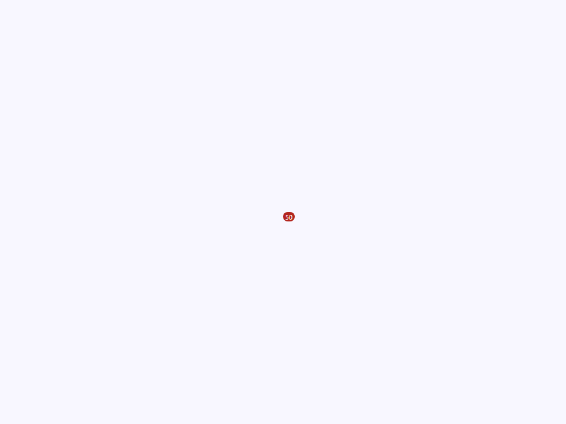
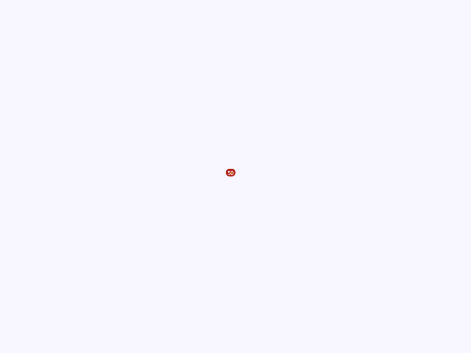
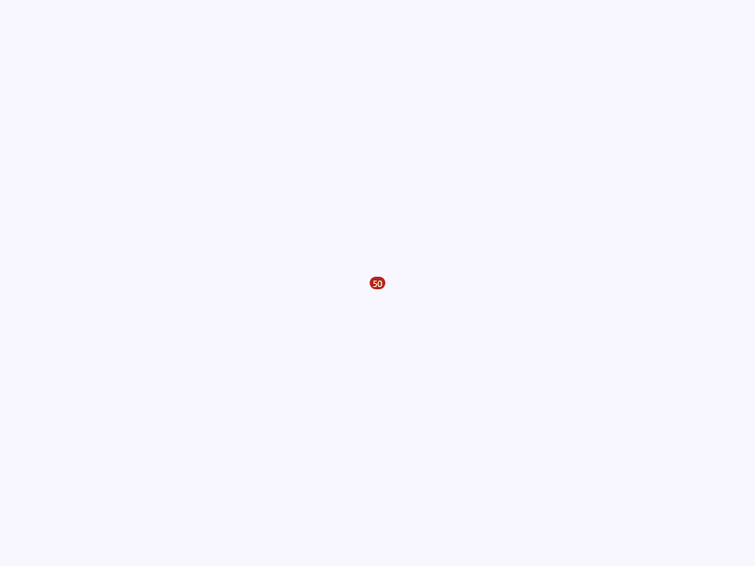
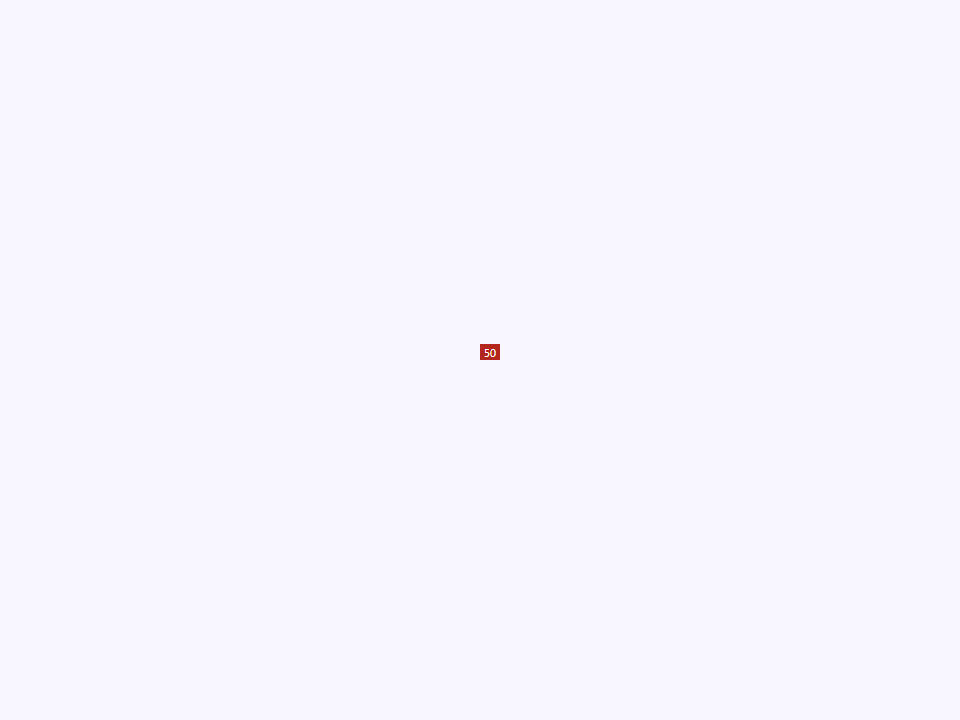
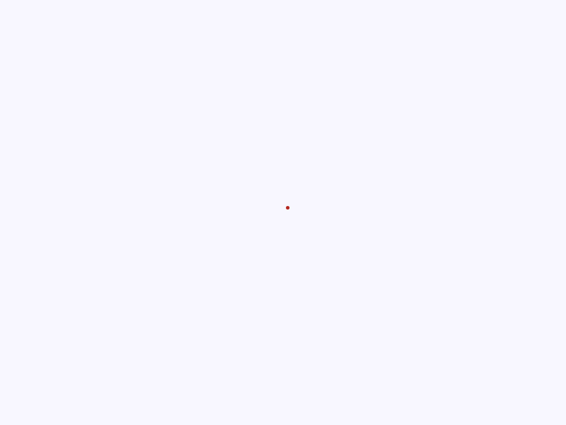
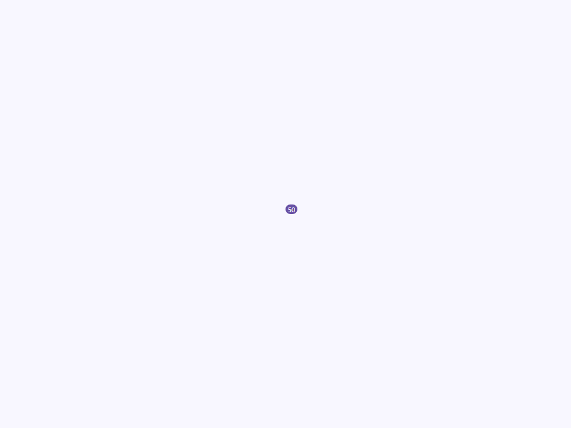
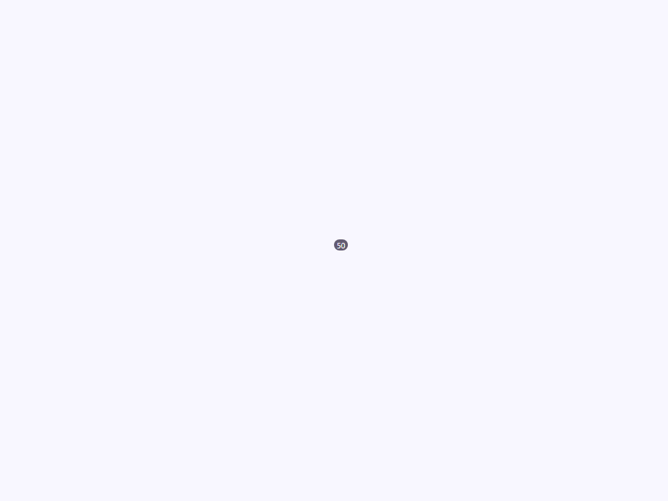
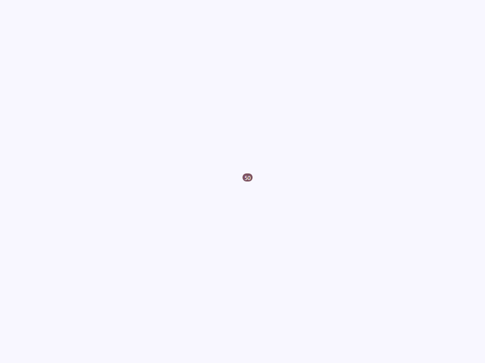
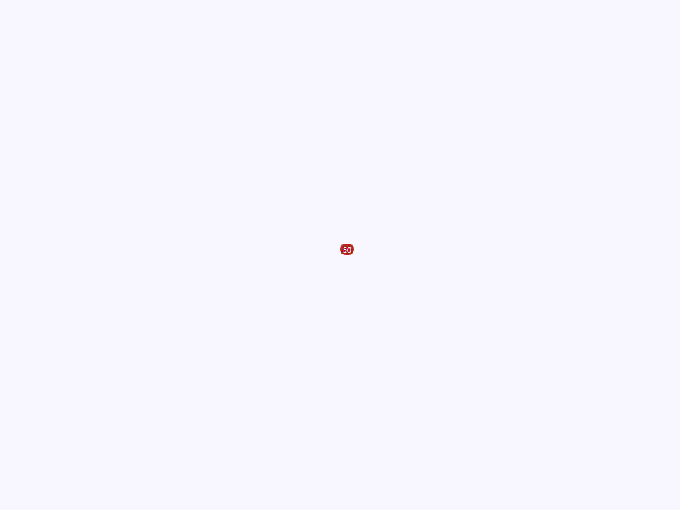
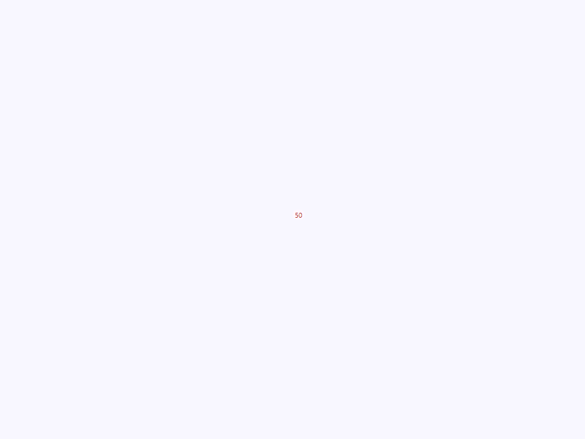

# Badge

Componente Material Design 3 Badge.

Los badges son pequeños descriptores de estado anclados a un elemento padre, usados para
transmitir información suplementaria como un conteo de notificaciones, estado
en línea, o indicador de selección.

**Contrato de posicionamiento:**
El badge usa `position: absolute` y se ancla al elemento padre.
En `connectedCallback`, si el `position` computado del padre es `'static'`,
el badge automáticamente establece `parent.style.position = 'relative'`.
Los consumidores no necesitan añadir manualmente `position: relative` al padre.

**Modelo de renderizado:**
El `:host` se muestra como `contents`, haciéndolo transparente para el layout.
Solo el span interior `.badge` se renderiza visualmente. Esto permite que el badge
se inserte dentro de cualquier elemento sin afectar su flujo de layout.

- Tag: `moni-badge`
- Clase: `MoniBadge`
- Fuente: `src/components/moni-badge.ts`

## Cuándo usarlo

Usa `moni-badge` cuando la interfaz necesite el patrón que describe este componente. Antes de elegirlo, revisa sus estados, contenido permitido y comportamiento accesible; las capturas del final muestran el resultado real de cada variante.

## Uso básico

```html
<!-- Badge de notificación en un botón -->
<div style="position: relative; display: inline-flex;">
  <moni-button icon="notifications" variant="text"></moni-button>
  <moni-badge value="5"></moni-badge>
</div>
```

## Ejemplo práctico con Tailwind CSS v4

Tailwind controla composición, ancho, espaciado y responsividad alrededor del Web Component. Moni UI conserva el aspecto interno mediante Shadow DOM y design tokens.

```html
<div class="mx-auto flex w-full max-w-md flex-col gap-4 p-6">
  <moni-badge></moni-badge>
</div>
```

No necesitas un plugin de Tailwind. En tu CSS v4 importa ambas capas una sola vez:

```css
@import "tailwindcss";
@import "@moni-labs/moni-ui/styles";

@theme {
  --font-sans: Inter, ui-sans-serif, system-ui, sans-serif;
}
```

Las utilities aplicadas directamente al tag afectan su caja anfitriona. No uses selectores Tailwind para asumir acceso al DOM interno; personaliza únicamente con los CSS Parts y Custom Properties públicos enumerados más abajo.

## Recomendaciones

- Usa `moni-badge` para su propósito semántico; no lo sustituyas por un `div` estilizado.
- Aplica Tailwind al layout exterior. Para el interior del Shadow DOM usa las variables CSS y `::part()` documentados.
- En formularios controlados, sincroniza la propiedad `value` y escucha el evento documentado; no dependas solo del atributo inicial.
- Prueba los estados claro, oscuro, foco por teclado, deshabilitado y viewport móvil antes de publicar.

## Propiedades y atributos

| Atributo | Propiedad | Tipo | Default | Descripción |
|---|---|---|---|---|
| `value` | `value` | `string` | `''` | Contenido de texto de la etiqueta del badge.  También acepta contenido en el slot — el slot por defecto dentro del span del badge usa este valor cuando no hay hijos proporcionados en el slot. Usa un string vacío con `shape="min"` para renderizar un badge de solo punto. |
| `position` | `position` | `'top' \| 'bottom' \| 'left' \| 'right' \| 'none' \| ''` | `''` | Posición de anclaje relativa a los bordes del elemento padre.  Usa `inset: 50% auto auto 50%` como base y ajusta la traslación: - `''` (por defecto) — esquina superior derecha (translate: 0, -100%). - `'top'`    — igual que por defecto, alias explícito. - `'bottom'` — esquina inferior derecha (translate: 0, 0). - `'left'`   — esquina superior izquierda (translate: -100%, -100%). - `'right'`  — esquina superior derecha (translate: 0, -100%). - `'none'`   — deshabilita el posicionamiento absoluto; ver también el atributo `inline`. |
| `shape` | `shape` | `'circle' \| 'square' \| 'min' \| ''` | `''` | Forma del contenedor del badge.  - `''` (por defecto) — Forma de píldora redondeada (border-radius: 1rem). - `'circle'`     — Alias para píldora; el badge siempre es circular cuando el                    contenido es un solo carácter o está ausente. - `'square'`     — Sin border-radius (badge angular). - `'min'`        — Solo punto; el contenido se oculta mediante `display: none` y la                    forma se recorta a un círculo pequeño mediante `clip-path`. |
| `color` | `color` | `'primary' \| 'secondary' \| 'tertiary' \| 'error'` | `'error'` | Rol de color semántico del badge.  Se asigna a los roles de la paleta de colores M3: - `'error'` (por defecto) — Rojo; estándar para conteos de notificaciones y alertas. - `'primary'`         — Color primario de la marca; para estados activos o de selección. - `'secondary'`       — Acento secundario; para indicadores suplementarios. - `'tertiary'`        — Acento terciario; para badges decorativos o informativos. |
| `inline` | `inline` | `boolean` | `false` | Cuando es `true`, el badge se renderiza en línea (restablece `position: absolute` a `position: relative`) en lugar de anclarse al padre.  Equivalente a la clase `.badge.none` de BeerCSS. Úsalo para indicadores de estado en línea que fluyen dentro de texto o contenedores flex. |
| `border` | `border` | `boolean` | `false` | Cuando está presente, renderiza el badge con un estilo delineado: - El fondo se convierte en `--surface` (igual que el fondo de la página). - El borde y el color del texto usan el token de color de la paleta (ej. `--error`).  Equivalente a la clase `.badge.border` de BeerCSS. |

## Slots

Este componente no declara slots públicos.

## Eventos

No declara eventos propios.

## Métodos públicos

No expone métodos públicos adicionales.

## CSS Parts

- `badge`: Parte interna personalizable.

## CSS Custom Properties consumidas

- `--_x`
- `--_y`
- `--error`
- `--font`
- `--on-error`
- `--on-primary`
- `--on-secondary`
- `--on-tertiary`
- `--primary`
- `--secondary`
- `--surface`
- `--tertiary`

## Referencia visual por variable

Cada imagen se genera con el componente real: cambia solo la variable indicada y mantiene estable el resto del escenario. Úsala para comparar estados, no como sustituto de la API.

### `value`

Contenido de texto de la etiqueta del badge.

También acepta contenido en el slot — el slot por defecto dentro del span del badge
usa este valor cuando no hay hijos proporcionados en el slot.
Usa un string vacío con `shape="min"` para renderizar un badge de solo punto.


### `position`

Posición de anclaje relativa a los bordes del elemento padre.

Usa `inset: 50% auto auto 50%` como base y ajusta la traslación:
- `''` (por defecto) — esquina superior derecha (translate: 0, -100%).
- `'top'`    — igual que por defecto, alias explícito.
- `'bottom'` — esquina inferior derecha (translate: 0, 0).
- `'left'`   — esquina superior izquierda (translate: -100%, -100%).
- `'right'`  — esquina superior derecha (translate: 0, -100%).
- `'none'`   — deshabilita el posicionamiento absoluto; ver también el atributo `inline`.










### `shape`

Forma del contenedor del badge.

- `''` (por defecto) — Forma de píldora redondeada (border-radius: 1rem).
- `'circle'`     — Alias para píldora; el badge siempre es circular cuando el
                   contenido es un solo carácter o está ausente.
- `'square'`     — Sin border-radius (badge angular).
- `'min'`        — Solo punto; el contenido se oculta mediante `display: none` y la
                   forma se recorta a un círculo pequeño mediante `clip-path`.







### `color`

Rol de color semántico del badge.

Se asigna a los roles de la paleta de colores M3:
- `'error'` (por defecto) — Rojo; estándar para conteos de notificaciones y alertas.
- `'primary'`         — Color primario de la marca; para estados activos o de selección.
- `'secondary'`       — Acento secundario; para indicadores suplementarios.
- `'tertiary'`        — Acento terciario; para badges decorativos o informativos.








### `inline`

Cuando es `true`, el badge se renderiza en línea (restablece `position: absolute` a
`position: relative`) en lugar de anclarse al padre.

Equivalente a la clase `.badge.none` de BeerCSS. Úsalo para indicadores de estado en línea
que fluyen dentro de texto o contenedores flex.




### `border`

Cuando está presente, renderiza el badge con un estilo delineado:
- El fondo se convierte en `--surface` (igual que el fondo de la página).
- El borde y el color del texto usan el token de color de la paleta (ej. `--error`).

Equivalente a la clase `.badge.border` de BeerCSS.



