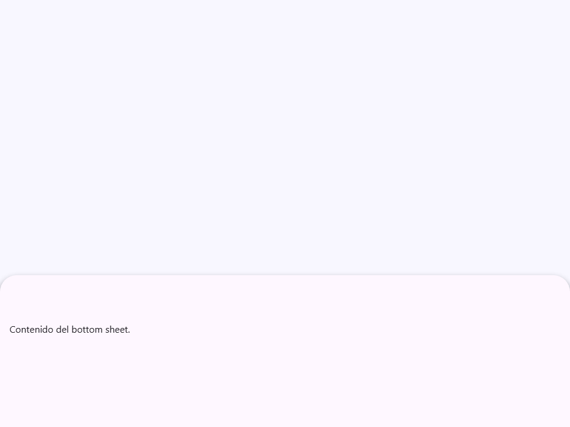
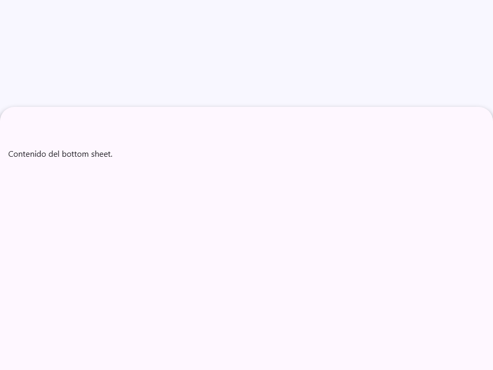
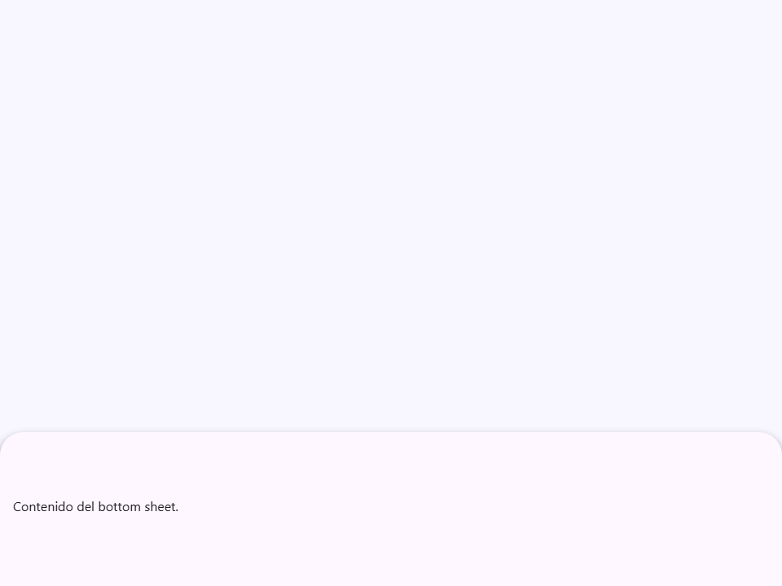
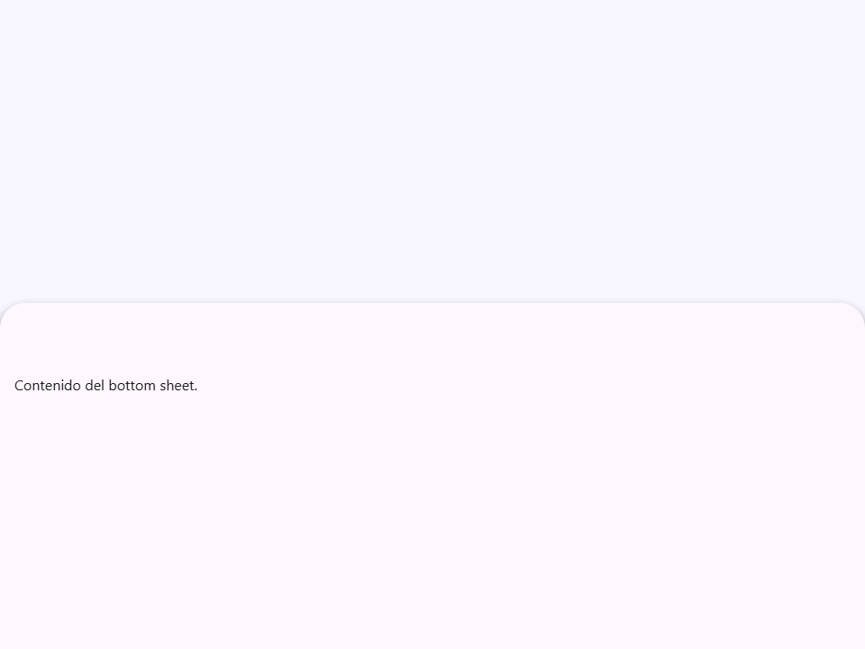
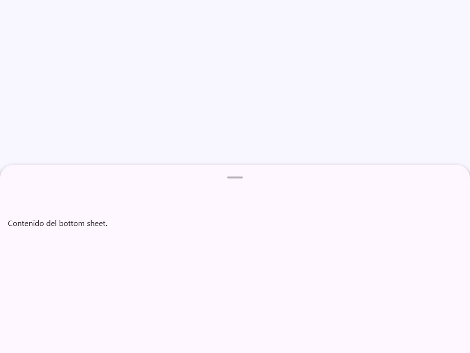
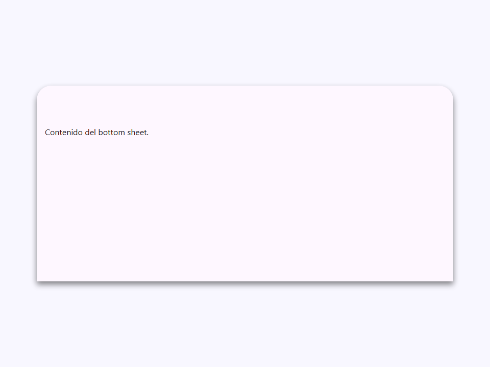

# Bottom Sheet

Componente Material Design 3 Bottom Sheet.

Los bottom sheets son superficies ancladas a la parte inferior de la pantalla que
complementan la vista principal. Muestran contenido complementario, acciones
contextuales, o flujos de tareas sin ocultar por completo el contenido principal.

**Referencia de la especificación M3:** `m3-docs/components/sheets-bottom/specs.md`

**Nota de implementación — elemento nativo `<dialog>`:**
Al igual que `<moni-dialog>`, este componente envuelve el elemento nativo `<dialog>`.
La propiedad `open` controla `dialog.showModal()` / `dialog.close()`. Cuando
`modal=true` (por defecto), se renderiza automáticamente un fondo `::backdrop`.

**Teletransportación (montaje a nivel del body):**
Cuando `positioning="body"` (por defecto), el componente se mueve a
`document.body` en `connectedCallback` para que el diálogo inferior fijo se renderice
por encima de todos los contextos de apilamiento. En `disconnectedCallback`, se mueve de nuevo
a su posición original en el DOM. Esto evita el recorte por un ancestro con `overflow: hidden`
o `transform`.

**Tamaños:**
- `small`  — Hoja compacta; adecuada para menús de acciones simples.
- `medium` — Altura estándar (por defecto).
- `large`  — Altura expandida (`expandedHeight` controla el block-size máximo).
- `auto`   — Altura impulsada por el contenido.

- Tag: `moni-bottom-sheet`
- Clase: `MoniBottomSheet`
- Fuente: `src/components/moni-bottom-sheet.ts`

## Cuándo usarlo

Usa `moni-bottom-sheet` cuando la interfaz necesite el patrón que describe este componente. Antes de elegirlo, revisa sus estados, contenido permitido y comportamiento accesible; las capturas del final muestran el resultado real de cada variante.

## Uso básico

```html
<moni-bottom-sheet title="Compartir" handle>
  <moni-list-item icon="share">Copiar enlace</moni-list-item>
  <moni-list-item icon="mail">Enviar por correo</moni-list-item>
</moni-bottom-sheet>

<script>
  document.querySelector('moni-bottom-sheet').open = true;
</script>
```

## Ejemplo práctico con Tailwind CSS v4

Tailwind controla composición, ancho, espaciado y responsividad alrededor del Web Component. Moni UI conserva el aspecto interno mediante Shadow DOM y design tokens.

```html
<div class="mx-auto flex w-full max-w-md flex-col gap-4 p-6">
  <moni-bottom-sheet></moni-bottom-sheet>
</div>
```

No necesitas un plugin de Tailwind. En tu CSS v4 importa ambas capas una sola vez:

```css
@import "tailwindcss";
@import "@moni-labs/moni-ui/styles";

@theme {
  --font-sans: Inter, ui-sans-serif, system-ui, sans-serif;
}
```

Las utilities aplicadas directamente al tag afectan su caja anfitriona. No uses selectores Tailwind para asumir acceso al DOM interno; personaliza únicamente con los CSS Parts y Custom Properties públicos enumerados más abajo.

## Recomendaciones

- Usa `moni-bottom-sheet` para su propósito semántico; no lo sustituyas por un `div` estilizado.
- Aplica Tailwind al layout exterior. Para el interior del Shadow DOM usa las variables CSS y `::part()` documentados.
- Mantén el estado de apertura en una única fuente de verdad y devuelve el foco al disparador al cerrar.
- Prueba los estados claro, oscuro, foco por teclado, deshabilitado y viewport móvil antes de publicar.

## Propiedades y atributos

| Atributo | Propiedad | Tipo | Default | Descripción |
|---|---|---|---|---|
| `open` | `open` | `boolean` | `false` | Controla el estado abierto/cerrado del bottom sheet.  Cuando se establece en `true`, llama a `dialog.showModal()` o `dialog.show()` dependiendo de la propiedad `modal`. Cuando se establece en `false`, llama a `dialog.close()`. |
| `size` | `size` | `'small' \| 'medium' \| 'large' \| 'auto'` | `'medium'` | Variante de altura del contenedor de la hoja.  - `'small'`  — Compacta; adecuada para confirmaciones rápidas. - `'medium'` — Altura estándar (por defecto). - `'large'`  — Llena el `expandedHeight` de la ventana gráfica. - `'auto'`   — Depende del contenido; la altura se adapta al contenido en el slot. |
| `modal` | `modal` | `boolean` | `true` | Cuando es `true` (por defecto), la hoja se abre como un diálogo modal con un fondo translúcido (scrim). Cuando es `false`, se abre como una superposición no modal sin scrim. |
| `title` | `title` | `string` | `''` | Texto de encabezado mostrado en el área del encabezado de la hoja. |
| `handle` | `handle` | `boolean` | `false` | Muestra el indicador visual de arrastre en la parte superior de la hoja.  El asa es opcional según la especificación M3. Su indicador mide 32 × 4dp, pero la zona interactiva ocupa todo el ancho y 48dp de alto para facilitar el agarre. El encabezado continúa admitiendo gestos de arrastre aunque el indicador esté oculto. |
| `positioning` | `positioning` | `'body' \| 'fixed' \| 'absolute' \| 'static'` | `'fixed'` | Controla cómo se posiciona la hoja en el documento.  - `'body'` (por defecto) — Teletransporta el elemento a `document.body` para que   la superposición fija se renderice por encima de todos los contextos de apilamiento. - `'fixed'` — Posicionamiento fijo dentro de su subárbol DOM actual. - `'absolute'` — Absoluto dentro del ancestro posicionado más cercano. - `'static'` — Flujo estático (rara vez necesario; solo para pruebas). |
| `expanded-height` | `expandedHeight` | `string` | `'85%'` | Block-size (altura) máximo de la hoja cuando `size="large"`.  Acepta cualquier valor válido de `max-block-size` en CSS (ej. `'85%'`, `'600px'`). Por defecto es `'85%'` que es el máximo recomendado por M3 para bottom sheets en pantallas compactas. |
| `max-width` | `maxWidth` | `string` | `''` | Restricción opcional de inline-size (ancho) máximo para la hoja.  Cuando se establece (ej. `'640px'`), la hoja no excederá este ancho incluso en pantallas anchas. Útil para puntos de interrupción de tableta/escritorio donde se prefiere un modal centrado en lugar de una hoja de ancho completo. |

## Slots

- `default`: El contenido principal del bottom sheet.
- `handle`: El área del asa de arrastre en la parte superior.
- `footer`: Botones de acción en la parte inferior de la hoja.

## Eventos

No declara eventos propios.

## Métodos públicos

No expone métodos públicos adicionales.

## CSS Parts

- `dialog`: Parte interna personalizable.
- `header`: Parte interna personalizable.
- `body`: El área de contenido principal desplazable (scrollable).
- `footer`: Parte interna personalizable.
- `content`: Parte interna personalizable.

## CSS Custom Properties consumidas

- `--_padding`
- `--elevate3`
- `--moni-bottom-sheet-expanded-height`
- `--moni-bottom-sheet-max-width`
- `--on-surface`
- `--on-surface-variant`
- `--speed3`
- `--surface`

## Referencia visual por variable

Cada imagen se genera con el componente real: cambia solo la variable indicada y mantiene estable el resto del escenario. Úsala para comparar estados, no como sustituto de la API.

### `open`

Controla el estado abierto/cerrado del bottom sheet.

Cuando se establece en `true`, llama a `dialog.showModal()` o `dialog.show()`
dependiendo de la propiedad `modal`. Cuando se establece en `false`, llama a `dialog.close()`.


### `size`

Variante de altura del contenedor de la hoja.

- `'small'`  — Compacta; adecuada para confirmaciones rápidas.
- `'medium'` — Altura estándar (por defecto).
- `'large'`  — Llena el `expandedHeight` de la ventana gráfica.
- `'auto'`   — Depende del contenido; la altura se adapta al contenido en el slot.








### `modal`

Cuando es `true` (por defecto), la hoja se abre como un diálogo modal con un
fondo translúcido (scrim). Cuando es `false`, se abre como una superposición no modal sin scrim.




### `title`

Texto de encabezado mostrado en el área del encabezado de la hoja.


### `handle`

Muestra el indicador visual de arrastre en la parte superior de la hoja.

El asa es opcional según la especificación M3. Su indicador mide 32 × 4dp,
pero la zona interactiva ocupa todo el ancho y 48dp de alto para facilitar
el agarre. El encabezado continúa admitiendo gestos de arrastre aunque el
indicador esté oculto.




### `positioning`

Controla cómo se posiciona la hoja en el documento.

- `'body'` (por defecto) — Teletransporta el elemento a `document.body` para que
  la superposición fija se renderice por encima de todos los contextos de apilamiento.
- `'fixed'` — Posicionamiento fijo dentro de su subárbol DOM actual.
- `'absolute'` — Absoluto dentro del ancestro posicionado más cercano.
- `'static'` — Flujo estático (rara vez necesario; solo para pruebas).




### `expanded-height`

Block-size (altura) máximo de la hoja cuando `size="large"`.

Acepta cualquier valor válido de `max-block-size` en CSS (ej. `'85%'`, `'600px'`).
Por defecto es `'85%'` que es el máximo recomendado por M3 para bottom sheets
en pantallas compactas.


### `max-width`

Restricción opcional de inline-size (ancho) máximo para la hoja.

Cuando se establece (ej. `'640px'`), la hoja no excederá este ancho incluso en
pantallas anchas. Útil para puntos de interrupción de tableta/escritorio donde se prefiere
un modal centrado en lugar de una hoja de ancho completo.


