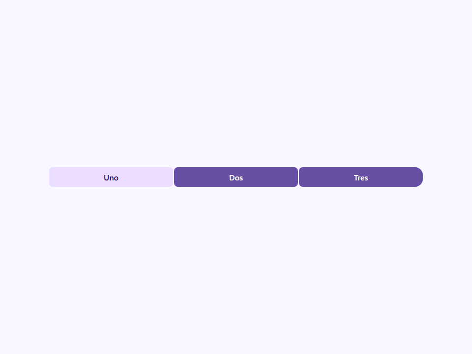
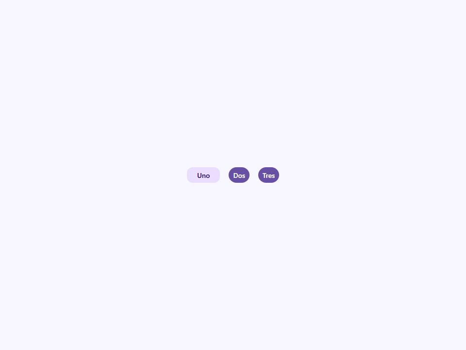
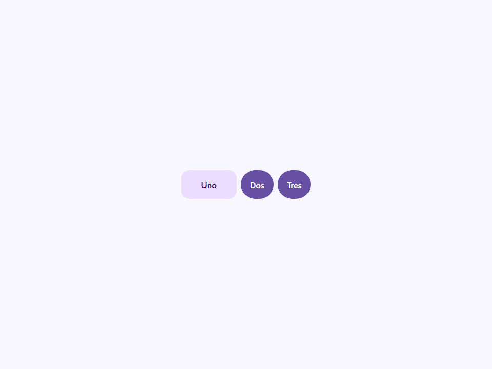
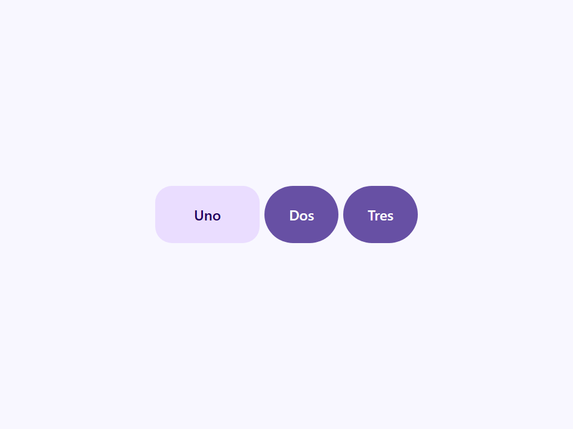
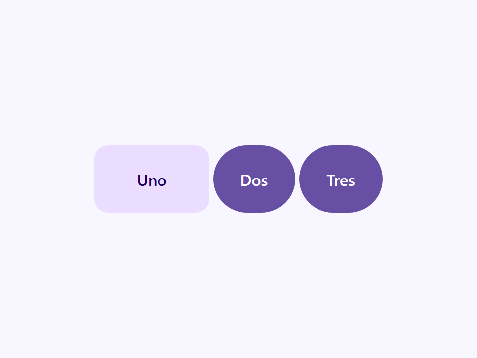
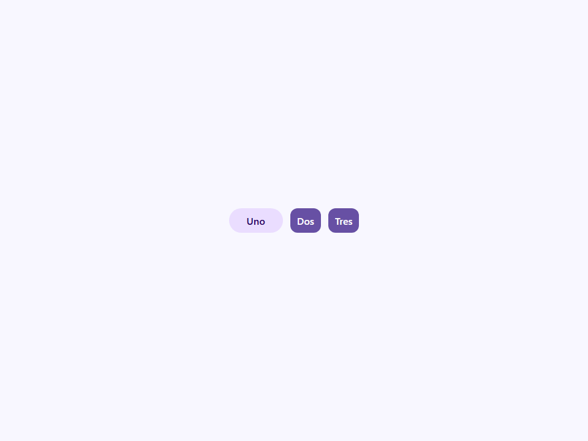
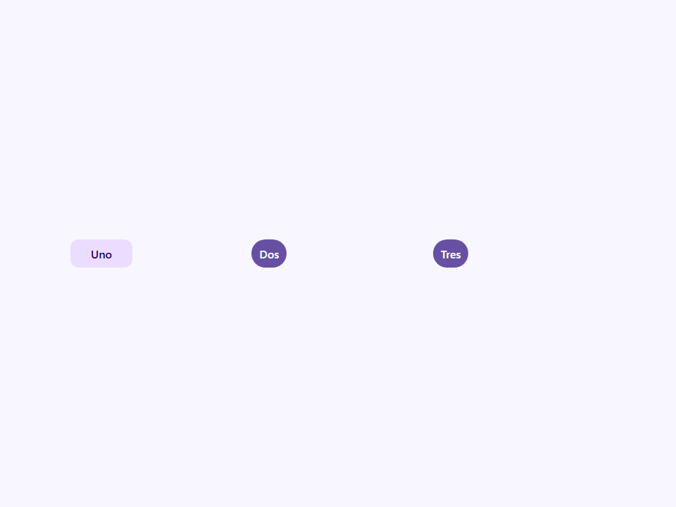
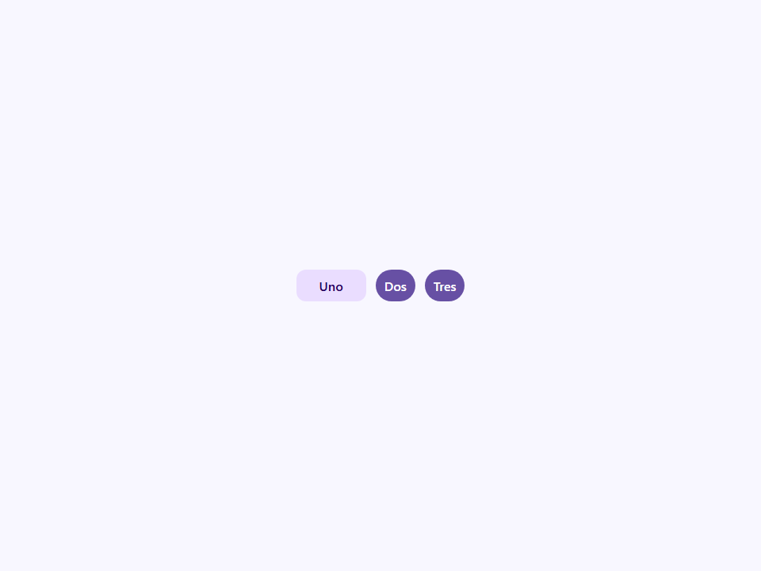

# Button Group

Componente Material Design 3 Button Group.

Organiza múltiples componentes `<moni-button>` o `<moni-icon-button>`
en una sola fila.

**Variantes:**
- `standard` (por defecto) — Una fila flex simple con un espacio entre botones.
- `connected` — El reemplazo de M3 Expressive para los botones segmentados. En este
  modo, los botones comparten bordes y forman una sola forma de píldora continua. El
  grupo gestiona el estado de selección única/múltiple de sus hijos.

**Detalles de la variante `connected`:**
- **Propagación de forma:** El grupo propaga automáticamente las clases de forma M3
  (`left-round-flat`, `no-round`, `right-round-flat`) a sus hijos para
  que se entrelacen sin problemas.
- **Gestión del interruptor:** El grupo escucha los clics de los hijos y cambia sus
  atributos `active`. Cuando `multi=false` (por defecto), solo un botón puede estar
  activo a la vez (comportamiento de radio button). Cuando `multi=true`, múltiples botones
  pueden estar activos (comportamiento de checkbox).
- **Propagación de eventos:** Dispara un evento `'change'` cuando la selección cambia.

**Accesibilidad:**
- Renderiza con `role="group"` (puede ser sobrescrito a `toolbar` o `radiogroup`).
- Los consumidores deben proporcionar un atributo `aria-label` o `aria-labelledby`
  para identificar el propósito del grupo para las tecnologías de asistencia.

- Tag: `moni-button-group`
- Clase: `MoniButtonGroup`
- Fuente: `src/components/moni-button-group.ts`

## Cuándo usarlo

Usa `moni-button-group` cuando la interfaz necesite el patrón que describe este componente. Antes de elegirlo, revisa sus estados, contenido permitido y comportamiento accesible; las capturas del final muestran el resultado real de cada variante.

## Uso básico

```html
<!-- Grupo conectado de selección única -->
<moni-button-group variant="connected" label="Alineación">
  <moni-button icon="format_align_left" active></moni-button>
  <moni-button icon="format_align_center"></moni-button>
  <moni-button icon="format_align_right"></moni-button>
</moni-button-group>

<!-- Fila estándar de botones -->
<moni-button-group gap="1rem">
  <moni-button variant="text">Cancelar</moni-button>
  <moni-button>Guardar</moni-button>
</moni-button-group>
```

## Ejemplo práctico con Tailwind CSS v4

Tailwind controla composición, ancho, espaciado y responsividad alrededor del Web Component. Moni UI conserva el aspecto interno mediante Shadow DOM y design tokens.

```html
<div class="mx-auto flex w-full max-w-md flex-col gap-4 p-6">
  <moni-button-group label="Ejemplo"></moni-button-group>
</div>
```

No necesitas un plugin de Tailwind. En tu CSS v4 importa ambas capas una sola vez:

```css
@import "tailwindcss";
@import "@moni-labs/moni-ui/styles";

@theme {
  --font-sans: Inter, ui-sans-serif, system-ui, sans-serif;
}
```

Las utilities aplicadas directamente al tag afectan su caja anfitriona. No uses selectores Tailwind para asumir acceso al DOM interno; personaliza únicamente con los CSS Parts y Custom Properties públicos enumerados más abajo.

## Recomendaciones

- Usa `moni-button-group` para su propósito semántico; no lo sustituyas por un `div` estilizado.
- Aplica Tailwind al layout exterior. Para el interior del Shadow DOM usa las variables CSS y `::part()` documentados.
- Prueba los estados claro, oscuro, foco por teclado, deshabilitado y viewport móvil antes de publicar.

## Propiedades y atributos

| Atributo | Propiedad | Tipo | Default | Descripción |
|---|---|---|---|---|
| `variant` | `variant` | `'standard' \| 'connected'` | `'standard'` | Variante visual del grupo de botones. - `standard`: Los elementos se espacian normalmente. - `connected`: Los elementos se unen con bordes colapsados y radios internos aplanados. |
| `size` | `size` | `'xsmall' \| 'small' \| 'medium' \| 'large' \| 'xlarge' \| 'extra'` | `'small'` | Tamaño de los botones en el grupo. Si se especifica, se propaga hacia abajo a los hijos. |
| `multi` | `multi` | `boolean` | `false` | Permite que múltiples botones estén activos a la vez (solo aplica a grupos seleccionables). |
| `selection-required` | `selectionRequired` | `boolean` | `false` | Impide que el grupo quede sin selección. |
| `shape` | `shape` | `'round' \| 'square'` | `'round'` | Forma base común de los botones. La selección invierte round ↔ square. |
| `resizing` | `resizing` | `'fixed' \| 'flexible'` | `'fixed'` | Controla si los botones conservan su ancho intrínseco o llenan la superficie. |
| `gap` | `gap` | `string` | `''` | Espacio CSS personalizado entre botones (ej., '1rem'). Solo se aplica cuando la variante es 'standard'. |
| `role` | `role` | `'group' \| 'toolbar' \| 'radiogroup'` | `'group'` | Rol ARIA del contenedor del grupo. |
| `label` | `label` | `string` | `''` | Una etiqueta accesible para el grupo (`aria-label`). |
| `labelled-by` | `labelledBy` | `string` | `''` | ID de un elemento que etiqueta este grupo (`aria-labelledby`). |

## Slots

- `default`: Los elementos `<moni-button>` que conforman el grupo.

## Eventos

- `change`: evento compuesto y burbujeante emitido por el componente.

## Métodos públicos

No expone métodos públicos adicionales.

## CSS Parts

- `container`: Parte interna personalizable.

## CSS Custom Properties consumidas

- `--_moni-group-flex-grow`

## Referencia visual por variable

Cada imagen se genera con el componente real: cambia solo la variable indicada y mantiene estable el resto del escenario. Úsala para comparar estados, no como sustituto de la API.

### `variant`

Variante visual del grupo de botones.
- `standard`: Los elementos se espacian normalmente.
- `connected`: Los elementos se unen con bordes colapsados y radios internos aplanados.




### `size`

Tamaño de los botones en el grupo. Si se especifica, se propaga hacia abajo a los hijos.











### `multi`

Permite que múltiples botones estén activos a la vez (solo aplica a grupos seleccionables).


### `selection-required`

Impide que el grupo quede sin selección.


### `shape`

Forma base común de los botones. La selección invierte round ↔ square.




### `resizing`

Controla si los botones conservan su ancho intrínseco o llenan la superficie.




### `gap`

Espacio CSS personalizado entre botones (ej., '1rem').
Solo se aplica cuando la variante es 'standard'.


### `role`

Rol ARIA del contenedor del grupo.


### `label`

Una etiqueta accesible para el grupo (`aria-label`).


### `labelled-by`

ID de un elemento que etiqueta este grupo (`aria-labelledby`).


