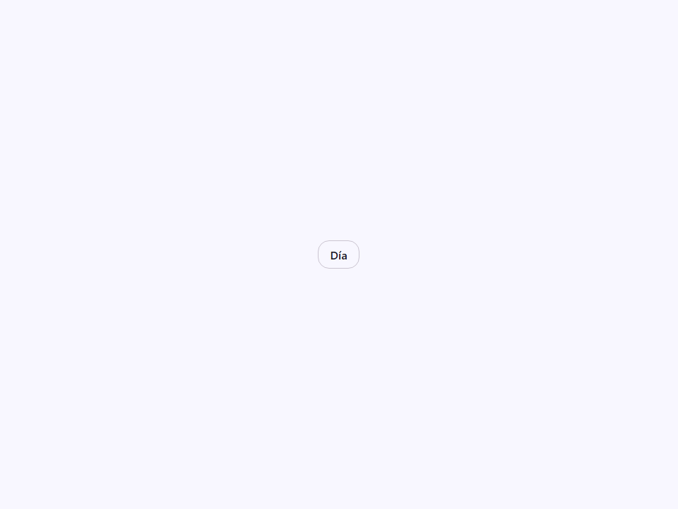
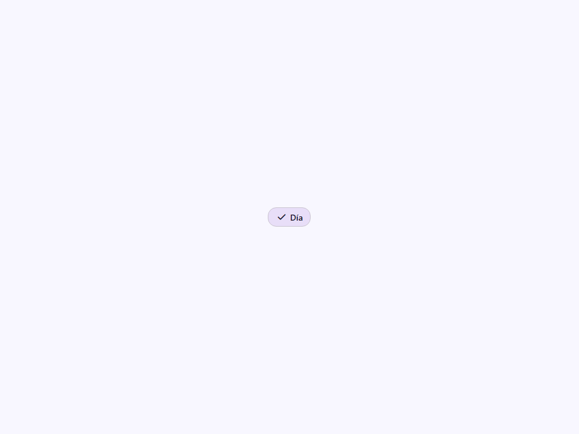
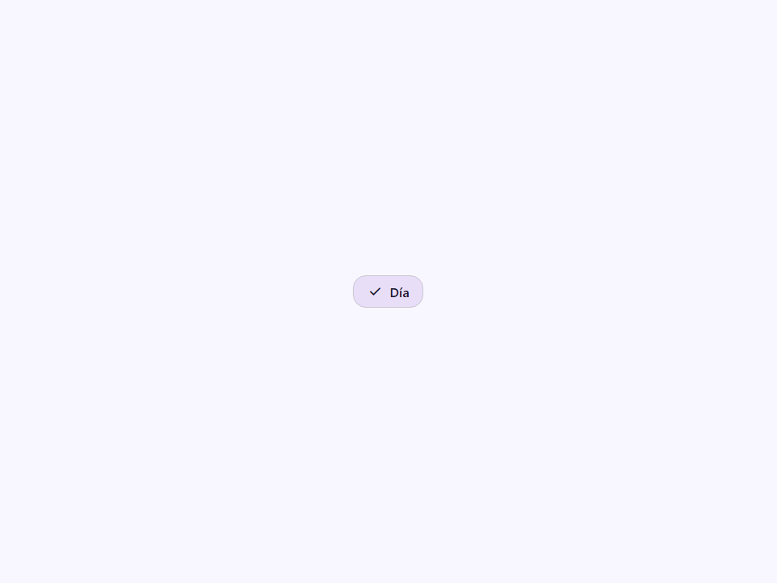
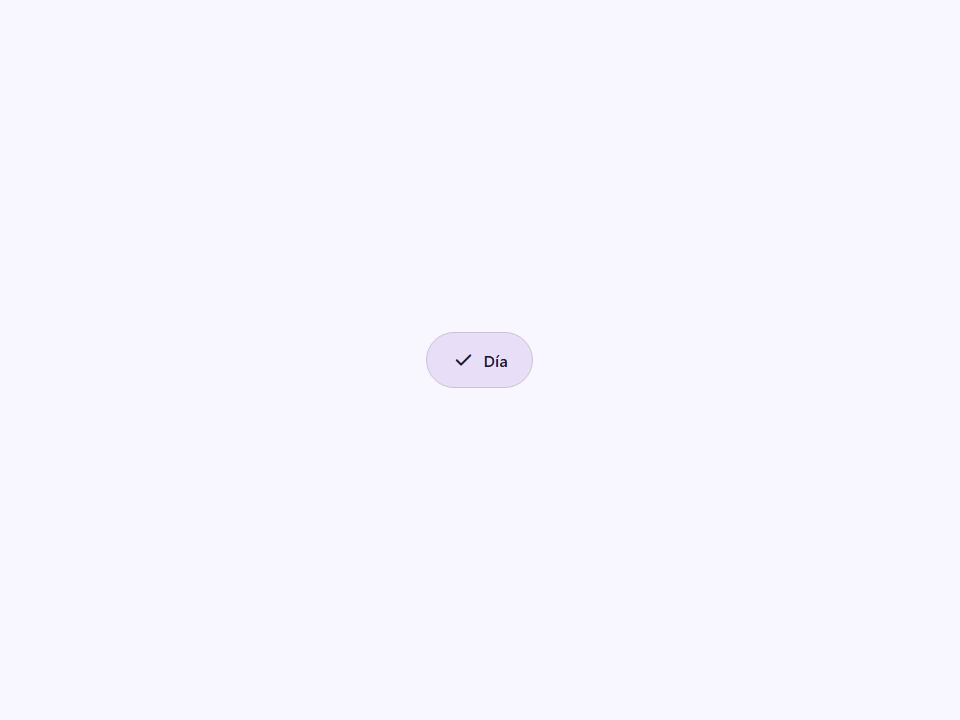
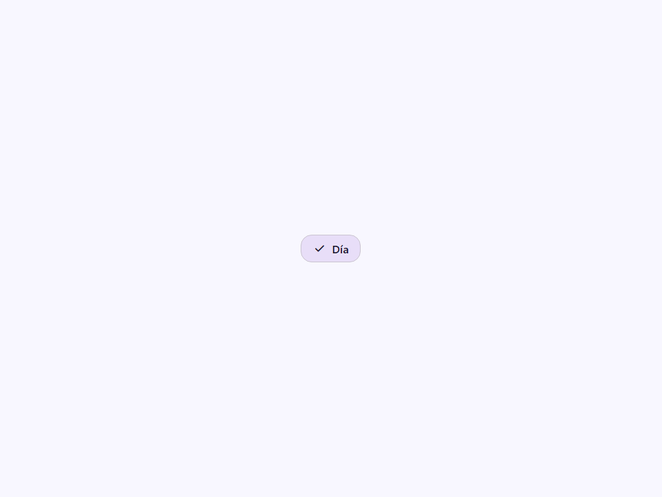
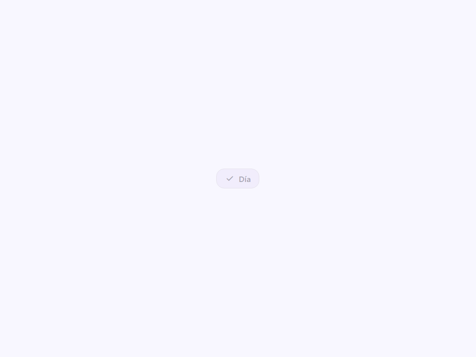
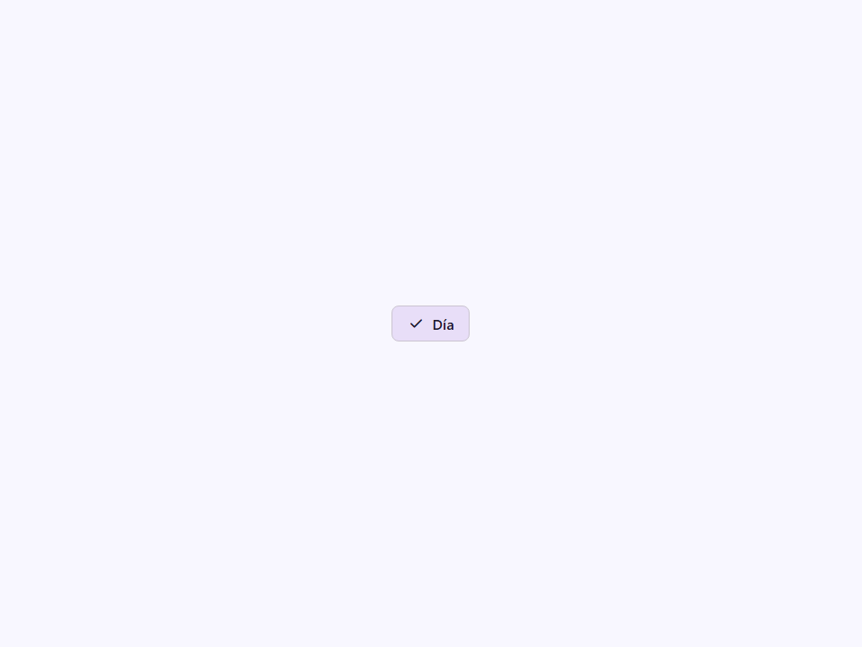
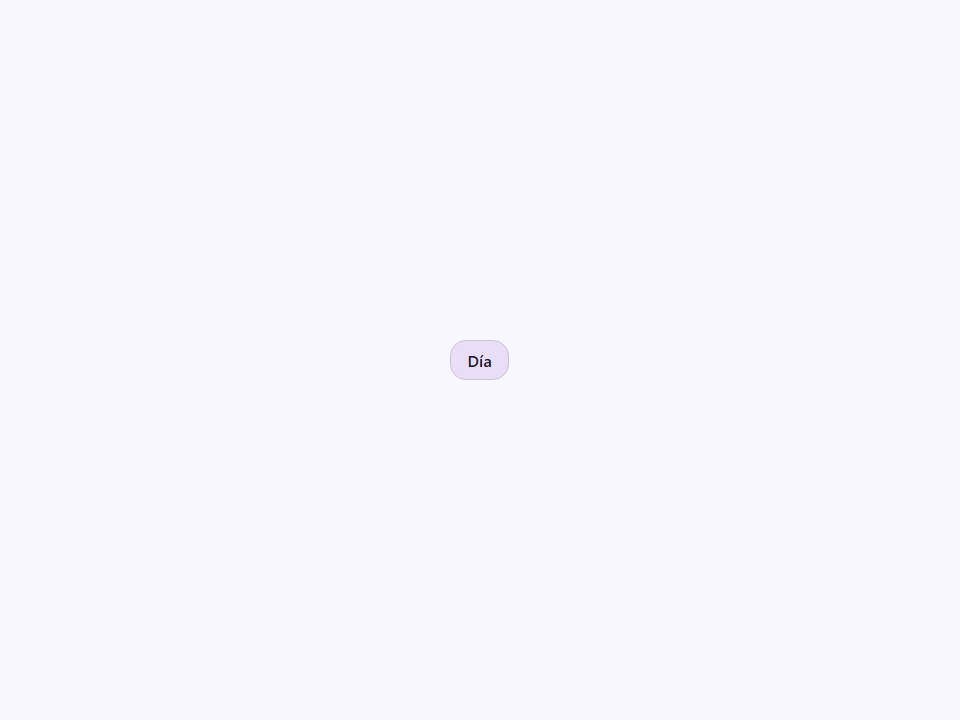

# Button Segment

Componente Material Design 3 Segmented Button (Heredado).

**Aviso de obsolescencia:** La especificación M3 (`m3-docs/components/segmented-buttons/overview.md`)
ha reemplazado el componente a medida "segmented button" con botones estándar organizados
en un grupo "conectado". Por favor usa `<moni-button-group variant="connected">`
conteniendo elementos `<moni-button>` estándar en lugar de este componente.

Este componente permanece por compatibilidad hacia atrás pero será eliminado en una
futura versión mayor. Renderiza un segmento único dentro de un `<moni-segmented-button>`.

- Tag: `moni-button-segment`
- Clase: `MoniButtonSegment`
- Fuente: `src/components/moni-button-segment.ts`

## Cuándo usarlo

Usa `moni-button-segment` cuando la interfaz necesite el patrón que describe este componente. Antes de elegirlo, revisa sus estados, contenido permitido y comportamiento accesible; las capturas del final muestran el resultado real de cada variante.

## Uso básico

```html
<!-- Uso heredado (no recomendado) -->
<moni-segmented-button>
  <moni-button-segment value="day" checked>Día</moni-button-segment>
  <moni-button-segment value="week">Semana</moni-button-segment>
</moni-segmented-button>
```

## Ejemplo práctico con Tailwind CSS v4

Tailwind controla composición, ancho, espaciado y responsividad alrededor del Web Component. Moni UI conserva el aspecto interno mediante Shadow DOM y design tokens.

```html
<div class="mx-auto flex w-full max-w-md flex-col gap-4 p-6">
  <moni-button-segment></moni-button-segment>
</div>
```

No necesitas un plugin de Tailwind. En tu CSS v4 importa ambas capas una sola vez:

```css
@import "tailwindcss";
@import "@moni-labs/moni-ui/styles";

@theme {
  --font-sans: Inter, ui-sans-serif, system-ui, sans-serif;
}
```

Las utilities aplicadas directamente al tag afectan su caja anfitriona. No uses selectores Tailwind para asumir acceso al DOM interno; personaliza únicamente con los CSS Parts y Custom Properties públicos enumerados más abajo.

## Recomendaciones

- Usa `moni-button-segment` para su propósito semántico; no lo sustituyas por un `div` estilizado.
- Aplica Tailwind al layout exterior. Para el interior del Shadow DOM usa las variables CSS y `::part()` documentados.
- Durante una operación asíncrona combina el estado `loading` —si existe— con `disabled` para evitar envíos duplicados.
- En formularios controlados, sincroniza la propiedad `value` y escucha el evento documentado; no dependas solo del atributo inicial.
- Prueba los estados claro, oscuro, foco por teclado, deshabilitado y viewport móvil antes de publicar.

## Propiedades y atributos

| Atributo | Propiedad | Tipo | Default | Descripción |
|---|---|---|---|---|
| `value` | `value` | `string` | `'on'` | Valor asociado con el segmento, usado por el grupo padre. |
| `checked` | `checked` | `boolean` | `false` | Estado seleccionado del segmento. |
| `size` | `size` | `'xsmall' \| 'small' \| 'medium' \| 'large' \| 'xlarge' \| 'extra'` | `'small'` | Tamaño del segmento (usualmente heredado del botón segmentado padre). |
| `disabled` | `disabled` | `boolean` | `false` | Deshabilita el segmento. |
| `position` | `position` | `'first' \| 'middle' \| 'last' \| 'solo'` | `'solo'` | Índice posicional del segmento dentro del grupo. Determina la lógica de redondeo del border-radius. |
| `hide-check` | `hideCheck` | `boolean` | `false` | Si es verdadero, oculta el icono de marca de verificación que normalmente reemplaza al icono inicial cuando se selecciona. |

## Slots

- `default`: El texto de la etiqueta del segmento.

## Eventos

No declara eventos propios.

## Métodos públicos

No expone métodos públicos adicionales.

## CSS Parts

- `checkmark`: Parte interna personalizable.
- `label`: Parte interna personalizable.

## CSS Custom Properties consumidas

- `--_segment-gap`
- `--_segment-height`
- `--_segment-icon`
- `--_segment-padding`
- `--_segment-square-radius`
- `--ease-standard`
- `--moni-button-segment-gap`
- `--moni-button-segment-radius-left`
- `--moni-button-segment-radius-middle`
- `--moni-button-segment-radius-right`
- `--on-secondary-container`
- `--on-surface`
- `--outline`
- `--outline-variant`
- `--secondary-container`
- `--speed2`
- `--surface-container-high`

## Referencia visual por variable

Cada imagen se genera con el componente real: cambia solo la variable indicada y mantiene estable el resto del escenario. Úsala para comparar estados, no como sustituto de la API.

### `value`

Valor asociado con el segmento, usado por el grupo padre.


### `checked`

Estado seleccionado del segmento.




### `size`

Tamaño del segmento (usualmente heredado del botón segmentado padre).








### `disabled`

Deshabilita el segmento.





### `position`

Índice posicional del segmento dentro del grupo.
Determina la lógica de redondeo del border-radius.





### `hide-check`

Si es verdadero, oculta el icono de marca de verificación que normalmente reemplaza al icono inicial cuando se selecciona.



