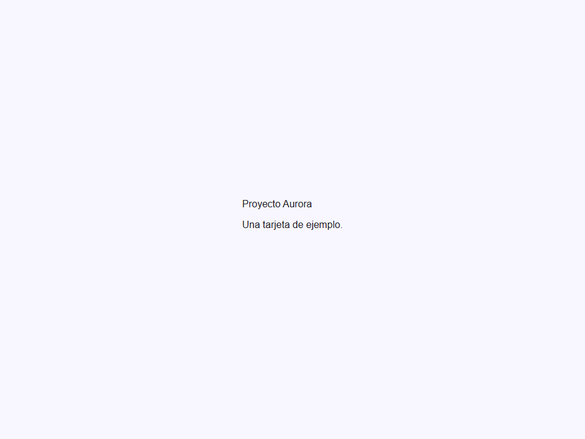

# Card

Componente Material Design 3 Card.

Las tarjetas muestran contenido y acciones sobre un solo sujeto. Son
superficies contenedoras que agrupan información relacionada junta, haciendo
fácil para los usuarios escanear e interactuar con colecciones de datos relacionados.

**Referencia de la especificación M3:** `m3-docs/components/cards/specs.md`

**Variantes:**
- `elevated` (por defecto) — Fondo `surface-container-low` + sombra `--elevate1`.
  Mejor para colecciones donde la tarjeta necesita separación visual de un
  fondo con patrones o de color. Gana sombra al pasar el ratón/arrastrar.
- `filled` — Fondo `surface-container-highest`, sin sombra.
  Énfasis más bajo; úsalo cuando las tarjetas se asientan directamente sobre la superficie del fondo principal.
- `outlined` — Fondo `surface` + trazo `outline-variant` 1dp.
  Énfasis estructural más alto sin proyectar una sombra. Mejor en fondos sólidos.

**Medidas M3:**
- Radio de esquina del contenedor: 12dp.
- Relleno de contenido horizontal: 16dp.
- Espacio entre tarjetas en una colección: máx. 8dp.
- Alineación de texto del titular: inicio.

**Tarjetas interactivas:**
Cuando `clickable=true`, la tarjeta renderiza capas de estado M3 (hover,
focus, press) a través del pseudo-elemento `::before`. El consumidor debe manejar
el evento `click` para implementar la lógica de navegación o selección.

- Tag: `moni-card`
- Clase: `MoniCard`
- Fuente: `src/components/moni-card.ts`

## Cuándo usarlo

Usa `moni-card` cuando la interfaz necesite el patrón que describe este componente. Antes de elegirlo, revisa sus estados, contenido permitido y comportamiento accesible; las capturas del final muestran el resultado real de cada variante.

## Uso básico

```html
<moni-card variant="outlined" clickable>
  
  <h3 slot="headline">Título de Tarjeta</h3>
  <p slot="supporting">Texto de soporte que describe el tema de la tarjeta.</p>
  <div slot="actions">
    <moni-button variant="text">Cancelar</moni-button>
    <moni-button>Confirmar</moni-button>
  </div>
</moni-card>
```

## Ejemplo práctico con Tailwind CSS v4

Tailwind controla composición, ancho, espaciado y responsividad alrededor del Web Component. Moni UI conserva el aspecto interno mediante Shadow DOM y design tokens.

```html
<div class="mx-auto flex w-full max-w-md flex-col gap-4 p-6">
  <moni-card><h2 class="text-xl font-semibold">Proyecto Aurora</h2>
  <p class="text-sm opacity-70">Actualizado hace 5 minutos</p></moni-card>
</div>
```

No necesitas un plugin de Tailwind. En tu CSS v4 importa ambas capas una sola vez:

```css
@import "tailwindcss";
@import "@moni-labs/moni-ui/styles";

@theme {
  --font-sans: Inter, ui-sans-serif, system-ui, sans-serif;
}
```

Las utilities aplicadas directamente al tag afectan su caja anfitriona. No uses selectores Tailwind para asumir acceso al DOM interno; personaliza únicamente con los CSS Parts y Custom Properties públicos enumerados más abajo.

## Recomendaciones

- Usa `moni-card` para su propósito semántico; no lo sustituyas por un `div` estilizado.
- Aplica Tailwind al layout exterior. Para el interior del Shadow DOM usa las variables CSS y `::part()` documentados.
- Durante una operación asíncrona combina el estado `loading` —si existe— con `disabled` para evitar envíos duplicados.
- Prueba los estados claro, oscuro, foco por teclado, deshabilitado y viewport móvil antes de publicar.

## Propiedades y atributos

| Atributo | Propiedad | Tipo | Default | Descripción |
|---|---|---|---|---|
| `variant` | `variant` | `'elevated' \| 'filled' \| 'outlined'` | `'elevated'` | Variante visual de la tarjeta.  - `'elevated'` (por defecto) — Fondo Surface-low + sombra de elevación. - `'filled'` — Fondo Surface-highest, sin sombra. - `'outlined'` — Fondo Surface + trazo outline-variant. |
| `clickable` | `clickable` | `boolean` | `false` | Cuando es `true`, aplica capas de estado M3 (hover, focus, pressed) para comunicar interactividad. El fondo de la tarjeta cambia ligeramente en hover.  Úsalo cuando la tarjeta en sí es un objetivo de navegación o selección clicable. |
| `draggable` | `draggable` | `boolean` | `false` | Cuando es `true`, aplica box-shadow `--elevate3` para simular el estado "arrastrado" M3 según lo especificado en la especificación de interacción de tarjetas M3.  Los consumidores deben alternar este atributo basado en el estado de arrastre de la tarjeta (ej. a través de un callback de biblioteca drag-and-drop). |
| `disabled` | `disabled` | `boolean` | `false` | Cuando es `true`, la tarjeta se renderiza con opacidad del 50% con `cursor: not-allowed`, indicando que la tarjeta y sus acciones no están disponibles. |

## Slots

- `media`: Una imagen, video, o icono en la parte superior de la tarjeta.
- `default`: Contenido del cuerpo principal (reemplaza todos los slots con nombre si se usa).
- `headline`: Texto de título equivalente a H3.
- `subhead`: Título secundario debajo del titular.
- `supporting`: Texto de soporte descriptivo del cuerpo.
- `actions`: Fila de botones de acción en la parte inferior de la tarjeta.

## Eventos

No declara eventos propios.

## Métodos públicos

No expone métodos públicos adicionales.

## CSS Parts

- `card`: El contenedor exterior de la tarjeta.
- `media`: Parte interna personalizable.
- `content`: El contenedor de contenido.
- `actions`: Parte interna personalizable.
- `body`: Parte interna personalizable.

## CSS Custom Properties consumidas

- `--elevate1`
- `--elevate2`
- `--elevate3`
- `--font`
- `--on-surface`
- `--on-surface-variant`
- `--outline-variant`
- `--primary`
- `--speed2`
- `--surface`
- `--surface-container-highest`
- `--surface-container-low`

## Referencia visual por variable

Cada imagen se genera con el componente real: cambia solo la variable indicada y mantiene estable el resto del escenario. Úsala para comparar estados, no como sustituto de la API.

### `variant`

Variante visual de la tarjeta.

- `'elevated'` (por defecto) — Fondo Surface-low + sombra de elevación.
- `'filled'` — Fondo Surface-highest, sin sombra.
- `'outlined'` — Fondo Surface + trazo outline-variant.




### `clickable`

Cuando es `true`, aplica capas de estado M3 (hover, focus, pressed)
para comunicar interactividad. El fondo de la tarjeta cambia ligeramente en hover.

Úsalo cuando la tarjeta en sí es un objetivo de navegación o selección clicable.


### `draggable`

Cuando es `true`, aplica box-shadow `--elevate3` para simular el estado "arrastrado"
M3 según lo especificado en la especificación de interacción de tarjetas M3.

Los consumidores deben alternar este atributo basado en el estado de arrastre de la tarjeta
(ej. a través de un callback de biblioteca drag-and-drop).


### `disabled`

Cuando es `true`, la tarjeta se renderiza con opacidad del 50% con `cursor: not-allowed`,
indicando que la tarjeta y sus acciones no están disponibles.


