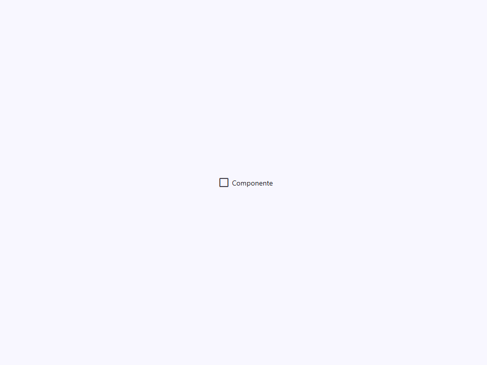
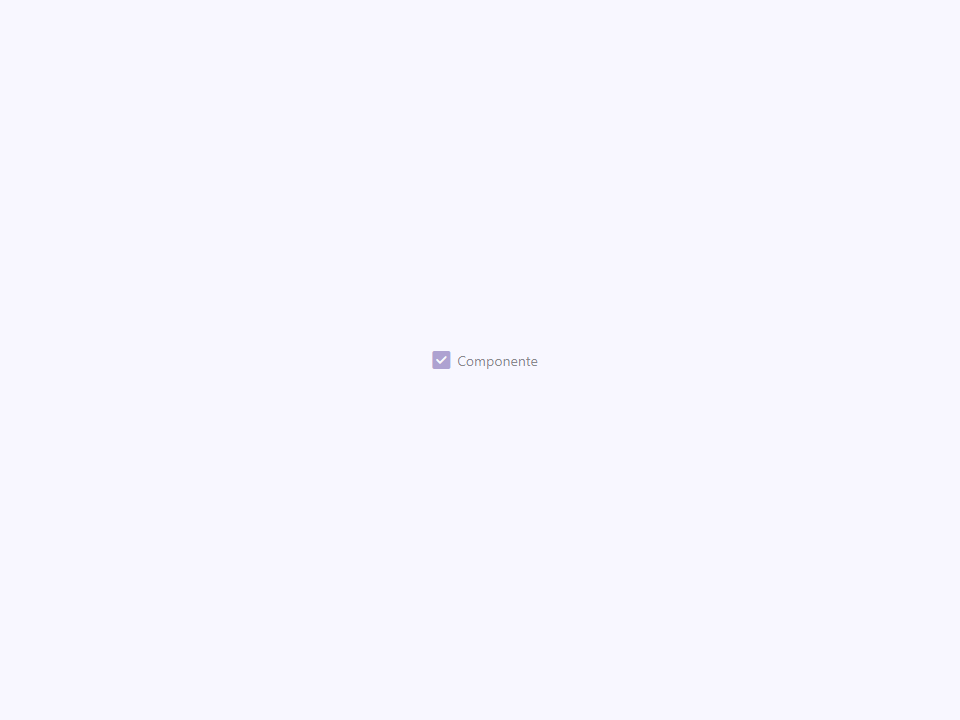
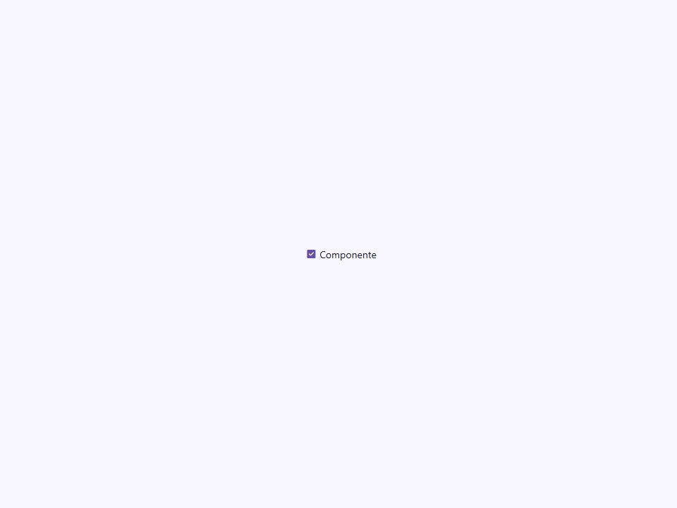
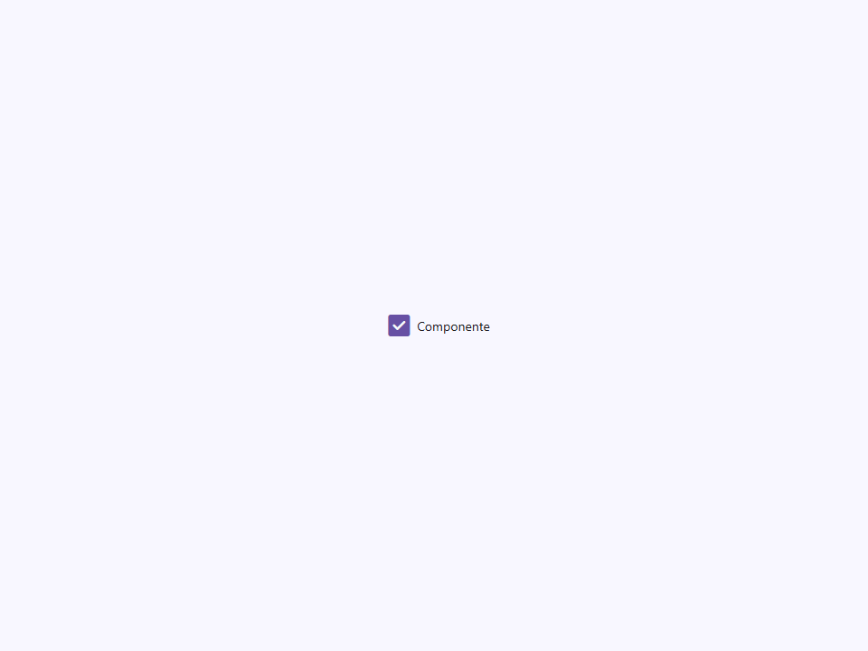
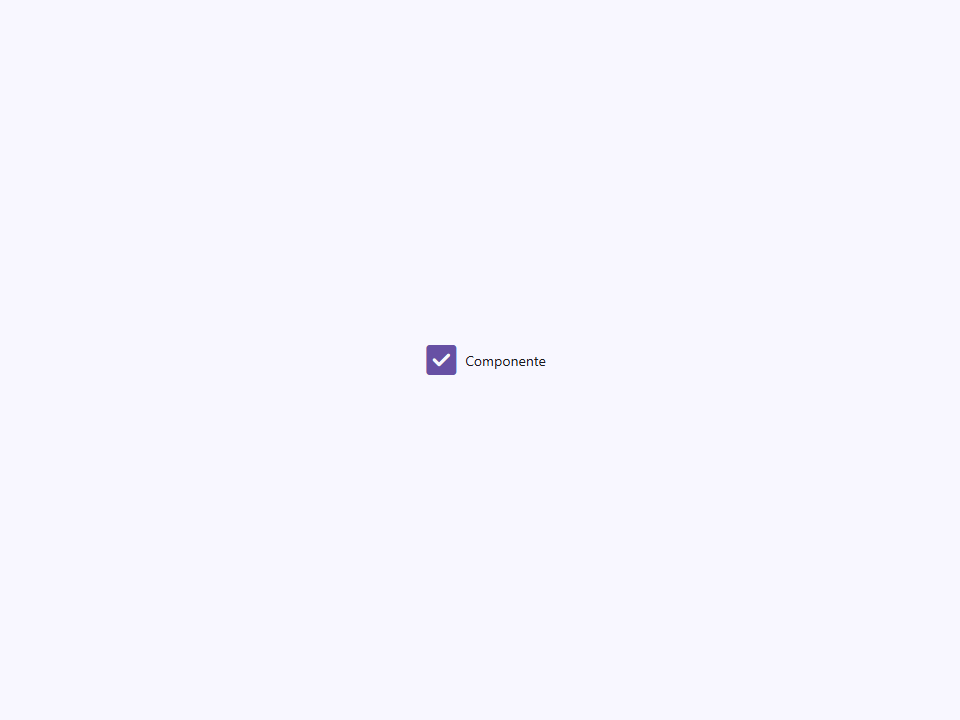

# Checkbox

Componente Material Design 3 Checkbox.

Los checkboxes permiten a los usuarios seleccionar uno o más elementos de un conjunto, o alternar
una sola opción binaria. Son envolturas solo visuales — el consumidor es
responsable de conectar la lógica de envío y validación del formulario.

**Arquitectura visual (Patrón BeerCSS):**
El `<input type="checkbox">` nativo ocupa espacio real en el diseño (mínimo 16×16)
pero está oculto visualmente con `opacity: 0`. Un hermano `<span>` renderizado después
del input contiene dos pseudo-elementos:
- `::before` — el icono visible del checkbox (ligadura de Material Symbols).
- `::after`  — el anillo de onda (ripple) de la capa de estado hover/focus.

El contenido de `::before` cambia entre:
- `'check_box_outline_blank'` (desmarcado)
- `'check_box'` (marcado)
- `'indeterminate_check_box'` (estado nativo indeterminado)

**Integración de formulario:**
Establecer `name` y `value` los pasa al elemento `<input>` nativo,
permitiendo la participación en envíos de formularios HTML.

- Tag: `moni-checkbox`
- Clase: `MoniCheckbox`
- Fuente: `src/components/moni-checkbox.ts`

## Cuándo usarlo

Usa `moni-checkbox` cuando la interfaz necesite el patrón que describe este componente. Antes de elegirlo, revisa sus estados, contenido permitido y comportamiento accesible; las capturas del final muestran el resultado real de cada variante.

## Uso básico

```html
<moni-checkbox label="Aceptar términos" name="terms" value="yes"></moni-checkbox>

<script>
  document.querySelector('moni-checkbox').addEventListener('moni-change', (e) => {
    console.log('checked:', e.target.checked);
  });
</script>
```

## Ejemplo práctico con Tailwind CSS v4

Tailwind controla composición, ancho, espaciado y responsividad alrededor del Web Component. Moni UI conserva el aspecto interno mediante Shadow DOM y design tokens.

```html
<div class="mx-auto flex w-full max-w-md flex-col gap-4 p-6">
  <moni-checkbox label="Ejemplo"></moni-checkbox>
</div>
```

No necesitas un plugin de Tailwind. En tu CSS v4 importa ambas capas una sola vez:

```css
@import "tailwindcss";
@import "@moni-labs/moni-ui/styles";

@theme {
  --font-sans: Inter, ui-sans-serif, system-ui, sans-serif;
}
```

Las utilities aplicadas directamente al tag afectan su caja anfitriona. No uses selectores Tailwind para asumir acceso al DOM interno; personaliza únicamente con los CSS Parts y Custom Properties públicos enumerados más abajo.

## Recomendaciones

- Usa `moni-checkbox` para su propósito semántico; no lo sustituyas por un `div` estilizado.
- Aplica Tailwind al layout exterior. Para el interior del Shadow DOM usa las variables CSS y `::part()` documentados.
- Durante una operación asíncrona combina el estado `loading` —si existe— con `disabled` para evitar envíos duplicados.
- En formularios controlados, sincroniza la propiedad `value` y escucha el evento documentado; no dependas solo del atributo inicial.
- Prueba los estados claro, oscuro, foco por teclado, deshabilitado y viewport móvil antes de publicar.

## Propiedades y atributos

| Atributo | Propiedad | Tipo | Default | Descripción |
|---|---|---|---|---|
| `label` | `label` | `string` | `''` | Texto de la etiqueta mostrado a la derecha del icono del checkbox.  Cuando no está vacío, la etiqueta se renderiza como un nodo de texto dentro del `<span>`. Cuando está vacío, el slot por defecto se renderiza en su lugar, permitiendo HTML en el slot. |
| `checked` | `checked` | `boolean` | `false` | Si el checkbox está actualmente marcado.  Reflejado como un atributo para que los selectores de atributos CSS y los lectores de estado externos puedan observar el estado marcado sin acceder a la propiedad JS. Sincronizado con el input nativo a través de `updated()`. |
| `disabled` | `disabled` | `boolean` | `false` | Cuando es `true`, el input nativo se deshabilita: el checkbox no es interactivo y se renderiza con opacidad del 50%. |
| `unchecked-icon` | `uncheckedIcon` | `string` | `''` | Material Symbol mostrado cuando el checkbox está desmarcado. |
| `checked-icon` | `checkedIcon` | `string` | `''` | Material Symbol mostrado cuando el checkbox está marcado. |
| `size` | `size` | `'small' \| 'medium' \| 'large' \| 'extra'` | `'medium'` | Tamaño visual del icono del checkbox.  Se mapea a la propiedad personalizada `--_size` que controla tanto el área de impacto del input invisible como el tamaño del icono visible `::before`.  \| Valor      \| `--_size` \| \|------------\|-----------\| \| `'small'`  \| 1rem      \| \| `'medium'` \| 1.5rem    \| \| `'large'`  \| 2rem      \| \| `'extra'`  \| 2.5rem    \| |
| `name` | `name` | `string` | `''` | Reenviado al atributo `<input name>` nativo. Requerido para agrupar checkboxes dentro de un formulario. |
| `value` | `value` | `string` | `''` | Reenviado al atributo `<input value>` nativo. El valor enviado en un formulario cuando este checkbox está marcado. |

## Slots

Este componente no declara slots públicos.

## Eventos

No declara eventos propios.

## Métodos públicos

No expone métodos públicos adicionales.

## CSS Parts

- `checkbox`: Parte interna personalizable.

## CSS Custom Properties consumidas

- `--_size`
- `--font`
- `--font-icon`
- `--on-primary`
- `--on-surface`
- `--on-surface-variant`
- `--primary`
- `--speed1`

## Referencia visual por variable

Cada imagen se genera con el componente real: cambia solo la variable indicada y mantiene estable el resto del escenario. Úsala para comparar estados, no como sustituto de la API.

### `label`

Texto de la etiqueta mostrado a la derecha del icono del checkbox.

Cuando no está vacío, la etiqueta se renderiza como un nodo de texto dentro del `<span>`.
Cuando está vacío, el slot por defecto se renderiza en su lugar, permitiendo HTML en el slot.


### `checked`

Si el checkbox está actualmente marcado.

Reflejado como un atributo para que los selectores de atributos CSS y los lectores
de estado externos puedan observar el estado marcado sin acceder a la propiedad JS.
Sincronizado con el input nativo a través de `updated()`.




### `disabled`

Cuando es `true`, el input nativo se deshabilita: el checkbox no es interactivo
y se renderiza con opacidad del 50%.




### `unchecked-icon`

Material Symbol mostrado cuando el checkbox está desmarcado.


### `checked-icon`

Material Symbol mostrado cuando el checkbox está marcado.


### `size`

Tamaño visual del icono del checkbox.

Se mapea a la propiedad personalizada `--_size` que controla tanto el área de impacto
del input invisible como el tamaño del icono visible `::before`.

| Valor      | `--_size` |
|------------|-----------|
| `'small'`  | 1rem      |
| `'medium'` | 1.5rem    |
| `'large'`  | 2rem      |
| `'extra'`  | 2.5rem    |








### `name`

Reenviado al atributo `<input name>` nativo.
Requerido para agrupar checkboxes dentro de un formulario.


### `value`

Reenviado al atributo `<input value>` nativo.
El valor enviado en un formulario cuando este checkbox está marcado.


