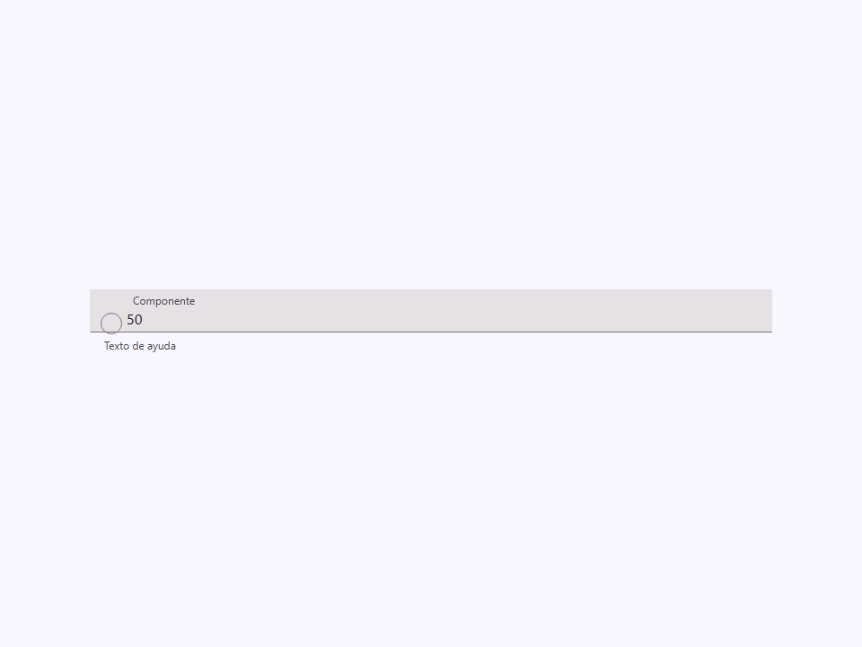
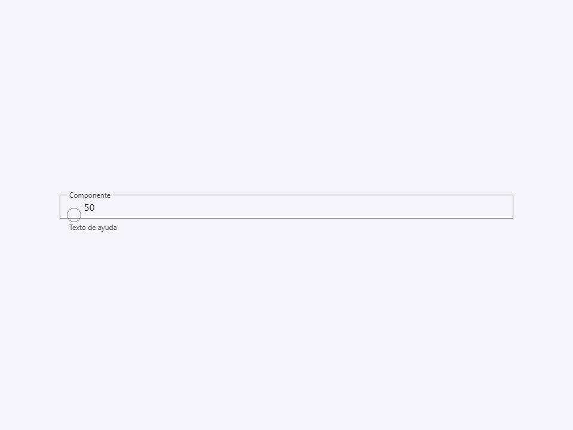
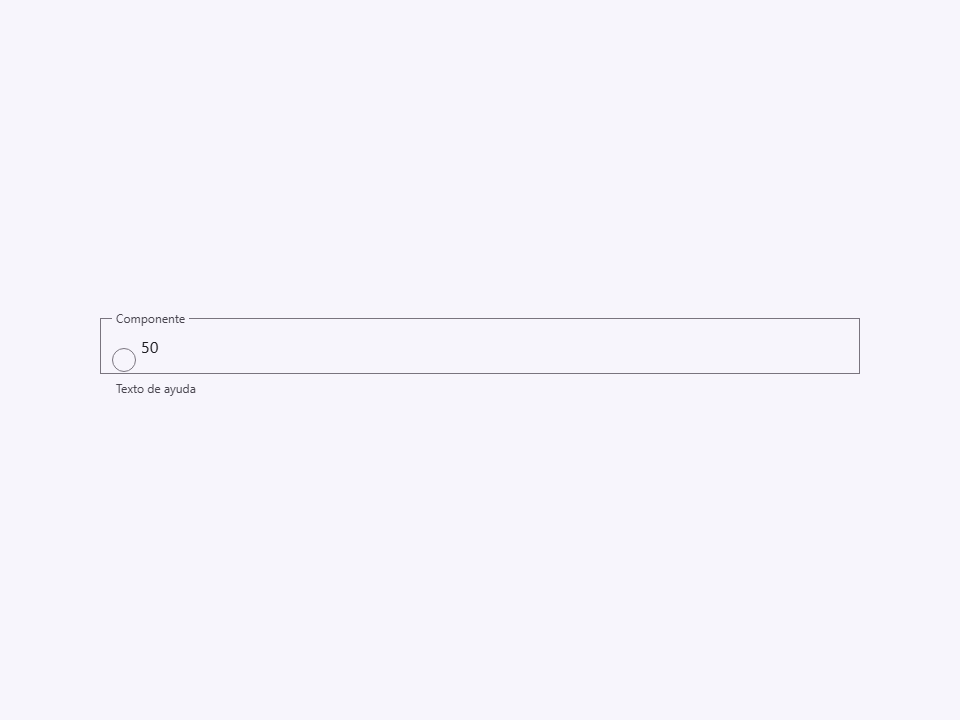
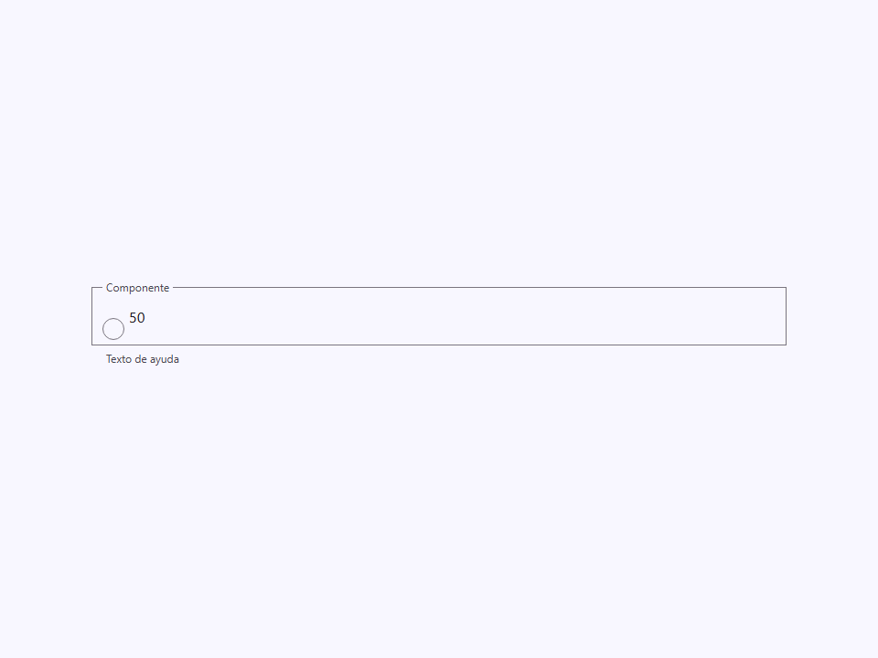
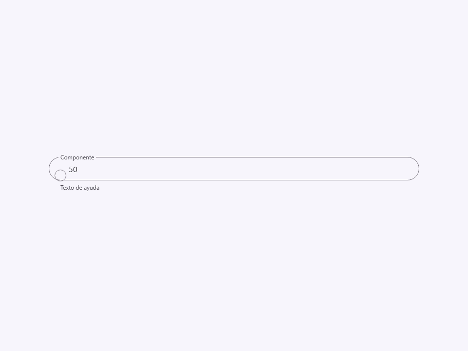
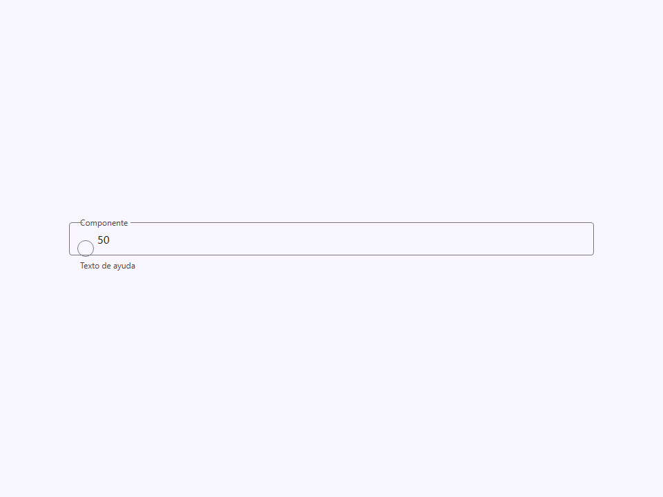
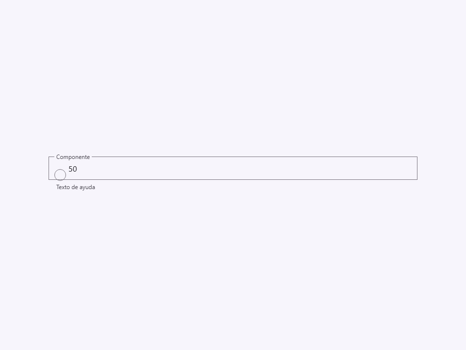
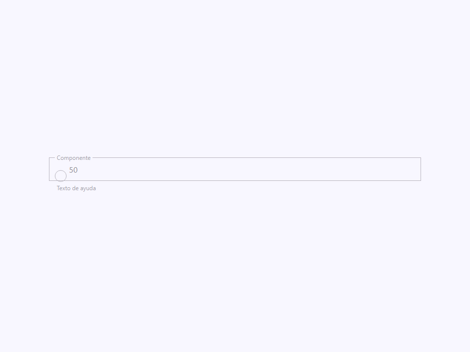
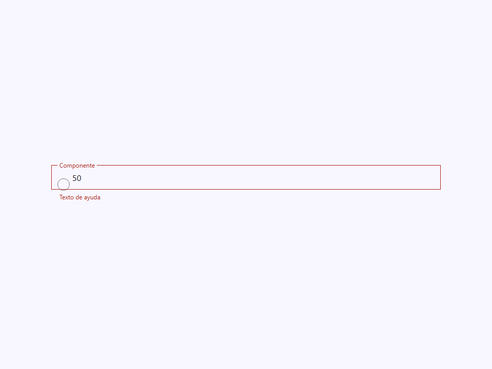

# Color Field

Componente Material Design 3 Color Field (Campo de Color).

Un campo de texto especializado para la entrada de color que combina un
`<input type="color">` nativo con una visualización de texto de solo lectura del
valor hexadecimal seleccionado, envuelto en la carcasa estándar de campo M3.

**Arquitectura visual:**
Extiende el patrón de estilo de campo usado por `<moni-text-field>`. El
slot de icono inicial se reemplaza por una muestra de color circular (`.swatch`)
que se posiciona absolutamente sobre una entrada de color nativa invisible.
Al hacer clic en la muestra se abre el selector de color del sistema. La parte de entrada de texto
muestra el código hexadecimal seleccionado y es estrictamente `readOnly`.

**Sincronización de estado:**
El componente escucha el evento nativo `change` en la entrada de color,
actualiza la propiedad `value`, y re-despacha un evento compuesto `'change'`.
No escucha `input` (arrastre continuo en el selector de color) para evitar
el disparo excesivo de eventos, pero los consumidores pueden adjuntar sus propios
escuchas de `input` directamente al elemento si se necesita una vista previa en vivo.

- Tag: `moni-color-field`
- Clase: `MoniColorField`
- Fuente: `src/components/moni-color-field.ts`

## Cuándo usarlo

Usa `moni-color-field` cuando la interfaz necesite el patrón que describe este componente. Antes de elegirlo, revisa sus estados, contenido permitido y comportamiento accesible; las capturas del final muestran el resultado real de cada variante.

## Uso básico

```html
<moni-color-field
  label="Color del Tema"
  name="primaryColor"
  value="#6750a4"
  variant="outlined"
></moni-color-field>
```

## Ejemplo práctico con Tailwind CSS v4

Tailwind controla composición, ancho, espaciado y responsividad alrededor del Web Component. Moni UI conserva el aspecto interno mediante Shadow DOM y design tokens.

```html
<div class="mx-auto flex w-full max-w-md flex-col gap-4 p-6">
  <moni-color-field label="Ejemplo"></moni-color-field>
</div>
```

No necesitas un plugin de Tailwind. En tu CSS v4 importa ambas capas una sola vez:

```css
@import "tailwindcss";
@import "@moni-labs/moni-ui/styles";

@theme {
  --font-sans: Inter, ui-sans-serif, system-ui, sans-serif;
}
```

Las utilities aplicadas directamente al tag afectan su caja anfitriona. No uses selectores Tailwind para asumir acceso al DOM interno; personaliza únicamente con los CSS Parts y Custom Properties públicos enumerados más abajo.

## Recomendaciones

- Usa `moni-color-field` para su propósito semántico; no lo sustituyas por un `div` estilizado.
- Aplica Tailwind al layout exterior. Para el interior del Shadow DOM usa las variables CSS y `::part()` documentados.
- Durante una operación asíncrona combina el estado `loading` —si existe— con `disabled` para evitar envíos duplicados.
- En formularios controlados, sincroniza la propiedad `value` y escucha el evento documentado; no dependas solo del atributo inicial.
- Prueba los estados claro, oscuro, foco por teclado, deshabilitado y viewport móvil antes de publicar.

## Propiedades y atributos

| Atributo | Propiedad | Tipo | Default | Descripción |
|---|---|---|---|---|
| `name` | `name` | `string` | `''` | El nombre del input, enviado con los datos del formulario. |
| `label` | `label` | `string` | `''` | El texto de la etiqueta flotante. |
| `variant` | `variant` | `'filled' \| 'outlined'` | `'outlined'` | Variante visual del campo de texto. |
| `size` | `size` | `'small' \| 'medium' \| 'large' \| 'extra'` | `'medium'` | Define las dimensiones del campo de texto. |
| `shape` | `shape` | `'round' \| 'square' \| 'no-round'` | `'no-round'` | Forma del radio del borde del campo. |
| `disabled` | `disabled` | `boolean` | `false` | Deshabilita el campo de color. |
| `helper` | `helper` | `string` | `''` | Texto de ayuda mostrado debajo del campo. |
| `error-text` | `errorText` | `string` | `''` | Texto de error mostrado debajo del campo cuando `error` es true.
 Sobrescribe el texto de ayuda. |
| `error` | `error` | `boolean` | `false` | Si es true, establece el campo en un estado de error. |
| `value` | `value` | `string` | `'#6750a4'` | El valor actual del color hexadecimal. |

## Slots

Este componente no declara slots públicos.

## Eventos

No declara eventos propios.

## Métodos públicos

No expone métodos públicos adicionales.

## CSS Parts

- `field`: Parte interna personalizable.
- `swatch`: El elemento de vista previa de color circular.
- `input-color`: El `<input type="color">` nativo, visualmente oculto.
- `input-text`: El `<input type="text">` nativo que muestra el código hexadecimal.
- `label`: Parte interna personalizable.
- `color`: Parte interna personalizable.
- `helper`: Parte interna personalizable.
- `text`: Parte interna personalizable.

## CSS Custom Properties consumidas

- `--_swatch`
- `--outline`

## Referencia visual por variable

Cada imagen se genera con el componente real: cambia solo la variable indicada y mantiene estable el resto del escenario. Úsala para comparar estados, no como sustituto de la API.

### `name`

El nombre del input, enviado con los datos del formulario.


### `label`

El texto de la etiqueta flotante.


### `variant`

Variante visual del campo de texto.




### `size`

Define las dimensiones del campo de texto.








### `shape`

Forma del radio del borde del campo.






### `disabled`

Deshabilita el campo de color.





### `helper`

Texto de ayuda mostrado debajo del campo.


### `error-text`

Texto de error mostrado debajo del campo cuando `error` es true.
Sobrescribe el texto de ayuda.


### `error`

Si es true, establece el campo en un estado de error.




### `value`

El valor actual del color hexadecimal.


