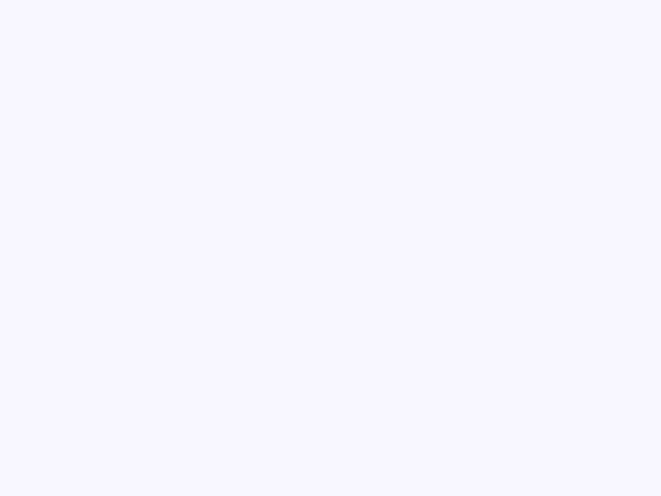
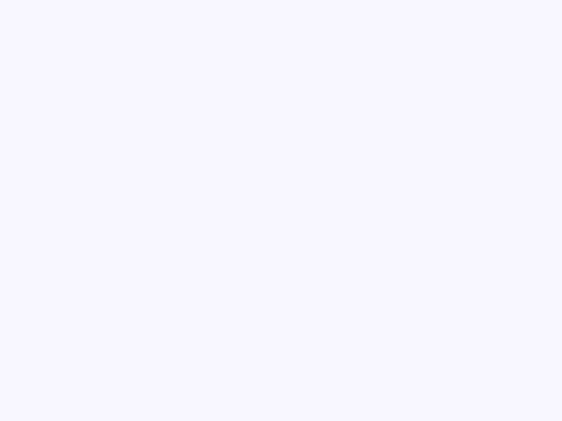
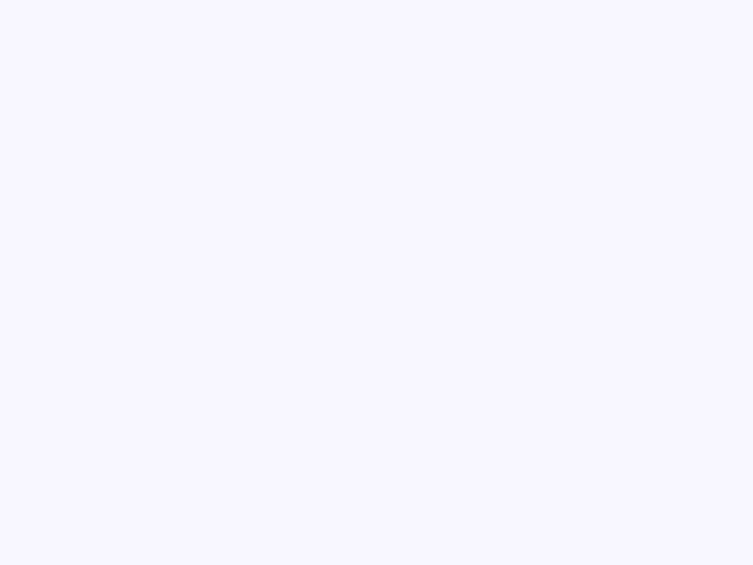

# Context Menu

Componente Material Design 3 Context Menu (Menú Contextual).

Un menú especializado que se abre en las coordenadas exactas de un evento de puntero,
típicamente desencadenado por un clic derecho (evento `contextmenu`). Proporciona
acciones contextuales relacionadas con el elemento específico clicado.

**Referencia de la especificación M3:** `m3-docs/components/menus/specs.md` (Menús contextuales)

**Mecanismo de activación:**
El componente no requiere activación programática a través de una propiedad `open`.
En su lugar, adjunta un detector de eventos `contextmenu` a su elemento padre
durante `connectedCallback`. Cuando se hace clic derecho en el padre, el menú
captura las coordenadas `clientX`/`clientY`, previene el menú contextual predeterminado
del navegador, y se abre en la posición del cursor usando `position: fixed`.

**Comportamiento de auto-inversión (atributo `flip`):**
Según las pautas de M3, los menús deben invertirse al lado opuesto del cursor
si al abrirse en la `placement` solicitada causarían un desbordamiento de la
ventana gráfica. Cuando `flip=true`, el componente calcula dinámicamente los límites
de la ventana antes de abrir y anula `placement` si es necesario (ej., invirtiendo
de `bottom` a `top` si se hace clic cerca de la parte inferior de la pantalla).

**Auto-descarte:**
Se cierra automáticamente al hacer clic en cualquier lugar fuera del menú, o al
presionar la tecla `Escape`.

- Tag: `moni-context-menu`
- Clase: `MoniContextMenu`
- Fuente: `src/components/moni-context-menu.ts`

## Cuándo usarlo

Usa `moni-context-menu` cuando la interfaz necesite el patrón que describe este componente. Antes de elegirlo, revisa sus estados, contenido permitido y comportamiento accesible; las capturas del final muestran el resultado real de cada variante.

## Uso básico

```html
<!-- Envuelve el área de activación y el menú en un contenedor -->
<div>
  <p>Haz clic derecho para ver las opciones</p>
  <moni-context-menu flip>
    <moni-menu-item>Copiar</moni-menu-item>
    <moni-menu-item>Pegar</moni-menu-item>
    <moni-divider></moni-divider>
    <moni-menu-item>Eliminar</moni-menu-item>
  </moni-context-menu>
</div>
```

## Ejemplo práctico con Tailwind CSS v4

Tailwind controla composición, ancho, espaciado y responsividad alrededor del Web Component. Moni UI conserva el aspecto interno mediante Shadow DOM y design tokens.

```html
<div class="mx-auto flex w-full max-w-md flex-col gap-4 p-6">
  <moni-context-menu></moni-context-menu>
</div>
```

No necesitas un plugin de Tailwind. En tu CSS v4 importa ambas capas una sola vez:

```css
@import "tailwindcss";
@import "@moni-labs/moni-ui/styles";

@theme {
  --font-sans: Inter, ui-sans-serif, system-ui, sans-serif;
}
```

Las utilities aplicadas directamente al tag afectan su caja anfitriona. No uses selectores Tailwind para asumir acceso al DOM interno; personaliza únicamente con los CSS Parts y Custom Properties públicos enumerados más abajo.

## Recomendaciones

- Usa `moni-context-menu` para su propósito semántico; no lo sustituyas por un `div` estilizado.
- Aplica Tailwind al layout exterior. Para el interior del Shadow DOM usa las variables CSS y `::part()` documentados.
- Prueba los estados claro, oscuro, foco por teclado, deshabilitado y viewport móvil antes de publicar.

## Propiedades y atributos

| Atributo | Propiedad | Tipo | Default | Descripción |
|---|---|---|---|---|
| `placement` | `placement` | `'bottom' \| 'top' \| 'left' \| 'right'` | `'bottom'` | Selecciona el valor de `placement` entre las opciones documentadas. |
| `flip` | `flip` | `boolean` | `false` | Activa o desactiva el comportamiento `flip`. En HTML, la presencia del atributo significa `true`; omítelo para `false`. |

## Slots

- `default`: Los elementos `<moni-menu-item>` que componen el menú.

## Eventos

No declara eventos propios.

## Métodos públicos

No expone métodos públicos adicionales.

## CSS Parts

No declara CSS Parts.

## CSS Custom Properties consumidas

- `--_x`
- `--_y`
- `--font`

## Referencia visual por variable

Cada imagen se genera con el componente real: cambia solo la variable indicada y mantiene estable el resto del escenario. Úsala para comparar estados, no como sustituto de la API.

### `placement`

Selecciona el valor de `placement` entre las opciones documentadas.








### `flip`

Activa o desactiva el comportamiento `flip`. En HTML, la presencia del atributo significa `true`; omítelo para `false`.


