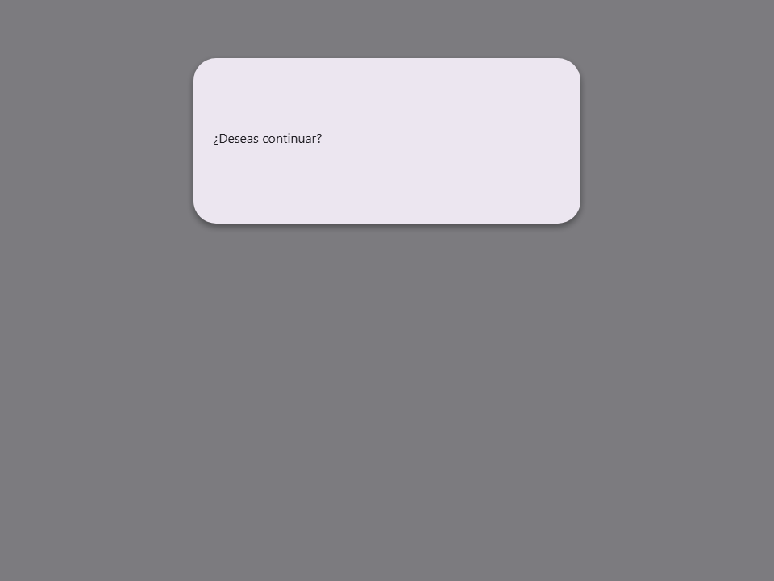
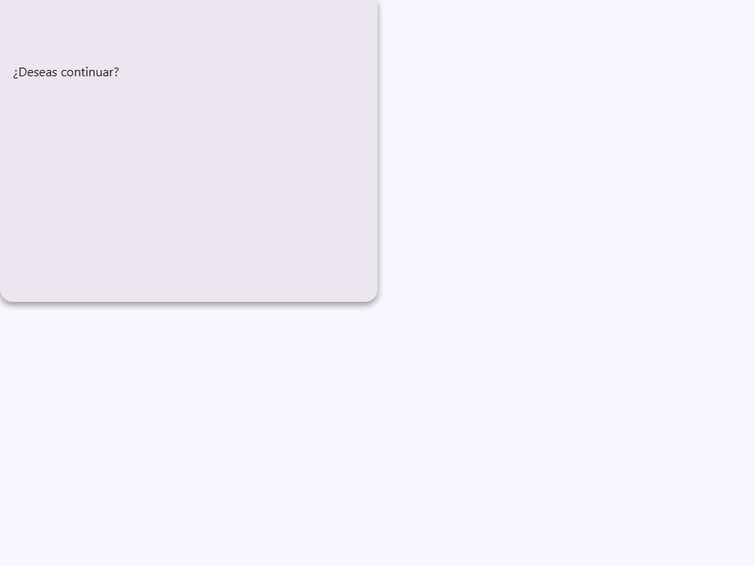
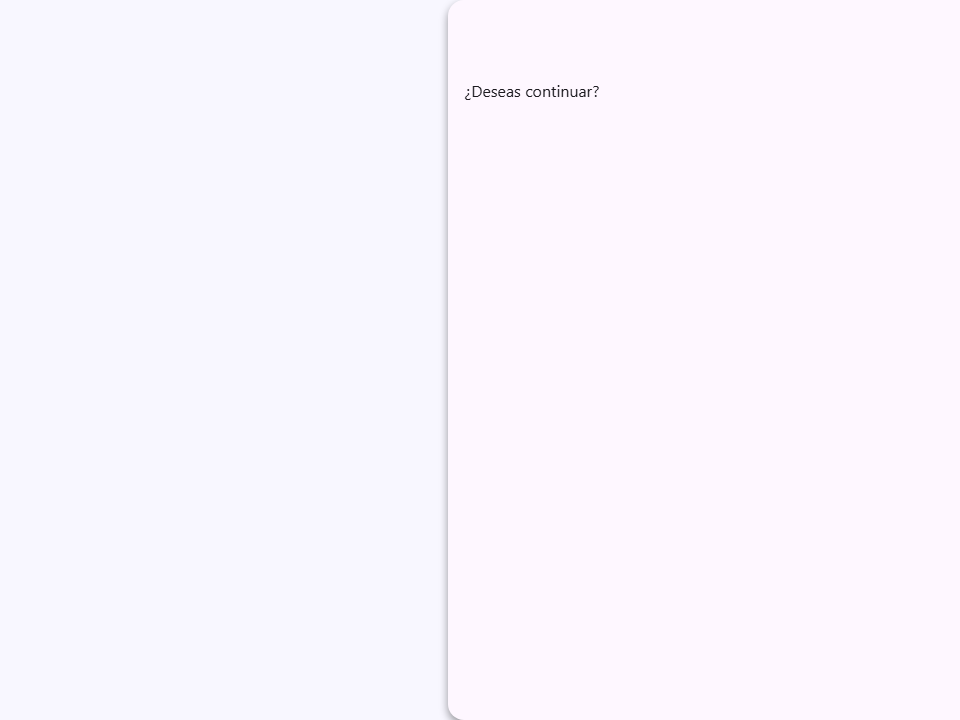
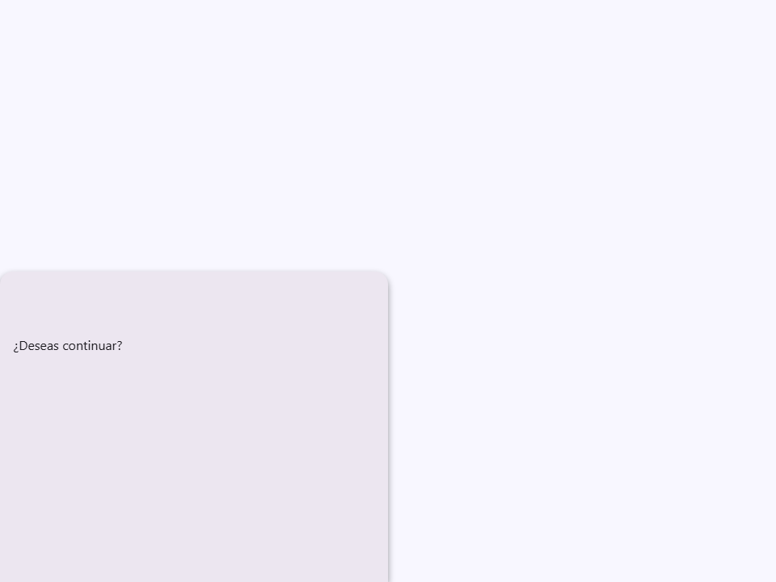
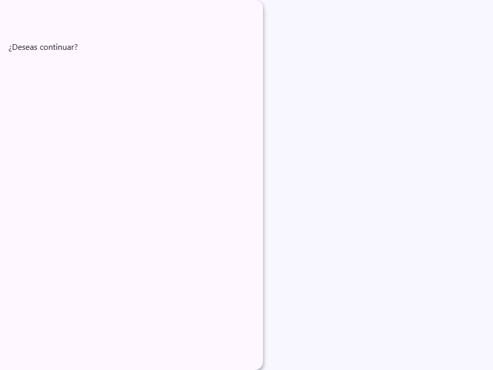
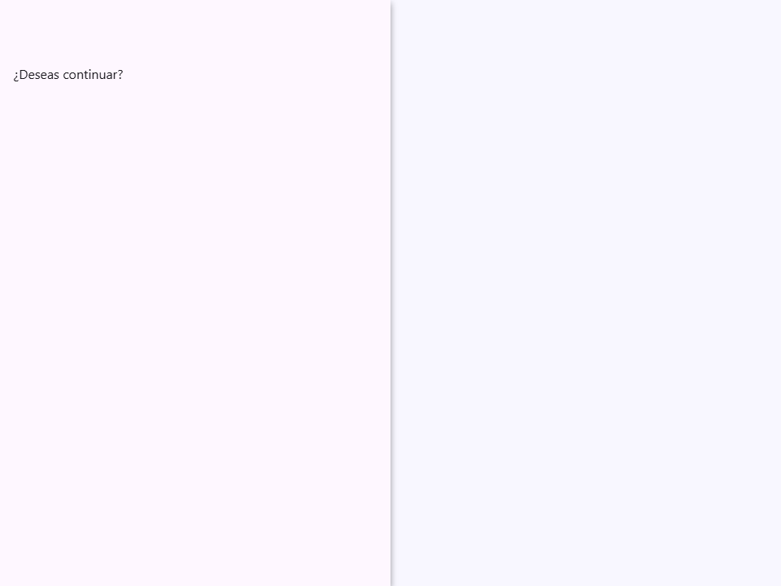
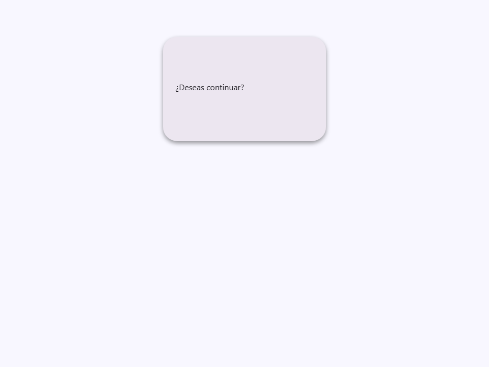
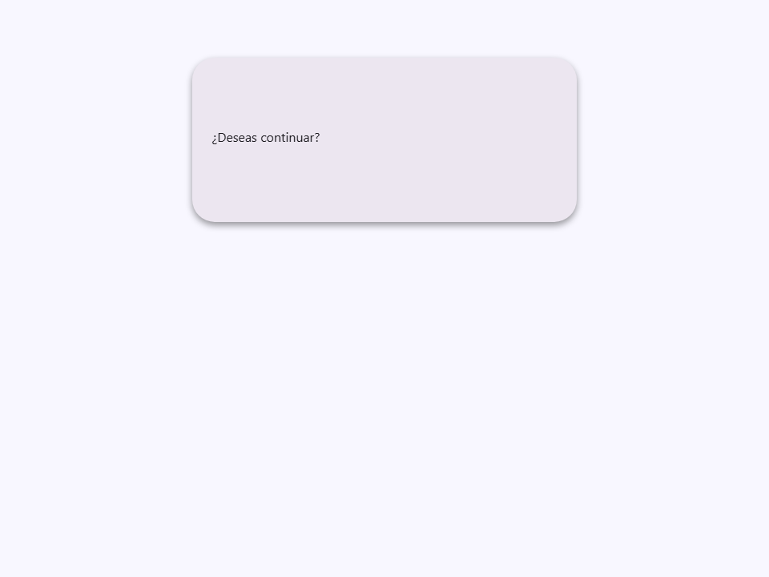
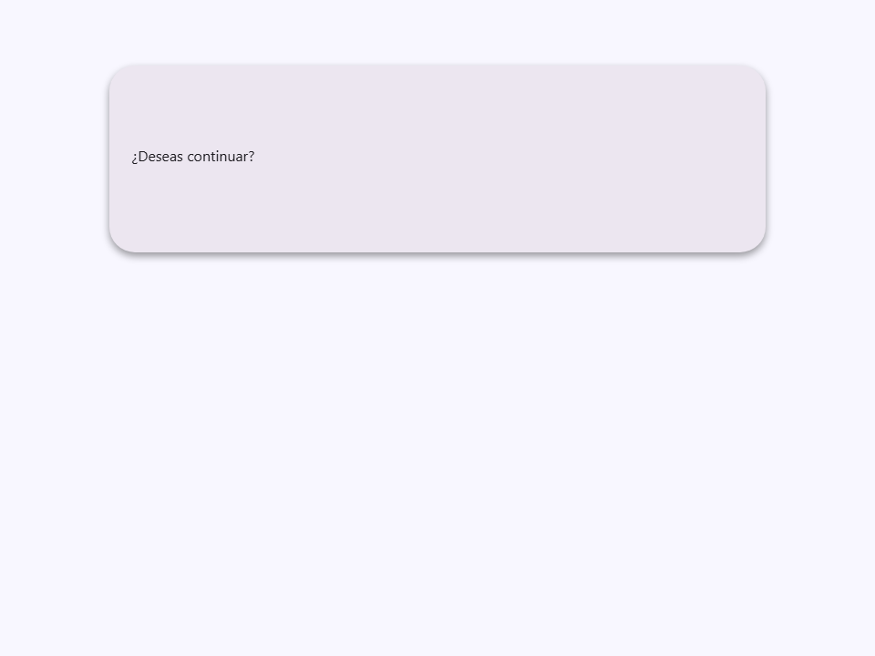

# Dialog

Componente Material Design 3 Dialog (Diálogo).

Los diálogos informan a los usuarios sobre una tarea y pueden contener información crítica,
requerir decisiones o implicar múltiples tareas. Interrumpen el flujo de trabajo del
usuario y deben usarse con moderación.

**Referencia de la especificación M3:** `m3-docs/components/dialogs/specs.md`

**Nota de implementación — elemento nativo `<dialog>`:**
Este componente envuelve el elemento HTML nativo `<dialog>`. La apertura y cierre
se controlan mediante el atributo `open` (y su propiedad JS). El componente
sincroniza los cambios de `open` al `<dialog>` nativo en `updated()`:
- `modal=true` → llama a `dialog.showModal()` (bloquea el foco, añade fondo oscuro).
- `modal=false` → llama a `dialog.show()` (no bloquea, sin fondo oscuro).
- `open=false` → llama a `dialog.close()`.

**Colocación (atributo `side`):**
- `center` (por defecto) — Centrado en la ventana gráfica. Diálogo M3 estándar.
- `top`, `right`, `bottom`, `left` — Paneles anclados a los bordes (patrón side sheet).
- `max` — Diálogo a pantalla completa para flujos complejos.

- Tag: `moni-dialog`
- Clase: `MoniDialog`
- Fuente: `src/components/moni-dialog.ts`

## Cuándo usarlo

Usa `moni-dialog` cuando la interfaz necesite el patrón que describe este componente. Antes de elegirlo, revisa sus estados, contenido permitido y comportamiento accesible; las capturas del final muestran el resultado real de cada variante.

## Uso básico

```html
<!-- Diálogo modal básico -->
<moni-dialog open modal title="Eliminar elemento?" size="small">
  <p>Esta acción no se puede deshacer.</p>
  <div slot="footer">
    <moni-button variant="text">Cancelar</moni-button>
    <moni-button>Eliminar</moni-button>
  </div>
</moni-dialog>
```

## Ejemplo práctico con Tailwind CSS v4

Tailwind controla composición, ancho, espaciado y responsividad alrededor del Web Component. Moni UI conserva el aspecto interno mediante Shadow DOM y design tokens.

```html
<div class="mx-auto flex w-full max-w-md flex-col gap-4 p-6">
  <moni-dialog></moni-dialog>
</div>
```

No necesitas un plugin de Tailwind. En tu CSS v4 importa ambas capas una sola vez:

```css
@import "tailwindcss";
@import "@moni-labs/moni-ui/styles";

@theme {
  --font-sans: Inter, ui-sans-serif, system-ui, sans-serif;
}
```

Las utilities aplicadas directamente al tag afectan su caja anfitriona. No uses selectores Tailwind para asumir acceso al DOM interno; personaliza únicamente con los CSS Parts y Custom Properties públicos enumerados más abajo.

## Recomendaciones

- Usa `moni-dialog` para su propósito semántico; no lo sustituyas por un `div` estilizado.
- Aplica Tailwind al layout exterior. Para el interior del Shadow DOM usa las variables CSS y `::part()` documentados.
- Mantén el estado de apertura en una única fuente de verdad y devuelve el foco al disparador al cerrar.
- Prueba los estados claro, oscuro, foco por teclado, deshabilitado y viewport móvil antes de publicar.

## Propiedades y atributos

| Atributo | Propiedad | Tipo | Default | Descripción |
|---|---|---|---|---|
| `open` | `open` | `boolean` | `false` | Controla el estado abierto/cerrado del diálogo.  Cuando se establece en `true`, el componente llama a `dialog.showModal()` (si `modal`) o `dialog.show()`. Cuando se establece en `false`, llama a `dialog.close()`. Reflejado como un atributo HTML para CSS y lectores de estado externos. |
| `modal` | `modal` | `boolean` | `false` | Cuando es `true`, abre el diálogo como un modal usando `<dialog>.showModal()`.  Diálogos modales: - Bloquean que el foco del teclado salga del diálogo. - Renderizan una capa `::backdrop` sobre el resto de la página. - Se pueden cerrar presionando `Escape` (comportamiento nativo del navegador).  Cuando es `false`, usa `<dialog>.show()` que no es bloqueante (sin trampa de foco y sin capa de fondo). |
| `side` | `side` | `'center' \| 'top' \| 'right' \| 'bottom' \| 'left' \| 'max'` | `'center'` | Colocación del diálogo dentro de la ventana gráfica.  - `'center'` (por defecto) — Centrado. Colocación de diálogo M3 estándar. - `'top'`    — Anclado al borde superior (cajón desde arriba). - `'right'`  — Anclado al borde derecho (patrón de hoja lateral). - `'bottom'` — Anclado al borde inferior (alternativa de hoja inferior). - `'left'`   — Anclado al borde izquierdo (patrón de cajón de navegación). - `'max'`    — Pantalla completa (cubre toda la ventana gráfica). |
| `size` | `size` | `'small' \| 'medium' \| 'large'` | `'medium'` | Tamaño del contenedor del diálogo.  - `'small'`  — Diálogo estrecho; ideal para confirmaciones simples. - `'medium'` — Ancho de diálogo estándar (por defecto). - `'large'`  — Diálogo ancho; para formularios o contenido complejo. |
| `title` | `title` | `string` | `''` | Texto mostrado en el área del encabezado del diálogo.  Cuando no está vacío, se renderiza como un encabezado estilizado dentro del contenedor del encabezado. El slot `header` tiene prioridad sobre este atributo cuando ambos están presentes. |

## Slots

- `default`: El contenido del cuerpo del diálogo.
- `header`: Contenido personalizado del encabezado (sobrescribe el atributo `title`).
- `footer`: Fila de botones de acción en la parte inferior del diálogo.

## Eventos

No declara eventos propios.

## Métodos públicos

No expone métodos públicos adicionales.

## CSS Parts

- `dialog`: Parte interna personalizable.
- `header`: Parte interna personalizable.
- `body`: El envoltorio del contenido del cuerpo.
- `footer`: Parte interna personalizable.
- `content`: Parte interna personalizable.

## CSS Custom Properties consumidas

- `--_bottom`
- `--_padding`
- `--_top`
- `--elevate2`
- `--moni-dialog-scale`
- `--on-surface`
- `--speed3`
- `--surface`
- `--surface-container-high`

## Referencia visual por variable

Cada imagen se genera con el componente real: cambia solo la variable indicada y mantiene estable el resto del escenario. Úsala para comparar estados, no como sustituto de la API.

### `open`

Controla el estado abierto/cerrado del diálogo.

Cuando se establece en `true`, el componente llama a `dialog.showModal()` (si `modal`)
o `dialog.show()`. Cuando se establece en `false`, llama a `dialog.close()`.
Reflejado como un atributo HTML para CSS y lectores de estado externos.


### `modal`

Cuando es `true`, abre el diálogo como un modal usando `<dialog>.showModal()`.

Diálogos modales:
- Bloquean que el foco del teclado salga del diálogo.
- Renderizan una capa `::backdrop` sobre el resto de la página.
- Se pueden cerrar presionando `Escape` (comportamiento nativo del navegador).

Cuando es `false`, usa `<dialog>.show()` que no es bloqueante (sin trampa de foco
y sin capa de fondo).




### `side`

Colocación del diálogo dentro de la ventana gráfica.

- `'center'` (por defecto) — Centrado. Colocación de diálogo M3 estándar.
- `'top'`    — Anclado al borde superior (cajón desde arriba).
- `'right'`  — Anclado al borde derecho (patrón de hoja lateral).
- `'bottom'` — Anclado al borde inferior (alternativa de hoja inferior).
- `'left'`   — Anclado al borde izquierdo (patrón de cajón de navegación).
- `'max'`    — Pantalla completa (cubre toda la ventana gráfica).












### `size`

Tamaño del contenedor del diálogo.

- `'small'`  — Diálogo estrecho; ideal para confirmaciones simples.
- `'medium'` — Ancho de diálogo estándar (por defecto).
- `'large'`  — Diálogo ancho; para formularios o contenido complejo.







### `title`

Texto mostrado en el área del encabezado del diálogo.

Cuando no está vacío, se renderiza como un encabezado estilizado dentro del contenedor del encabezado.
El slot `header` tiene prioridad sobre este atributo cuando ambos están presentes.


