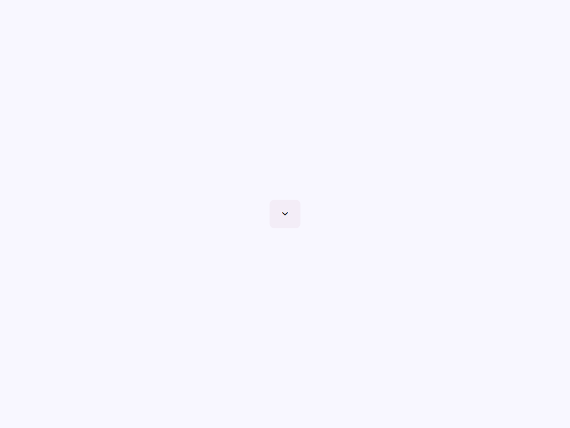
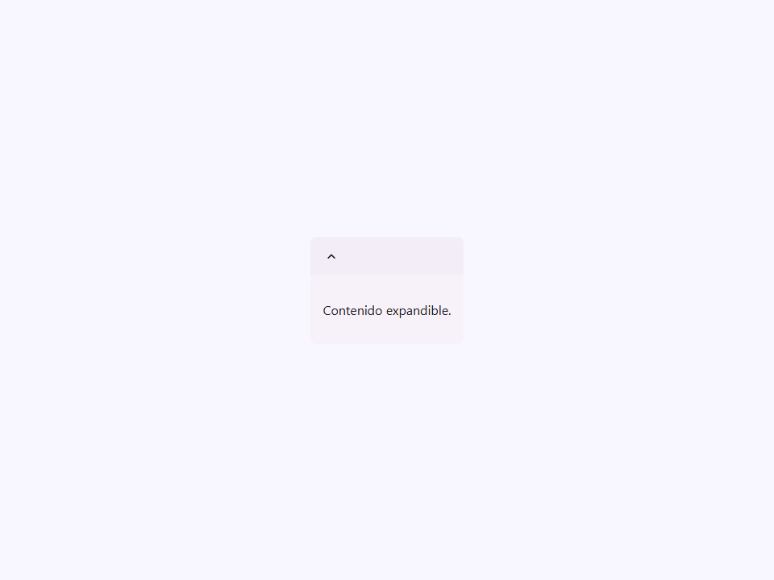

# Expansion

Componente Material Design 3 Expansion panel (Panel de expansión).

Un envoltorio ligero alrededor de los elementos HTML nativos `<details>` y `<summary>`,
estilizado de acuerdo con las pautas de superficie y elevación de M3.
Los paneles de expansión contienen flujos de creación y permiten la edición ligera de un elemento.

**Arquitectura visual:**
El componente renderiza un elemento `<details>` con un `<summary>` que actúa
como el encabezado expandible. El contenido del slot por defecto se coloca dentro de la
etiqueta `<details>` (pero fuera del `<summary>`), ocultándose y mostrándose naturalmente
según el comportamiento nativo. Se añade un icono `expand_more` de M3 mediante un
pseudo-elemento CSS `::after` que rota cuando el panel está abierto.

**Uso:**
Establezca el atributo `title` para un encabezado de texto simple, o use el slot `summary`
para proyectar contenido enriquecido personalizado (como iconos o texto secundario) en el
área del encabezado.

- Tag: `moni-expansion`
- Clase: `MoniExpansion`
- Fuente: `src/components/moni-expansion.ts`

## Cuándo usarlo

Usa `moni-expansion` cuando la interfaz necesite el patrón que describe este componente. Antes de elegirlo, revisa sus estados, contenido permitido y comportamiento accesible; las capturas del final muestran el resultado real de cada variante.

## Uso básico

```html
<!-- Título de texto simple -->
<moni-expansion title="Configuración Avanzada">
  <p>Habilite las características del modo de desarrollador aquí.</p>
</moni-expansion>

<!-- Contenido de resumen enriquecido a través de slot -->
<moni-expansion open>
  <div slot="summary" style="display: flex; gap: 8px;">
    <moni-icon>person</moni-icon>
    <span>Información Personal</span>
  </div>
  <form>
    <moni-text-field label="Nombre"></moni-text-field>
  </form>
</moni-expansion>
```

## Ejemplo práctico con Tailwind CSS v4

Tailwind controla composición, ancho, espaciado y responsividad alrededor del Web Component. Moni UI conserva el aspecto interno mediante Shadow DOM y design tokens.

```html
<div class="mx-auto flex w-full max-w-md flex-col gap-4 p-6">
  <moni-expansion></moni-expansion>
</div>
```

No necesitas un plugin de Tailwind. En tu CSS v4 importa ambas capas una sola vez:

```css
@import "tailwindcss";
@import "@moni-labs/moni-ui/styles";

@theme {
  --font-sans: Inter, ui-sans-serif, system-ui, sans-serif;
}
```

Las utilities aplicadas directamente al tag afectan su caja anfitriona. No uses selectores Tailwind para asumir acceso al DOM interno; personaliza únicamente con los CSS Parts y Custom Properties públicos enumerados más abajo.

## Recomendaciones

- Usa `moni-expansion` para su propósito semántico; no lo sustituyas por un `div` estilizado.
- Aplica Tailwind al layout exterior. Para el interior del Shadow DOM usa las variables CSS y `::part()` documentados.
- Mantén el estado de apertura en una única fuente de verdad y devuelve el foco al disparador al cerrar.
- Prueba los estados claro, oscuro, foco por teclado, deshabilitado y viewport móvil antes de publicar.

## Propiedades y atributos

| Atributo | Propiedad | Tipo | Default | Descripción |
|---|---|---|---|---|
| `open` | `open` | `boolean` | `false` | Controla si la superficie superpuesta está abierta. |
| `title` | `title` | `string` | `''` | Define `title`. Conserva el tipo indicado y usa la propiedad JavaScript cuando el valor no sea una cadena. |

## Slots

- `default`: El contenido del cuerpo del panel de expansión.
- `summary`: Contenido personalizado del encabezado (sobrescribe el atributo `title`).

## Eventos

No declara eventos propios.

## Métodos públicos

No expone métodos públicos adicionales.

## CSS Parts

- `body`: Parte interna personalizable.
- `expansion`: Parte interna personalizable.
- `summary`: Parte interna personalizable.

## CSS Custom Properties consumidas

- `--font`
- `--font-icon`
- `--on-surface`
- `--speed2`
- `--surface-container`
- `--surface-container-low`

## Referencia visual por variable

Cada imagen se genera con el componente real: cambia solo la variable indicada y mantiene estable el resto del escenario. Úsala para comparar estados, no como sustituto de la API.

### `open`

Controla si la superficie superpuesta está abierta.





### `title`

Define `title`. Conserva el tipo indicado y usa la propiedad JavaScript cuando el valor no sea una cadena.


