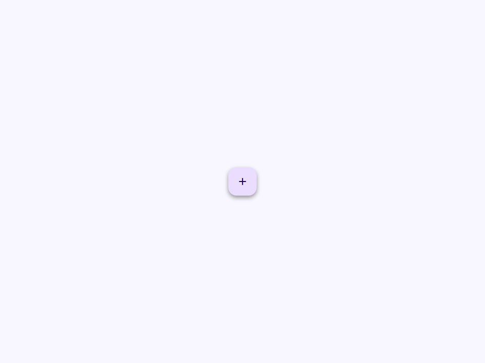
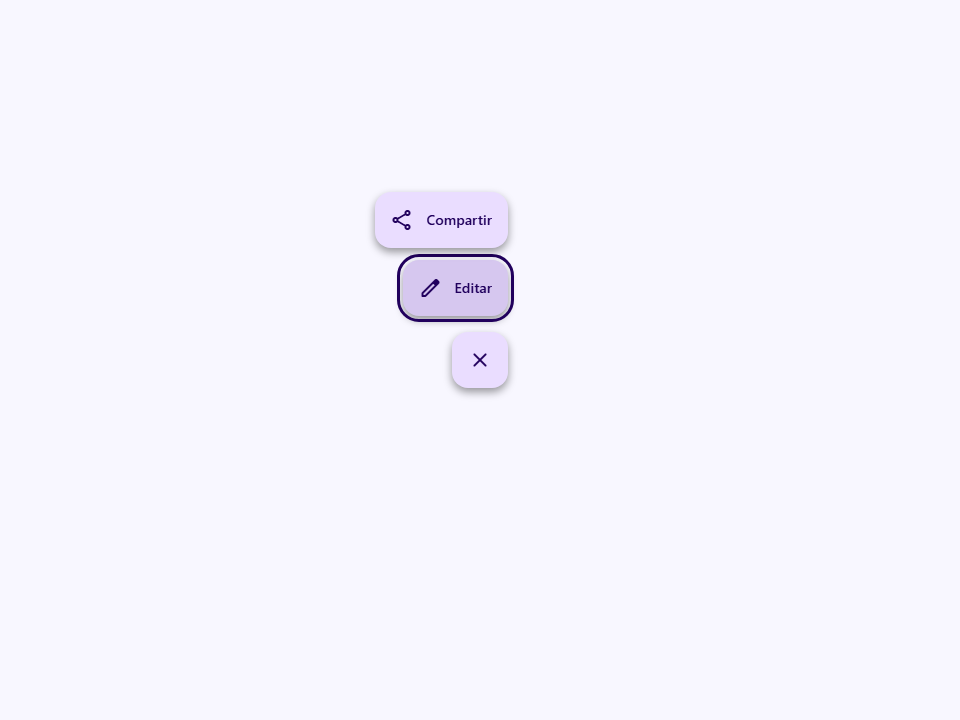
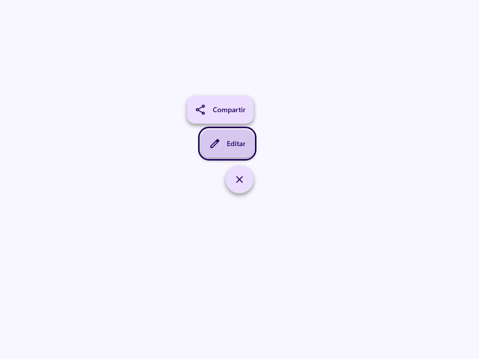

# Fab Menu

Accessible Material 3 Expressive FAB menu / speed dial.

- Tag: `moni-fab-menu`
- Clase: `MoniFabMenu`
- Fuente: `src/components/moni-fab-menu.ts`

## Cuándo usarlo

Usa `moni-fab-menu` cuando la interfaz necesite el patrón que describe este componente. Antes de elegirlo, revisa sus estados, contenido permitido y comportamiento accesible; las capturas del final muestran el resultado real de cada variante.

## Uso básico

```html
<moni-fab-menu></moni-fab-menu>
```

## Ejemplo práctico con Tailwind CSS v4

Tailwind controla composición, ancho, espaciado y responsividad alrededor del Web Component. Moni UI conserva el aspecto interno mediante Shadow DOM y design tokens.

```html
<div class="mx-auto flex w-full max-w-md flex-col gap-4 p-6">
  <moni-fab-menu label="Ejemplo"></moni-fab-menu>
</div>
```

No necesitas un plugin de Tailwind. En tu CSS v4 importa ambas capas una sola vez:

```css
@import "tailwindcss";
@import "@moni-labs/moni-ui/styles";

@theme {
  --font-sans: Inter, ui-sans-serif, system-ui, sans-serif;
}
```

Las utilities aplicadas directamente al tag afectan su caja anfitriona. No uses selectores Tailwind para asumir acceso al DOM interno; personaliza únicamente con los CSS Parts y Custom Properties públicos enumerados más abajo.

## Recomendaciones

- Usa `moni-fab-menu` para su propósito semántico; no lo sustituyas por un `div` estilizado.
- Aplica Tailwind al layout exterior. Para el interior del Shadow DOM usa las variables CSS y `::part()` documentados.
- Durante una operación asíncrona combina el estado `loading` —si existe— con `disabled` para evitar envíos duplicados.
- Cuando el control muestre únicamente un icono, añade siempre un `aria-label` descriptivo.
- Mantén el estado de apertura en una única fuente de verdad y devuelve el foco al disparador al cerrar.
- Prueba los estados claro, oscuro, foco por teclado, deshabilitado y viewport móvil antes de publicar.

## Propiedades y atributos

| Atributo | Propiedad | Tipo | Default | Descripción |
|---|---|---|---|---|
| `open` | `open` | `boolean` | `false` | Controla si la superficie superpuesta está abierta. |
| `disabled` | `disabled` | `boolean` | `false` | Impide la interacción y aplica el estado visual deshabilitado. |
| `icon` | `icon` | `string` | `'add'` | Nombre de Material Symbol mostrado por el componente. |
| `close-icon` | `closeIcon` | `string` | `'close'` | Define `closeIcon`. Conserva el tipo indicado y usa la propiedad JavaScript cuando el valor no sea una cadena. |
| `label` | `label` | `string` | `'Abrir acciones'` | Etiqueta visible y accesible del control. |
| `close-label` | `closeLabel` | `string` | `'Cerrar acciones'` | Define `closeLabel`. Conserva el tipo indicado y usa la propiedad JavaScript cuando el valor no sea una cadena. |
| `size` | `size` | `MoniFabSize` | `'medium'` | Selecciona uno de los tamaños visuales admitidos. |
| `color` | `color` | `MoniFabColor` | `'primary'` | Define `color`. Conserva el tipo indicado y usa la propiedad JavaScript cuando el valor no sea una cadena. |
| `shape` | `shape` | `'rounded' \| 'circle'` | `'rounded'` | Selecciona el valor de `shape` entre las opciones documentadas. |
| `direction` | `direction` | `FabMenuDirection` | `'up'` | Define `direction`. Conserva el tipo indicado y usa la propiedad JavaScript cuando el valor no sea una cadena. |
| `position` | `position` | `MoniFabPosition` | `''` | Define `position`. Conserva el tipo indicado y usa la propiedad JavaScript cuando el valor no sea una cadena. |

## Slots

Este componente no declara slots públicos.

## Eventos

- `moni-toggle`: evento compuesto y burbujeante emitido por el componente.

## Métodos públicos

No expone métodos públicos adicionales.

## CSS Parts

- `menu`: Parte interna personalizable.
- `trigger`: Parte interna personalizable.

## CSS Custom Properties consumidas

- `--_fab-menu-index`

## Referencia visual por variable

Cada imagen se genera con el componente real: cambia solo la variable indicada y mantiene estable el resto del escenario. Úsala para comparar estados, no como sustituto de la API.

### `open`

Controla si la superficie superpuesta está abierta.




### `disabled`

Impide la interacción y aplica el estado visual deshabilitado.


### `icon`

Nombre de Material Symbol mostrado por el componente.


### `close-icon`

Define `closeIcon`. Conserva el tipo indicado y usa la propiedad JavaScript cuando el valor no sea una cadena.



### `label`

Etiqueta visible y accesible del control.


### `close-label`

Define `closeLabel`. Conserva el tipo indicado y usa la propiedad JavaScript cuando el valor no sea una cadena.


### `size`

Selecciona uno de los tamaños visuales admitidos.


### `color`

Define `color`. Conserva el tipo indicado y usa la propiedad JavaScript cuando el valor no sea una cadena.


### `shape`

Selecciona el valor de `shape` entre las opciones documentadas.




### `direction`

Define `direction`. Conserva el tipo indicado y usa la propiedad JavaScript cuando el valor no sea una cadena.


### `position`

Define `position`. Conserva el tipo indicado y usa la propiedad JavaScript cuando el valor no sea una cadena.


