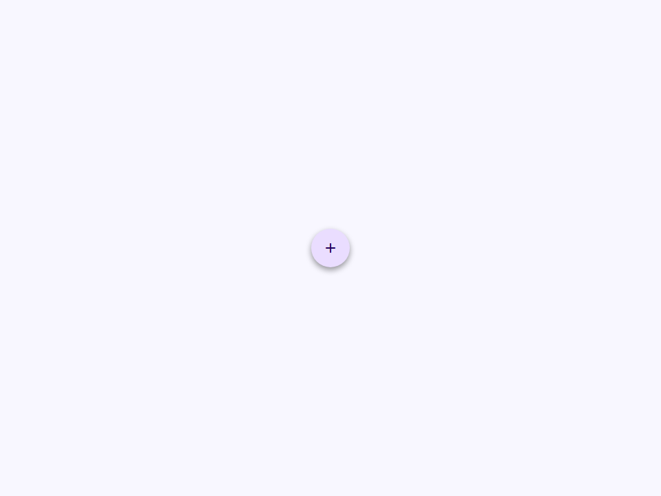
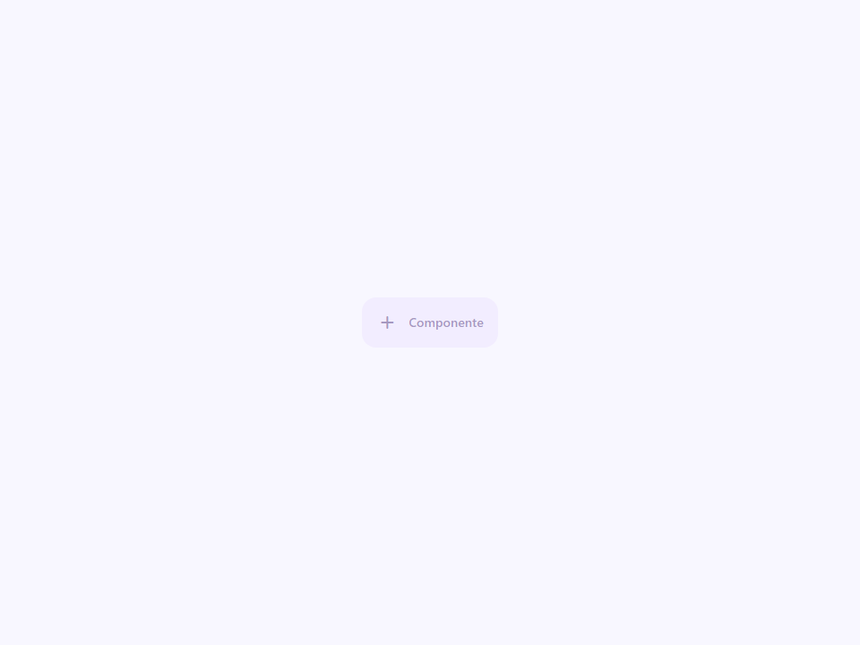
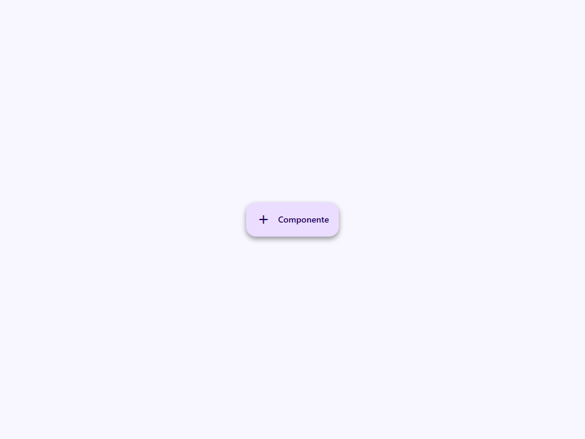

# Fab

Material 3 Expressive floating action button.

- Tag: `moni-fab`
- Clase: `MoniFab`
- Fuente: `src/components/moni-fab.ts`

## Cuándo usarlo

Usa `moni-fab` cuando la interfaz necesite el patrón que describe este componente. Antes de elegirlo, revisa sus estados, contenido permitido y comportamiento accesible; las capturas del final muestran el resultado real de cada variante.

## Uso básico

```html
<moni-fab></moni-fab>
```

## Ejemplo práctico con Tailwind CSS v4

Tailwind controla composición, ancho, espaciado y responsividad alrededor del Web Component. Moni UI conserva el aspecto interno mediante Shadow DOM y design tokens.

```html
<div class="mx-auto flex w-full max-w-md flex-col gap-4 p-6">
  <moni-fab label="Ejemplo"></moni-fab>
</div>
```

No necesitas un plugin de Tailwind. En tu CSS v4 importa ambas capas una sola vez:

```css
@import "tailwindcss";
@import "@moni-labs/moni-ui/styles";

@theme {
  --font-sans: Inter, ui-sans-serif, system-ui, sans-serif;
}
```

Las utilities aplicadas directamente al tag afectan su caja anfitriona. No uses selectores Tailwind para asumir acceso al DOM interno; personaliza únicamente con los CSS Parts y Custom Properties públicos enumerados más abajo.

## Recomendaciones

- Usa `moni-fab` para su propósito semántico; no lo sustituyas por un `div` estilizado.
- Aplica Tailwind al layout exterior. Para el interior del Shadow DOM usa las variables CSS y `::part()` documentados.
- Durante una operación asíncrona combina el estado `loading` —si existe— con `disabled` para evitar envíos duplicados.
- En formularios controlados, sincroniza la propiedad `value` y escucha el evento documentado; no dependas solo del atributo inicial.
- Cuando el control muestre únicamente un icono, añade siempre un `aria-label` descriptivo.
- Prueba los estados claro, oscuro, foco por teclado, deshabilitado y viewport móvil antes de publicar.

## Propiedades y atributos

| Atributo | Propiedad | Tipo | Default | Descripción |
|---|---|---|---|---|
| `size` | `size` | `MoniFabSize` | `'medium'` | Selecciona uno de los tamaños visuales admitidos. |
| `color` | `color` | `MoniFabColor` | `'primary'` | Define `color`. Conserva el tipo indicado y usa la propiedad JavaScript cuando el valor no sea una cadena. |
| `shape` | `shape` | `'rounded' \| 'circle'` | `'rounded'` | Selecciona el valor de `shape` entre las opciones documentadas. |
| `extended` | `extended` | `boolean` | `false` | Activa o desactiva el comportamiento `extended`. En HTML, la presencia del atributo significa `true`; omítelo para `false`. |
| `expanded` | `expanded` | `boolean` | `false` | Activa o desactiva el comportamiento `expanded`. En HTML, la presencia del atributo significa `true`; omítelo para `false`. |
| `disabled` | `disabled` | `boolean` | `false` | Impide la interacción y aplica el estado visual deshabilitado. |
| `icon` | `icon` | `string` | `'add'` | Nombre de Material Symbol mostrado por el componente. |
| `label` | `label` | `string` | `''` | Etiqueta visible y accesible del control. |
| `aria-label` | `accessibleLabel` | `string` | `''` | Define `accessibleLabel`. Conserva el tipo indicado y usa la propiedad JavaScript cuando el valor no sea una cadena. |
| `type` | `type` | `'button' \| 'submit' \| 'reset'` | `'button'` | Selecciona el valor de `type` entre las opciones documentadas. |
| `name` | `name` | `string` | `''` | Nombre enviado junto al valor cuando participa en un formulario. |
| `value` | `value` | `string` | `''` | Valor actual del control; usa la propiedad JavaScript para valores que deban conservar su tipo. |
| `position` | `position` | `MoniFabPosition` | `''` | Define `position`. Conserva el tipo indicado y usa la propiedad JavaScript cuando el valor no sea una cadena. |

## Slots

Este componente no declara slots públicos.

## Eventos

No declara eventos propios.

## Métodos públicos

- `override focus(options?: FocusOptions)` — Método público focus.

## CSS Parts

- `button`: Parte interna personalizable.
- `fab`: Parte interna personalizable.
- `icon`: Parte interna personalizable.
- `label`: Parte interna personalizable.

## CSS Custom Properties consumidas

- `--_container`
- `--_content`
- `--_icon-size`
- `--_padding`
- `--_pressed-radius`
- `--_radius`
- `--_size`
- `--elevate1`
- `--elevate2`
- `--elevate3`
- `--font`
- `--on-primary-container`
- `--on-secondary-container`
- `--on-tertiary-container`
- `--primary`
- `--primary-container`
- `--secondary-container`
- `--surface-container-high`
- `--tertiary-container`

## Referencia visual por variable

Cada imagen se genera con el componente real: cambia solo la variable indicada y mantiene estable el resto del escenario. Úsala para comparar estados, no como sustituto de la API.

### `size`

Selecciona uno de los tamaños visuales admitidos.


### `color`

Define `color`. Conserva el tipo indicado y usa la propiedad JavaScript cuando el valor no sea una cadena.


### `shape`

Selecciona el valor de `shape` entre las opciones documentadas.




### `extended`

Activa o desactiva el comportamiento `extended`. En HTML, la presencia del atributo significa `true`; omítelo para `false`.


### `expanded`

Activa o desactiva el comportamiento `expanded`. En HTML, la presencia del atributo significa `true`; omítelo para `false`.


### `disabled`

Impide la interacción y aplica el estado visual deshabilitado.




### `icon`

Nombre de Material Symbol mostrado por el componente.


### `label`

Etiqueta visible y accesible del control.


### `aria-label`

Define `accessibleLabel`. Conserva el tipo indicado y usa la propiedad JavaScript cuando el valor no sea una cadena.


### `type`

Selecciona el valor de `type` entre las opciones documentadas.


### `name`

Nombre enviado junto al valor cuando participa en un formulario.



### `value`

Valor actual del control; usa la propiedad JavaScript para valores que deban conservar su tipo.


### `position`

Define `position`. Conserva el tipo indicado y usa la propiedad JavaScript cuando el valor no sea una cadena.


