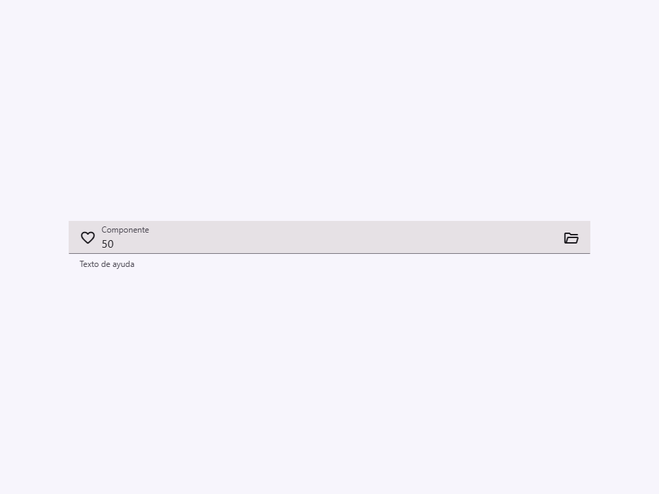
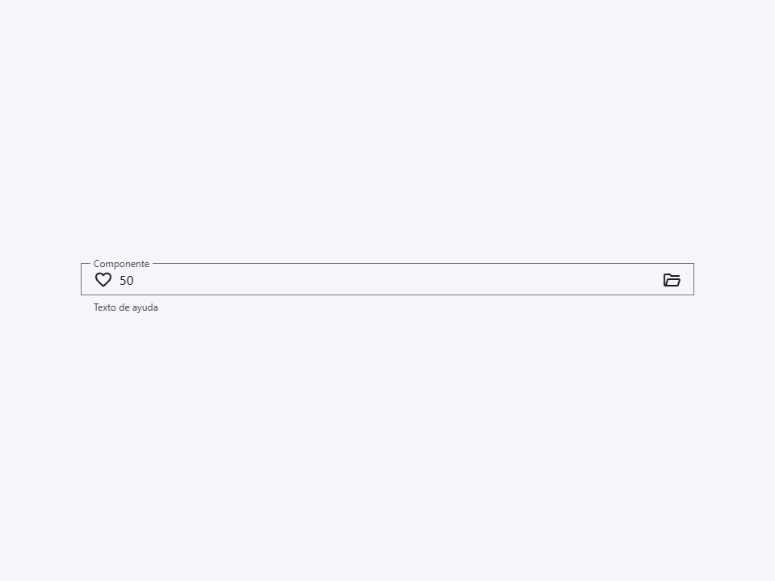
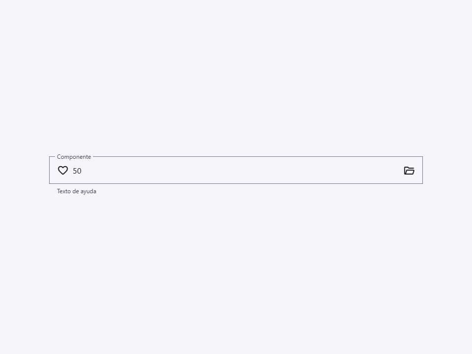
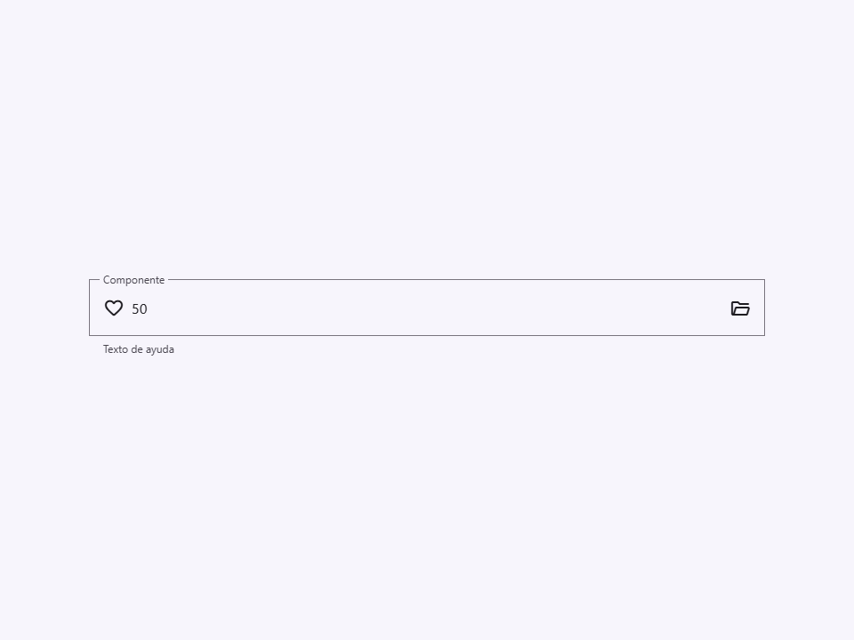
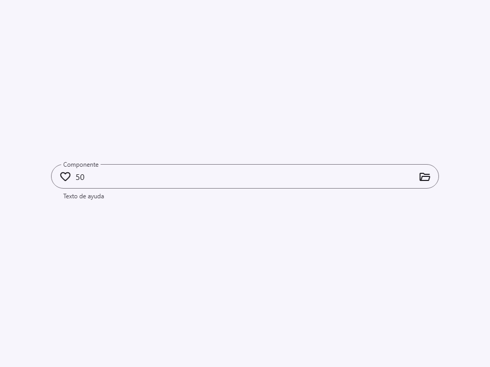
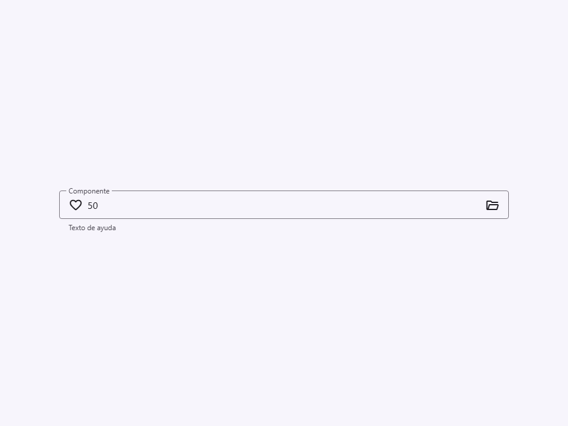
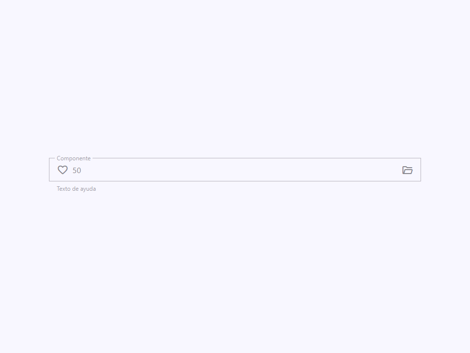
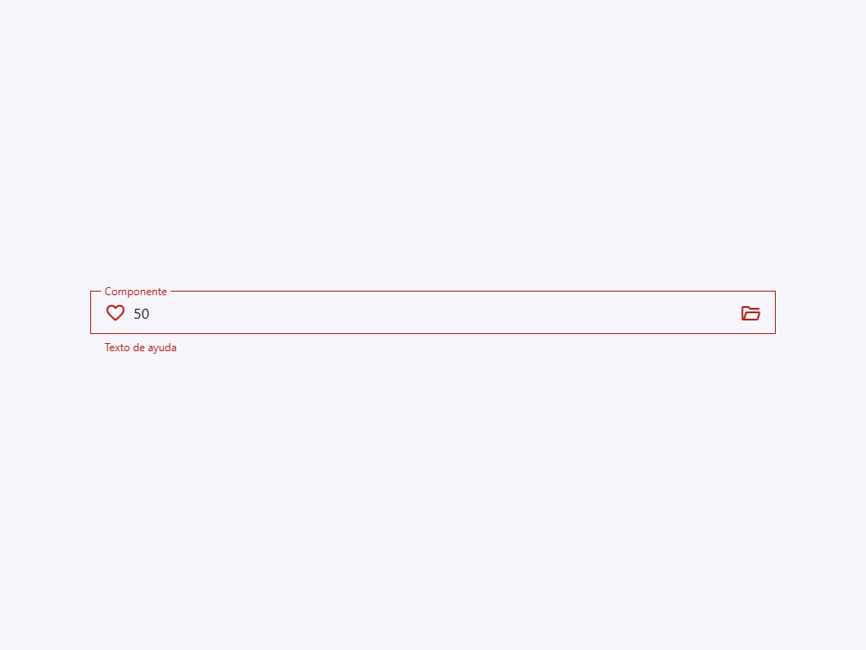

# File Field

Componente Material Design 3 File Field (Campo de Archivo).

Un componente de campo especializado que proporciona una alternativa estilizada y accesible
al `<input type="file">` nativo. Envuelve un input de archivo nativo dentro de
la carcasa `.field` de M3 y presenta un input de texto de solo lectura que muestra los
nombres de archivo(s) seleccionado(s) junto a un botón de acción "Seleccionar archivo" estilizado.

**Arquitectura visual:**
El componente aprovecha los patrones CSS `fieldStyles`. La estructura interna del DOM
está ordenada específicamente como:
`[text input] -> [label] -> [file input] -> [output]`
Este ordenamiento específico asegura que el selector CSS de hermano adyacente
(`input + label`) pueda flotar correctamente la etiqueta cuando el campo está poblado,
a pesar de que el campo visible sea realmente el input de texto de solo lectura.

**Gestión del estado:**
Cuando el usuario selecciona archivos a través del input de archivo oculto, el componente escucha
el evento nativo `change`, lee `input.files`, y actualiza el input de texto
de solo lectura con una lista separada por comas de los nombres de archivo. La propiedad `value`
se mantiene sincronizada, y se re-despacha un evento compuesto `'change'`.

- Tag: `moni-file-field`
- Clase: `MoniFileField`
- Fuente: `src/components/moni-file-field.ts`

## Cuándo usarlo

Usa `moni-file-field` cuando la interfaz necesite el patrón que describe este componente. Antes de elegirlo, revisa sus estados, contenido permitido y comportamiento accesible; las capturas del final muestran el resultado real de cada variante.

## Uso básico

```html
<!-- Carga de un solo archivo -->
<moni-file-field
  label="Foto de perfil"
  name="avatar"
  accept="image/png, image/jpeg"
  button-label="Explorar..."
></moni-file-field>

<!-- Carga de múltiples archivos con estado de error -->
<moni-file-field
  label="Documentos"
  multiple
  error
  error-text="Los archivos superan el límite de tamaño máximo"
></moni-file-field>
```

## Ejemplo práctico con Tailwind CSS v4

Tailwind controla composición, ancho, espaciado y responsividad alrededor del Web Component. Moni UI conserva el aspecto interno mediante Shadow DOM y design tokens.

```html
<div class="mx-auto flex w-full max-w-md flex-col gap-4 p-6">
  <moni-file-field label="Ejemplo"></moni-file-field>
</div>
```

No necesitas un plugin de Tailwind. En tu CSS v4 importa ambas capas una sola vez:

```css
@import "tailwindcss";
@import "@moni-labs/moni-ui/styles";

@theme {
  --font-sans: Inter, ui-sans-serif, system-ui, sans-serif;
}
```

Las utilities aplicadas directamente al tag afectan su caja anfitriona. No uses selectores Tailwind para asumir acceso al DOM interno; personaliza únicamente con los CSS Parts y Custom Properties públicos enumerados más abajo.

## Recomendaciones

- Usa `moni-file-field` para su propósito semántico; no lo sustituyas por un `div` estilizado.
- Aplica Tailwind al layout exterior. Para el interior del Shadow DOM usa las variables CSS y `::part()` documentados.
- Durante una operación asíncrona combina el estado `loading` —si existe— con `disabled` para evitar envíos duplicados.
- En formularios controlados, sincroniza la propiedad `value` y escucha el evento documentado; no dependas solo del atributo inicial.
- Cuando el control muestre únicamente un icono, añade siempre un `aria-label` descriptivo.
- Prueba los estados claro, oscuro, foco por teclado, deshabilitado y viewport móvil antes de publicar.

## Propiedades y atributos

| Atributo | Propiedad | Tipo | Default | Descripción |
|---|---|---|---|---|
| `name` | `name` | `string` | `''` | El nombre del input, enviado con los datos del formulario. |
| `label` | `label` | `string` | `''` | El texto de la etiqueta flotante. |
| `variant` | `variant` | `'filled' \| 'outlined'` | `'outlined'` | Variante visual del campo de texto. |
| `size` | `size` | `'small' \| 'medium' \| 'large' \| 'extra'` | `'medium'` | Define las dimensiones del campo de texto. |
| `shape` | `shape` | `'round' \| 'square' \| 'no-round'` | `'no-round'` | Forma del radio del borde del campo. |
| `accept` | `accept` | `string` | `''` | El atributo `accept` para el input de archivo (ej. `image/*, .pdf`). |
| `multiple` | `multiple` | `boolean` | `false` | Permite seleccionar múltiples archivos si es true. |
| `button-label` | `buttonLabel` | `string` | `'Choose file'` | Texto para el botón de selección de archivo. |
| `disabled` | `disabled` | `boolean` | `false` | Deshabilita el campo de archivo. |
| `helper` | `helper` | `string` | `''` | Texto de ayuda mostrado debajo del campo. |
| `error-text` | `errorText` | `string` | `''` | Texto de error mostrado debajo del campo cuando `error` es true.
 Sobrescribe el texto de ayuda. |
| `error` | `error` | `boolean` | `false` | Si es true, establece el campo en un estado de error. |
| `value` | `value` | `string` | `''` | La representación en cadena de los archivos seleccionados (solo lectura para el usuario). |
| `icon` | `icon` | `string` | `''` | Nombre del icono inicial (Material Symbols). |
| `trailing-icon` | `trailingIcon` | `string` | `'folder_open'` | Nombre del icono final (Material Symbols). |

## Slots

Este componente no declara slots públicos.

## Eventos

No declara eventos propios.

## Métodos públicos

No expone métodos públicos adicionales.

## CSS Parts

- `field`: Parte interna personalizable.
- `input-text`: El `<input type="text">` de solo lectura visible.
- `label`: Parte interna personalizable.
- `input-file`: El `<input type="file">` nativo oculto.
- `button`: El elemento de botón (estilizado vía CSS `::file-selector-button`).
- `display`: Parte interna personalizable.
- `file`: Parte interna personalizable.
- `helper`: Parte interna personalizable.
- `leading-icon`: Parte interna personalizable.
- `trailing-icon`: Parte interna personalizable.

## CSS Custom Properties consumidas

No consume variables CSS propias.

## Referencia visual por variable

Cada imagen se genera con el componente real: cambia solo la variable indicada y mantiene estable el resto del escenario. Úsala para comparar estados, no como sustituto de la API.

### `name`

El nombre del input, enviado con los datos del formulario.


### `label`

El texto de la etiqueta flotante.


### `variant`

Variante visual del campo de texto.




### `size`

Define las dimensiones del campo de texto.








### `shape`

Forma del radio del borde del campo.






### `accept`

El atributo `accept` para el input de archivo (ej. `image/*, .pdf`).


### `multiple`

Permite seleccionar múltiples archivos si es true.


### `button-label`

Texto para el botón de selección de archivo.


### `disabled`

Deshabilita el campo de archivo.




### `helper`

Texto de ayuda mostrado debajo del campo.


### `error-text`

Texto de error mostrado debajo del campo cuando `error` es true.
Sobrescribe el texto de ayuda.


### `error`

Si es true, establece el campo en un estado de error.




### `value`

La representación en cadena de los archivos seleccionados (solo lectura para el usuario).


### `icon`

Nombre del icono inicial (Material Symbols).


### `trailing-icon`

Nombre del icono final (Material Symbols).


