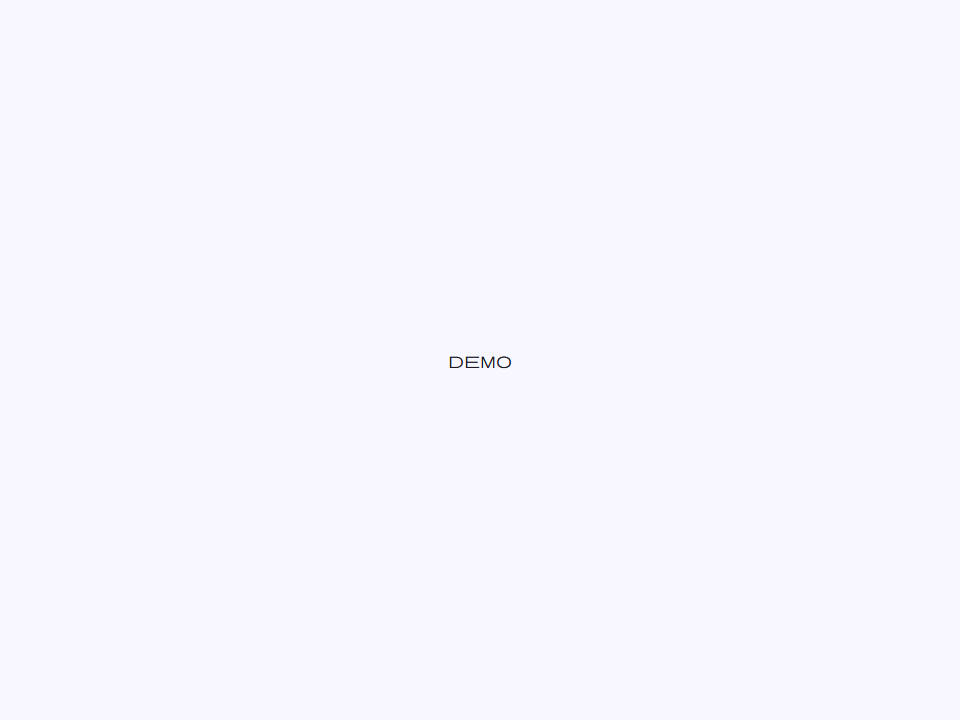
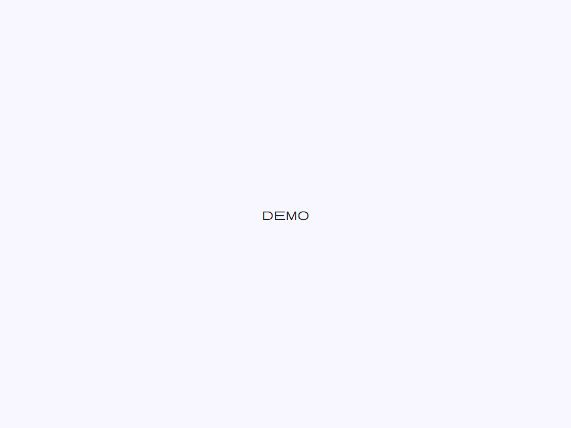
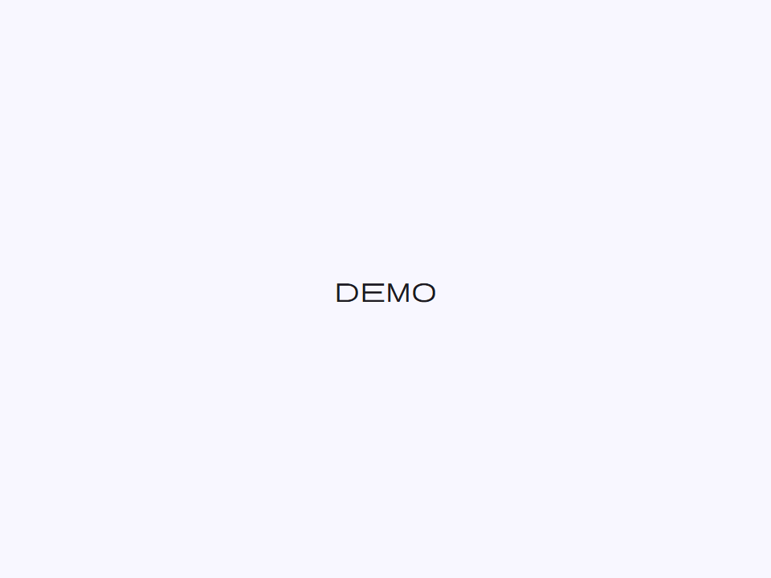

# Icon

Componente de icono solo visual que utiliza la fuente variable Material Symbols.

Renderiza un glifo de Material Symbols por el nombre de su ligadura. La fuente de iconos
debe cargarse globalmente en el documento host — no viene empaquetada con
el componente. Añada la fuente a través de la hoja de estilos `@moni-labs/moni-ui/styles`
o incluyendo el enlace CDN de Google Fonts.

**Renderizado de fuentes:**
El icono usa `font-family: var(--font-icon)` que por defecto es
`'Material Symbols Rounded'`. Sobrescriba `--font-icon-override` en el
`:root` del documento host para cambiar a una variante diferente del conjunto de iconos
(ej. `'Material Symbols Outlined'` o `'Material Symbols Sharp'`).

**Ajustes de fuente variable:**
El valor por defecto de `font-variation-settings` es `'FILL' 0, 'wght' 400, 'GRAD' 0, 'opsz' 24`.
Establecer el atributo `filled` cambia a `'FILL' 1` para la variante de icono sólido.

**Herencia de color:**
El icono siempre hereda el color de su padre a través de `color: inherit`, haciéndolo
adaptarse automáticamente a las variantes de botones, estados seleccionados de chips, estados
activos de elementos de lista y otros contenedores de contexto de color.

- Tag: `moni-icon`
- Clase: `MoniIcon`
- Fuente: `src/components/moni-icon.ts`

## Cuándo usarlo

Usa `moni-icon` cuando la interfaz necesite el patrón que describe este componente. Antes de elegirlo, revisa sus estados, contenido permitido y comportamiento accesible; las capturas del final muestran el resultado real de cada variante.

## Uso básico

```html
<!-- Icono básico -->
<moni-icon name="home"></moni-icon>

<!-- Icono grande rellenado -->
<moni-icon name="favorite" size="large" filled></moni-icon>

<!-- Sobrescritura de SVG personalizado a través de slot -->
<moni-icon>
  <svg slot="default" viewBox="0 0 24 24">...</svg>
</moni-icon>
```

## Ejemplo práctico con Tailwind CSS v4

Tailwind controla composición, ancho, espaciado y responsividad alrededor del Web Component. Moni UI conserva el aspecto interno mediante Shadow DOM y design tokens.

```html
<div class="mx-auto flex w-full max-w-md flex-col gap-4 p-6">
  <moni-icon></moni-icon>
</div>
```

No necesitas un plugin de Tailwind. En tu CSS v4 importa ambas capas una sola vez:

```css
@import "tailwindcss";
@import "@moni-labs/moni-ui/styles";

@theme {
  --font-sans: Inter, ui-sans-serif, system-ui, sans-serif;
}
```

Las utilities aplicadas directamente al tag afectan su caja anfitriona. No uses selectores Tailwind para asumir acceso al DOM interno; personaliza únicamente con los CSS Parts y Custom Properties públicos enumerados más abajo.

## Recomendaciones

- Usa `moni-icon` para su propósito semántico; no lo sustituyas por un `div` estilizado.
- Aplica Tailwind al layout exterior. Para el interior del Shadow DOM usa las variables CSS y `::part()` documentados.
- Prueba los estados claro, oscuro, foco por teclado, deshabilitado y viewport móvil antes de publicar.

## Propiedades y atributos

| Atributo | Propiedad | Tipo | Default | Descripción |
|---|---|---|---|---|
| `name` | `name` | `string` | `''` | Nombre de la ligadura de Material Symbols para el icono a renderizar.  Utilice el nombre exactamente como se muestra en https://fonts.google.com/icons (ej. `'home'`, `'settings'`, `'arrow_forward'`). Cuando está vacío, se renderiza el slot por defecto en su lugar. |
| `size` | `size` | `'tiny' \| 'small' \| 'medium' \| 'large' \| 'extra'` | `'medium'` | Tamaño de la caja delimitadora del icono.  Se mapea a la propiedad personalizada `--_size`: \| Valor      \| Tamaño   \| \|------------\|----------\| \| `'tiny'`   \| 1rem     \| \| `'small'`  \| 1.25rem  \| \| `'medium'` \| 1.5rem   \| \| `'large'`  \| 1.75rem  \| \| `'extra'`  \| 2rem     \| |
| `filled` | `filled` | `boolean` | `false` | Cuando es `true`, cambia a la variante rellenada (filled) del icono estableciendo `font-variation-settings: 'FILL' 1`.  Esto funciona solo con fuentes de iconos variables que incluyen el eje `FILL` (todas las variantes de Material Symbols lo hacen). No tiene efecto si se carga una fuente de iconos diferente que no soporte `FILL`. |

## Slots

- `default`: Contenido de respaldo cuando `name` está vacío. Acepta elementos `<svg>` o ``
          que se dimensionan al 100% de la caja del icono.

## Eventos

No declara eventos propios.

## Métodos públicos

No expone métodos públicos adicionales.

## CSS Parts

No declara CSS Parts.

## CSS Custom Properties consumidas

- `--_size`
- `--font-icon`
- `--moni-icon-size`

## Referencia visual por variable

Cada imagen se genera con el componente real: cambia solo la variable indicada y mantiene estable el resto del escenario. Úsala para comparar estados, no como sustituto de la API.

### `name`

Nombre de la ligadura de Material Symbols para el icono a renderizar.

Utilice el nombre exactamente como se muestra en https://fonts.google.com/icons
(ej. `'home'`, `'settings'`, `'arrow_forward'`).
Cuando está vacío, se renderiza el slot por defecto en su lugar.


### `size`

Tamaño de la caja delimitadora del icono.

Se mapea a la propiedad personalizada `--_size`:
| Valor      | Tamaño   |
|------------|----------|
| `'tiny'`   | 1rem     |
| `'small'`  | 1.25rem  |
| `'medium'` | 1.5rem   |
| `'large'`  | 1.75rem  |
| `'extra'`  | 2rem     |








### `filled`

Cuando es `true`, cambia a la variante rellenada (filled) del icono estableciendo
`font-variation-settings: 'FILL' 1`.

Esto funciona solo con fuentes de iconos variables que incluyen el eje `FILL`
(todas las variantes de Material Symbols lo hacen). No tiene efecto si se carga
una fuente de iconos diferente que no soporte `FILL`.


