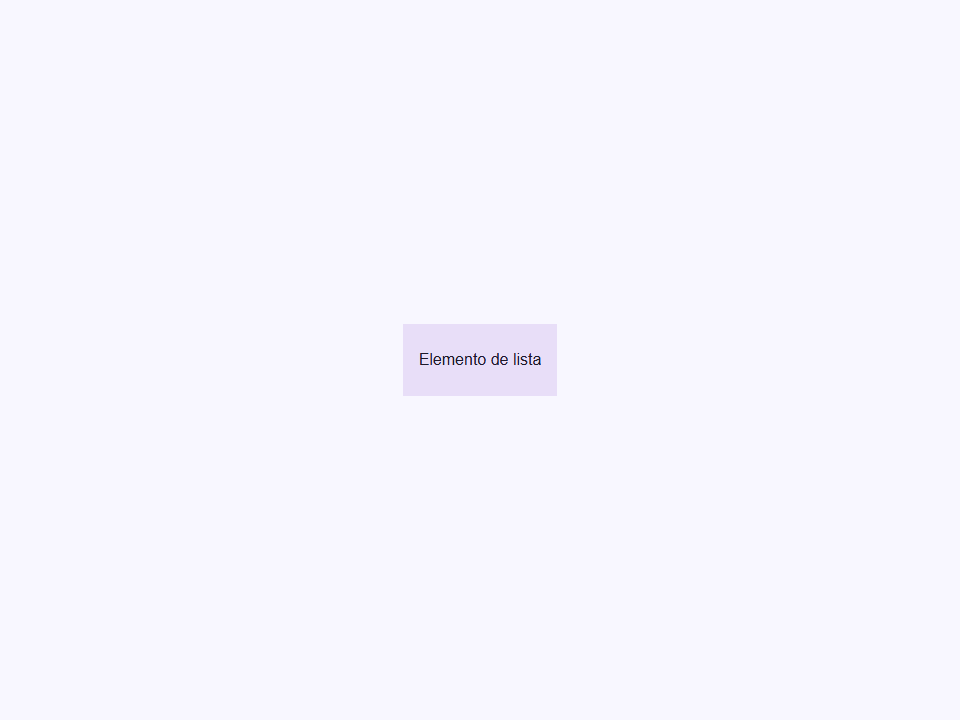
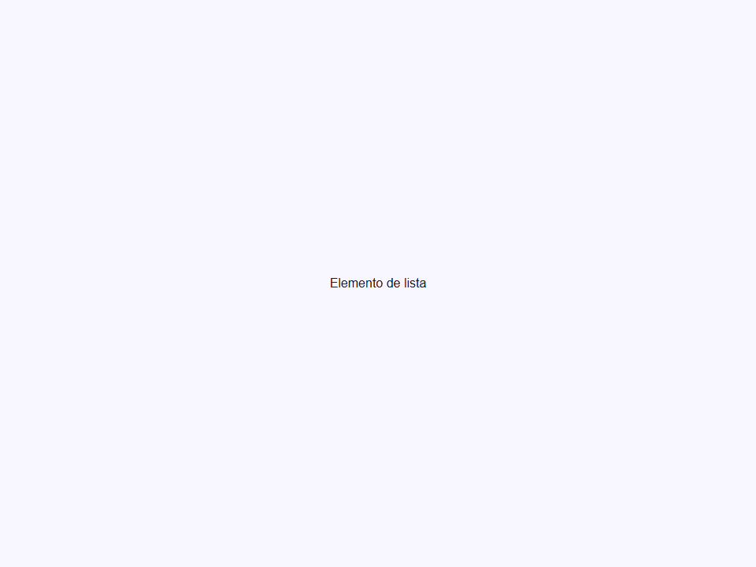
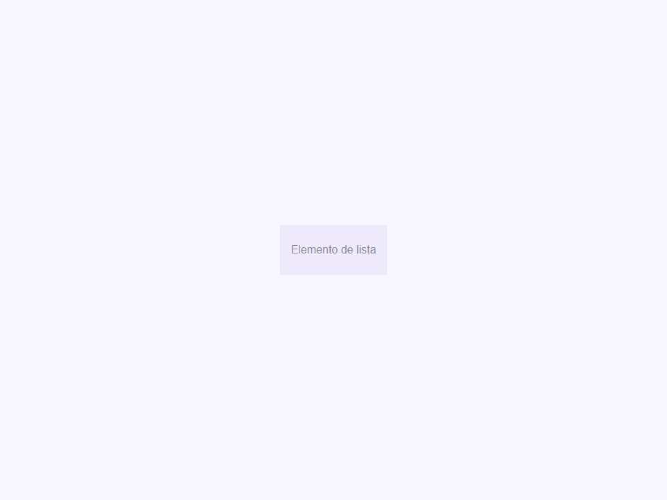

# List Item

Componente Material Design 3 List Item (Elemento de Lista).

Una sola fila dentro de un `<moni-list>`. Los elementos de lista muestran un titular y
opcionalmente texto de soporte, metadatos, iconos o avatares.

**Referencia de la especificación M3:** `m3-docs/components/lists/specs.md`

**Configuraciones de línea:**
El atributo `lines` configura el diseño y la altura mínima del elemento:
- `lines="1"` (por defecto) — altura mínima de 56dp. Solo se muestra el slot del titular.
- `lines="2"` — altura mínima de 72dp. Muestra el titular y el texto de soporte.
- `lines="3"` — altura mínima de 88dp. Muestra el titular, el texto de soporte y el texto meta.

**Comportamiento interactivo:**
Por defecto, los elementos se renderizan como elementos `<button>`, adquiriendo la capa de estado de M3
(efectos de ondulación de hover, focus y press).
Si se proporciona el atributo `href`, el elemento se renderiza internamente como un elemento `<a>`,
permitiendo enrutamiento de enlaces nativos e interacciones mientras se preserva el
estilo del elemento de lista.

**Elementos visuales:**
- `icon` (atributo) — Nombre de Material Symbol para el icono inicial (24dp).
- `avatar` (atributo) — URL para una imagen circular inicial (40dp).
- `trailing-icon` (atributo) — Nombre de Material Symbol para el icono final.

- Tag: `moni-list-item`
- Clase: `MoniListItem`
- Fuente: `src/components/moni-list-item.ts`

## Cuándo usarlo

Usa `moni-list-item` cuando la interfaz necesite el patrón que describe este componente. Antes de elegirlo, revisa sus estados, contenido permitido y comportamiento accesible; las capturas del final muestran el resultado real de cada variante.

## Uso básico

```html
<!-- Elemento de 1 línea con icono -->
<moni-list-item icon="inbox">
  Bandeja de entrada
</moni-list-item>

<!-- Elemento de 2 líneas con avatar y meta final -->
<moni-list-item lines="2" avatar="/user.jpg">
  Ali Connors
  <span slot="supporting">¿Brunch este fin de semana?</span>
  <span slot="trailing-meta">10 min</span>
</moni-list-item>

<!-- Elemento de enlace -->
<moni-list-item href="/settings" icon="settings">
  Ajustes
</moni-list-item>
```

## Ejemplo práctico con Tailwind CSS v4

Tailwind controla composición, ancho, espaciado y responsividad alrededor del Web Component. Moni UI conserva el aspecto interno mediante Shadow DOM y design tokens.

```html
<div class="mx-auto flex w-full max-w-md flex-col gap-4 p-6">
  <moni-list-item></moni-list-item>
</div>
```

No necesitas un plugin de Tailwind. En tu CSS v4 importa ambas capas una sola vez:

```css
@import "tailwindcss";
@import "@moni-labs/moni-ui/styles";

@theme {
  --font-sans: Inter, ui-sans-serif, system-ui, sans-serif;
}
```

Las utilities aplicadas directamente al tag afectan su caja anfitriona. No uses selectores Tailwind para asumir acceso al DOM interno; personaliza únicamente con los CSS Parts y Custom Properties públicos enumerados más abajo.

## Recomendaciones

- Usa `moni-list-item` para su propósito semántico; no lo sustituyas por un `div` estilizado.
- Aplica Tailwind al layout exterior. Para el interior del Shadow DOM usa las variables CSS y `::part()` documentados.
- Durante una operación asíncrona combina el estado `loading` —si existe— con `disabled` para evitar envíos duplicados.
- Cuando el control muestre únicamente un icono, añade siempre un `aria-label` descriptivo.
- Mantén el estado de apertura en una única fuente de verdad y devuelve el foco al disparador al cerrar.
- Prueba los estados claro, oscuro, foco por teclado, deshabilitado y viewport móvil antes de publicar.

## Propiedades y atributos

| Atributo | Propiedad | Tipo | Default | Descripción |
|---|---|---|---|---|
| `lines` | `lines` | `1 \| 2 \| 3` | `1` | Define `lines`. Conserva el tipo indicado y usa la propiedad JavaScript cuando el valor no sea una cadena. |
| `icon` | `icon` | `string` | `''` | Nombre de Material Symbol mostrado por el componente. |
| `avatar` | `avatar` | `string` | `''` | Define `avatar`. Conserva el tipo indicado y usa la propiedad JavaScript cuando el valor no sea una cadena. |
| `trailing-icon` | `trailingIcon` | `string` | `''` | Define `trailingIcon`. Conserva el tipo indicado y usa la propiedad JavaScript cuando el valor no sea una cadena. |
| `active` | `active` | `boolean` | `false` | Indica si el elemento está activo. |
| `disabled` | `disabled` | `boolean` | `false` | Impide la interacción y aplica el estado visual deshabilitado. |
| `href` | `href` | `string` | `''` | Define `href`. Conserva el tipo indicado y usa la propiedad JavaScript cuando el valor no sea una cadena. |

## Slots

- `default`: Texto del titular (Línea 1).
- `supporting`: Texto de soporte (Línea 2, requiere `lines>=2`).
- `meta`: Texto meta adicional (Línea 3, requiere `lines=3`).
- `trailing-meta`: Texto pequeño mostrado en el borde derecho lejano.

## Eventos

No declara eventos propios.

## Métodos públicos

No expone métodos públicos adicionales.

## CSS Parts

- `item`: El contenedor externo `<button>` o `<a>`.
- `leading-icon`: Contenedor para el icono/avatar inicial.
- `text`: Parte interna personalizable.
- `trailing-icon`: Contenedor para el icono final.
- `avatar`: Parte interna personalizable.
- `headline`: Parte interna personalizable.
- `leading`: Parte interna personalizable.
- `meta`: Parte interna personalizable.
- `row`: Parte interna personalizable.
- `supporting`: Parte interna personalizable.
- `trailing`: Parte interna personalizable.

## CSS Custom Properties consumidas

- `--font`
- `--on-secondary-container`
- `--on-surface`
- `--on-surface-variant`
- `--outline-variant`
- `--secondary-container`
- `--speed2`
- `--surface-container`

## Referencia visual por variable

Cada imagen se genera con el componente real: cambia solo la variable indicada y mantiene estable el resto del escenario. Úsala para comparar estados, no como sustituto de la API.

### `lines`

Define `lines`. Conserva el tipo indicado y usa la propiedad JavaScript cuando el valor no sea una cadena.


### `icon`

Nombre de Material Symbol mostrado por el componente.



### `avatar`

Define `avatar`. Conserva el tipo indicado y usa la propiedad JavaScript cuando el valor no sea una cadena.


### `trailing-icon`

Define `trailingIcon`. Conserva el tipo indicado y usa la propiedad JavaScript cuando el valor no sea una cadena.


### `active`

Indica si el elemento está activo.




### `disabled`

Impide la interacción y aplica el estado visual deshabilitado.




### `href`

Define `href`. Conserva el tipo indicado y usa la propiedad JavaScript cuando el valor no sea una cadena.


