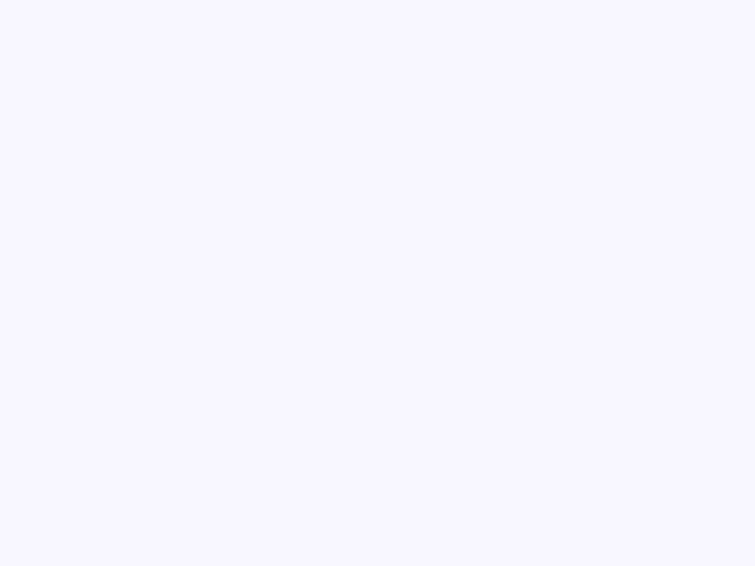
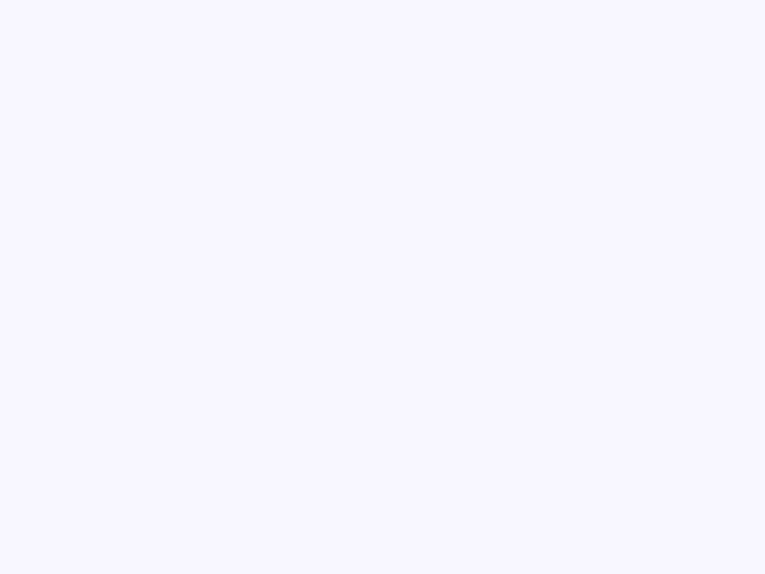

# List

Componente Material Design 3 List (Lista).

Las listas son índices continuos y verticales de texto o imágenes. Son
elementos contenedores que proporcionan agrupación estructural y opcionalmente
líneas divisorias para los hijos `<moni-list-item>`.

**Referencia de la especificación M3:** `m3-docs/components/lists/specs.md`

**Rol de contenedor:**
La lista en sí no aplica relleno (padding) ni márgenes a sus hijos. El espaciado
y el relleno interno están controlados enteramente por los propios elementos `<moni-list-item>`
para asegurar áreas táctiles (hit targets) y alineación correctas.

**Variantes:**
- `default` (cadena vacía) — Un contenedor de lista limpio y sin bordes.
- `border` — Añade un borde inferior a la lista y muestra divisores
  horizontales (color `outline-variant`) entre los elementos de la lista.

- Tag: `moni-list`
- Clase: `MoniList`
- Fuente: `src/components/moni-list.ts`

## Cuándo usarlo

Usa `moni-list` cuando la interfaz necesite el patrón que describe este componente. Antes de elegirlo, revisa sus estados, contenido permitido y comportamiento accesible; las capturas del final muestran el resultado real de cada variante.

## Uso básico

```html
<!-- Lista estándar -->
<moni-list>
  <moni-list-item headline="Elemento 1"></moni-list-item>
  <moni-list-item headline="Elemento 2"></moni-list-item>
</moni-list>

<!-- Lista con divisores y elementos redondeados -->
<moni-list variant="border" rounded>
  <moni-list-item icon="inbox" headline="Bandeja de entrada"></moni-list-item>
  <moni-list-item icon="send" headline="Enviados"></moni-list-item>
</moni-list>
```

## Ejemplo práctico con Tailwind CSS v4

Tailwind controla composición, ancho, espaciado y responsividad alrededor del Web Component. Moni UI conserva el aspecto interno mediante Shadow DOM y design tokens.

```html
<div class="mx-auto flex w-full max-w-md flex-col gap-4 p-6">
  <moni-list></moni-list>
</div>
```

No necesitas un plugin de Tailwind. En tu CSS v4 importa ambas capas una sola vez:

```css
@import "tailwindcss";
@import "@moni-labs/moni-ui/styles";

@theme {
  --font-sans: Inter, ui-sans-serif, system-ui, sans-serif;
}
```

Las utilities aplicadas directamente al tag afectan su caja anfitriona. No uses selectores Tailwind para asumir acceso al DOM interno; personaliza únicamente con los CSS Parts y Custom Properties públicos enumerados más abajo.

## Recomendaciones

- Usa `moni-list` para su propósito semántico; no lo sustituyas por un `div` estilizado.
- Aplica Tailwind al layout exterior. Para el interior del Shadow DOM usa las variables CSS y `::part()` documentados.
- Prueba los estados claro, oscuro, foco por teclado, deshabilitado y viewport móvil antes de publicar.

## Propiedades y atributos

| Atributo | Propiedad | Tipo | Default | Descripción |
|---|---|---|---|---|
| `variant` | `variant` | `'' \| 'border'` | `''` | Selecciona la variante visual y su nivel de énfasis. |
| `rounded` | `rounded` | `boolean` | `false` | Activa o desactiva el comportamiento `rounded`. En HTML, la presencia del atributo significa `true`; omítelo para `false`. |

## Slots

- `default`: Elementos `<moni-list-item>`.

## Eventos

No declara eventos propios.

## Métodos públicos

No expone métodos públicos adicionales.

## CSS Parts

No declara CSS Parts.

## CSS Custom Properties consumidas

- `--font`
- `--on-surface`
- `--outline-variant`

## Referencia visual por variable

Cada imagen se genera con el componente real: cambia solo la variable indicada y mantiene estable el resto del escenario. Úsala para comparar estados, no como sustituto de la API.

### `variant`

Selecciona la variante visual y su nivel de énfasis.




### `rounded`

Activa o desactiva el comportamiento `rounded`. En HTML, la presencia del atributo significa `true`; omítelo para `false`.




