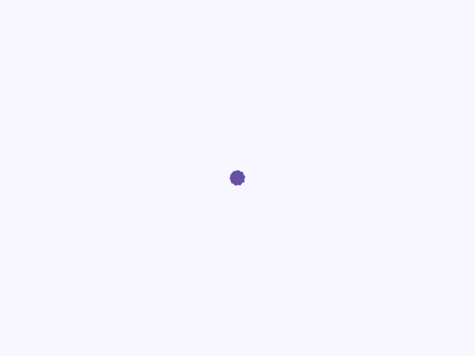
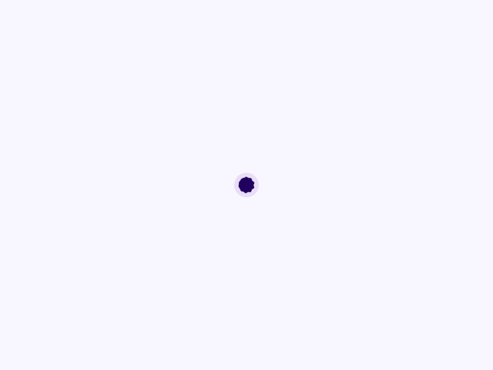

# Loading Indicator

Componente Material Design 3 Loading Indicator (Indicador de carga).

Un indicador de carga indeterminado que representa visualmente un tiempo de espera
no especificado. A diferencia de los spinners circulares estándar, este componente usa una animación
de polígono cambiante que cambia entre formas (círculo, cuadrado redondeado, etc.)
de acuerdo con las especificaciones de movimiento de alta fidelidad M3 Expressive.

**Variantes:**
- `uncontained` (por defecto) — Una forma cambiante independiente que hereda el color
  de su contexto de texto (o por defecto es `primary`).
- `contained` — La forma cambiante se coloca dentro de un contenedor circular
  con un color de fondo distinto, útil para estados de carga de alto contraste
  o superposición de imágenes.

**Animación y Accesibilidad:**
El componente gestiona sus propias etiquetas `<animate>` SVG. La animación se
inicia/detiene automáticamente a través de `connectedCallback`/`disconnectedCallback`
para ahorrar ciclos de CPU cuando el elemento está fuera de la pantalla. Aplica los atributos de valor
y roles ARIA estándar (`role="progressbar"`) para asegurar que los lectores de pantalla
lo identifiquen correctamente como un estado de carga indeterminado.

- Tag: `moni-loading-indicator`
- Clase: `MoniLoadingIndicator`
- Fuente: `src/components/moni-loading-indicator.ts`

## Cuándo usarlo

Usa `moni-loading-indicator` cuando la interfaz necesite el patrón que describe este componente. Antes de elegirlo, revisa sus estados, contenido permitido y comportamiento accesible; las capturas del final muestran el resultado real de cada variante.

## Uso básico

```html
<!-- Indicador no contenido -->
<moni-loading-indicator></moni-loading-indicator>

<!-- Indicador contenido (el contenedor por defecto es secondary-container) -->
<moni-loading-indicator variant="contained"></moni-loading-indicator>
```

## Ejemplo práctico con Tailwind CSS v4

Tailwind controla composición, ancho, espaciado y responsividad alrededor del Web Component. Moni UI conserva el aspecto interno mediante Shadow DOM y design tokens.

```html
<div class="mx-auto flex w-full max-w-md flex-col gap-4 p-6">
  <moni-loading-indicator></moni-loading-indicator>
</div>
```

No necesitas un plugin de Tailwind. En tu CSS v4 importa ambas capas una sola vez:

```css
@import "tailwindcss";
@import "@moni-labs/moni-ui/styles";

@theme {
  --font-sans: Inter, ui-sans-serif, system-ui, sans-serif;
}
```

Las utilities aplicadas directamente al tag afectan su caja anfitriona. No uses selectores Tailwind para asumir acceso al DOM interno; personaliza únicamente con los CSS Parts y Custom Properties públicos enumerados más abajo.

## Recomendaciones

- Usa `moni-loading-indicator` para su propósito semántico; no lo sustituyas por un `div` estilizado.
- Aplica Tailwind al layout exterior. Para el interior del Shadow DOM usa las variables CSS y `::part()` documentados.
- Prueba los estados claro, oscuro, foco por teclado, deshabilitado y viewport móvil antes de publicar.

## Propiedades y atributos

| Atributo | Propiedad | Tipo | Default | Descripción |
|---|---|---|---|---|
| `variant` | `variant` | `'uncontained' \| 'contained'` | `'uncontained'` | Selecciona la variante visual y su nivel de énfasis. |

## Slots

Este componente no declara slots públicos.

## Eventos

No declara eventos propios.

## Métodos públicos

No expone métodos públicos adicionales.

## CSS Parts

- `container`: El envoltorio exterior `.container`.
- `svg`: El elemento `<svg>` interior.
- `shape`: El elemento `<path>` que se transforma.

## CSS Custom Properties consumidas

- `--_polygon-4-sided-cookie`
- `--_polygon-9-sided-cookie`
- `--_polygon-oval`
- `--_polygon-pentagon`
- `--_polygon-pill`
- `--_polygon-soft-burst`
- `--_polygon-sunny`
- `--moni-loading-indicator-active-color`
- `--moni-loading-indicator-contained-active-color`
- `--moni-loading-indicator-contained-container-color`
- `--moni-loading-indicator-container-shape`
- `--moni-loading-indicator-container-size`
- `--moni-loading-indicator-size`
- `--on-primary-container`
- `--primary`
- `--secondary-container`

## Referencia visual por variable

Cada imagen se genera con el componente real: cambia solo la variable indicada y mantiene estable el resto del escenario. Úsala para comparar estados, no como sustituto de la API.

### `variant`

Selecciona la variante visual y su nivel de énfasis.




