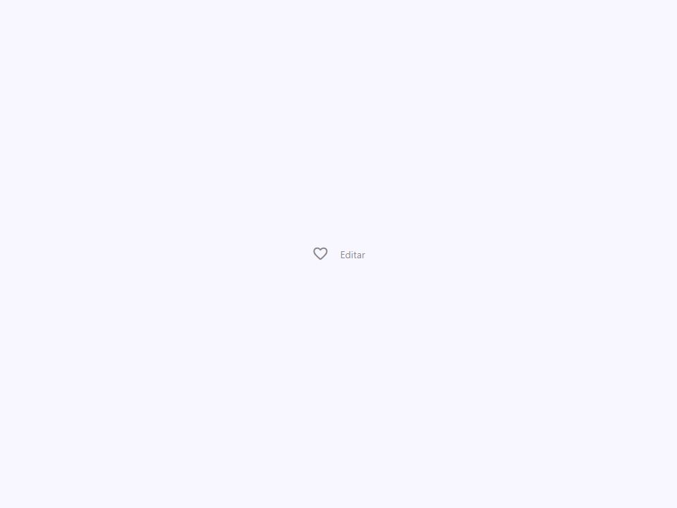
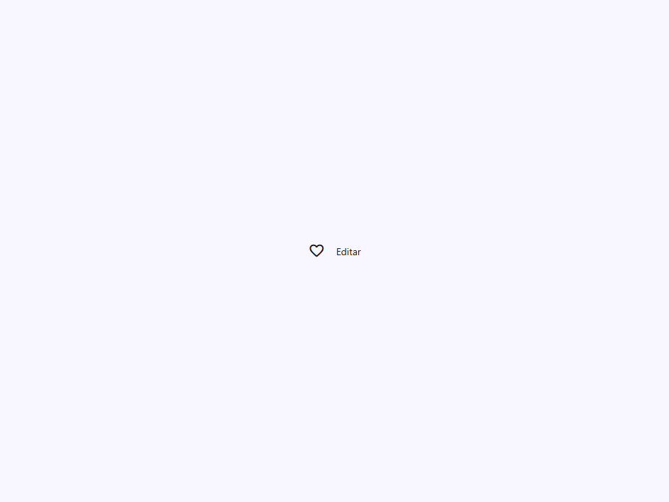

# Menu Item

Componente Material Design 3 Menu Item (Elemento de Menú).

Un elemento interactivo individual dentro de un `<moni-menu>` o `<moni-context-menu>`.
Proporciona el estilo estándar de elemento de menú M3, estados hover, e iconos
iniciales opcionales.

**Referencia de la especificación M3:** `m3-docs/components/menus/specs.md`

**Estados de interacción:**
- Hover: aplica una capa de opacidad.
- Activo (`active=true`): aplica un fondo resaltado `tertiary-container`,
  útil para indicar la opción actualmente seleccionada en una lista.
- Deshabilitado (`disabled=true`): reduce la opacidad y deshabilita los eventos del puntero.

- Tag: `moni-menu-item`
- Clase: `MoniMenuItem`
- Fuente: `src/components/moni-menu-item.ts`

## Cuándo usarlo

Usa `moni-menu-item` cuando la interfaz necesite el patrón que describe este componente. Antes de elegirlo, revisa sus estados, contenido permitido y comportamiento accesible; las capturas del final muestran el resultado real de cada variante.

## Uso básico

```html
<moni-menu-item icon="edit">Editar texto</moni-menu-item>
<moni-menu-item icon="content_copy" disabled>Copiar</moni-menu-item>
<moni-menu-item active>Actualmente seleccionado</moni-menu-item>
```

## Ejemplo práctico con Tailwind CSS v4

Tailwind controla composición, ancho, espaciado y responsividad alrededor del Web Component. Moni UI conserva el aspecto interno mediante Shadow DOM y design tokens.

```html
<div class="mx-auto flex w-full max-w-md flex-col gap-4 p-6">
  <moni-menu-item label="Ejemplo"></moni-menu-item>
</div>
```

No necesitas un plugin de Tailwind. En tu CSS v4 importa ambas capas una sola vez:

```css
@import "tailwindcss";
@import "@moni-labs/moni-ui/styles";

@theme {
  --font-sans: Inter, ui-sans-serif, system-ui, sans-serif;
}
```

Las utilities aplicadas directamente al tag afectan su caja anfitriona. No uses selectores Tailwind para asumir acceso al DOM interno; personaliza únicamente con los CSS Parts y Custom Properties públicos enumerados más abajo.

## Recomendaciones

- Usa `moni-menu-item` para su propósito semántico; no lo sustituyas por un `div` estilizado.
- Aplica Tailwind al layout exterior. Para el interior del Shadow DOM usa las variables CSS y `::part()` documentados.
- Durante una operación asíncrona combina el estado `loading` —si existe— con `disabled` para evitar envíos duplicados.
- Cuando el control muestre únicamente un icono, añade siempre un `aria-label` descriptivo.
- Mantén el estado de apertura en una única fuente de verdad y devuelve el foco al disparador al cerrar.
- Prueba los estados claro, oscuro, foco por teclado, deshabilitado y viewport móvil antes de publicar.

## Propiedades y atributos

| Atributo | Propiedad | Tipo | Default | Descripción |
|---|---|---|---|---|
| `active` | `active` | `boolean` | `false` | Indica si el elemento está activo. |
| `disabled` | `disabled` | `boolean` | `false` | Impide la interacción y aplica el estado visual deshabilitado. |
| `icon` | `icon` | `string` | `''` | Nombre de Material Symbol mostrado por el componente. |
| `label` | `label` | `string` | `''` | Etiqueta visible y accesible del control. |

## Slots

- `default`: La etiqueta de texto para el elemento de menú.

## Eventos

No declara eventos propios.

## Métodos públicos

No expone métodos públicos adicionales.

## CSS Parts

- `item`: Parte interna personalizable.
- `icon`: Parte interna personalizable.
- `label`: Parte interna personalizable.

## CSS Custom Properties consumidas

- `--active`
- `--font`
- `--on-surface`
- `--on-tertiary-container`
- `--speed2`
- `--tertiary-container`

## Referencia visual por variable

Cada imagen se genera con el componente real: cambia solo la variable indicada y mantiene estable el resto del escenario. Úsala para comparar estados, no como sustituto de la API.

### `active`

Indica si el elemento está activo.


### `disabled`

Impide la interacción y aplica el estado visual deshabilitado.




### `icon`

Nombre de Material Symbol mostrado por el componente.



### `label`

Etiqueta visible y accesible del control.


