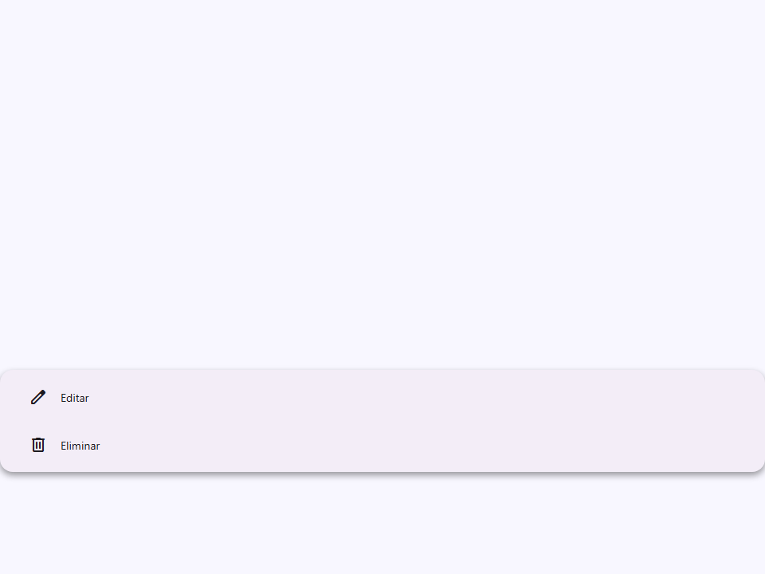
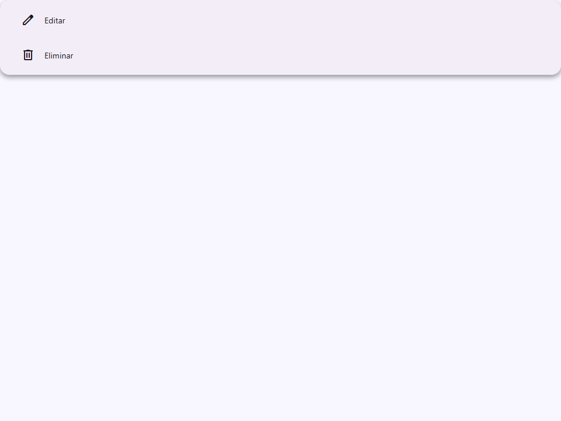
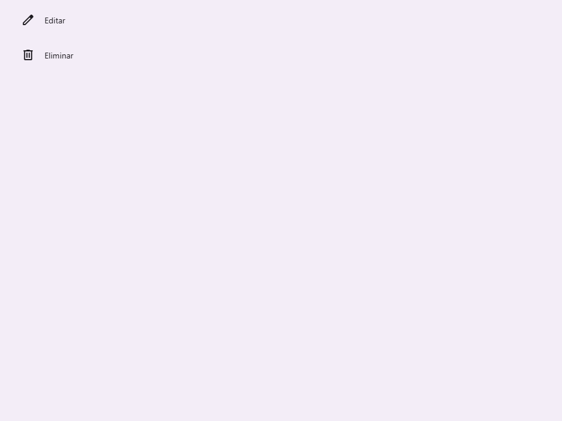
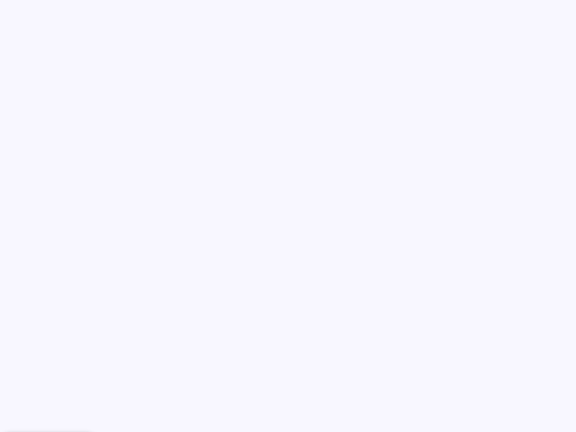
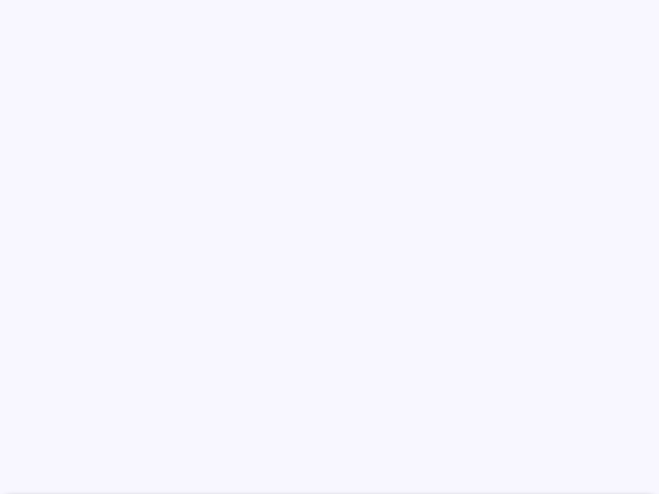
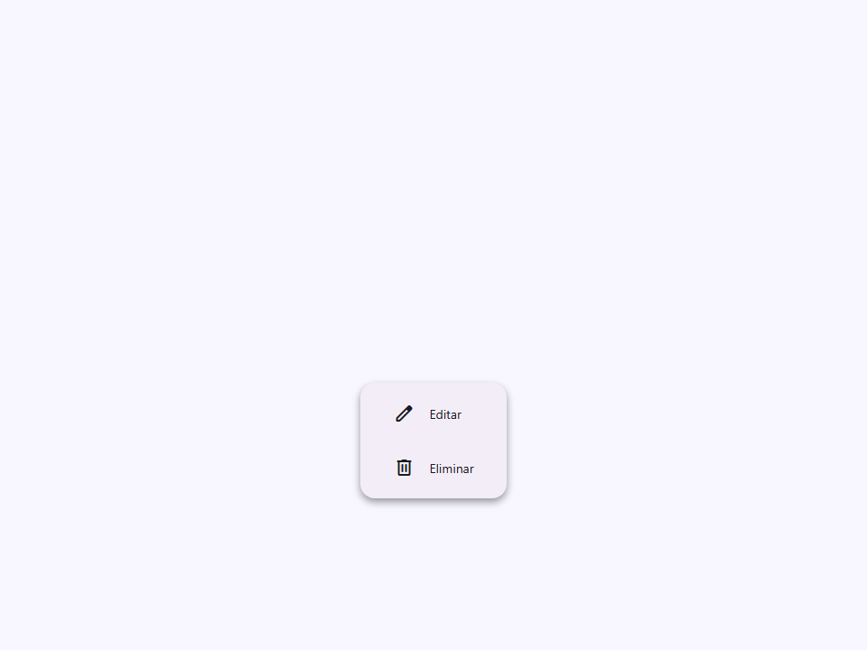

# Menu

Componente Material Design 3 Menu (Menú).

Los menús muestran una lista de opciones en una superficie temporal. Aparecen cuando
los usuarios interactúan con un botón, acción u otro control.

**Referencia de la especificación M3:** `m3-docs/components/menus/guidelines.md`

**Arquitectura de posicionamiento:**
El menú usa `position: absolute` relativo a su ancestro posicionado más cercano.
El `:host` del componente usa `display: contents`, lo que significa que el
elemento interior `<menu>` participa directamente en el contexto de diseño del consumidor.
**Crucial:** El consumidor debe aplicar `position: relative` al elemento contenedor
que contiene tanto el activador (trigger) como el `<moni-menu>`.

**Posicionamiento de auto-volteo (auto-flip):**
Según las pautas de M3, los menús deben voltearse hacia el lado opuesto del anclaje
si se desbordan de la ventana gráfica (viewport).
- **Navegadores modernos (Chrome/Edge 125+, Safari 18+):** Utiliza el posicionamiento
  de anclaje de CSS y `@position-try-fallback` nativamente cuando `flip=true`.
- **Alternativa (Fallback):** Un polyfill de JavaScript mide el menú después de que se abre. Si
  se desborda de la posición `placement` solicitada, establece un estado interno para voltear
  las clases de posicionamiento.

**Gestión del estado:**
El atributo `active` controla la visibilidad. Los consumidores deben escuchar los eventos
del activador (como `click`) y alternar la propiedad `active`.

- Tag: `moni-menu`
- Clase: `MoniMenu`
- Fuente: `src/components/moni-menu.ts`

## Cuándo usarlo

Usa `moni-menu` cuando la interfaz necesite el patrón que describe este componente. Antes de elegirlo, revisa sus estados, contenido permitido y comportamiento accesible; las capturas del final muestran el resultado real de cada variante.

## Uso básico

```html
<!-- El contenedor debe tener position: relative -->
<div style="position: relative; display: inline-block;">
  <moni-button id="menu-trigger">Abrir Menú</moni-button>

  <moni-menu placement="bottom" flip id="my-menu">
    <moni-menu-item icon="edit">Editar</moni-menu-item>
    <moni-menu-item icon="content_copy">Copiar</moni-menu-item>
    <moni-divider></moni-divider>
    <moni-menu-item icon="delete">Eliminar</moni-menu-item>
  </moni-menu>
</div>

<script>
  const btn = document.getElementById('menu-trigger');
  const menu = document.getElementById('my-menu');
  btn.addEventListener('click', () => menu.active = !menu.active);
</script>
```

## Ejemplo práctico con Tailwind CSS v4

Tailwind controla composición, ancho, espaciado y responsividad alrededor del Web Component. Moni UI conserva el aspecto interno mediante Shadow DOM y design tokens.

```html
<div class="mx-auto flex w-full max-w-md flex-col gap-4 p-6">
  <moni-menu></moni-menu>
</div>
```

No necesitas un plugin de Tailwind. En tu CSS v4 importa ambas capas una sola vez:

```css
@import "tailwindcss";
@import "@moni-labs/moni-ui/styles";

@theme {
  --font-sans: Inter, ui-sans-serif, system-ui, sans-serif;
}
```

Las utilities aplicadas directamente al tag afectan su caja anfitriona. No uses selectores Tailwind para asumir acceso al DOM interno; personaliza únicamente con los CSS Parts y Custom Properties públicos enumerados más abajo.

## Recomendaciones

- Usa `moni-menu` para su propósito semántico; no lo sustituyas por un `div` estilizado.
- Aplica Tailwind al layout exterior. Para el interior del Shadow DOM usa las variables CSS y `::part()` documentados.
- Mantén el estado de apertura en una única fuente de verdad y devuelve el foco al disparador al cerrar.
- Prueba los estados claro, oscuro, foco por teclado, deshabilitado y viewport móvil antes de publicar.

## Propiedades y atributos

| Atributo | Propiedad | Tipo | Default | Descripción |
|---|---|---|---|---|
| `placement` | `placement` | `'bottom' \| 'top' \| 'left' \| 'right' \| 'min' \| 'max'` | `'bottom'` | Posición preferida en relación con el anclaje padre. |
| `no-wrap` | `noWrap` | `boolean` | `false` | Deshabilita el ajuste de texto dentro del menú. |
| `active` | `active` | `boolean` | `false` | Controla si el menú está visible. |
| `space` | `space` | `'no-space' \| 'space' \| 'small-space' \| 'medium-space' \| 'large-space' \| 'extra-space'` | `'no-space'` | Lógica de espaciado entre el anclaje y el menú. |
| `flip` | `flip` | `boolean` | `false` | Habilita la evitación de colisiones basada en JS (volteando la posición si está fuera de los límites). Útil para navegadores que carecen de soporte para anclaje CSS. |

## Slots

- `default`: Elementos `<moni-menu-item>`, `<moni-divider>`, o elementos `<li>` en bruto.

## Eventos

No declara eventos propios.

## Métodos públicos

No expone métodos públicos adicionales.

## CSS Parts

- `menu`: Parte interna personalizable.

## CSS Custom Properties consumidas

- `--elevate2`
- `--font`
- `--on-surface`
- `--speed2`
- `--surface-container`

## Referencia visual por variable

Cada imagen se genera con el componente real: cambia solo la variable indicada y mantiene estable el resto del escenario. Úsala para comparar estados, no como sustituto de la API.

### `placement`

Posición preferida en relación con el anclaje padre.









### `no-wrap`

Deshabilita el ajuste de texto dentro del menú.




### `active`

Controla si el menú está visible.




### `space`

Lógica de espaciado entre el anclaje y el menú.


### `flip`

Habilita la evitación de colisiones basada en JS (volteando la posición si está fuera de los límites).
Útil para navegadores que carecen de soporte para anclaje CSS.



