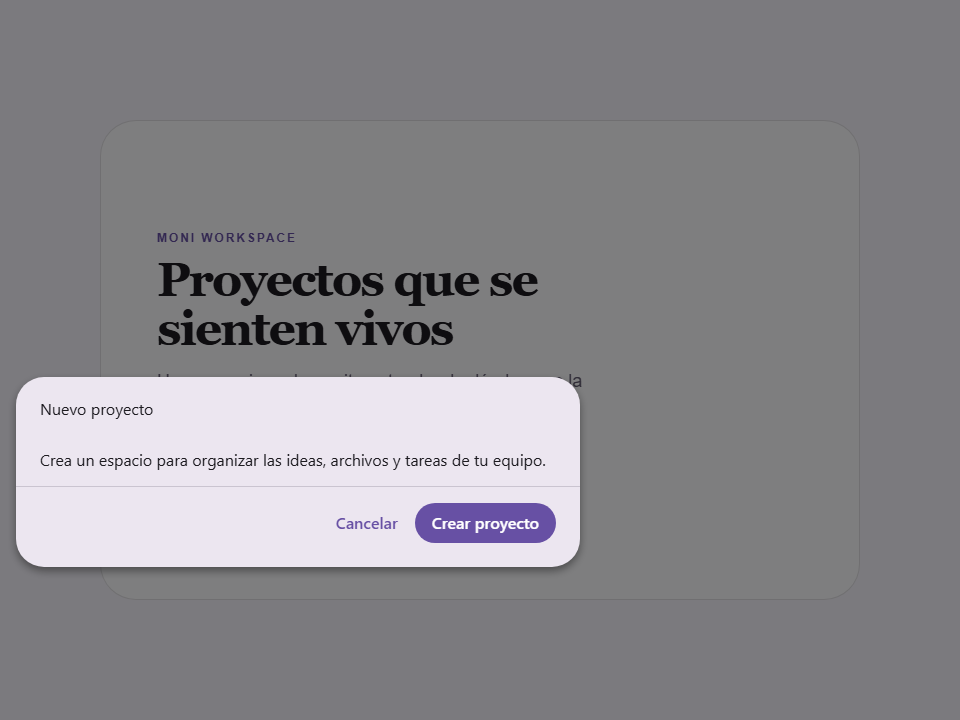

# Morph Modal

Componente moni-morph-modal de Moni UI.

- Tag: `moni-morph-modal`
- Clase: `MoniMorphModal`
- Fuente: `src/components/moni-morph-modal.ts`

## Cuándo usarlo

Usa `moni-morph-modal` cuando la interfaz necesite el patrón que describe este componente. Antes de elegirlo, revisa sus estados, contenido permitido y comportamiento accesible; las capturas del final muestran el resultado real de cada variante.

## Uso básico

```html
<moni-morph-modal></moni-morph-modal>
```

## Ejemplo práctico con Tailwind CSS v4

Tailwind controla composición, ancho, espaciado y responsividad alrededor del Web Component. Moni UI conserva el aspecto interno mediante Shadow DOM y design tokens.

```html
<div class="mx-auto flex w-full max-w-md flex-col gap-4 p-6">
  <moni-morph-modal></moni-morph-modal>
</div>
```

No necesitas un plugin de Tailwind. En tu CSS v4 importa ambas capas una sola vez:

```css
@import "tailwindcss";
@import "@moni-labs/moni-ui/styles";

@theme {
  --font-sans: Inter, ui-sans-serif, system-ui, sans-serif;
}
```

Las utilities aplicadas directamente al tag afectan su caja anfitriona. No uses selectores Tailwind para asumir acceso al DOM interno; personaliza únicamente con los CSS Parts y Custom Properties públicos enumerados más abajo.

## Recomendaciones

- Usa `moni-morph-modal` para su propósito semántico; no lo sustituyas por un `div` estilizado.
- Aplica Tailwind al layout exterior. Para el interior del Shadow DOM usa las variables CSS y `::part()` documentados.
- Mantén el estado de apertura en una única fuente de verdad y devuelve el foco al disparador al cerrar.
- Prueba los estados claro, oscuro, foco por teclado, deshabilitado y viewport móvil antes de publicar.

## Propiedades y atributos

| Atributo | Propiedad | Tipo | Default | Descripción |
|---|---|---|---|---|
| `target` | `target` | `string` | `''` | Selector del elemento disparador desde el cual transformarse (ej. '#fab' o '.my-button'). Si se omite, el modal aún puede activarse programáticamente estableciendo `open = true`. |
| `open` | `open` | `boolean` | `false` | Controla el estado abierto/cerrado del modal. Puede establecerse directamente, o se gestiona internamente cuando se hace clic en el elemento `target`. |
| `modal` | `modal` | `boolean` | `true` | Si es true, renderiza un fondo y atrapa el foco, actuando como un verdadero diálogo modal. |
| `placement` | `placement` | `Placement` | `'center'` | Posición preferida del modal en relación con la ventana gráfica. |
| `expanded-width` | `expandedWidth` | `string` | `'22rem'` | El ancho del modal cuando está completamente expandido. |
| `expanded-height` | `expandedHeight` | `string` | `'18rem'` | La altura del modal cuando está completamente expandido. |
| `close-on-click-outside` | `closeOnClickOutside` | `boolean` | `true` | Si es true, hacer clic fuera del modal lo cerrará. |
| `close-on-esc` | `closeOnEsc` | `boolean` | `true` | Si es true, presionar la tecla Escape cerrará el modal. |
| `show-close-button` | `showCloseButton` | `boolean` | `false` | Si es true, muestra un botón de icono de cierre por defecto en el encabezado. |
| `morph-label` | `morphLabel` | `boolean` | `false` | Si es true, intenta fundir/transformar una etiqueta del disparador hacia el encabezado del modal. |
| `morph-label-selector` | `morphLabelSelector` | `string` | `''` | Un selector CSS personalizado utilizado para encontrar el elemento de etiqueta específico dentro del target a transformar. |
| `has-backdrop` | `hasBackdrop` | `boolean` | `true` | Si es true, renderiza un fondo atenuado detrás del modal. |
| `hide-target` | `hideTarget` | `boolean` | `false` | Si es true, oculta el elemento disparador (target) mientras el modal está abierto. |
| `cover-target` | `coverTarget` | `boolean` | `false` | Si es true, fuerza al modal a cubrir visualmente la ubicación original del target antes de expandirse. |
| `auto-size` | `autoSize` | `boolean` | `false` | Si es true, el modal calcula automáticamente su tamaño final basándose en el contenido interno (ignora expandedWidth y expandedHeight). |
| `blur-content` | `blurContent` | `boolean` | `false` | Si es true, aplica un efecto de desenfoque (blur) al contenido durante la animación de entrada y salida. |
| `debug` | `debug` | `boolean` | `false` | Muestra en consola el origen, geometría y estrategia usada por cada morph. |

## Slots

Este componente no declara slots públicos.

## Eventos

No declara eventos propios.

## Métodos públicos

- `show(): void` — Dispara la apertura del modal y coordina la animación de FLIP (First, Last, Invert, Play) / Morphing.
1. Oculta visualmente el target original.
2. Posiciona el modal colapsado exactamente sobre el target original (mismas dimensiones, color, y radios).
3. Expande fluidamente el modal a sus dimensiones finales mediante transformaciones CSS.
- `showFrom(target: HTMLElement): void` — Abre el modal realizando el morph desde un elemento proporcionado directamente.
Útil cuando el trigger vive dentro de un Shadow DOM y no puede resolverse con `target`.
- `resizeTo(width: string, height: string, anchor: 'center' | 'top-left' = 'center'): void` — Redimensiona y reposiciona suavemente un modal que ya está abierto.
- `hide(): void` — Método público hide.
- `toggle(): void` — Método público toggle.

## CSS Parts

- `backdrop`: Parte interna personalizable.
- `body`: Parte interna personalizable.
- `footer`: Parte interna personalizable.
- `header`: Parte interna personalizable.
- `icon`: Parte interna personalizable.
- `icon-trailing`: Parte interna personalizable.
- `label`: Parte interna personalizable.
- `panel`: Parte interna personalizable.
- `panel-inner`: Parte interna personalizable.

## CSS Custom Properties consumidas

- `--_backdrop-duration`
- `--_backdrop-ease`
- `--_panel-height`
- `--_panel-width`
- `--_z-index`
- `--active`
- `--elevate2`
- `--font-icon`
- `--moni-morph-body-overflow-x`
- `--moni-morph-body-overflow-y`
- `--moni-morph-body-padding`
- `--moni-morph-body-scrollbar-gutter`
- `--moni-morph-panel-radius`
- `--on-surface`
- `--on-surface-variant`
- `--outline-variant`
- `--scrim`
- `--surface-container-high`

## Referencia visual por variable

Cada imagen se genera con el componente real: cambia solo la variable indicada y mantiene estable el resto del escenario. Úsala para comparar estados, no como sustituto de la API.

### `open`

Controla el estado abierto/cerrado del modal.
Puede establecerse directamente, o se gestiona internamente cuando se hace clic en el elemento `target`.


### `modal`

Si es true, renderiza un fondo y atrapa el foco, actuando como un verdadero diálogo modal.


### `placement`

Posición preferida del modal en relación con la ventana gráfica.


### `expanded-width`

El ancho del modal cuando está completamente expandido.


### `expanded-height`

La altura del modal cuando está completamente expandido.


### `show-close-button`

Si es true, muestra un botón de icono de cierre por defecto en el encabezado.


### `has-backdrop`

Si es true, renderiza un fondo atenuado detrás del modal.


### `auto-size`

Si es true, el modal calcula automáticamente su tamaño final basándose en el contenido interno (ignora expandedWidth y expandedHeight).



