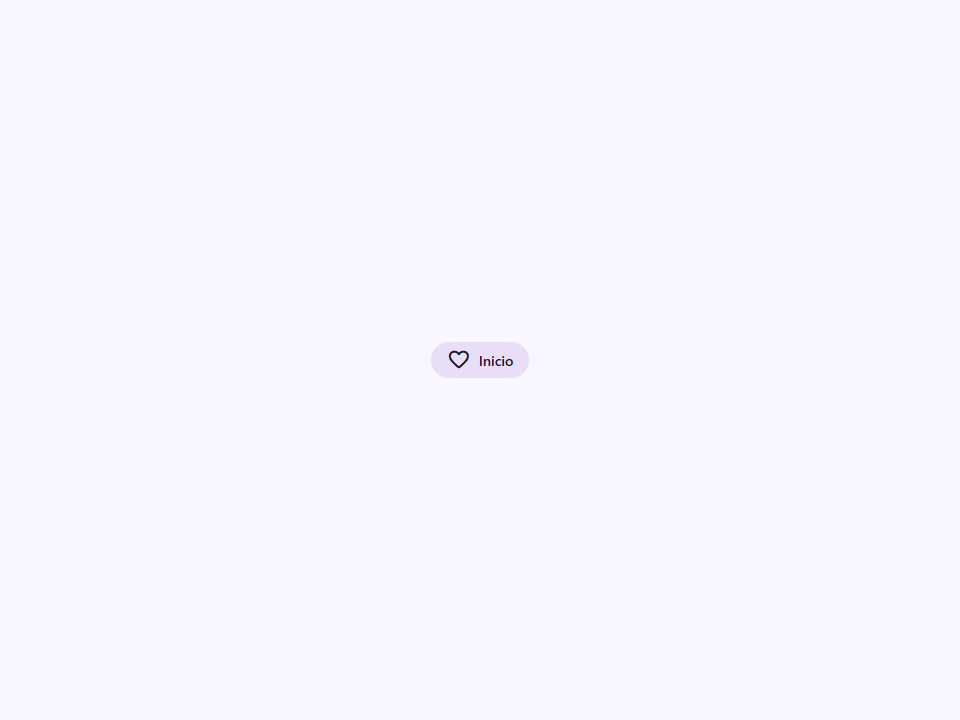
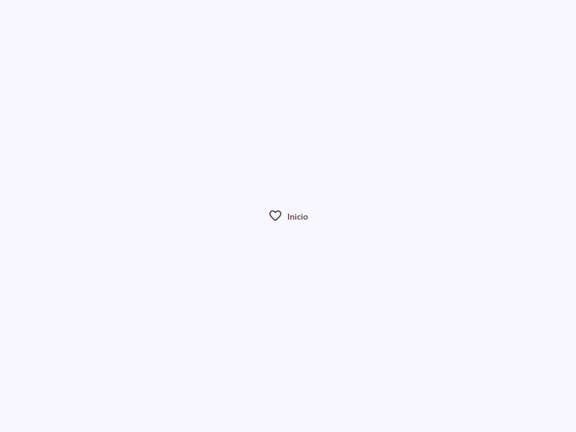

# Nav Item

Componente Material Design 3 Navigation Item (Elemento de Navegación).

Un elemento de destino individual dentro de un contenedor `<moni-nav>`. Se renderiza como un
elemento `<a>` accesible con un icono, etiqueta y capa de estado M3.

**Referencias a la especificación M3:**
- Elemento de barra de navegación: `m3-docs/components/navigation-bar/specs.md`
- Elemento de riel de navegación: `m3-docs/components/navigation-rail/specs.md`
- Elemento de cajón de navegación: `m3-docs/components/navigation-drawer/specs.md`

**Adaptación de diseño:**
Las propiedades `placement`, `variant` y `layout` son retransmitidas desde
el padre `<moni-nav>` (típicamente a través de vinculación de atributos en el
método render del padre). El elemento de navegación las usa para renderizar condicionalmente:
- Icono + etiqueta abajo (barra de navegación).
- Solo icono + etiqueta horizontal (riel).
- Icono + etiqueta completa (cajón).

**Comportamiento responsivo:**
Usa `window.matchMedia('(min-width: 601px)')` para detectar pantallas medianas
y almacena el resultado en `_isMediumScreen`. Esto impulsa el cambio de diseño
automático entre estilos de barra y riel.

**Estado activo:**
El atributo `active` aplica el indicador activo M3: un fondo `secondary-container`
en forma de píldora detrás del icono y un color de etiqueta más oscuro.

- Tag: `moni-nav-item`
- Clase: `MoniNavItem`
- Fuente: `src/components/moni-nav-item.ts`

## Cuándo usarlo

Usa `moni-nav-item` cuando la interfaz necesite el patrón que describe este componente. Antes de elegirlo, revisa sus estados, contenido permitido y comportamiento accesible; las capturas del final muestran el resultado real de cada variante.

## Uso básico

```html
<moni-nav placement="bottom">
  <moni-nav-item href="/" icon="home" label="Inicio" active></moni-nav-item>
  <moni-nav-item href="/search" icon="search" label="Buscar"></moni-nav-item>
  <moni-nav-item href="/profile" icon="person" label="Perfil">
    <moni-badge value="3"></moni-badge>  <!-- insignia de notificación -->
  </moni-nav-item>
</moni-nav>
```

## Ejemplo práctico con Tailwind CSS v4

Tailwind controla composición, ancho, espaciado y responsividad alrededor del Web Component. Moni UI conserva el aspecto interno mediante Shadow DOM y design tokens.

```html
<div class="mx-auto flex w-full max-w-md flex-col gap-4 p-6">
  <moni-nav-item label="Ejemplo"></moni-nav-item>
</div>
```

No necesitas un plugin de Tailwind. En tu CSS v4 importa ambas capas una sola vez:

```css
@import "tailwindcss";
@import "@moni-labs/moni-ui/styles";

@theme {
  --font-sans: Inter, ui-sans-serif, system-ui, sans-serif;
}
```

Las utilities aplicadas directamente al tag afectan su caja anfitriona. No uses selectores Tailwind para asumir acceso al DOM interno; personaliza únicamente con los CSS Parts y Custom Properties públicos enumerados más abajo.

## Recomendaciones

- Usa `moni-nav-item` para su propósito semántico; no lo sustituyas por un `div` estilizado.
- Aplica Tailwind al layout exterior. Para el interior del Shadow DOM usa las variables CSS y `::part()` documentados.
- Cuando el control muestre únicamente un icono, añade siempre un `aria-label` descriptivo.
- Mantén el estado de apertura en una única fuente de verdad y devuelve el foco al disparador al cerrar.
- Prueba los estados claro, oscuro, foco por teclado, deshabilitado y viewport móvil antes de publicar.

## Propiedades y atributos

| Atributo | Propiedad | Tipo | Default | Descripción |
|---|---|---|---|---|
| `href` | `href` | `string` | `'#'` | Define `href`. Conserva el tipo indicado y usa la propiedad JavaScript cuando el valor no sea una cadena. |
| `target` | `target` | `string` | `''` | Define `target`. Conserva el tipo indicado y usa la propiedad JavaScript cuando el valor no sea una cadena. |
| `icon` | `icon` | `string` | `''` | Nombre de Material Symbol mostrado por el componente. |
| `label` | `label` | `string` | `''` | Etiqueta visible y accesible del control. |
| `active` | `active` | `boolean` | `false` | Indica si el elemento está activo. |
| `placement` | `placement` | `string` | `'top'` | Define `placement`. Conserva el tipo indicado y usa la propiedad JavaScript cuando el valor no sea una cadena. |
| `variant` | `variant` | `string` | `'rail'` | Selecciona la variante visual y su nivel de énfasis. |
| `layout` | `layout` | `string` | `'auto'` | Define `layout`. Conserva el tipo indicado y usa la propiedad JavaScript cuando el valor no sea una cadena. |

## Slots

- `default`: Contenido adicional colocado después del icono (ej. `<moni-badge>`).

## Eventos

No declara eventos propios.

## Métodos públicos

No expone métodos públicos adicionales.

## CSS Parts

- `item`: Parte interna personalizable.
- `icon`: Parte interna personalizable.
- `label`: Parte interna personalizable.
- `indicator`: Parte interna personalizable.

## CSS Custom Properties consumidas

- `--font`
- `--on-secondary-container`
- `--on-surface-variant`
- `--secondary`
- `--secondary-container`
- `--speed2`
- `--surface-container-high`

## Referencia visual por variable

Cada imagen se genera con el componente real: cambia solo la variable indicada y mantiene estable el resto del escenario. Úsala para comparar estados, no como sustituto de la API.

### `href`

Define `href`. Conserva el tipo indicado y usa la propiedad JavaScript cuando el valor no sea una cadena.



### `target`

Define `target`. Conserva el tipo indicado y usa la propiedad JavaScript cuando el valor no sea una cadena.


### `icon`

Nombre de Material Symbol mostrado por el componente.


### `label`

Etiqueta visible y accesible del control.


### `active`

Indica si el elemento está activo.




### `placement`

Define `placement`. Conserva el tipo indicado y usa la propiedad JavaScript cuando el valor no sea una cadena.


### `variant`

Selecciona la variante visual y su nivel de énfasis.


### `layout`

Define `layout`. Conserva el tipo indicado y usa la propiedad JavaScript cuando el valor no sea una cadena.


