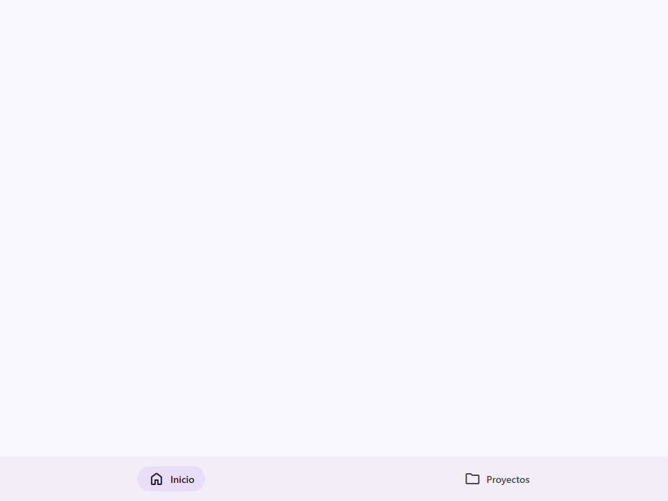
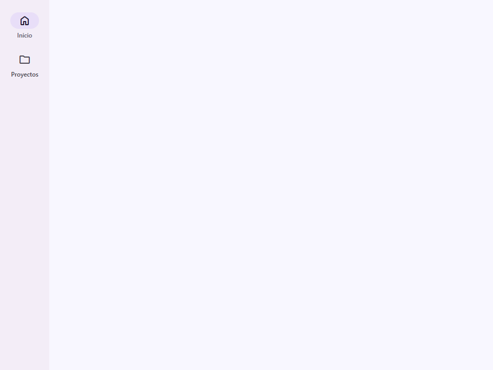
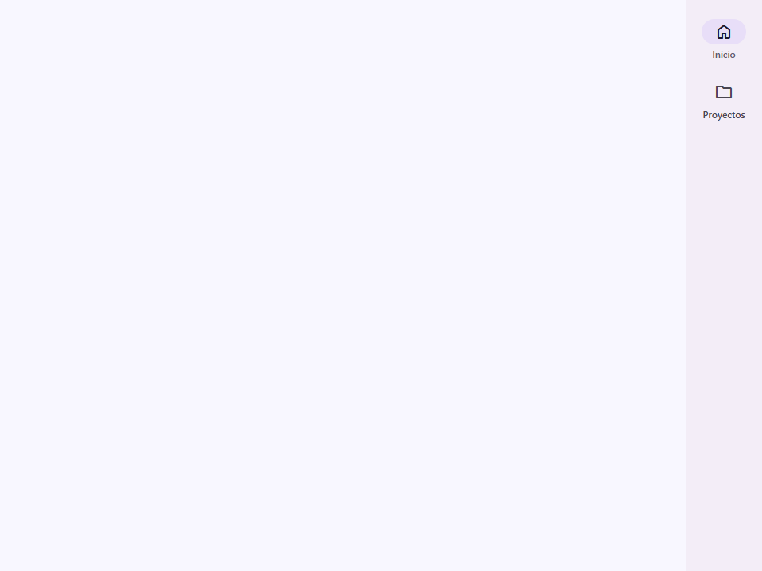
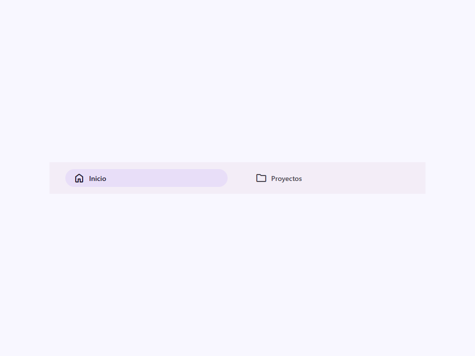
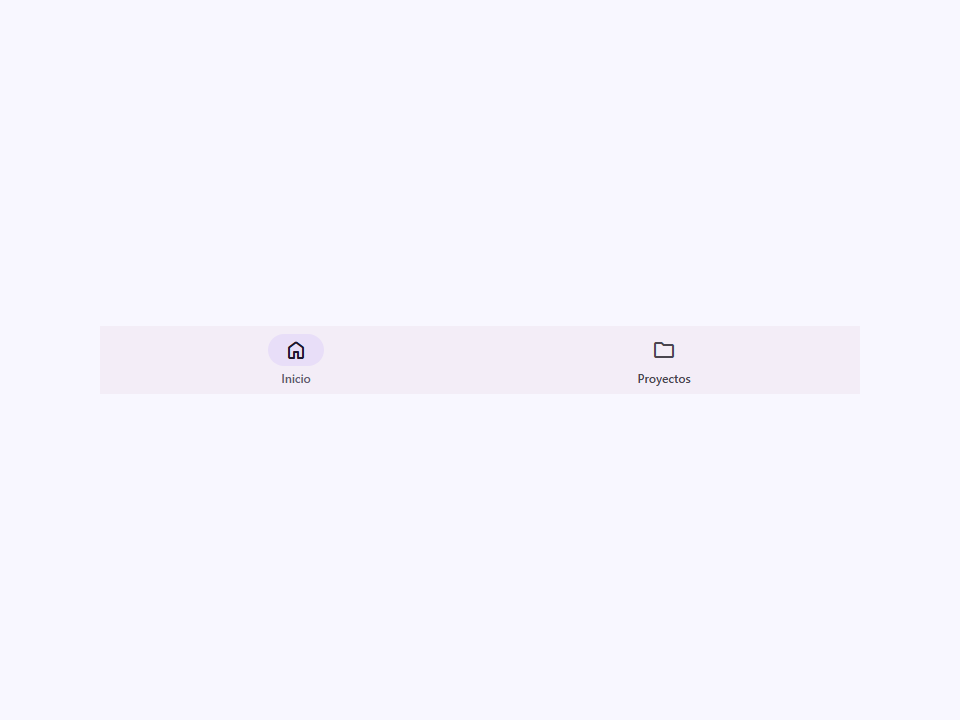
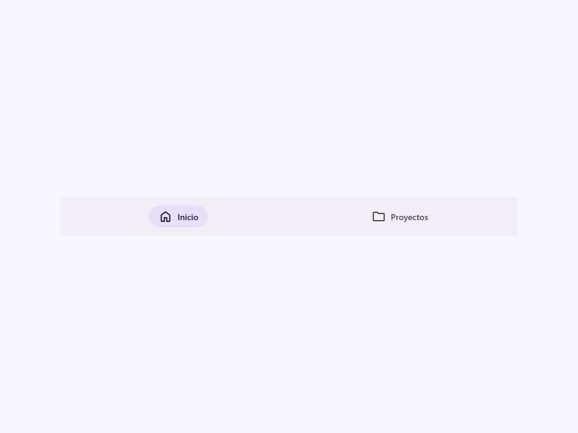

# Nav

Componente contenedor de Navegación Material Design 3.

`<moni-nav>` es el contenedor que envuelve los elementos `<moni-nav-item>` y
controla el patrón de navegación M3: barra de navegación, riel de navegación o
cajón de navegación.

**Referencias a la especificación M3:**
- Barra de navegación: `m3-docs/components/navigation-bar/specs.md`
- Riel de navegación: `m3-docs/components/navigation-rail/specs.md`
- Cajón de navegación: `m3-docs/components/navigation-drawer/specs.md`

**Patrones de navegación:**
- **Barra de navegación** (`placement="bottom"`) — Barra horizontal de elementos de icono+etiqueta
  en la parte inferior de la pantalla. Ideal para 3–5 destinos de nivel superior.
- **Riel de navegación** (`variant="rail"`) — Riel vertical de elementos de icono+etiqueta
  en el lateral de la pantalla. Ideal para puntos de interrupción medianos/expandidos.
- **Cajón estándar** (`variant="drawer"`) — Panel vertical siempre visible
  con etiquetas de texto completo. Sin atenuación (scrim). Ideal para pantallas grandes.
- **Cajón modal** (`variant="drawer" modal`) — Cajón superpuesto con atenuación (scrim).
  Se abre/cierra a través de la propiedad `open`. Atrapa el foco del teclado mientras está abierto.
  Se cierra al presionar la tecla `Escape`.

**Manejo del teclado:**
Cuando `modal=true`, el componente añade un listener global de `keydown` en
`connectedCallback` que cierra el cajón con `Escape`. El listener se
elimina en `disconnectedCallback`.

- Tag: `moni-nav`
- Clase: `MoniNav`
- Fuente: `src/components/moni-nav.ts`

## Cuándo usarlo

Usa `moni-nav` cuando la interfaz necesite el patrón que describe este componente. Antes de elegirlo, revisa sus estados, contenido permitido y comportamiento accesible; las capturas del final muestran el resultado real de cada variante.

## Uso básico

```html
<!-- Barra de navegación inferior -->
<moni-nav placement="bottom">
  <moni-nav-item icon="home" label="Inicio" active></moni-nav-item>
  <moni-nav-item icon="search" label="Buscar"></moni-nav-item>
  <moni-nav-item icon="person" label="Perfil"></moni-nav-item>
</moni-nav>

<!-- Cajón de navegación modal -->
<moni-nav variant="drawer" modal open placement="left">
  <h3 slot="header">Mi App</h3>
  <moni-nav-item icon="home" label="Inicio" active></moni-nav-item>
  <moni-nav-item icon="settings" label="Ajustes"></moni-nav-item>
</moni-nav>
```

## Ejemplo práctico con Tailwind CSS v4

Tailwind controla composición, ancho, espaciado y responsividad alrededor del Web Component. Moni UI conserva el aspecto interno mediante Shadow DOM y design tokens.

```html
<div class="mx-auto flex w-full max-w-md flex-col gap-4 p-6">
  <moni-nav></moni-nav>
</div>
```

No necesitas un plugin de Tailwind. En tu CSS v4 importa ambas capas una sola vez:

```css
@import "tailwindcss";
@import "@moni-labs/moni-ui/styles";

@theme {
  --font-sans: Inter, ui-sans-serif, system-ui, sans-serif;
}
```

Las utilities aplicadas directamente al tag afectan su caja anfitriona. No uses selectores Tailwind para asumir acceso al DOM interno; personaliza únicamente con los CSS Parts y Custom Properties públicos enumerados más abajo.

## Recomendaciones

- Usa `moni-nav` para su propósito semántico; no lo sustituyas por un `div` estilizado.
- Aplica Tailwind al layout exterior. Para el interior del Shadow DOM usa las variables CSS y `::part()` documentados.
- Mantén el estado de apertura en una única fuente de verdad y devuelve el foco al disparador al cerrar.
- Prueba los estados claro, oscuro, foco por teclado, deshabilitado y viewport móvil antes de publicar.

## Propiedades y atributos

| Atributo | Propiedad | Tipo | Default | Descripción |
|---|---|---|---|---|
| `placement` | `placement` | `'top' \| 'bottom' \| 'left' \| 'right'` | `'top'` | Selecciona el valor de `placement` entre las opciones documentadas. |
| `variant` | `variant` | `'rail' \| 'drawer'` | `'rail'` | Selecciona la variante visual y su nivel de énfasis. |
| `modal` | `modal` | `boolean` | `false` | Activa o desactiva el comportamiento `modal`. En HTML, la presencia del atributo significa `true`; omítelo para `false`. |
| `open` | `open` | `boolean` | `true` | Controla si la superficie superpuesta está abierta. |
| `layout` | `layout` | `'vertical' \| 'horizontal' \| 'auto'` | `'auto'` | Selecciona el valor de `layout` entre las opciones documentadas. |

## Slots

- `default`: Hijos `<moni-nav-item>`.
- `header`: Contenido encima de los elementos de navegación (solo variante drawer).
- `footer`: Contenido debajo de los elementos de navegación (solo variante drawer).

## Eventos

No declara eventos propios.

## Métodos públicos

No expone métodos públicos adicionales.

## CSS Parts

- `nav`: Parte interna personalizable.
- `scrim`: Parte interna personalizable.

## CSS Custom Properties consumidas

- `--font`
- `--on-surface`
- `--scrim`
- `--speed2`
- `--speed3`
- `--surface-container`

## Referencia visual por variable

Cada imagen se genera con el componente real: cambia solo la variable indicada y mantiene estable el resto del escenario. Úsala para comparar estados, no como sustituto de la API.

### `placement`

Selecciona el valor de `placement` entre las opciones documentadas.








### `variant`

Selecciona la variante visual y su nivel de énfasis.




### `modal`

Activa o desactiva el comportamiento `modal`. En HTML, la presencia del atributo significa `true`; omítelo para `false`.


### `open`

Controla si la superficie superpuesta está abierta.


### `layout`

Selecciona el valor de `layout` entre las opciones documentadas.





