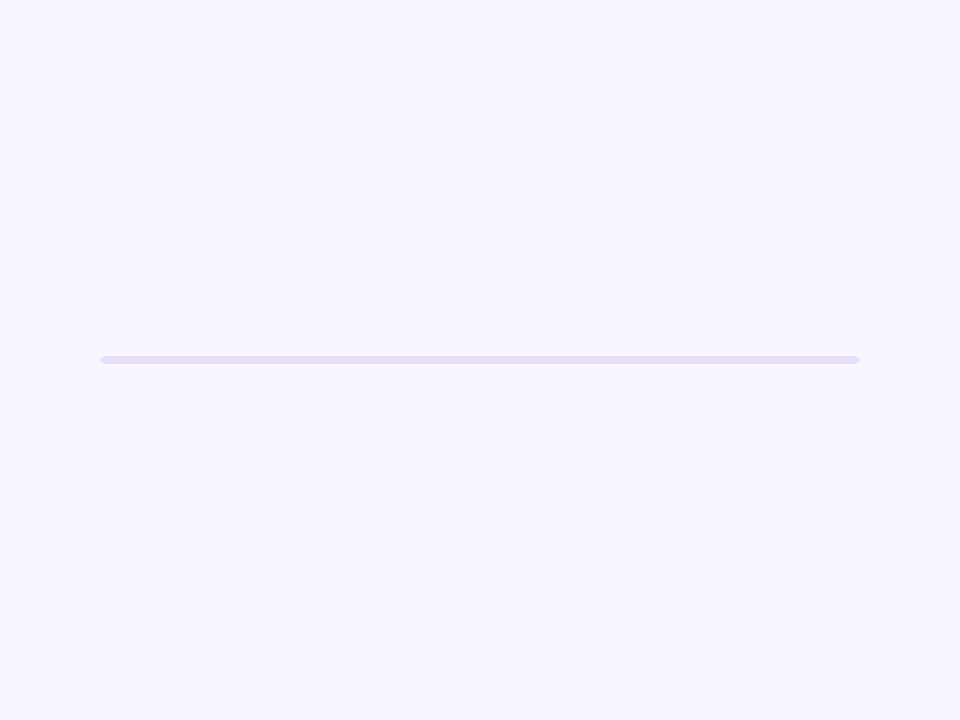
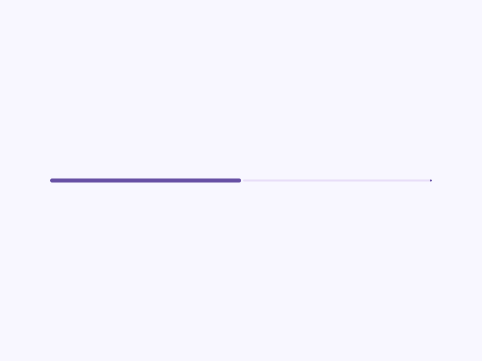

# Progress

Material 3 Expressive progress indicator.

- Tag: `moni-progress`
- Clase: `MoniProgress`
- Fuente: `src/components/moni-progress.ts`

## Cuándo usarlo

Usa `moni-progress` cuando la interfaz necesite el patrón que describe este componente. Antes de elegirlo, revisa sus estados, contenido permitido y comportamiento accesible; las capturas del final muestran el resultado real de cada variante.

## Uso básico

```html
<moni-progress></moni-progress>
```

## Ejemplo práctico con Tailwind CSS v4

Tailwind controla composición, ancho, espaciado y responsividad alrededor del Web Component. Moni UI conserva el aspecto interno mediante Shadow DOM y design tokens.

```html
<div class="mx-auto flex w-full max-w-md flex-col gap-4 p-6">
  <moni-progress label="Ejemplo"></moni-progress>
</div>
```

No necesitas un plugin de Tailwind. En tu CSS v4 importa ambas capas una sola vez:

```css
@import "tailwindcss";
@import "@moni-labs/moni-ui/styles";

@theme {
  --font-sans: Inter, ui-sans-serif, system-ui, sans-serif;
}
```

Las utilities aplicadas directamente al tag afectan su caja anfitriona. No uses selectores Tailwind para asumir acceso al DOM interno; personaliza únicamente con los CSS Parts y Custom Properties públicos enumerados más abajo.

## Recomendaciones

- Usa `moni-progress` para su propósito semántico; no lo sustituyas por un `div` estilizado.
- Aplica Tailwind al layout exterior. Para el interior del Shadow DOM usa las variables CSS y `::part()` documentados.
- En formularios controlados, sincroniza la propiedad `value` y escucha el evento documentado; no dependas solo del atributo inicial.
- Prueba los estados claro, oscuro, foco por teclado, deshabilitado y viewport móvil antes de publicar.

## Propiedades y atributos

| Atributo | Propiedad | Tipo | Default | Descripción |
|---|---|---|---|---|
| `value` | `value` | `number` | `0` | Current progress value. |
| `max` | `max` | `number` | `100` | Maximum progress value. |
| `variant` | `variant` | `MoniProgressVariant` | `'linear'` | Visual indicator family. |
| `size` | `size` | `MoniProgressSize` | `'medium'` | Current M3 size token. |
| `indeterminate` | `indeterminate` | `boolean` | `false` | Shows the animated state used when progress cannot be measured. |
| `mode` | `mode` | `MoniProgressMode` | `'determinate'` | Linear progress behavior. Buffer adds loaded and pending regions. |
| `buffer-value` | `bufferValue` | `number` | `0` | Buffered progress value used when mode is buffer. |
| `stop-indicator` | `stopIndicator` | `boolean` | `false` | Shows the optional 4px M3 stop indicator at the end of a linear track. |
| `wave-transition` | `waveTransition` | `boolean` | `false` | Smoothly morphs wavy indicators to flat and back without changing progress. |
| `aria-label` | `label` | `string` | `'Progress'` | Accessible name announced by assistive technology. |

## Slots

Este componente no declara slots públicos.

## Eventos

No declara eventos propios.

## Métodos públicos

No expone métodos públicos adicionales.

## CSS Parts

- `buffer`: Parte interna personalizable.
- `indicator`: Parte interna personalizable.
- `progress`: Parte interna personalizable.
- `stop-indicator`: Parte interna personalizable.
- `svg`: Parte interna personalizable.
- `track`: Parte interna personalizable.

## CSS Custom Properties consumidas

- `--_active-color`
- `--_active-end`
- `--_buffer-end`
- `--_buffer-gap-start`
- `--_buffer-start`
- `--_circular-size`
- `--_gap`
- `--_linear-height`
- `--_stop`
- `--_thickness`
- `--_track-color`
- `--active`
- `--moni-progress-active`
- `--moni-progress-track`
- `--primary`
- `--secondary-container`

## Referencia visual por variable

Cada imagen se genera con el componente real: cambia solo la variable indicada y mantiene estable el resto del escenario. Úsala para comparar estados, no como sustituto de la API.

### `value`

Current progress value.


### `max`

Maximum progress value.


### `variant`

Visual indicator family.


### `size`

Current M3 size token.


### `indeterminate`

Shows the animated state used when progress cannot be measured.




### `mode`

Linear progress behavior. Buffer adds loaded and pending regions.


### `buffer-value`

Buffered progress value used when mode is buffer.


### `stop-indicator`

Shows the optional 4px M3 stop indicator at the end of a linear track.




### `wave-transition`

Smoothly morphs wavy indicators to flat and back without changing progress.


### `aria-label`

Accessible name announced by assistive technology.


