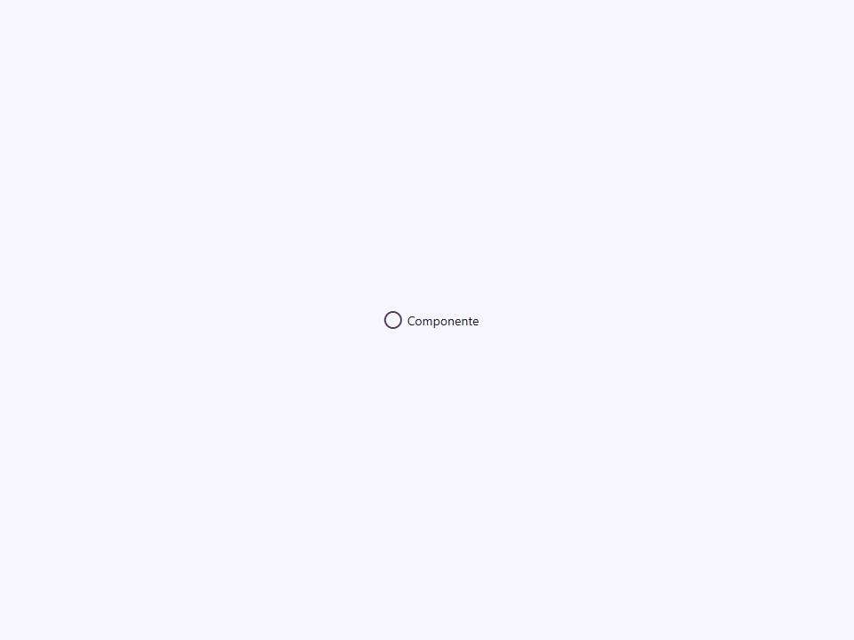
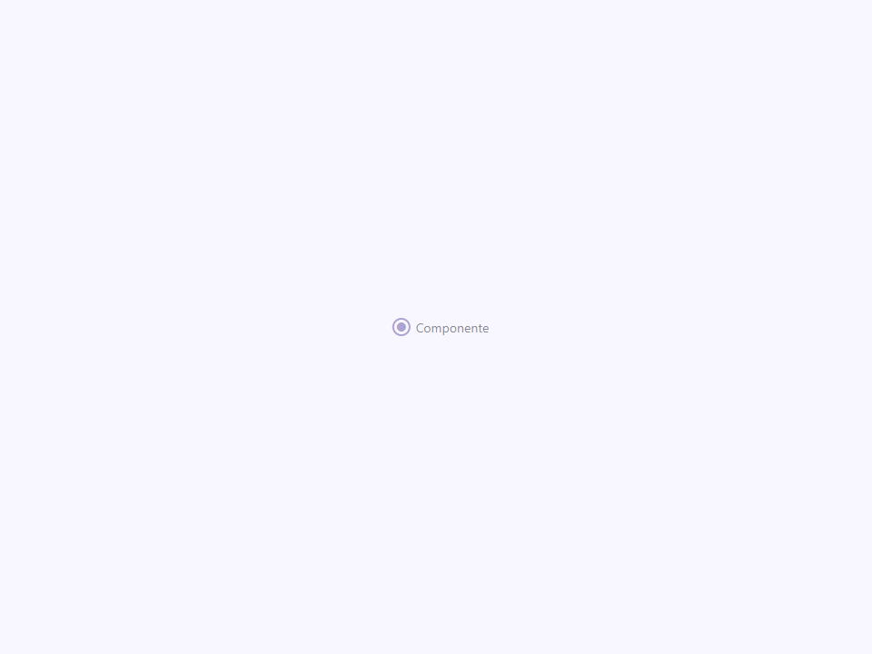
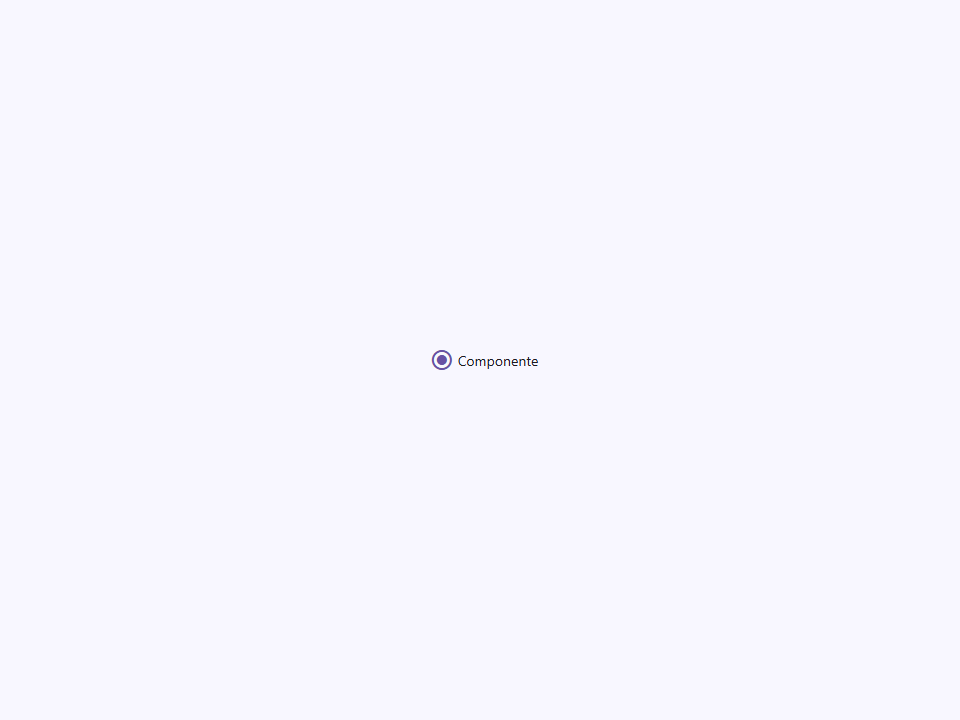
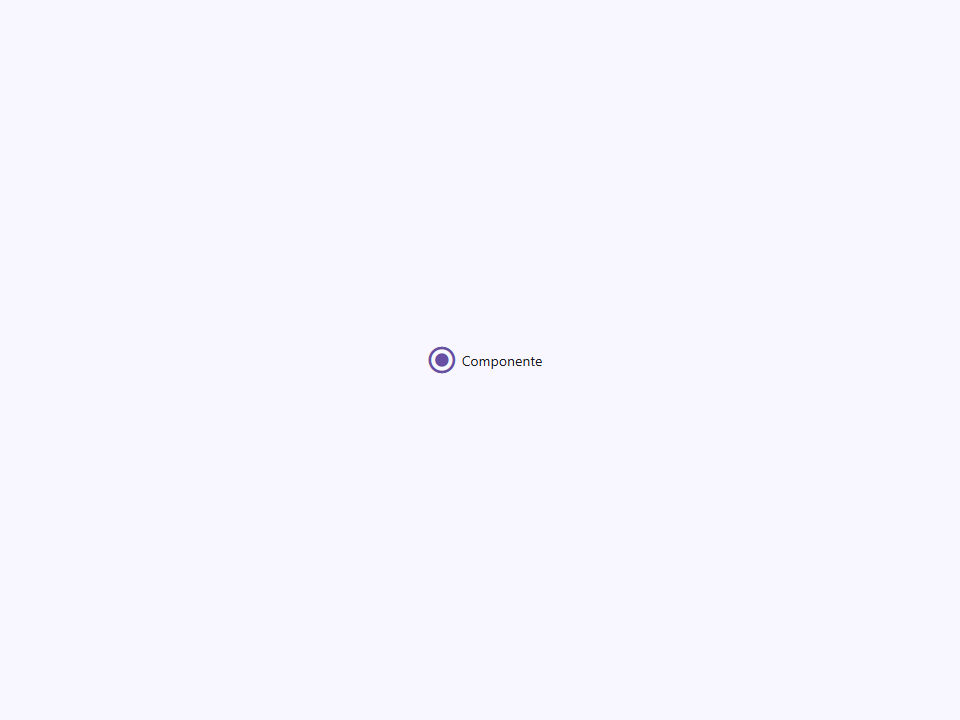
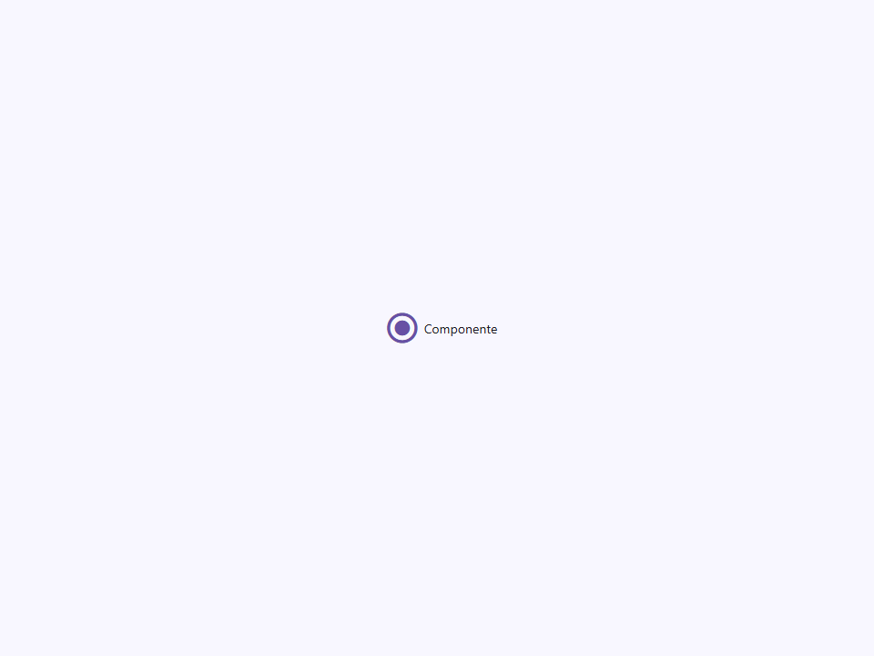

# Radio

Componente Material Design 3 Radio Button (Botón de Opción).

Los botones de opción permiten a los usuarios seleccionar exactamente un elemento de un conjunto de opciones
mutuamente excluyentes. Comparten la misma arquitectura visual que
`<moni-checkbox>` pero usan `type="radio"` e implementan la deselección de grupo.

**Referencia a la especificación M3:** `m3-docs/components/radio/specs.md`

**Arquitectura visual (Patrón BeerCSS):**
Idéntico al patrón de checkbox: el `<input type="radio">` nativo ocupa
espacio de diseño real a `--_size` × `--_size` pero se oculta mediante `opacity: 0`.
Un `<span>` hermano renderiza:
- `::before` — el icono de radio (`radio_button_unchecked` / `radio_button_checked`).
- `::after`  — el anillo de onda (ripple) de hover/foco.

**Deselección de grupo:**
Cuando se marca un radio, `_onChange` consulta el `getRootNode()` del componente
para encontrar todos los elementos `moni-radio` que comparten el mismo atributo `name` y establece
su propiedad `checked` en `false`. Esto refleja el comportamiento nativo del navegador
para grupos de radio a través de los límites del shadow DOM, donde la agrupación por `name` no
funciona de forma nativa.

- Tag: `moni-radio`
- Clase: `MoniRadio`
- Fuente: `src/components/moni-radio.ts`

## Cuándo usarlo

Usa `moni-radio` cuando la interfaz necesite el patrón que describe este componente. Antes de elegirlo, revisa sus estados, contenido permitido y comportamiento accesible; las capturas del final muestran el resultado real de cada variante.

## Uso básico

```html
<moni-radio name="color" value="red"   label="Rojo"></moni-radio>
<moni-radio name="color" value="green" label="Verde"></moni-radio>
<moni-radio name="color" value="blue"  label="Azul" checked></moni-radio>
```

## Ejemplo práctico con Tailwind CSS v4

Tailwind controla composición, ancho, espaciado y responsividad alrededor del Web Component. Moni UI conserva el aspecto interno mediante Shadow DOM y design tokens.

```html
<div class="mx-auto flex w-full max-w-md flex-col gap-4 p-6">
  <moni-radio label="Ejemplo"></moni-radio>
</div>
```

No necesitas un plugin de Tailwind. En tu CSS v4 importa ambas capas una sola vez:

```css
@import "tailwindcss";
@import "@moni-labs/moni-ui/styles";

@theme {
  --font-sans: Inter, ui-sans-serif, system-ui, sans-serif;
}
```

Las utilities aplicadas directamente al tag afectan su caja anfitriona. No uses selectores Tailwind para asumir acceso al DOM interno; personaliza únicamente con los CSS Parts y Custom Properties públicos enumerados más abajo.

## Recomendaciones

- Usa `moni-radio` para su propósito semántico; no lo sustituyas por un `div` estilizado.
- Aplica Tailwind al layout exterior. Para el interior del Shadow DOM usa las variables CSS y `::part()` documentados.
- Durante una operación asíncrona combina el estado `loading` —si existe— con `disabled` para evitar envíos duplicados.
- En formularios controlados, sincroniza la propiedad `value` y escucha el evento documentado; no dependas solo del atributo inicial.
- Prueba los estados claro, oscuro, foco por teclado, deshabilitado y viewport móvil antes de publicar.

## Propiedades y atributos

| Atributo | Propiedad | Tipo | Default | Descripción |
|---|---|---|---|---|
| `label` | `label` | `string` | `''` | Etiqueta de texto mostrada a la derecha del icono de radio.  Cuando no está vacía, se renderiza como un nodo de texto. Cuando está vacía, se renderiza la ranura (slot) por defecto, permitiendo contenido HTML en la ranura como etiqueta. |
| `checked` | `checked` | `boolean` | `false` | Indica si este botón de opción está actualmente seleccionado.  Se refleja como un atributo para que los selectores CSS puedan apuntarlo. Se sincroniza con el input nativo a través de `updated()`. |
| `disabled` | `disabled` | `boolean` | `false` | Cuando es `true`, el radio no es interactivo y se renderiza a un 50% de opacidad. |
| `unchecked-icon` | `uncheckedIcon` | `string` | `''` | Material Symbol mostrado cuando el radio no está seleccionado. |
| `checked-icon` | `checkedIcon` | `string` | `''` | Material Symbol mostrado cuando el radio está seleccionado. |
| `icon-container` | `iconContainer` | `'circle' \| 'none'` | `'circle'` | Contenedor visual de los iconos personalizados. |
| `size` | `size` | `'small' \| 'medium' \| 'large' \| 'extra'` | `'medium'` | Tamaño visual del icono de radio y su área de interacción (hit area) invisible.  \| Valor      \| `--_size` \| \|------------\|-----------\| \| `'small'`  \| 1rem      \| \| `'medium'` \| 1.5rem    \| \| `'large'`  \| 2rem      \| \| `'extra'`  \| 2.5rem    \| |
| `name` | `name` | `string` | `''` | Nombre del grupo de radio. Los radios con el mismo `name` en el mismo nodo raíz se tratan como un grupo de exclusión mutua por `_onChange`.  Nota: Los grupos nativos de `<input type="radio">` solo funcionan dentro de la misma raíz de documento. Dado que `moni-radio` usa shadow DOM, la deselección de los hermanos se maneja imperativamente en `_onChange`. |
| `value` | `value` | `string` | `''` | Se retransmite al atributo nativo `<input value>`. El valor enviado en un formulario cuando este radio es seleccionado. |

## Slots

Este componente no declara slots públicos.

## Eventos

No declara eventos propios.

## Métodos públicos

No expone métodos públicos adicionales.

## CSS Parts

- `radio`: Parte interna personalizable.

## CSS Custom Properties consumidas

- `--_size`
- `--font`
- `--font-icon`
- `--on-primary`
- `--on-surface`
- `--on-surface-variant`
- `--primary`
- `--speed1`

## Referencia visual por variable

Cada imagen se genera con el componente real: cambia solo la variable indicada y mantiene estable el resto del escenario. Úsala para comparar estados, no como sustituto de la API.

### `label`

Etiqueta de texto mostrada a la derecha del icono de radio.

Cuando no está vacía, se renderiza como un nodo de texto. Cuando está vacía, se renderiza la ranura (slot)
por defecto, permitiendo contenido HTML en la ranura como etiqueta.


### `checked`

Indica si este botón de opción está actualmente seleccionado.

Se refleja como un atributo para que los selectores CSS puedan apuntarlo. Se sincroniza con
el input nativo a través de `updated()`.




### `disabled`

Cuando es `true`, el radio no es interactivo y se renderiza a un 50% de opacidad.




### `unchecked-icon`

Material Symbol mostrado cuando el radio no está seleccionado.


### `checked-icon`

Material Symbol mostrado cuando el radio está seleccionado.


### `icon-container`

Contenedor visual de los iconos personalizados.




### `size`

Tamaño visual del icono de radio y su área de interacción (hit area) invisible.

| Valor      | `--_size` |
|------------|-----------|
| `'small'`  | 1rem      |
| `'medium'` | 1.5rem    |
| `'large'`  | 2rem      |
| `'extra'`  | 2.5rem    |






### `name`

Nombre del grupo de radio. Los radios con el mismo `name` en el mismo nodo raíz
se tratan como un grupo de exclusión mutua por `_onChange`.

Nota: Los grupos nativos de `<input type="radio">` solo funcionan dentro de la misma
raíz de documento. Dado que `moni-radio` usa shadow DOM, la deselección
de los hermanos se maneja imperativamente en `_onChange`.


### `value`

Se retransmite al atributo nativo `<input value>`.
El valor enviado en un formulario cuando este radio es seleccionado.


