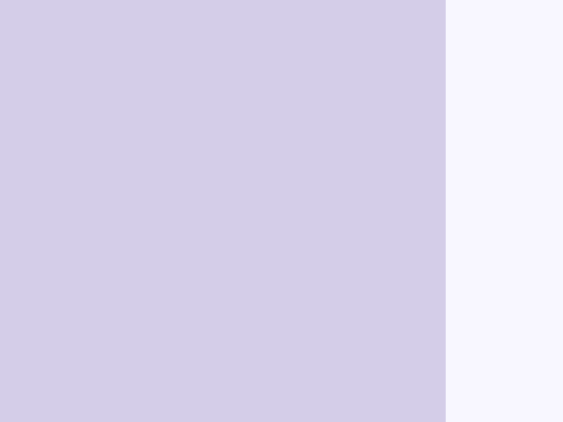

# Ripple

Componente de decoración de onda (ripple) puramente visual.

Proporciona una animación de onda con origen en el puntero: el círculo expansivo comienza
en las coordenadas exactas donde se pulsó (pointer-down) en lugar de en el centro del elemento.
Esta es la onda M3 de alta fidelidad; para una onda central más simple solo con CSS,
usa el pseudo-elemento `.interactive::after` de `interactionStyles` en su lugar.

**Uso:**
Coloca `<moni-ripple>` como **hijo** de cualquier elemento interactivo. El componente
adjunta automáticamente un listener de `pointerdown` a su `parentElement` y
calcula el origen de la onda en coordenadas porcentuales relativas al padre.

El elemento padre NO debe tener `position: static` (la onda aplica
`position: relative` automáticamente en `connectedCallback`).

**Modelo de tiempo:**
En `pointerdown`:
1. Se establece `active = false` (cancela cualquier onda en progreso).
2. Un tick de `requestAnimationFrame` asegura que el navegador haya procesado el reinicio.
3. `active = true` activa la animación de escala CSS.
4. Un `setTimeout` de duración `duration` ms (basado en `speed`) reinicia `active = false`.

La duración coincide con la duración de la transición CSS para que el desvanecimiento de la opacidad
se complete antes de que se limpie `active`.

**Limpieza (Cleanup):**
`disconnectedCallback` elimina el listener de `pointerdown` y borra cualquier
tiempo de espera (timeout) pendiente. Llama siempre a `super.disconnectedCallback()` si usas subclases.

- Tag: `moni-ripple`
- Clase: `MoniRipple`
- Fuente: `src/components/moni-ripple.ts`

## Cuándo usarlo

Usa `moni-ripple` cuando la interfaz necesite el patrón que describe este componente. Antes de elegirlo, revisa sus estados, contenido permitido y comportamiento accesible; las capturas del final muestran el resultado real de cada variante.

## Uso básico

```html
<!-- Onda en un elemento personalizado -->
<div class="my-button" style="position: relative; overflow: hidden;">
  Haz clic
  <moni-ripple color="primary"></moni-ripple>
</div>
```

## Ejemplo práctico con Tailwind CSS v4

Tailwind controla composición, ancho, espaciado y responsividad alrededor del Web Component. Moni UI conserva el aspecto interno mediante Shadow DOM y design tokens.

```html
<div class="mx-auto flex w-full max-w-md flex-col gap-4 p-6">
  <moni-ripple></moni-ripple>
</div>
```

No necesitas un plugin de Tailwind. En tu CSS v4 importa ambas capas una sola vez:

```css
@import "tailwindcss";
@import "@moni-labs/moni-ui/styles";

@theme {
  --font-sans: Inter, ui-sans-serif, system-ui, sans-serif;
}
```

Las utilities aplicadas directamente al tag afectan su caja anfitriona. No uses selectores Tailwind para asumir acceso al DOM interno; personaliza únicamente con los CSS Parts y Custom Properties públicos enumerados más abajo.

## Recomendaciones

- Usa `moni-ripple` para su propósito semántico; no lo sustituyas por un `div` estilizado.
- Aplica Tailwind al layout exterior. Para el interior del Shadow DOM usa las variables CSS y `::part()` documentados.
- Mantén el estado de apertura en una única fuente de verdad y devuelve el foco al disparador al cerrar.
- Prueba los estados claro, oscuro, foco por teclado, deshabilitado y viewport móvil antes de publicar.

## Propiedades y atributos

| Atributo | Propiedad | Tipo | Default | Descripción |
|---|---|---|---|---|
| `x` | `x` | `number` | `50` | Origen horizontal de la onda como porcentaje del ancho del padre.  Se establece automáticamente por `_onPointerDown` basándose en las coordenadas del puntero. Se puede configurar manualmente para activar una onda en una ubicación específica. |
| `y` | `y` | `number` | `50` | Origen vertical de la onda como porcentaje de la altura del padre.  Se establece automáticamente por `_onPointerDown` basándose en las coordenadas del puntero. |
| `active` | `active` | `boolean` | `false` | Cuando es `true`, la onda es visible y se está animando.  Alternado automáticamente por `_onPointerDown`. Se puede configurar manualmente para efectos de onda disparados programáticamente. |
| `speed` | `speed` | `'fast' \| 'normal' \| 'slow'` | `'normal'` | Velocidad de animación de la secuencia de expansión y desvanecimiento de la onda.  Se asigna a la propiedad personalizada CSS `--_dur`: - `'fast'`   — 300ms - `'normal'` — 600ms (por defecto) - `'slow'`   — 1200ms |
| `color` | `color` | `'primary' \| 'secondary' \| 'surface'` | `'primary'` | Token de color para la superposición de la onda.  Establece la propiedad CSS `color` en `:host`, que el span `.ripple` hereda a través de `background-color: currentColor`.  - `'primary'`   — `--primary` (por defecto) - `'secondary'` — `--secondary` - `'surface'`   — `--surface-variant` (sutil, para contenedores de superficie) |

## Slots

Este componente no declara slots públicos.

## Eventos

No declara eventos propios.

## Métodos públicos

No expone métodos públicos adicionales.

## CSS Parts

- `ripple`: Parte interna personalizable.

## CSS Custom Properties consumidas

- `--_dur`
- `--_x`
- `--_y`
- `--primary`
- `--secondary`
- `--surface-variant`

## Referencia visual por variable

Cada imagen se genera con el componente real: cambia solo la variable indicada y mantiene estable el resto del escenario. Úsala para comparar estados, no como sustituto de la API.

### `x`

Origen horizontal de la onda como porcentaje del ancho del padre.

Se establece automáticamente por `_onPointerDown` basándose en las coordenadas del puntero.
Se puede configurar manualmente para activar una onda en una ubicación específica.


### `y`

Origen vertical de la onda como porcentaje de la altura del padre.

Se establece automáticamente por `_onPointerDown` basándose en las coordenadas del puntero.


### `active`

Cuando es `true`, la onda es visible y se está animando.

Alternado automáticamente por `_onPointerDown`. Se puede configurar manualmente para
efectos de onda disparados programáticamente.




### `speed`

Velocidad de animación de la secuencia de expansión y desvanecimiento de la onda.

Se asigna a la propiedad personalizada CSS `--_dur`:
- `'fast'`   — 300ms
- `'normal'` — 600ms (por defecto)
- `'slow'`   — 1200ms


### `color`

Token de color para la superposición de la onda.

Establece la propiedad CSS `color` en `:host`, que el span `.ripple`
hereda a través de `background-color: currentColor`.

- `'primary'`   — `--primary` (por defecto)
- `'secondary'` — `--secondary`
- `'surface'`   — `--surface-variant` (sutil, para contenedores de superficie)


