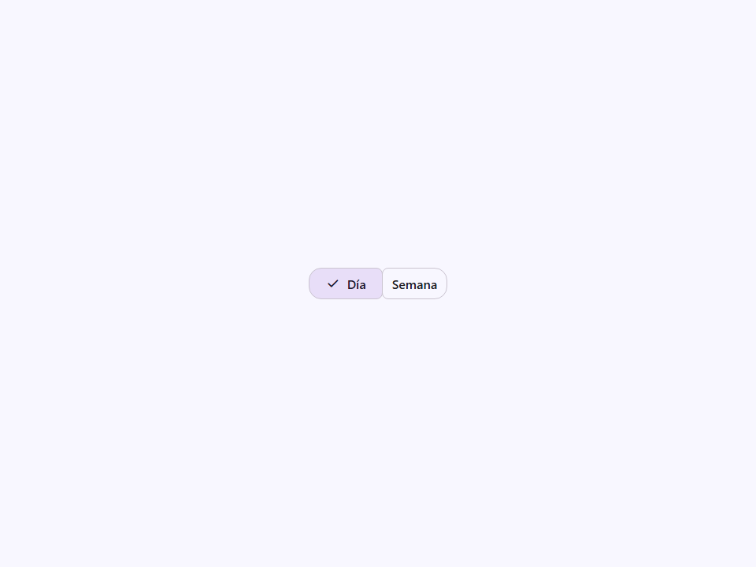
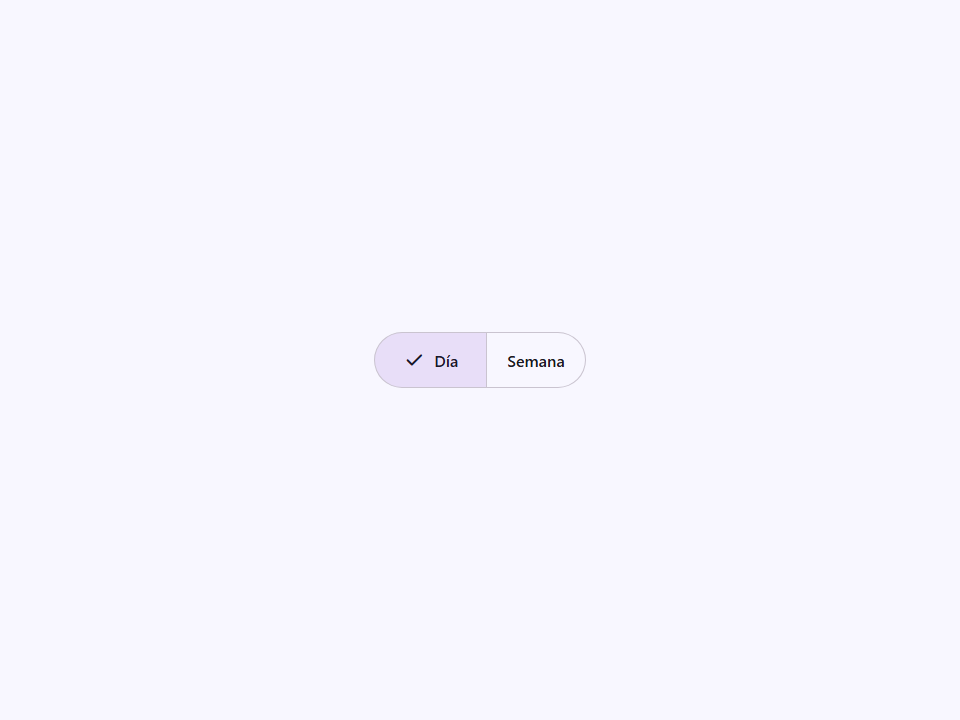
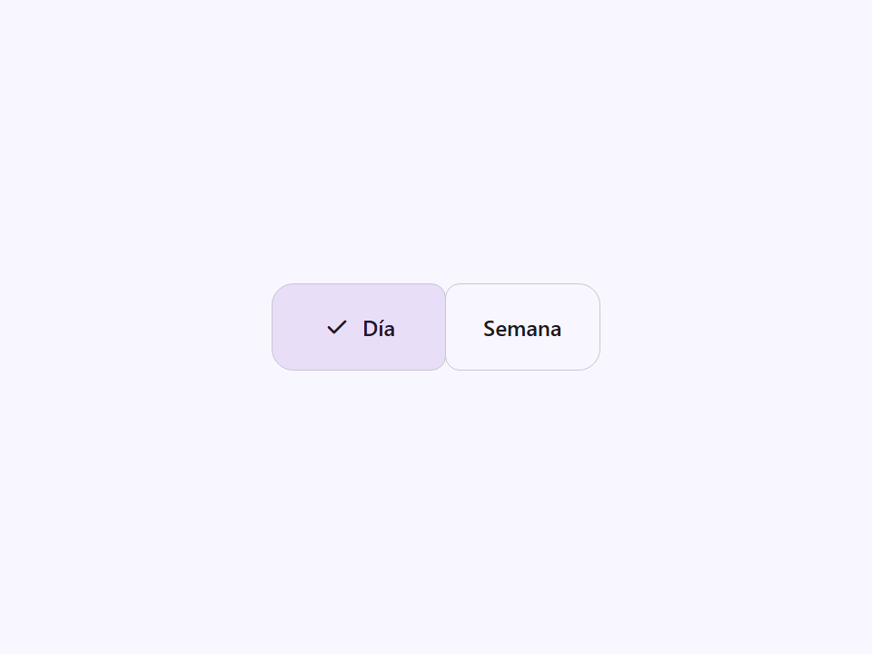
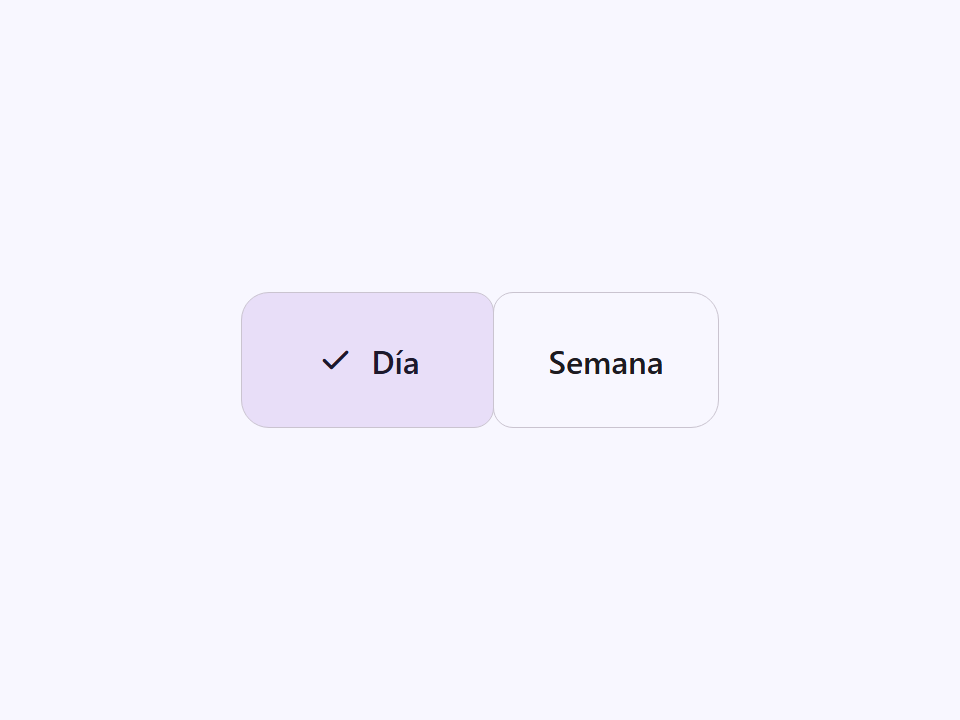

# Segmented Button

Componente Material Design 3 Segmented Button (Botón Segmentado) (Heredado).

Un grupo de botones segmentados seleccionables asociado a formularios.

**Aviso de obsolescencia (Deprecation Notice):** La especificación M3 (`m3-docs/components/segmented-buttons/overview.md`)
ha actualizado el patrón de botones segmentados. Los segmentos a medida han sido
reemplazados por elementos estándar `<moni-button>` agrupados dentro de un
`<moni-button-group variant="connected">`.

Este componente sigue funcionando para mantener la compatibilidad con versiones anteriores, pero será
eliminado en la v1.0. Se registra una advertencia de obsolescencia en la consola cuando el
elemento se conecta al DOM.

- Tag: `moni-segmented-button`
- Clase: `MoniSegmentedButton`
- Fuente: `src/components/moni-segmented-button.ts`

## Cuándo usarlo

Usa `moni-segmented-button` cuando la interfaz necesite el patrón que describe este componente. Antes de elegirlo, revisa sus estados, contenido permitido y comportamiento accesible; las capturas del final muestran el resultado real de cada variante.

## Uso básico

```html
<!-- Uso heredado (no recomendado) -->
<moni-segmented-button name="view" multi>
  <moni-button-segment value="day">Día</moni-button-segment>
  <moni-button-segment value="week">Semana</moni-button-segment>
</moni-segmented-button>

<!-- Equivalente M3 moderno -->
<moni-button-group variant="connected">
  <moni-button>Día</moni-button>
  <moni-button>Semana</moni-button>
</moni-button-group>
```

## Ejemplo práctico con Tailwind CSS v4

Tailwind controla composición, ancho, espaciado y responsividad alrededor del Web Component. Moni UI conserva el aspecto interno mediante Shadow DOM y design tokens.

```html
<div class="mx-auto flex w-full max-w-md flex-col gap-4 p-6">
  <moni-segmented-button></moni-segmented-button>
</div>
```

No necesitas un plugin de Tailwind. En tu CSS v4 importa ambas capas una sola vez:

```css
@import "tailwindcss";
@import "@moni-labs/moni-ui/styles";

@theme {
  --font-sans: Inter, ui-sans-serif, system-ui, sans-serif;
}
```

Las utilities aplicadas directamente al tag afectan su caja anfitriona. No uses selectores Tailwind para asumir acceso al DOM interno; personaliza únicamente con los CSS Parts y Custom Properties públicos enumerados más abajo.

## Recomendaciones

- Usa `moni-segmented-button` para su propósito semántico; no lo sustituyas por un `div` estilizado.
- Aplica Tailwind al layout exterior. Para el interior del Shadow DOM usa las variables CSS y `::part()` documentados.
- Prueba los estados claro, oscuro, foco por teclado, deshabilitado y viewport móvil antes de publicar.

## Propiedades y atributos

| Atributo | Propiedad | Tipo | Default | Descripción |
|---|---|---|---|---|
| `name` | `name` | `string` | `''` | Nombre del botón segmentado, usado para el envío del formulario. |
| `multi` | `multi` | `boolean` | `false` | Permite seleccionar múltiples segmentos simultáneamente. |
| `size` | `size` | `'xsmall' \| 'small' \| 'medium' \| 'large' \| 'xlarge' \| 'extra'` | `'small'` | Tamaño de los segmentos del botón. |
| `hide-check` | `hideCheck` | `boolean` | `false` | Oculta el icono de marca de verificación principal (leading checkmark) cuando se selecciona un segmento. |
| `gap` | `gap` | `string` | `''` | Define un espaciado personalizado entre segmentos. |

## Slots

- `default`: elementos `<moni-button-segment>`.

## Eventos

- `change`: evento compuesto y burbujeante emitido por el componente.

## Métodos públicos

No expone métodos públicos adicionales.

## CSS Parts

- `group`: Parte interna personalizable.

## CSS Custom Properties consumidas

No consume variables CSS propias.

## Referencia visual por variable

Cada imagen se genera con el componente real: cambia solo la variable indicada y mantiene estable el resto del escenario. Úsala para comparar estados, no como sustituto de la API.

### `name`

Nombre del botón segmentado, usado para el envío del formulario.


### `multi`

Permite seleccionar múltiples segmentos simultáneamente.




### `size`

Tamaño de los segmentos del botón.









### `hide-check`

Oculta el icono de marca de verificación principal (leading checkmark) cuando se selecciona un segmento.


### `gap`

Define un espaciado personalizado entre segmentos.


