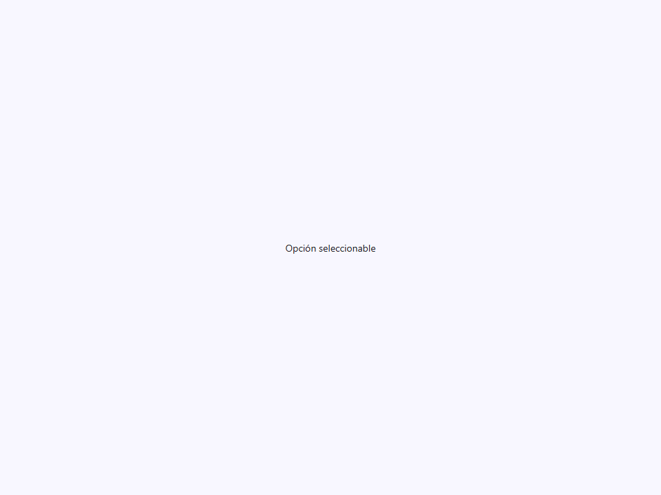
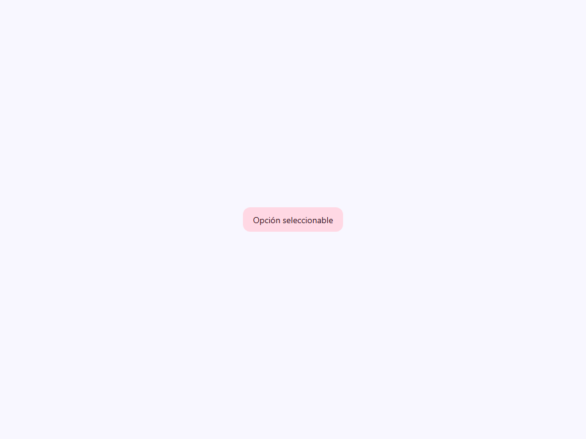
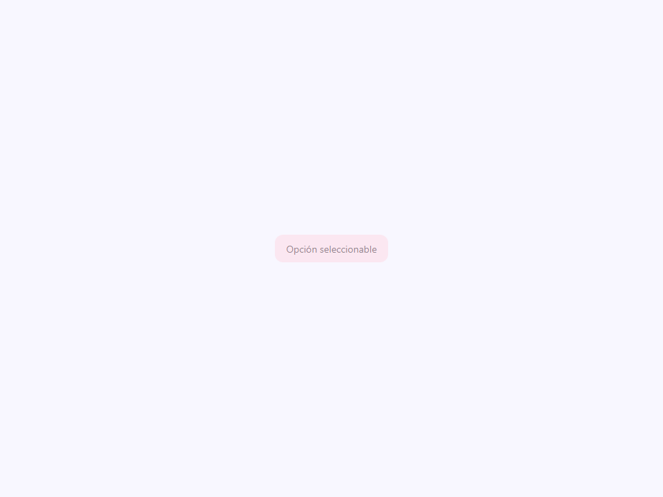

# Select Option

Componente Material Design 3 Select Option (Opción de Selección).

Un elemento individual seleccionable diseñado para colocarse dentro de un
menú desplegable `<moni-select>`.

**Interacción y diseño (layout):**
Las opciones se renderizan como elementos `<li>` accesibles estilizados de forma idéntica a
`<moni-menu-item>`. Cuando se insertan en un `<moni-select>`, el componente
padre extrae sus atributos `value`, `label` y `group` para construir
su modelo de datos interno y maneja la lógica de selección real, la navegación
por teclado y el renderizado dentro del popup desplegable.

**Agrupación:**
Las opciones se pueden clasificar en subcategorías proporcionando un atributo
`group`. El `<moni-select>` padre usa esto para generar automáticamente
encabezados de grupo (`<moni-select-group>`) en la lista desplegable.

- Tag: `moni-select-option`
- Clase: `MoniSelectOption`
- Fuente: `src/components/moni-select-option.ts`

## Cuándo usarlo

Usa `moni-select-option` cuando la interfaz necesite el patrón que describe este componente. Antes de elegirlo, revisa sus estados, contenido permitido y comportamiento accesible; las capturas del final muestran el resultado real de cada variante.

## Uso básico

```html
<moni-select label="Framework favorito">
  <!-- Opción estándar -->
  <moni-select-option value="lit">Lit Element</moni-select-option>

  <!-- Opción deshabilitada -->
  <moni-select-option value="react" disabled>React (no permitido)</moni-select-option>

  <!-- Opción agrupada -->
  <moni-select-option value="vue" group="Otros">Vue.js</moni-select-option>
</moni-select>
```

## Ejemplo práctico con Tailwind CSS v4

Tailwind controla composición, ancho, espaciado y responsividad alrededor del Web Component. Moni UI conserva el aspecto interno mediante Shadow DOM y design tokens.

```html
<div class="mx-auto flex w-full max-w-md flex-col gap-4 p-6">
  <moni-select-option label="Ejemplo"></moni-select-option>
</div>
```

No necesitas un plugin de Tailwind. En tu CSS v4 importa ambas capas una sola vez:

```css
@import "tailwindcss";
@import "@moni-labs/moni-ui/styles";

@theme {
  --font-sans: Inter, ui-sans-serif, system-ui, sans-serif;
}
```

Las utilities aplicadas directamente al tag afectan su caja anfitriona. No uses selectores Tailwind para asumir acceso al DOM interno; personaliza únicamente con los CSS Parts y Custom Properties públicos enumerados más abajo.

## Recomendaciones

- Usa `moni-select-option` para su propósito semántico; no lo sustituyas por un `div` estilizado.
- Aplica Tailwind al layout exterior. Para el interior del Shadow DOM usa las variables CSS y `::part()` documentados.
- Durante una operación asíncrona combina el estado `loading` —si existe— con `disabled` para evitar envíos duplicados.
- En formularios controlados, sincroniza la propiedad `value` y escucha el evento documentado; no dependas solo del atributo inicial.
- Prueba los estados claro, oscuro, foco por teclado, deshabilitado y viewport móvil antes de publicar.

## Propiedades y atributos

| Atributo | Propiedad | Tipo | Default | Descripción |
|---|---|---|---|---|
| `value` | `value` | `string` | `''` | Valor actual del control; usa la propiedad JavaScript para valores que deban conservar su tipo. |
| `label` | `label` | `string` | `''` | Etiqueta visible y accesible del control. |
| `group` | `group` | `string` | `''` | Define `group`. Conserva el tipo indicado y usa la propiedad JavaScript cuando el valor no sea una cadena. |
| `selected` | `selected` | `boolean` | `false` | Indica si la opción está seleccionada. |
| `disabled` | `disabled` | `boolean` | `false` | Impide la interacción y aplica el estado visual deshabilitado. |

## Slots

- `default`: La etiqueta de texto para la opción. Si se omite el atributo `label`,
          el `<moni-select>` padre leerá el `textContent` de esta ranura (slot).

## Eventos

No declara eventos propios.

## Métodos públicos

No expone métodos públicos adicionales.

## CSS Parts

- `item`: El elemento `<li>` exterior.
- `label`: Parte interna personalizable.
- `option`: Parte interna personalizable.

## CSS Custom Properties consumidas

- `--active`
- `--font`
- `--on-surface`
- `--on-tertiary-container`
- `--speed2`
- `--tertiary-container`

## Referencia visual por variable

Cada imagen se genera con el componente real: cambia solo la variable indicada y mantiene estable el resto del escenario. Úsala para comparar estados, no como sustituto de la API.

### `value`

Valor actual del control; usa la propiedad JavaScript para valores que deban conservar su tipo.


### `label`

Etiqueta visible y accesible del control.


### `group`

Define `group`. Conserva el tipo indicado y usa la propiedad JavaScript cuando el valor no sea una cadena.


### `selected`

Indica si la opción está seleccionada.





### `disabled`

Impide la interacción y aplica el estado visual deshabilitado.



