# Select

Componente Material Design 3 Select (Menú Desplegable).

Un menú desplegable select personalizado completo con capacidad de búsqueda, grupos de opciones,
navegación por teclado, animación y un modo de cajón/hoja (drawer/sheet) móvil opcional.
Reemplaza el elemento nativo `<select>` con una alternativa completamente estilizada y accesible
que cumple con M3.

**Referencia a la especificación M3:** `m3-docs/components/menus/specs.md` (menús desplegables)

**Resumen de características:**
- Variantes Filled y Outlined que coinciden con los estilos de campo de texto de M3.
- Etiqueta flotante (floating label) con la animación estándar de etiqueta flotante de estilos de campo.
- Modo de búsqueda: el atributo `searchable` agrega un campo de entrada de filtro en línea.
- Grupos de opciones: elementos `<moni-select-group>` en el slot para opciones jerárquicas.
- Cajón móvil: el atributo `drawer` abre las opciones en un `<moni-bottom-sheet>`
  en lugar de un popup desplegable, ideal para interfaces táctiles (touch UIs).
- Navegación por teclado: Teclas de flecha, Enter, Escape y Tab según combobox de ARIA.
- Estado de carga: `loading` muestra un progreso circular indeterminado.
- Soporte multi-valor: `multiple` permite selección múltiple.

**Fuentes de opciones:**
Las opciones se pueden proporcionar de dos maneras:
1. **Elementos `<moni-select-option>` en la ranura (slot)** (por defecto, recomendado para SSR).
2. **Propiedad `options`** — un array de `DropdownNode[]` para un control completamente programático.

**Vinculación de valores (Value binding):**
La propiedad `value` contiene la cadena de valor de la opción actualmente seleccionada.
Para selección múltiple, `values` contiene `string[]`. Al cambiar, se dispara un
evento compuesto `'moni-change'`.

- Tag: `moni-select`
- Clase: `MoniSelect`
- Fuente: `src/components/moni-select.ts`

## Cuándo usarlo

Usa `moni-select` cuando la interfaz necesite el patrón que describe este componente. Antes de elegirlo, revisa sus estados, contenido permitido y comportamiento accesible; las capturas del final muestran el resultado real de cada variante.

## Uso básico

```html
<moni-select label="País" name="country" variant="outlined">
  <moni-select-option value="us">Estados Unidos</moni-select-option>
  <moni-select-option value="gb">Reino Unido</moni-select-option>
  <moni-select-option value="de">Alemania</moni-select-option>
</moni-select>

<!-- Select con búsqueda -->
<moni-select label="Idioma" searchable>
  <moni-select-option value="ts">TypeScript</moni-select-option>
  <moni-select-option value="py">Python</moni-select-option>
</moni-select>
```

## Ejemplo práctico con Tailwind CSS v4

Tailwind controla composición, ancho, espaciado y responsividad alrededor del Web Component. Moni UI conserva el aspecto interno mediante Shadow DOM y design tokens.

```html
<div class="mx-auto flex w-full max-w-md flex-col gap-4 p-6">
  <moni-select label="Ejemplo"></moni-select>
</div>
```

No necesitas un plugin de Tailwind. En tu CSS v4 importa ambas capas una sola vez:

```css
@import "tailwindcss";
@import "@moni-labs/moni-ui/styles";

@theme {
  --font-sans: Inter, ui-sans-serif, system-ui, sans-serif;
}
```

Las utilities aplicadas directamente al tag afectan su caja anfitriona. No uses selectores Tailwind para asumir acceso al DOM interno; personaliza únicamente con los CSS Parts y Custom Properties públicos enumerados más abajo.

## Recomendaciones

- Usa `moni-select` para su propósito semántico; no lo sustituyas por un `div` estilizado.
- Aplica Tailwind al layout exterior. Para el interior del Shadow DOM usa las variables CSS y `::part()` documentados.
- Durante una operación asíncrona combina el estado `loading` —si existe— con `disabled` para evitar envíos duplicados.
- En formularios controlados, sincroniza la propiedad `value` y escucha el evento documentado; no dependas solo del atributo inicial.
- Cuando el control muestre únicamente un icono, añade siempre un `aria-label` descriptivo.
- Prueba los estados claro, oscuro, foco por teclado, deshabilitado y viewport móvil antes de publicar.

## Propiedades y atributos

| Atributo | Propiedad | Tipo | Default | Descripción |
|---|---|---|---|---|
| `name` | `name` | `string` | `''` | Nombre del campo select, usado para el envío del formulario. |
| `label` | `label` | `string` | `''` | Texto de la etiqueta flotante. |
| `variant` | `variant` | `'filled' \| 'outlined'` | `'filled'` | Variante visual del campo select. |
| `size` | `size` | `'small' \| 'medium' \| 'large' \| 'extra'` | `'medium'` | Define las dimensiones del campo select. |
| `shape` | `shape` | `'round' \| 'small-round' \| 'square' \| 'no-round'` | `'no-round'` | Forma (radio de borde) del campo. |
| `disabled` | `disabled` | `boolean` | `false` | Deshabilita el campo select. |
| `required` | `required` | `boolean` | `false` | Obliga a elegir una opción antes de enviar el formulario.  El `<input>` visible es de sólo lectura, así que la validación nativa no se aplica sobre él: la restricción se declara en el host con `ElementInternals.setValidity`, que es lo que mira el formulario. |
| `loading` | `loading` | `boolean` | `false` | Si es verdadero, muestra un indicador de carga (progreso lineal). |
| `helper` | `helper` | `string` | `''` | Texto de ayuda mostrado debajo del campo. |
| `error-text` | `errorText` | `string` | `''` | Texto de error mostrado debajo del campo cuando `error` es true. Reemplaza al texto de ayuda. |
| `error` | `error` | `boolean` | `false` | Si es verdadero, establece el campo en un estado de error. |
| `value` | `value` | `string` | `''` | El valor actual del select. |
| `icon` | `icon` | `string` | `''` | Nombre del icono principal (leading icon, Material Symbols). |
| `trailing-icon` | `trailingIcon` | `string` | `'arrow_drop_down'` | Nombre del icono final (trailing icon, Material Symbols) que indica el estado del menú desplegable. |
| `searchable` | `searchable` | `boolean` | `false` | Habilita un campo de búsqueda en la parte superior del menú desplegable para filtrar opciones. |
| `clearable` | `clearable` | `boolean` | `false` | Muestra un botón de limpieza cuando se selecciona un valor para restablecer fácilmente el campo. |
| `sheet` | `sheet` | `boolean` | `false` | Renderiza las opciones como una hoja inferior (bottom sheet, ideal para dispositivos móviles) en lugar de un menú desplegable. |
| `placeholder` | `placeholder` | `string` | `''` | Texto de marcador de posición (placeholder) mostrado cuando no hay ningún valor seleccionado. |
| `positioning` | `positioning` | `'absolute' \| 'fixed' \| 'body'` | `'absolute'` | Estrategia de posicionamiento para el menú desplegable.  - `'absolute'`: permanece en el contexto de posicionamiento del select. - `'fixed'`: usa coordenadas del viewport, pero conserva su contexto de apilamiento. - `'body'`: usa la capa superior nativa (Popover API) para escapar de `overflow`,   diálogos, bottom sheets y contextos de apilamiento. |
| `placement` | `placement` | `'top' \| 'bottom' \| 'left' \| 'right' \| 'auto'` | `'auto'` | Ubicación preferida del menú desplegable con respecto al disparador (trigger). |
| `dropdown-width` | `dropdownWidth` | `string` | `'trigger'` | Restricción de ancho del menú desplegable. - `'trigger'`: Coincide con el ancho del campo de entrada. - `'auto'`: Coincide con el ancho del contenido del menú desplegable. - O cualquier valor CSS de ancho válido (ej. '200px'). |
| `dropdown-max-height` | `dropdownMaxHeight` | `string` | `''` | Límite manual opcional para la altura del menú.  Acepta cualquier longitud CSS válida, por ejemplo `240px`, `40vh` o `calc(100vh - 8rem)`. El valor nunca supera el límite automático calculado según el viewport, la posición del campo y el tope predeterminado de 75vh. Una cadena vacía conserva el cálculo automático. |

## Slots

- `default`: Hijos `<moni-select-option>` o `<moni-select-group>`.

## Eventos

No declara eventos propios.

## Métodos públicos

- `checkValidity(): boolean` — Método público checkValidity.
- `reportValidity(): boolean` — Método público reportValidity.

## CSS Parts

- `field`: Parte interna personalizable.
- `dropdown`: El contenedor flotante de la lista de opciones.
- `helper`: Parte interna personalizable.
- `input`: Parte interna personalizable.
- `label`: Parte interna personalizable.
- `leading-icon`: Parte interna personalizable.
- `menu`: Parte interna personalizable.
- `trailing-icon`: Parte interna personalizable.

## CSS Custom Properties consumidas

- `--elevate3`
- `--on-surface`
- `--on-tertiary-container`
- `--outline`
- `--outline-variant`
- `--primary`
- `--speed2`
- `--speed3`
- `--surface-container`
- `--surface-container-high`
- `--surface-container-highest`
- `--surface-container-low`
- `--tertiary-container`

## Referencia visual por variable

Cada imagen se genera con el componente real: cambia solo la variable indicada y mantiene estable el resto del escenario. Úsala para comparar estados, no como sustituto de la API.

### `name`

Nombre del campo select, usado para el envío del formulario.


### `label`

Texto de la etiqueta flotante.


### `variant`

Variante visual del campo select.


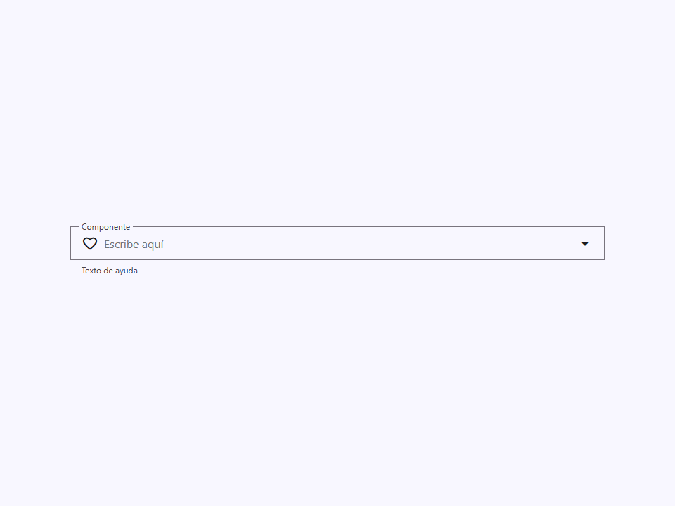

### `size`

Define las dimensiones del campo select.

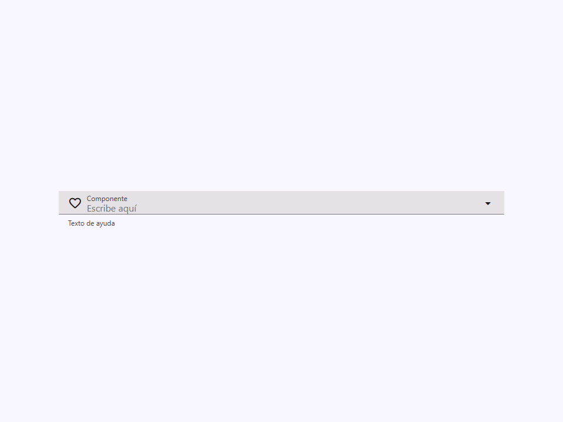


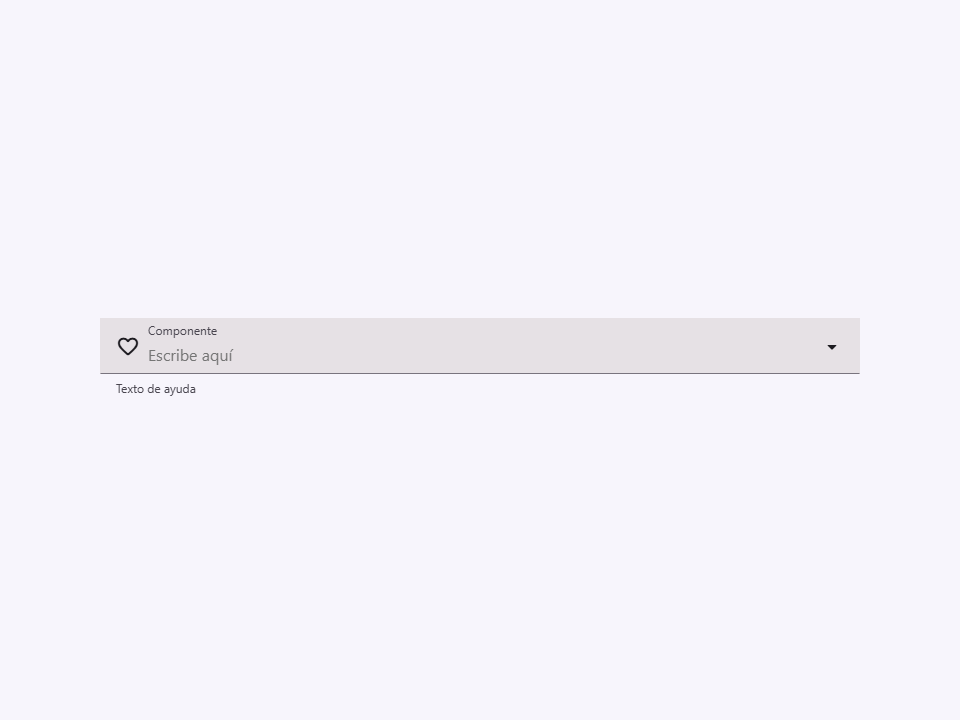

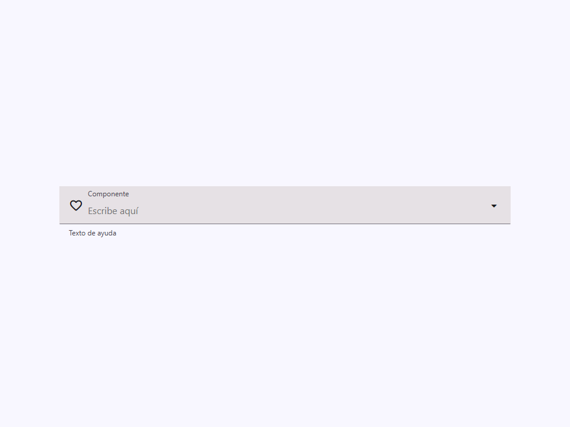

### `shape`

Forma (radio de borde) del campo.

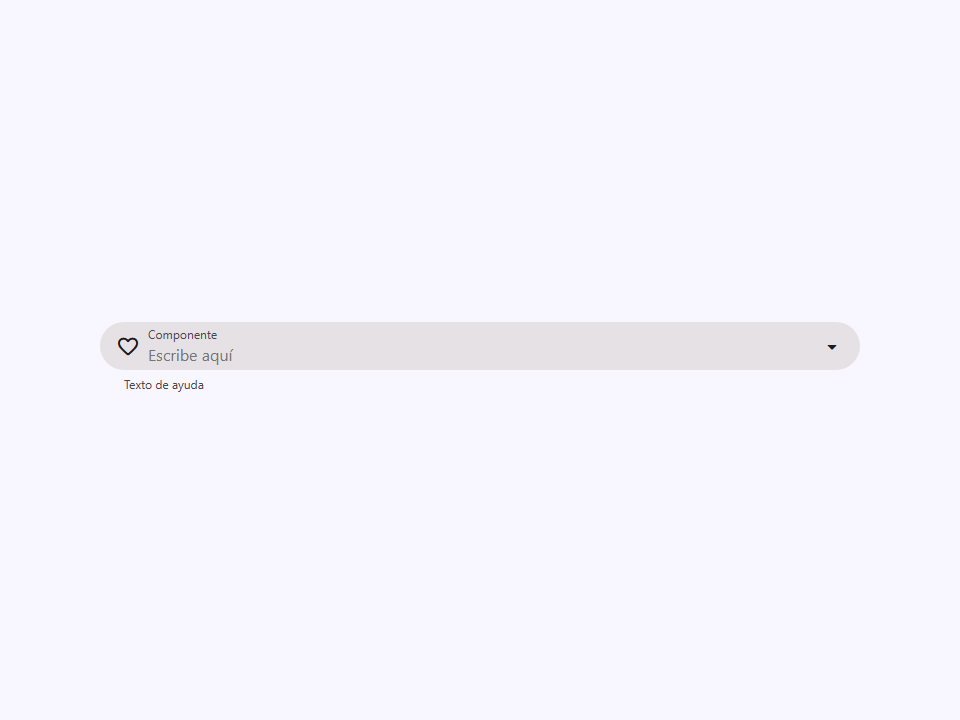

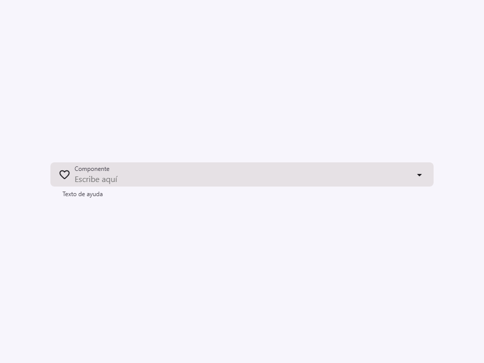

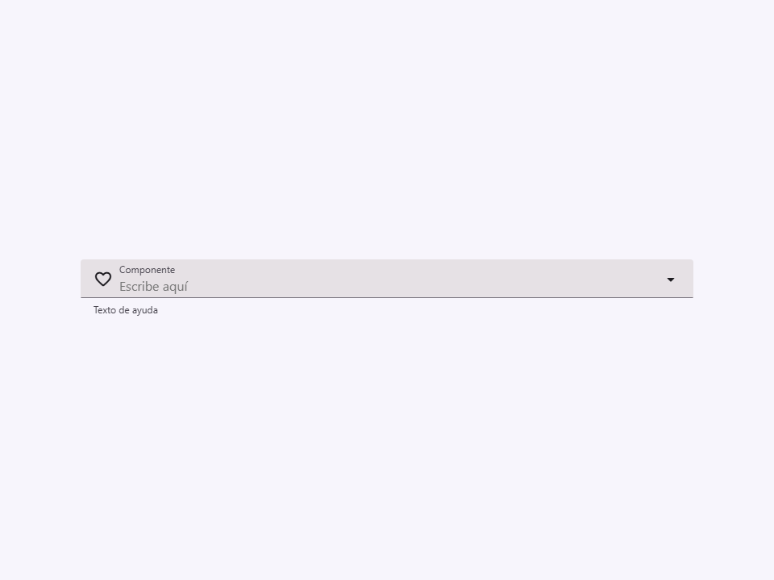


### `disabled`

Deshabilita el campo select.


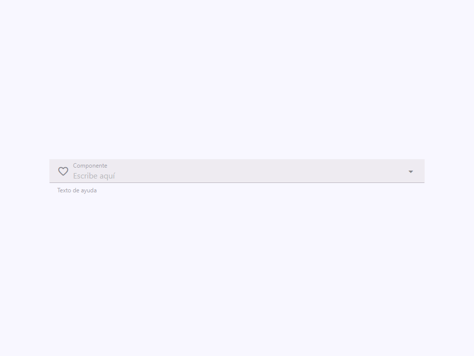

### `required`

Obliga a elegir una opción antes de enviar el formulario.

El `<input>` visible es de sólo lectura, así que la validación nativa no
se aplica sobre él: la restricción se declara en el host con
`ElementInternals.setValidity`, que es lo que mira el formulario.


### `loading`

Si es verdadero, muestra un indicador de carga (progreso lineal).


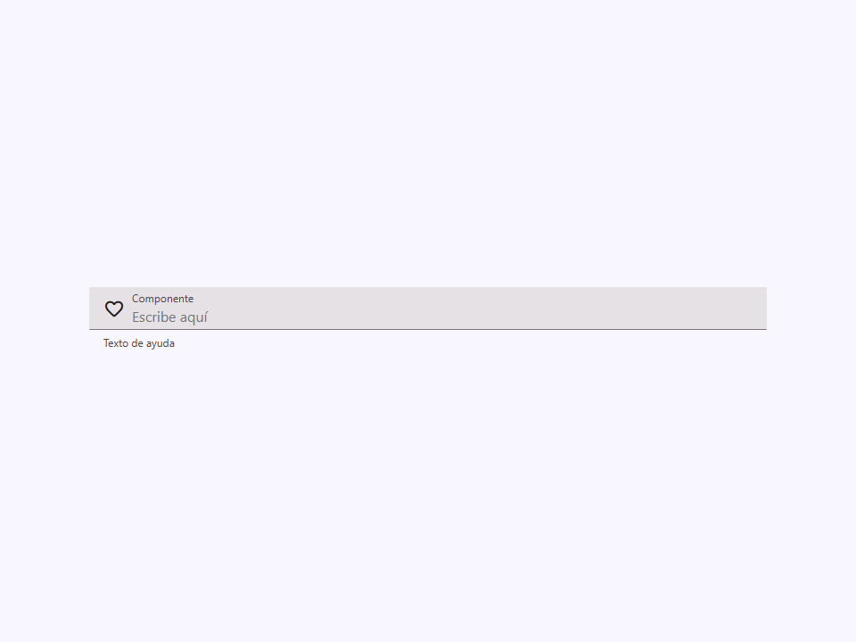

### `helper`

Texto de ayuda mostrado debajo del campo.


### `error-text`

Texto de error mostrado debajo del campo cuando `error` es true.
Reemplaza al texto de ayuda.


### `error`

Si es verdadero, establece el campo en un estado de error.


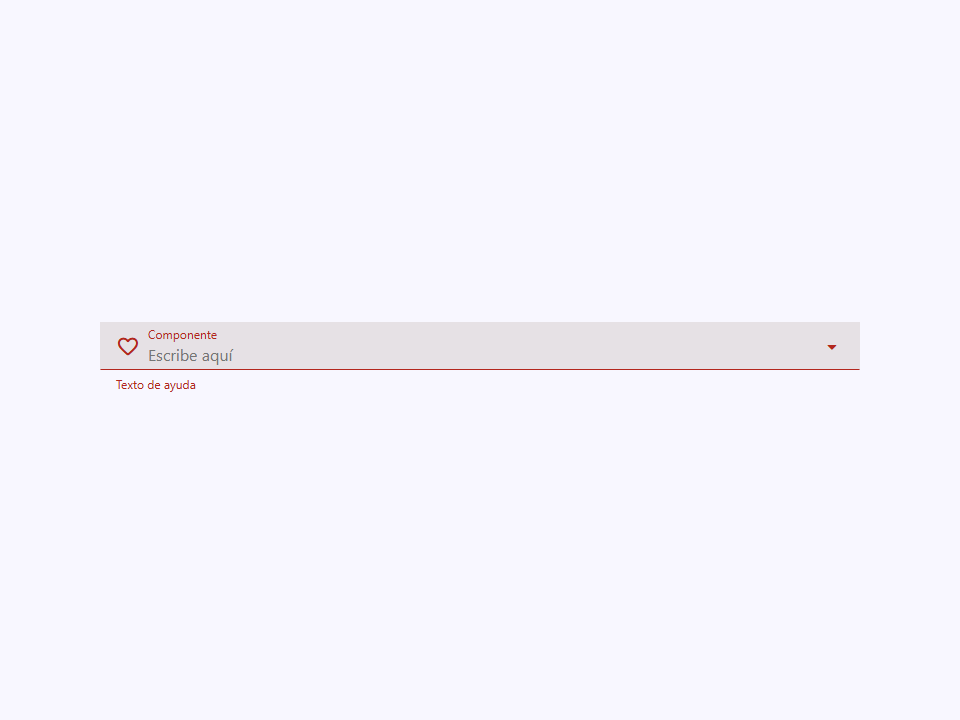

### `value`

El valor actual del select.


### `icon`

Nombre del icono principal (leading icon, Material Symbols).


### `trailing-icon`

Nombre del icono final (trailing icon, Material Symbols) que indica el estado del menú desplegable.


### `searchable`

Habilita un campo de búsqueda en la parte superior del menú desplegable para filtrar opciones.


### `clearable`

Muestra un botón de limpieza cuando se selecciona un valor para restablecer fácilmente el campo.


### `sheet`

Renderiza las opciones como una hoja inferior (bottom sheet, ideal para dispositivos móviles) en lugar de un menú desplegable.


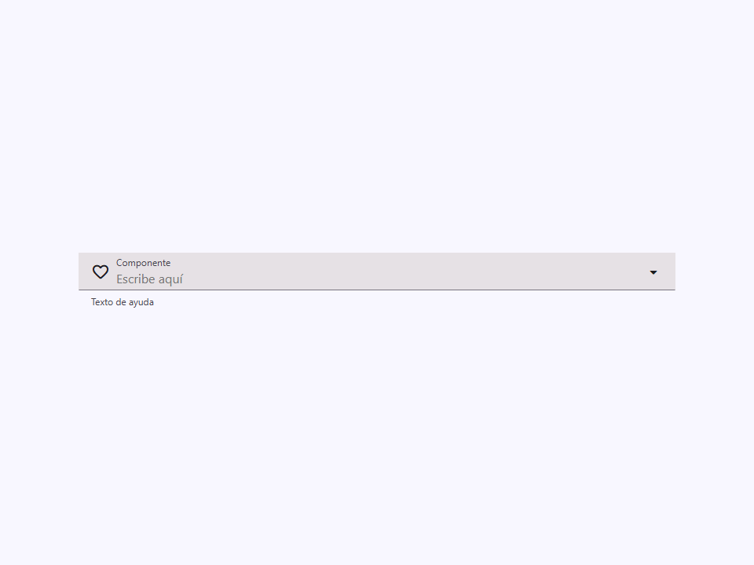

### `placeholder`

Texto de marcador de posición (placeholder) mostrado cuando no hay ningún valor seleccionado.


### `positioning`

Estrategia de posicionamiento para el menú desplegable.

- `'absolute'`: permanece en el contexto de posicionamiento del select.
- `'fixed'`: usa coordenadas del viewport, pero conserva su contexto de apilamiento.
- `'body'`: usa la capa superior nativa (Popover API) para escapar de `overflow`,
  diálogos, bottom sheets y contextos de apilamiento.


### `placement`

Ubicación preferida del menú desplegable con respecto al disparador (trigger).


### `dropdown-width`

Restricción de ancho del menú desplegable.
- `'trigger'`: Coincide con el ancho del campo de entrada.
- `'auto'`: Coincide con el ancho del contenido del menú desplegable.
- O cualquier valor CSS de ancho válido (ej. '200px').


### `dropdown-max-height`

Límite manual opcional para la altura del menú.

Acepta cualquier longitud CSS válida, por ejemplo `240px`, `40vh` o
`calc(100vh - 8rem)`. El valor nunca supera el límite automático calculado
según el viewport, la posición del campo y el tope predeterminado de 75vh.
Una cadena vacía conserva el cálculo automático.


