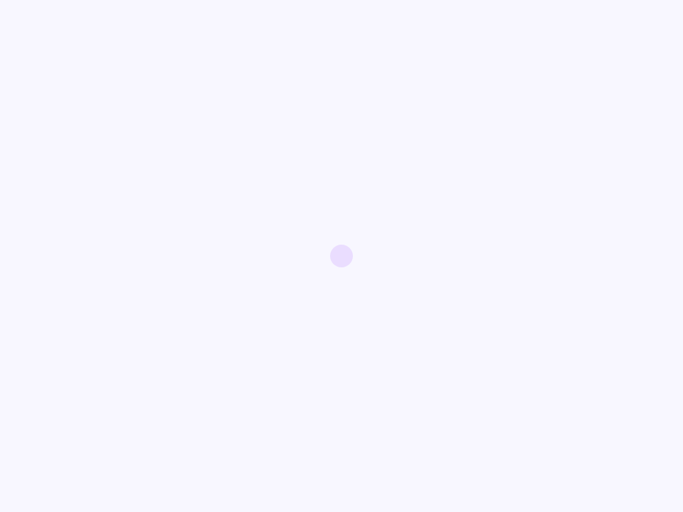
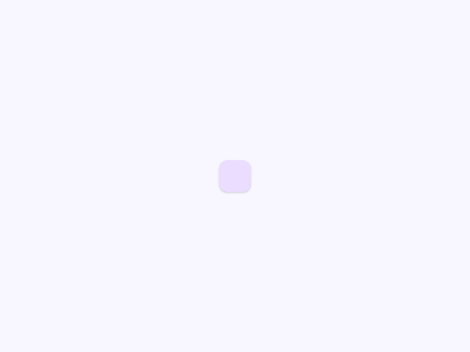
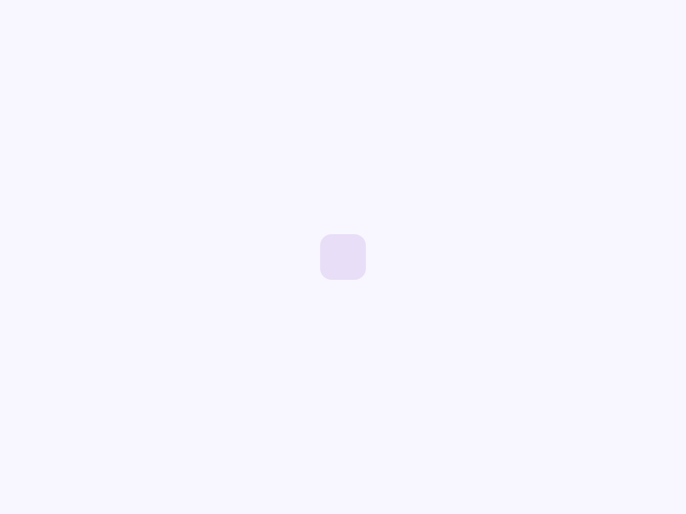
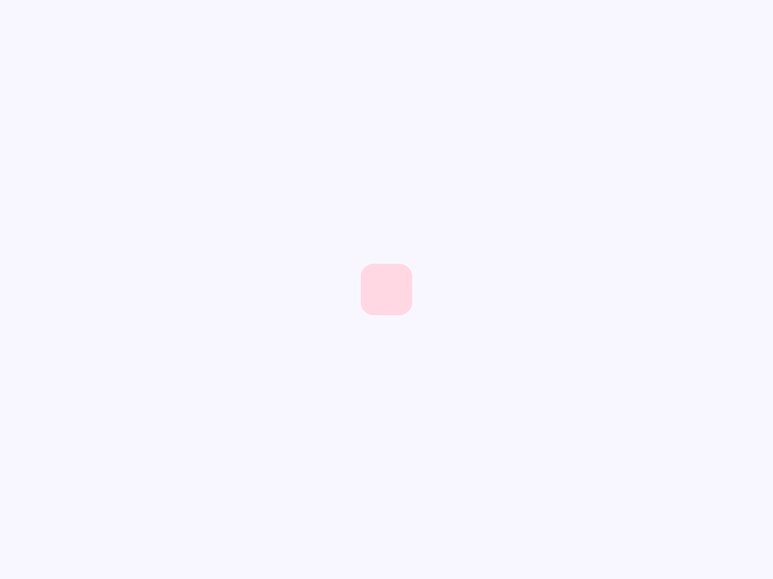
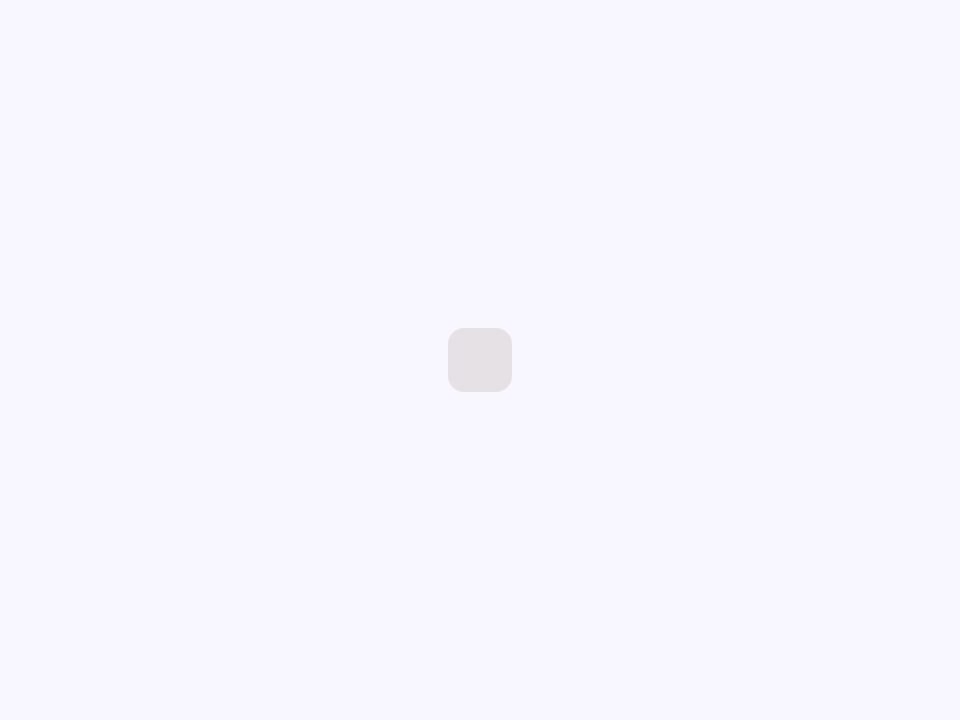

# Shape

Material 3 Expressive shape with built-in polygon morphing.

- Tag: `moni-shape`
- Clase: `MoniShape`
- Fuente: `src/components/moni-shape.ts`

## Cuándo usarlo

Usa `moni-shape` cuando la interfaz necesite el patrón que describe este componente. Antes de elegirlo, revisa sus estados, contenido permitido y comportamiento accesible; las capturas del final muestran el resultado real de cada variante.

## Uso básico

```html
<moni-shape></moni-shape>
```

## Ejemplo práctico con Tailwind CSS v4

Tailwind controla composición, ancho, espaciado y responsividad alrededor del Web Component. Moni UI conserva el aspecto interno mediante Shadow DOM y design tokens.

```html
<div class="mx-auto flex w-full max-w-md flex-col gap-4 p-6">
  <moni-shape></moni-shape>
</div>
```

No necesitas un plugin de Tailwind. En tu CSS v4 importa ambas capas una sola vez:

```css
@import "tailwindcss";
@import "@moni-labs/moni-ui/styles";

@theme {
  --font-sans: Inter, ui-sans-serif, system-ui, sans-serif;
}
```

Las utilities aplicadas directamente al tag afectan su caja anfitriona. No uses selectores Tailwind para asumir acceso al DOM interno; personaliza únicamente con los CSS Parts y Custom Properties públicos enumerados más abajo.

## Recomendaciones

- Usa `moni-shape` para su propósito semántico; no lo sustituyas por un `div` estilizado.
- Aplica Tailwind al layout exterior. Para el interior del Shadow DOM usa las variables CSS y `::part()` documentados.
- Prueba los estados claro, oscuro, foco por teclado, deshabilitado y viewport móvil antes de publicar.

## Propiedades y atributos

| Atributo | Propiedad | Tipo | Default | Descripción |
|---|---|---|---|---|
| `type` | `type` | `MoniShapeType` | `'rounded'` | Backwards-compatible Moni shape name. |
| `name` | `name` | `MoniShapeName \| ''` | `''` | M3E name alias. When set, it takes precedence over type. |
| `size` | `size` | `'small' \| 'medium' \| 'large' \| 'extra'` | `'medium'` | Selecciona uno de los tamaños visuales admitidos. |
| `border` | `border` | `boolean` | `false` | Activa o desactiva el comportamiento `border`. En HTML, la presencia del atributo significa `true`; omítelo para `false`. |
| `shadow` | `shadow` | `boolean` | `false` | Activa o desactiva el comportamiento `shadow`. En HTML, la presencia del atributo significa `true`; omítelo para `false`. |
| `shape-radius` | `shapeRadius` | `string` | `''` | Define `shapeRadius`. Conserva el tipo indicado y usa la propiedad JavaScript cuando el valor no sea una cadena. |
| `color` | `color` | `'primary' \| 'secondary' \| 'tertiary' \| 'surface'` | `'primary'` | Selecciona el valor de `color` entre las opciones documentadas. |
| `duration` | `duration` | `string` | `'500ms'` | Duration used when morphing from one named shape to another. |
| `easing` | `easing` | `string` | `'cubic-bezier(.2, 0, 0, 1)'` | CSS easing used by the morph transition. |

## Slots

Este componente no declara slots públicos.

## Eventos

No declara eventos propios.

## Métodos públicos

No expone métodos públicos adicionales.

## CSS Parts

- `shape`: Parte interna personalizable.

## CSS Custom Properties consumidas

- `--_morph-duration`
- `--_morph-easing`
- `--_radius`
- `--_shape-bg`
- `--_shape-fg`
- `--_shape-size`
- `--color-on-primary-container`
- `--color-on-secondary-container`
- `--color-on-surface`
- `--color-on-tertiary-container`
- `--color-outline-variant`
- `--color-primary-container`
- `--color-secondary-container`
- `--color-surface-container-highest`
- `--color-tertiary-container`
- `--font-sans`

## Referencia visual por variable

Cada imagen se genera con el componente real: cambia solo la variable indicada y mantiene estable el resto del escenario. Úsala para comparar estados, no como sustituto de la API.

### `type`

Backwards-compatible Moni shape name.


### `name`

M3E name alias. When set, it takes precedence over type.


### `size`

Selecciona uno de los tamaños visuales admitidos.




### `border`

Activa o desactiva el comportamiento `border`. En HTML, la presencia del atributo significa `true`; omítelo para `false`.


### `shadow`

Activa o desactiva el comportamiento `shadow`. En HTML, la presencia del atributo significa `true`; omítelo para `false`.




### `shape-radius`

Define `shapeRadius`. Conserva el tipo indicado y usa la propiedad JavaScript cuando el valor no sea una cadena.


### `color`

Selecciona el valor de `color` entre las opciones documentadas.








### `duration`

Duration used when morphing from one named shape to another.


### `easing`

CSS easing used by the morph transition.


