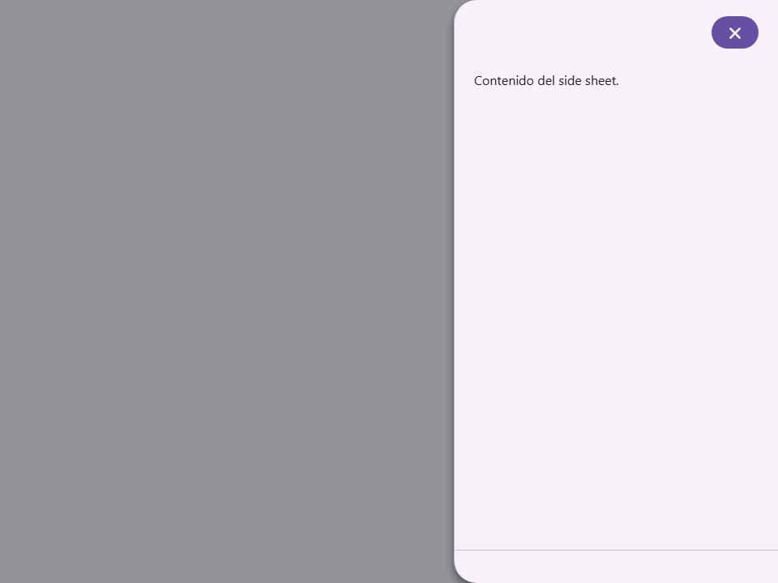
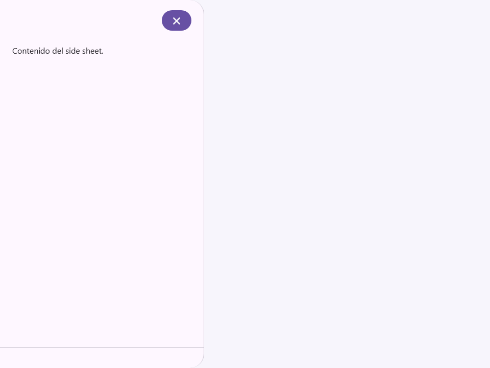
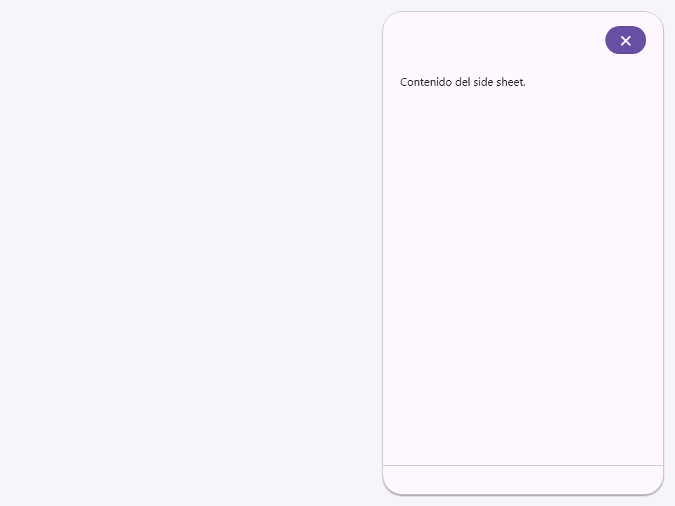
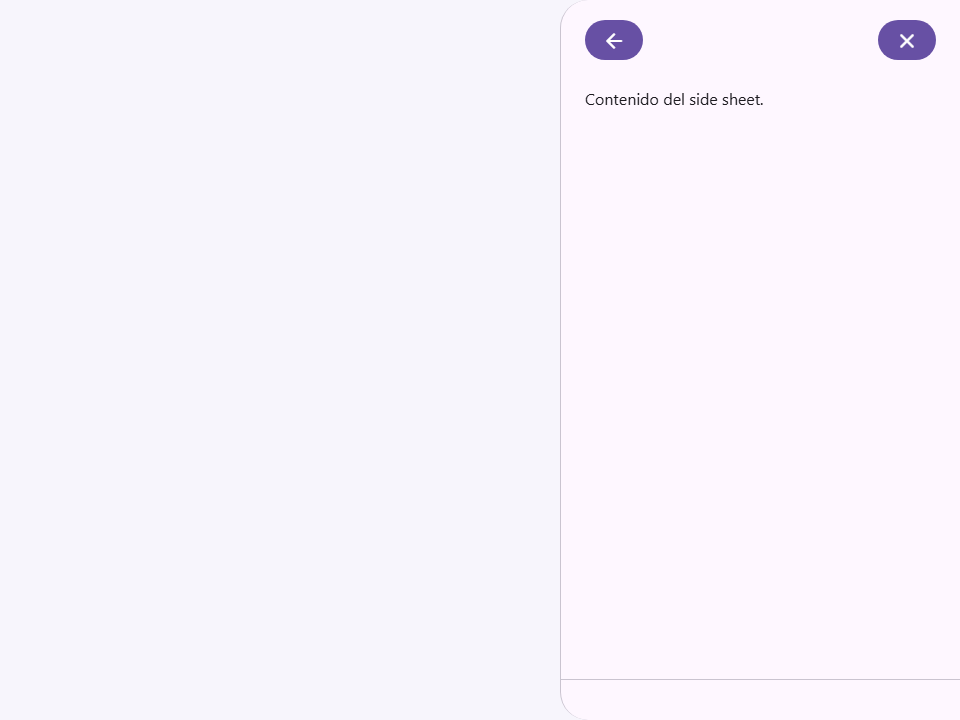
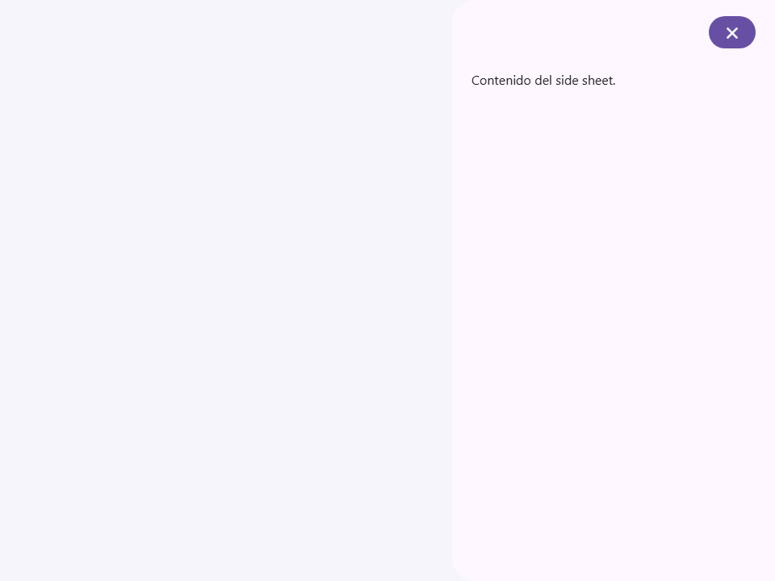
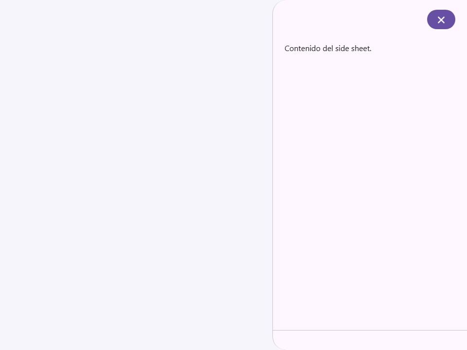
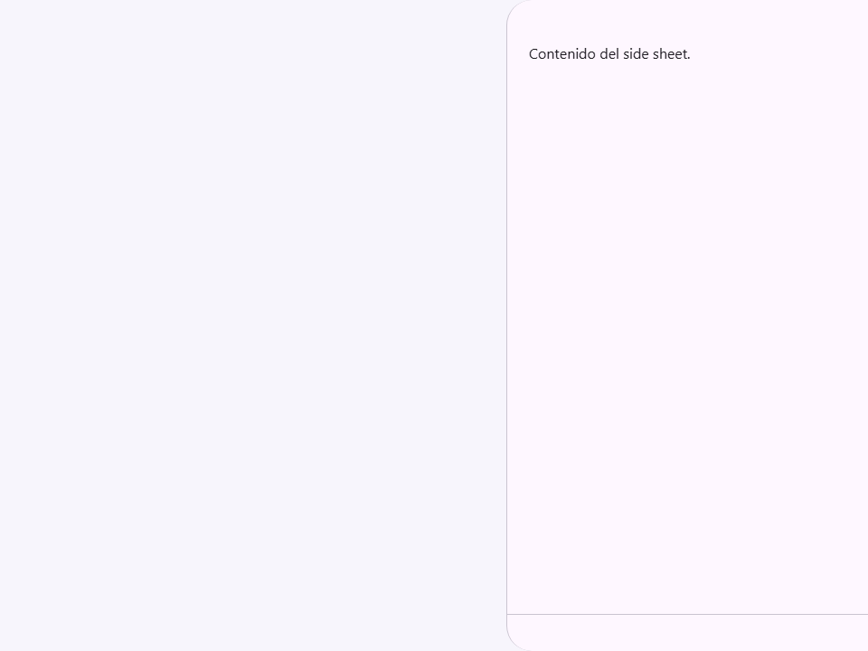

# Side Sheet

Componente Material Design 3 Side Sheet (Hoja o panel lateral).

Los paneles laterales muestran contenido complementario que está anclado al borde
izquierdo o derecho de la pantalla. Pueden ser estándar (en línea con el contenido)
o modales (superpuestos al contenido con un fondo/scrim oscurecido).

**Referencia a la especificación M3:** `m3-docs/components/side-sheets/specs.md`

**Comportamiento del cuadro de diálogo (Dialog behavior):**
Internamente, este componente utiliza el elemento HTML nativo `<dialog>` para una
accesibilidad robusta, captura de foco y renderizado en la capa superior (top-layer).
- Cuando `modal=true`, el panel usa `dialog.showModal()`, renderizando un fondo
  (scrim backdrop) y capturando el foco. Al presionar `Escape` se cierra.
- Cuando `modal=false`, el panel usa `dialog.show()` y permanece interactivo
  junto al contenido de la página principal.

**Arrastrar y redimensionar (Característica Moni):**
Al configurar el atributo `with-handle`, se agrega un controlador de arrastre en el borde
interior del panel. Los usuarios pueden hacer clic y arrastrar este controlador para 
redimensionar el ancho del panel hasta el límite `max-width`. Si el usuario arrastra
el panel hacia el borde de la pantalla rápidamente o más allá de cierto umbral, se cierra automáticamente.

**Animaciones:**
Los paneles laterales se deslizan desde el `side` (lado) especificado (`left` o `right`).
Las animaciones de apertura y cierre se manejan a través de transiciones CSS vinculadas a la propiedad `open`.

- Tag: `moni-side-sheet`
- Clase: `MoniSideSheet`
- Fuente: `src/components/moni-side-sheet.ts`

## Cuándo usarlo

Usa `moni-side-sheet` cuando la interfaz necesite el patrón que describe este componente. Antes de elegirlo, revisa sus estados, contenido permitido y comportamiento accesible; las capturas del final muestran el resultado real de cada variante.

## Uso básico

```html
<!-- Panel lateral modal a la derecha -->
<moni-side-sheet id="details-sheet" modal title="Detalles del artículo">
  <p>Aquí hay más información sobre el artículo seleccionado.</p>
  <div slot="footer">
    <moni-button>Guardar</moni-button>
  </div>
</moni-side-sheet>

<!-- Panel lateral a la izquierda, desvinculado (detached) y redimensionable -->
<moni-side-sheet side="left" detached with-handle max-width="50vw">
  <p>Opciones de navegación</p>
</moni-side-sheet>
```

## Ejemplo práctico con Tailwind CSS v4

Tailwind controla composición, ancho, espaciado y responsividad alrededor del Web Component. Moni UI conserva el aspecto interno mediante Shadow DOM y design tokens.

```html
<div class="mx-auto flex w-full max-w-md flex-col gap-4 p-6">
  <moni-side-sheet></moni-side-sheet>
</div>
```

No necesitas un plugin de Tailwind. En tu CSS v4 importa ambas capas una sola vez:

```css
@import "tailwindcss";
@import "@moni-labs/moni-ui/styles";

@theme {
  --font-sans: Inter, ui-sans-serif, system-ui, sans-serif;
}
```

Las utilities aplicadas directamente al tag afectan su caja anfitriona. No uses selectores Tailwind para asumir acceso al DOM interno; personaliza únicamente con los CSS Parts y Custom Properties públicos enumerados más abajo.

## Recomendaciones

- Usa `moni-side-sheet` para su propósito semántico; no lo sustituyas por un `div` estilizado.
- Aplica Tailwind al layout exterior. Para el interior del Shadow DOM usa las variables CSS y `::part()` documentados.
- Mantén el estado de apertura en una única fuente de verdad y devuelve el foco al disparador al cerrar.
- Prueba los estados claro, oscuro, foco por teclado, deshabilitado y viewport móvil antes de publicar.

## Propiedades y atributos

| Atributo | Propiedad | Tipo | Default | Descripción |
|---|---|---|---|---|
| `open` | `open` | `boolean` | `false` | Controla si la superficie superpuesta está abierta. |
| `modal` | `modal` | `boolean` | `false` | Activa o desactiva el comportamiento `modal`. En HTML, la presencia del atributo significa `true`; omítelo para `false`. |
| `side` | `side` | `'right' \| 'left'` | `'right'` | Selecciona el valor de `side` entre las opciones documentadas. |
| `title` | `title` | `string` | `''` | Define `title`. Conserva el tipo indicado y usa la propiedad JavaScript cuando el valor no sea una cadena. |
| `detached` | `detached` | `boolean` | `false` | Activa o desactiva el comportamiento `detached`. En HTML, la presencia del atributo significa `true`; omítelo para `false`. |
| `show-back` | `showBack` | `boolean` | `false` | Activa o desactiva el comportamiento `showBack`. En HTML, la presencia del atributo significa `true`; omítelo para `false`. |
| `no-border` | `noBorder` | `boolean` | `false` | Activa o desactiva el comportamiento `noBorder`. En HTML, la presencia del atributo significa `true`; omítelo para `false`. |
| `with-handle` | `withHandle` | `boolean` | `false` | Activa o desactiva el comportamiento `withHandle`. En HTML, la presencia del atributo significa `true`; omítelo para `false`. |
| `hide-close` | `hideClose` | `boolean` | `false` | Activa o desactiva el comportamiento `hideClose`. En HTML, la presencia del atributo significa `true`; omítelo para `false`. |
| `expanded-width` | `expandedWidth` | `string` | `'600px'` | Define `expandedWidth`. Conserva el tipo indicado y usa la propiedad JavaScript cuando el valor no sea una cadena. |
| `max-width` | `maxWidth` | `string` | `''` | Define `maxWidth`. Conserva el tipo indicado y usa la propiedad JavaScript cuando el valor no sea una cadena. |

## Slots

- `default`: Contenido del cuerpo principal.
- `header`: Contenido de encabezado personalizado (anula `title`, los botones de cerrar/volver permanecen).
- `footer`: Área de acción anclada en la parte inferior.

## Eventos

- `close`: evento compuesto y burbujeante emitido por el componente.
- `back`: evento compuesto y burbujeante emitido por el componente.

## Métodos públicos

No expone métodos públicos adicionales.

## CSS Parts

- `content`: Parte interna personalizable.
- `dialog`: Parte interna personalizable.
- `footer`: Parte interna personalizable.
- `header`: Parte interna personalizable.

## CSS Custom Properties consumidas

- `--elevate1`
- `--elevate3`
- `--moni-side-sheet-expanded-width`
- `--moni-side-sheet-max-width`
- `--on-surface`
- `--on-surface-variant`
- `--outline-variant`
- `--speed1`
- `--speed3`
- `--surface`
- `--surface-container-low`

## Referencia visual por variable

Cada imagen se genera con el componente real: cambia solo la variable indicada y mantiene estable el resto del escenario. Úsala para comparar estados, no como sustituto de la API.

### `open`

Controla si la superficie superpuesta está abierta.


### `modal`

Activa o desactiva el comportamiento `modal`. En HTML, la presencia del atributo significa `true`; omítelo para `false`.




### `side`

Selecciona el valor de `side` entre las opciones documentadas.




### `title`

Define `title`. Conserva el tipo indicado y usa la propiedad JavaScript cuando el valor no sea una cadena.


### `detached`

Activa o desactiva el comportamiento `detached`. En HTML, la presencia del atributo significa `true`; omítelo para `false`.




### `show-back`

Activa o desactiva el comportamiento `showBack`. En HTML, la presencia del atributo significa `true`; omítelo para `false`.




### `no-border`

Activa o desactiva el comportamiento `noBorder`. En HTML, la presencia del atributo significa `true`; omítelo para `false`.




### `with-handle`

Activa o desactiva el comportamiento `withHandle`. En HTML, la presencia del atributo significa `true`; omítelo para `false`.


### `hide-close`

Activa o desactiva el comportamiento `hideClose`. En HTML, la presencia del atributo significa `true`; omítelo para `false`.





### `expanded-width`

Define `expandedWidth`. Conserva el tipo indicado y usa la propiedad JavaScript cuando el valor no sea una cadena.


### `max-width`

Define `maxWidth`. Conserva el tipo indicado y usa la propiedad JavaScript cuando el valor no sea una cadena.


