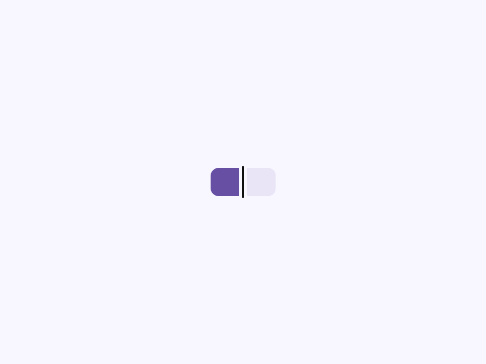
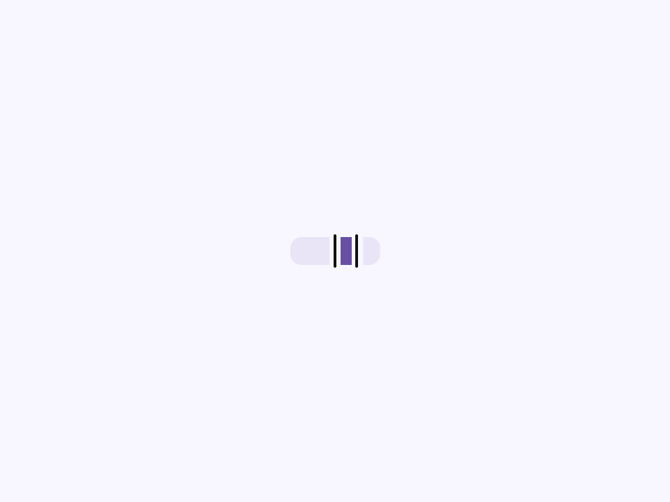
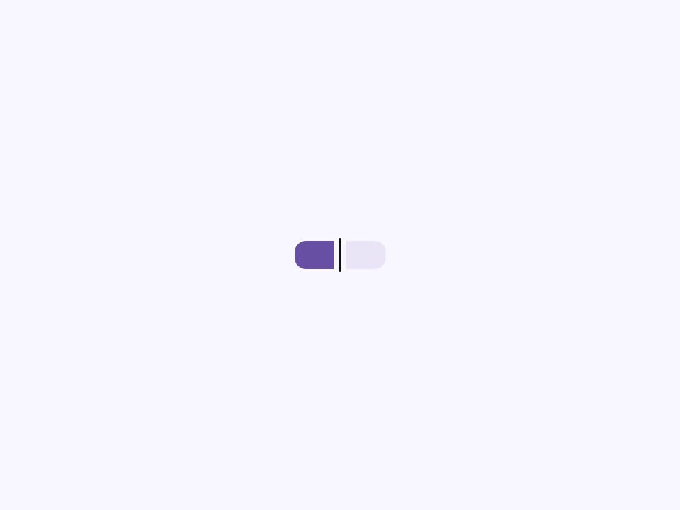
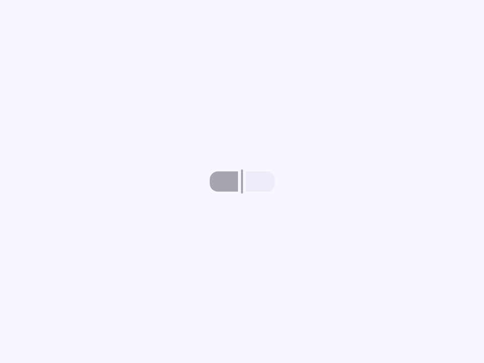
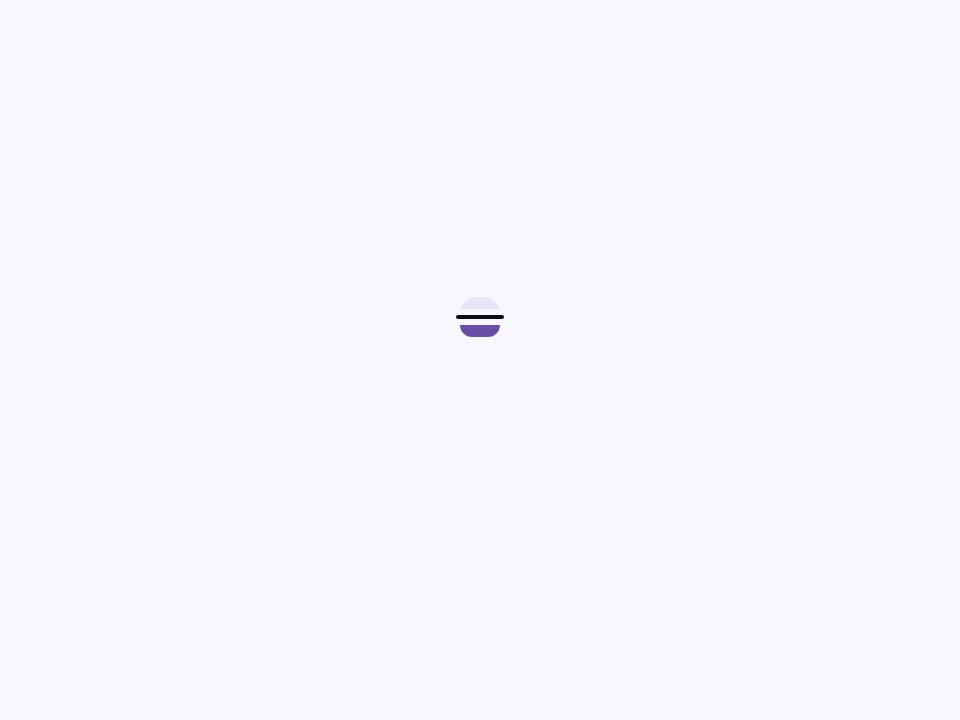

# Slider

Componente Material Design 3 Slider (Control deslizante).

Los sliders permiten a los usuarios seleccionar un solo valor o un rango de valores
desde una escala continua o discreta.

**Referencia a la especificación M3:** `m3-docs/components/sliders/specs.md`

**Modos de Slider:**
- **Continuo (Continuous)** (por defecto) — Arrastre suave entre `min` y `max`. Úsalo cuando
  no sea necesario que el usuario defina un valor exacto (ej. volumen).
- **Discreto (Discrete)** — Configura `step` para ajustarse a intervalos discretos. Las marcas
  (tick marks) aparecen a través del elemento nativo `<datalist>` en Chrome/Edge. Firefox no
  renderiza marcas de datalist para inputs de tipo rango.
- **Rango (Range)** (atributo `range`) — Dos controles (thumbs) que definen un valor mínimo y
  máximo dentro de la extensión del slider.
- **Vertical** (atributo `vertical`) — Slider rotado 90°.

**Tooltip indicador de valor (Value label tooltip):**
Cuando se configura `indicator`, el valor actual se muestra en un tooltip por encima
(o por debajo, a través de `indicator-placement`) del control activo durante el foco/arrastre.

**Marcas (Tick marks):**
- Atributo `ticks`: agrega datalist con marcas solo en `min` y `max`.
- Atributo `tick-interval`: genera opciones de datalist cada N unidades
  entre `min` y `max`, creando marcas visibles en esas posiciones.

**Manejo del estado interno:**
Usa `@state()` para `_value` y `_valueHigh` de modo que el ancho de la pista de llenado y
la posición del tooltip se actualicen de forma reactiva en cada evento `input` de arrastre sin
esperar al evento `change`.

- Tag: `moni-slider`
- Clase: `MoniSlider`
- Fuente: `src/components/moni-slider.ts`

## Cuándo usarlo

Usa `moni-slider` cuando la interfaz necesite el patrón que describe este componente. Antes de elegirlo, revisa sus estados, contenido permitido y comportamiento accesible; las capturas del final muestran el resultado real de cada variante.

## Uso básico

```html
<!-- Slider continuo -->
<moni-slider name="volume" min="0" max="100" value="60"></moni-slider>

<!-- Slider discreto con marcas cada 10 unidades -->
<moni-slider step="10" tick-interval="10" indicator></moni-slider>

<!-- Slider de rango -->
<moni-slider range min="0" max="100" value="20" value-high="80"></moni-slider>
```

## Ejemplo práctico con Tailwind CSS v4

Tailwind controla composición, ancho, espaciado y responsividad alrededor del Web Component. Moni UI conserva el aspecto interno mediante Shadow DOM y design tokens.

```html
<div class="mx-auto flex w-full max-w-md flex-col gap-4 p-6">
  <moni-slider></moni-slider>
</div>
```

No necesitas un plugin de Tailwind. En tu CSS v4 importa ambas capas una sola vez:

```css
@import "tailwindcss";
@import "@moni-labs/moni-ui/styles";

@theme {
  --font-sans: Inter, ui-sans-serif, system-ui, sans-serif;
}
```

Las utilities aplicadas directamente al tag afectan su caja anfitriona. No uses selectores Tailwind para asumir acceso al DOM interno; personaliza únicamente con los CSS Parts y Custom Properties públicos enumerados más abajo.

## Recomendaciones

- Usa `moni-slider` para su propósito semántico; no lo sustituyas por un `div` estilizado.
- Aplica Tailwind al layout exterior. Para el interior del Shadow DOM usa las variables CSS y `::part()` documentados.
- Durante una operación asíncrona combina el estado `loading` —si existe— con `disabled` para evitar envíos duplicados.
- Prueba los estados claro, oscuro, foco por teclado, deshabilitado y viewport móvil antes de publicar.

## Propiedades y atributos

| Atributo | Propiedad | Tipo | Default | Descripción |
|---|---|---|---|---|
| `name` | `name` | `string` | `''` | Nombre del input del slider, usado en el envío de formularios. |
| `min` | `min` | `string` | `'0'` | Valor mínimo del slider. |
| `max` | `max` | `string` | `'100'` | Valor máximo del slider. |
| `step` | `step` | `string` | `''` | Granularidad del slider. Debe ser un número positivo. |
| `tick-interval` | `tickInterval` | `number \| null` | `null` | Anula (overrides) el intervalo predeterminado de las marcas cuando `ticks` es verdadero. |
| `inset-icon` | `insetIcon` | `string` | `''` | Nombre del icono (Material Symbols) mostrado dentro del control (thumb) del slider. |
| `indicator-placement` | `indicatorPlacement` | `'top' \| 'bottom'` | `'top'` | Ubicación del tooltip indicador de valor. |
| `size` | `size` | `'tiny' \| 'small' \| 'medium' \| 'large' \| 'extra'` | `'medium'` | Grosor/tamaño de la pista y el control (thumb) del slider. |
| `range` | `range` | `boolean` | `false` | Habilita el modo de rango (dos controles: `value` y `valueEnd`). |
| `disabled` | `disabled` | `boolean` | `false` | Deshabilita el slider. |
| `ticks` | `ticks` | `boolean` | `false` | Renderiza marcas (tick marks) a lo largo de la pista en cada intervalo de paso. |
| `indicator` | `indicator` | `boolean` | `false` | Muestra un indicador de tooltip mostrando el(los) valor(es) actual(es) mientras se arrastra. |
| `vertical` | `isVertical` | `boolean` | `false` | Renderiza el slider de forma vertical en lugar de horizontal. |

## Slots

Este componente no declara slots públicos.

## Eventos

No declara eventos propios.

## Métodos públicos

No expone métodos públicos adicionales.

## CSS Parts

- `slider`: El contenedor exterior del slider.
- `track`: El fondo de la pista.
- `fill`: La porción llena de la pista.
- `indicator`: El tooltip de la etiqueta de valor.
- `control`: Parte interna personalizable.
- `root`: Parte interna personalizable.

## CSS Custom Properties consumidas

- `--_end`
- `--_indicator-gap`
- `--_start`
- `--_thumb`
- `--_track`
- `--active`
- `--font`
- `--inverse-on-surface`
- `--inverse-primary`
- `--inverse-surface`
- `--moni-slider-height`
- `--outline`
- `--primary`

## Referencia visual por variable

Cada imagen se genera con el componente real: cambia solo la variable indicada y mantiene estable el resto del escenario. Úsala para comparar estados, no como sustituto de la API.

### `name`

Nombre del input del slider, usado en el envío de formularios.


### `min`

Valor mínimo del slider.


### `max`

Valor máximo del slider.


### `step`

Granularidad del slider. Debe ser un número positivo.


### `tick-interval`

Anula (overrides) el intervalo predeterminado de las marcas cuando `ticks` es verdadero.


### `inset-icon`

Nombre del icono (Material Symbols) mostrado dentro del control (thumb) del slider.


### `indicator-placement`

Ubicación del tooltip indicador de valor.


### `size`

Grosor/tamaño de la pista y el control (thumb) del slider.





### `range`

Habilita el modo de rango (dos controles: `value` y `valueEnd`).




### `disabled`

Deshabilita el slider.





### `ticks`

Renderiza marcas (tick marks) a lo largo de la pista en cada intervalo de paso.


### `indicator`

Muestra un indicador de tooltip mostrando el(los) valor(es) actual(es) mientras se arrastra.


### `vertical`

Renderiza el slider de forma vertical en lugar de horizontal.



