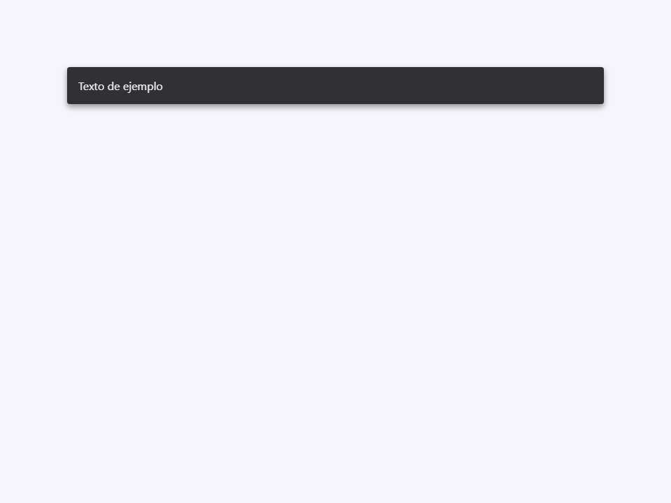
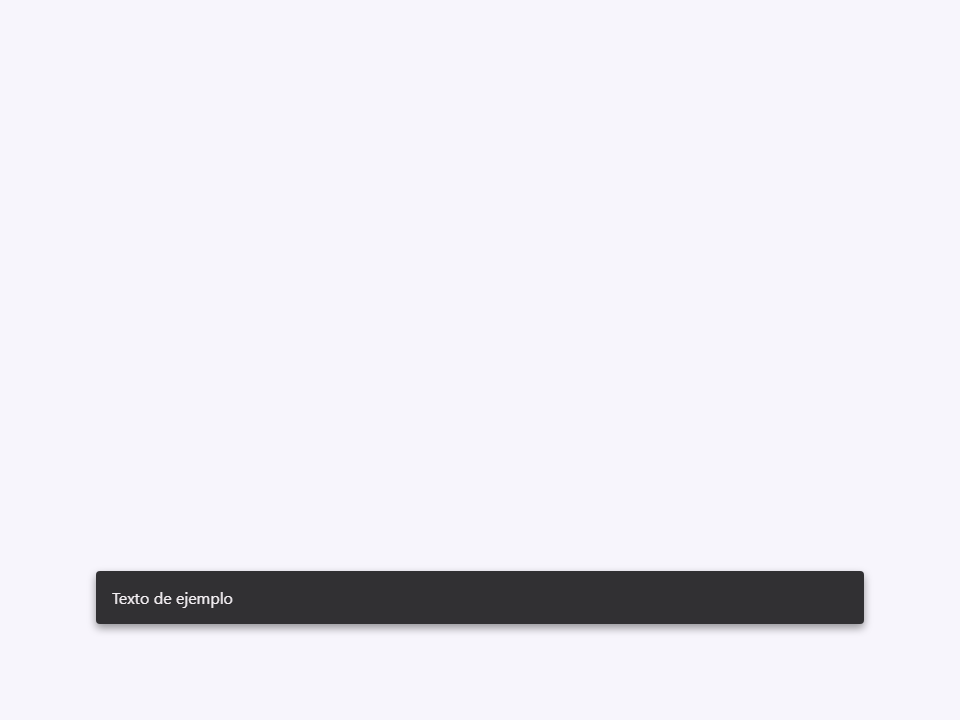

# Snackbar

Componente Material Design 3 Snackbar (Barra de notificaciones).

Los snackbars proporcionan mensajes breves sobre los procesos de la aplicación en la parte
inferior de la pantalla. Desaparecen automáticamente y no requieren acción del usuario,
pero pueden contener una única acción opcional.

**Referencia a la especificación M3:** `m3-docs/components/snackbar/specs.md`

**Modelo de posicionamiento:**
El snackbar utiliza `position: fixed` para que se renderice en la ventana gráfica (viewport)
independientemente del elemento en el que esté ubicado en el DOM. El elemento host
se muestra como `block` en lugar de `contents` para asegurar que `position: fixed`
dentro del shadow root se ancle a la ventana gráfica (no a un contexto de apilamiento
creado por un ancestro transformado).

**Mecanismo de mostrar/ocultar:**
La visibilidad es controlada por `:host([active]) .snackbar` a través de CSS
`opacity`, `visibility`, y `transform`. Esto imita el patrón `.snackbar.active`
de BeerCSS y permite animaciones de transición CSS.

**Truncamiento de texto M3:**
El texto del mensaje se limita a `maxLines` líneas con `-webkit-line-clamp`.
La especificación M3 requiere un máximo de 2 líneas; los consumidores pueden
anular esto a través del atributo `max-lines`.

- Tag: `moni-snackbar`
- Clase: `MoniSnackbar`
- Fuente: `src/components/moni-snackbar.ts`

## Cuándo usarlo

Usa `moni-snackbar` cuando la interfaz necesite el patrón que describe este componente. Antes de elegirlo, revisa sus estados, contenido permitido y comportamiento accesible; las capturas del final muestran el resultado real de cada variante.

## Uso básico

```ts
const snackbar = document.querySelector('moni-snackbar') as MoniSnackbar;

// Mostrar por 3 segundos
snackbar.text = 'Elemento eliminado';
snackbar.action = 'Deshacer';
snackbar.active = true;
setTimeout(() => { snackbar.active = false; }, 3000);
```

## Ejemplo práctico con Tailwind CSS v4

Tailwind controla composición, ancho, espaciado y responsividad alrededor del Web Component. Moni UI conserva el aspecto interno mediante Shadow DOM y design tokens.

```html
<div class="mx-auto flex w-full max-w-md flex-col gap-4 p-6">
  <moni-snackbar></moni-snackbar>
</div>
```

No necesitas un plugin de Tailwind. En tu CSS v4 importa ambas capas una sola vez:

```css
@import "tailwindcss";
@import "@moni-labs/moni-ui/styles";

@theme {
  --font-sans: Inter, ui-sans-serif, system-ui, sans-serif;
}
```

Las utilities aplicadas directamente al tag afectan su caja anfitriona. No uses selectores Tailwind para asumir acceso al DOM interno; personaliza únicamente con los CSS Parts y Custom Properties públicos enumerados más abajo.

## Recomendaciones

- Usa `moni-snackbar` para su propósito semántico; no lo sustituyas por un `div` estilizado.
- Aplica Tailwind al layout exterior. Para el interior del Shadow DOM usa las variables CSS y `::part()` documentados.
- Mantén el estado de apertura en una única fuente de verdad y devuelve el foco al disparador al cerrar.
- Prueba los estados claro, oscuro, foco por teclado, deshabilitado y viewport móvil antes de publicar.

## Propiedades y atributos

| Atributo | Propiedad | Tipo | Default | Descripción |
|---|---|---|---|---|
| `text` | `text` | `string` | `''` | El texto del mensaje principal mostrado en el snackbar.  Limitado a `maxLines` líneas. Los mensajes largos se truncan con `…`. Según la especificación M3, mantenga los mensajes cortos e informativos (menos de 60 caracteres). |
| `action` | `action` | `string` | `''` | Etiqueta para el botón de acción opcional.  Cuando no está vacía, renderiza un botón de texto en el borde posterior (trailing) del snackbar. El componente despacha un evento `'action'` cuando se hace clic en la acción. Esta es una etiqueta puramente visual — el consumidor maneja la lógica de la acción. |
| `placement` | `placement` | `'bottom' \| 'top'` | `'bottom'` | Ubicación vertical del snackbar en la pantalla.  - `'bottom'` (por defecto) — Fijo a 6rem desde la parte inferior, centrado horizontalmente. - `'top'` — Fijo a 6rem desde la parte superior, centrado horizontalmente. |
| `active` | `active` | `boolean` | `false` | Cuando es `true`, el snackbar es visible.  Alterne este atributo para mostrar/ocultar el snackbar. La transición CSS maneja la animación de desvanecimiento/deslizamiento hacia arriba (fade-in/slide-up) automáticamente. Los consumidores son responsables de implementar el temporizador de cierre automático. |
| `max-lines` | `maxLines` | `number` | `2` | Número máximo de líneas del texto del mensaje antes de que sea limitado (clamped).  Utiliza `-webkit-line-clamp` con `display: -webkit-box` para truncamiento multilínea compatible en varios navegadores. La especificación M3 recomienda un máximo de 2 líneas. |

## Slots

- `default`: Contenido adicional colocado dentro del contenedor del snackbar.

## Eventos

- `action`: evento compuesto y burbujeante emitido por el componente.

## Métodos públicos

No expone métodos públicos adicionales.

## CSS Parts

- `snackbar`: Parte interna personalizable.
- `text`: Parte interna personalizable.
- `action`: Parte interna personalizable.

## CSS Custom Properties consumidas

- `--_max-lines`
- `--elevate2`
- `--font`
- `--inverse-on-surface`
- `--inverse-primary`
- `--inverse-surface`
- `--speed2`

## Referencia visual por variable

Cada imagen se genera con el componente real: cambia solo la variable indicada y mantiene estable el resto del escenario. Úsala para comparar estados, no como sustituto de la API.

### `text`

El texto del mensaje principal mostrado en el snackbar.

Limitado a `maxLines` líneas. Los mensajes largos se truncan con `…`.
Según la especificación M3, mantenga los mensajes cortos e informativos (menos de 60 caracteres).


### `action`

Etiqueta para el botón de acción opcional.

Cuando no está vacía, renderiza un botón de texto en el borde posterior (trailing) del snackbar.
El componente despacha un evento `'action'` cuando se hace clic en la acción.
Esta es una etiqueta puramente visual — el consumidor maneja la lógica de la acción.


### `placement`

Ubicación vertical del snackbar en la pantalla.

- `'bottom'` (por defecto) — Fijo a 6rem desde la parte inferior, centrado horizontalmente.
- `'top'` — Fijo a 6rem desde la parte superior, centrado horizontalmente.




### `active`

Cuando es `true`, el snackbar es visible.

Alterne este atributo para mostrar/ocultar el snackbar. La transición CSS
maneja la animación de desvanecimiento/deslizamiento hacia arriba (fade-in/slide-up) automáticamente.
Los consumidores son responsables de implementar el temporizador de cierre automático.



### `max-lines`

Número máximo de líneas del texto del mensaje antes de que sea limitado (clamped).

Utiliza `-webkit-line-clamp` con `display: -webkit-box` para truncamiento multilínea
compatible en varios navegadores. La especificación M3 recomienda un máximo de 2 líneas.


