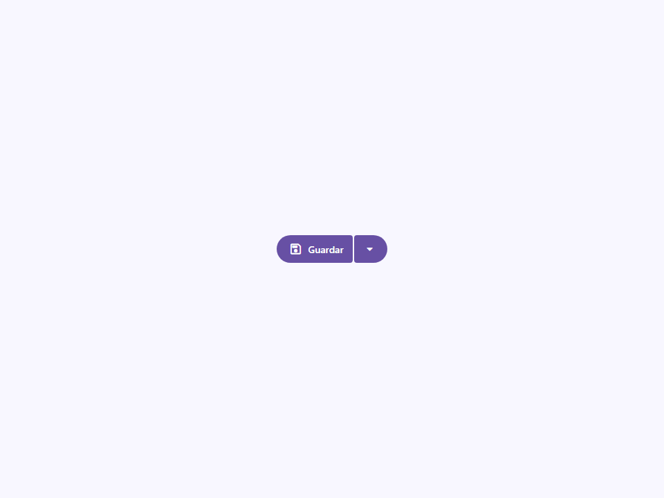
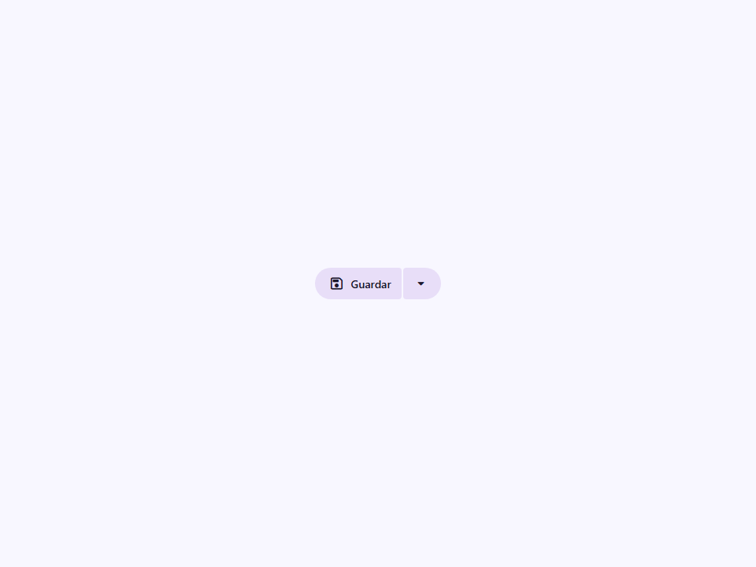
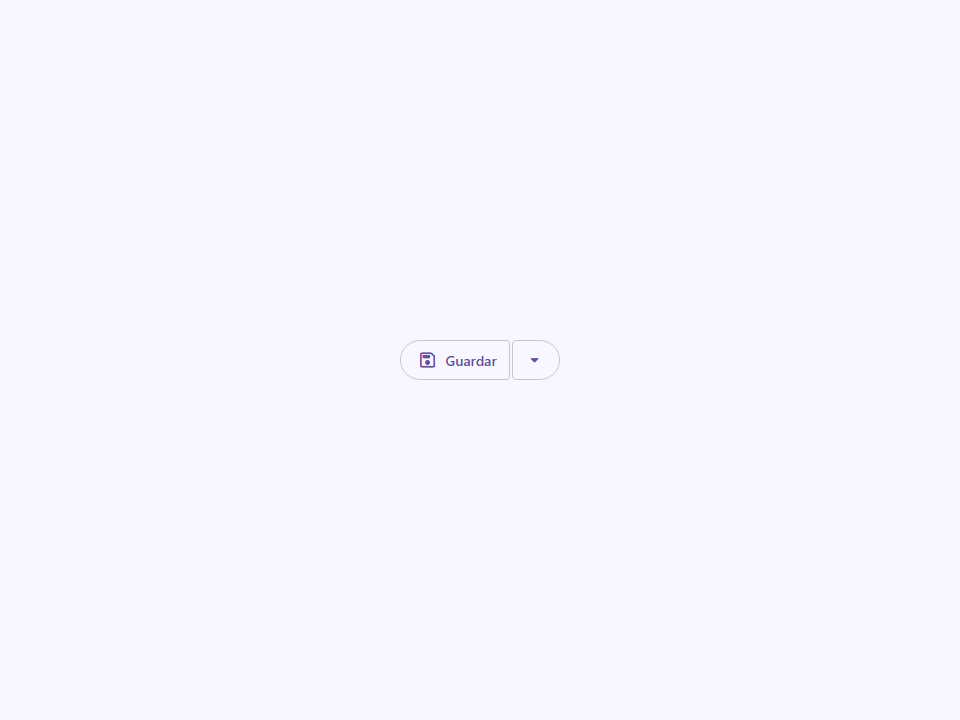
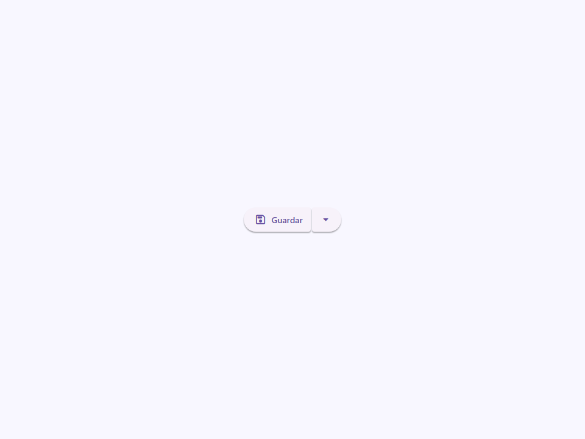
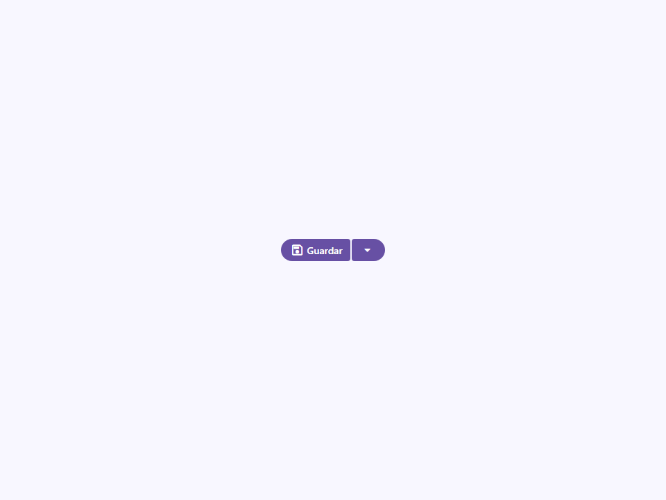
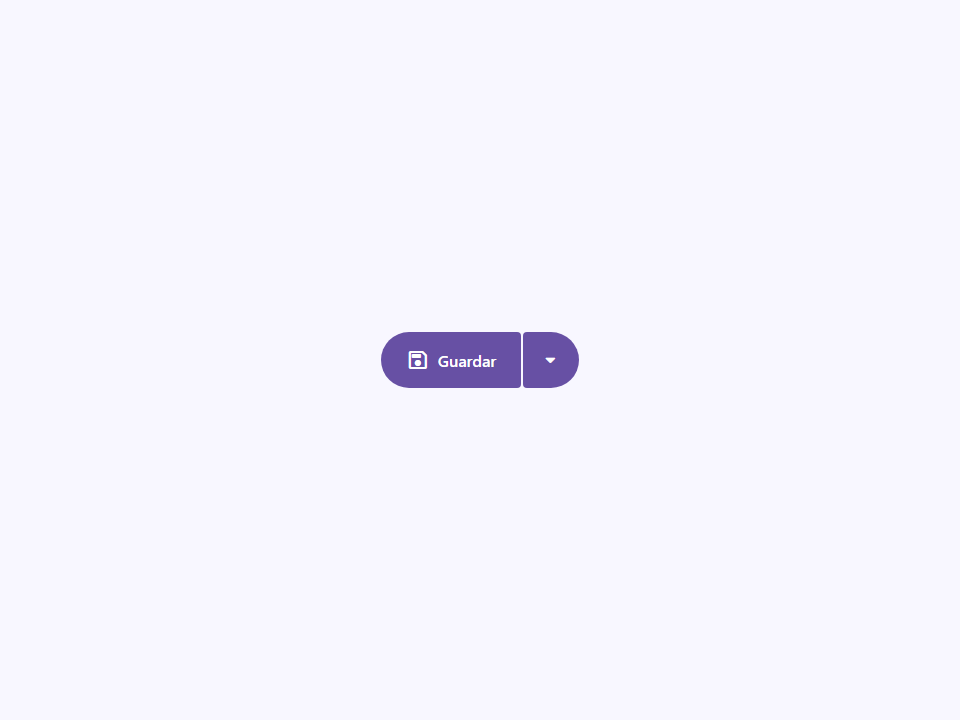
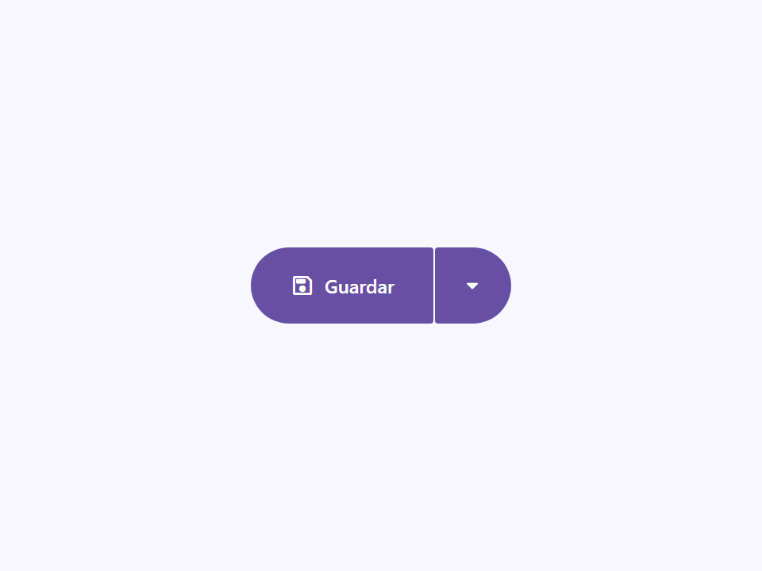
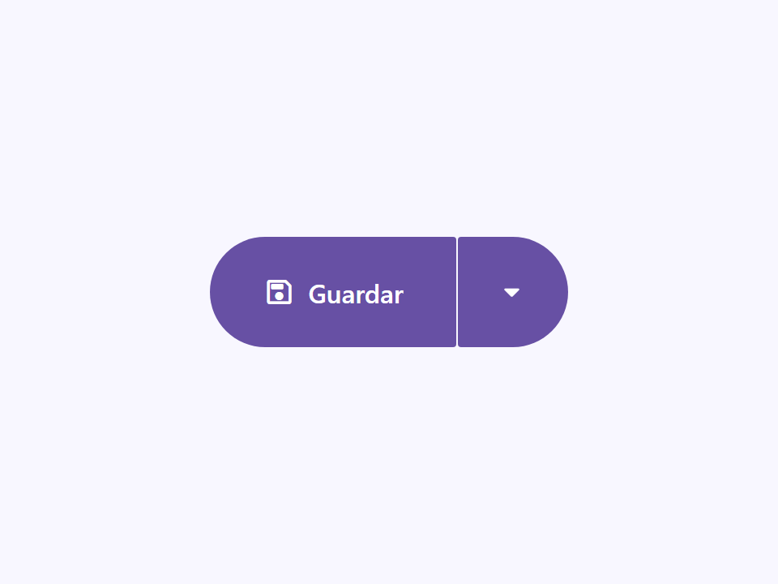

# Split Button

Componente Material Design 3 Split Button (Botón dividido).

Un botón dividido combina un botón de acción principal con un botón secundario desplegable.
Los dos botones se asientan a ras uno del otro, típicamente compartiendo
un color de fondo y elevación, pero separados por un borde distinto.

**Arquitectura visual:**
El componente actúa como un contenedor de diseño (`display: inline-flex`) que
agrupa dos botones estándar. Anula (overrides) los márgenes del botón posterior (trailing)
para crear el aspecto "conectado" (similar a los grupos de botones conectados).

**Uso:**
Los consumidores deben proporcionar exactamente dos botones a través de los slots con nombre:
- `slot="leading-button"` — La acción principal (usualmente texto o texto+icono).
- `slot="trailing-button"` — La acción secundaria (usualmente solo un icono desplegable).

Ambos botones deben ser elementos `<moni-button>` o `<moni-icon-button>` estándar
configurados con variantes coincidentes para una apariencia cohesiva.

- Tag: `moni-split-button`
- Clase: `MoniSplitButton`
- Fuente: `src/components/moni-split-button.ts`

## Cuándo usarlo

Usa `moni-split-button` cuando la interfaz necesite el patrón que describe este componente. Antes de elegirlo, revisa sus estados, contenido permitido y comportamiento accesible; las capturas del final muestran el resultado real de cada variante.

## Uso básico

```html
<moni-split-button variant="filled">
  <moni-button slot="leading-button" icon="send">Enviar</moni-button>
  <moni-button slot="trailing-button" icon="arrow_drop_down" id="schedule-trigger"></moni-button>
</moni-split-button>

<moni-menu id="schedule-menu" placement="bottom">
  <moni-menu-item>Programar envío...</moni-menu-item>
</moni-menu>
```

## Ejemplo práctico con Tailwind CSS v4

Tailwind controla composición, ancho, espaciado y responsividad alrededor del Web Component. Moni UI conserva el aspecto interno mediante Shadow DOM y design tokens.

```html
<div class="mx-auto flex w-full max-w-md flex-col gap-4 p-6">
  <moni-split-button></moni-split-button>
</div>
```

No necesitas un plugin de Tailwind. En tu CSS v4 importa ambas capas una sola vez:

```css
@import "tailwindcss";
@import "@moni-labs/moni-ui/styles";

@theme {
  --font-sans: Inter, ui-sans-serif, system-ui, sans-serif;
}
```

Las utilities aplicadas directamente al tag afectan su caja anfitriona. No uses selectores Tailwind para asumir acceso al DOM interno; personaliza únicamente con los CSS Parts y Custom Properties públicos enumerados más abajo.

## Recomendaciones

- Usa `moni-split-button` para su propósito semántico; no lo sustituyas por un `div` estilizado.
- Aplica Tailwind al layout exterior. Para el interior del Shadow DOM usa las variables CSS y `::part()` documentados.
- Prueba los estados claro, oscuro, foco por teclado, deshabilitado y viewport móvil antes de publicar.

## Propiedades y atributos

| Atributo | Propiedad | Tipo | Default | Descripción |
|---|---|---|---|---|
| `variant` | `variant` | `'filled' \| 'tonal' \| 'outlined' \| 'elevated'` | `'filled'` | Variante visual del contenedor del botón dividido. Pasa las sugerencias de estilo apropiadas a sus hijos. |
| `size` | `size` | `'xsmall' \| 'small' \| 'medium' \| 'large' \| 'xlarge' \| 'extra'` | `'small'` | Tamaño global aplicado a ambos botones en los slots. |
| `gap` | `gap` | `string` | `''` | El espacio (gap) CSS entre los botones líder y posterior. Normalmente 1px o 0 según la especificación M3. |

## Slots

- `leading-button`: El botón de acción principal a la izquierda.
- `trailing-button`: La acción secundaria (disparador desplegable) a la derecha.

## Eventos

No declara eventos propios.

## Métodos públicos

No expone métodos públicos adicionales.

## CSS Parts

- `wrapper`: Parte interna personalizable.

## CSS Custom Properties consumidas

- `--_split-button-gap`
- `--_split-content-gap`
- `--_split-height`
- `--_split-inner-radius`
- `--_split-label-size`
- `--_split-leading-end`
- `--_split-leading-icon`
- `--_split-leading-start`
- `--_split-trailing-icon`
- `--_split-trailing-width`

## Referencia visual por variable

Cada imagen se genera con el componente real: cambia solo la variable indicada y mantiene estable el resto del escenario. Úsala para comparar estados, no como sustituto de la API.

### `variant`

Variante visual del contenedor del botón dividido.
Pasa las sugerencias de estilo apropiadas a sus hijos.









### `size`

Tamaño global aplicado a ambos botones en los slots.











### `gap`

El espacio (gap) CSS entre los botones líder y posterior.
Normalmente 1px o 0 según la especificación M3.


