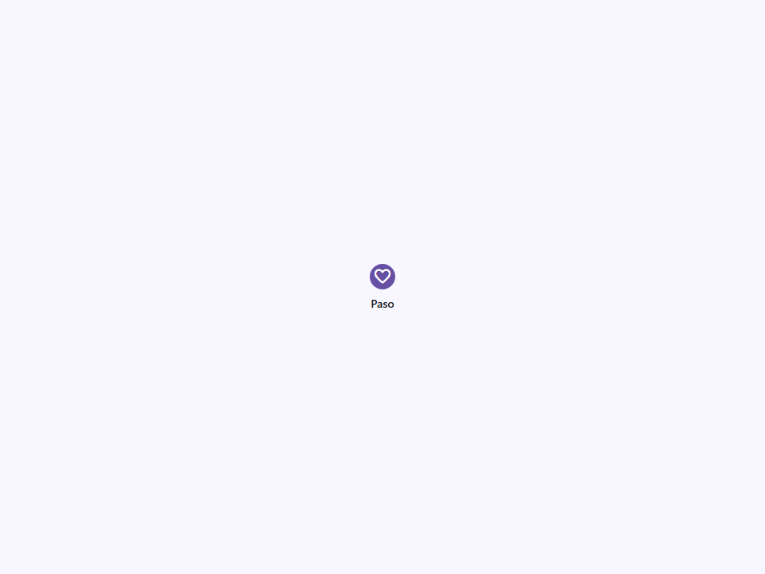
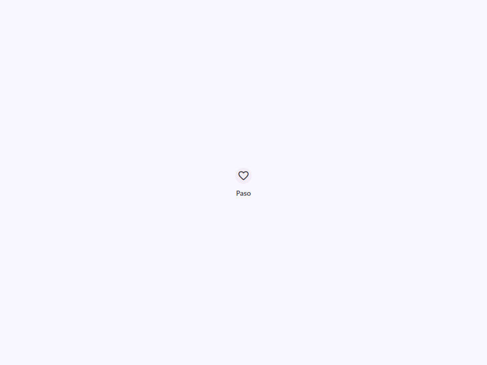
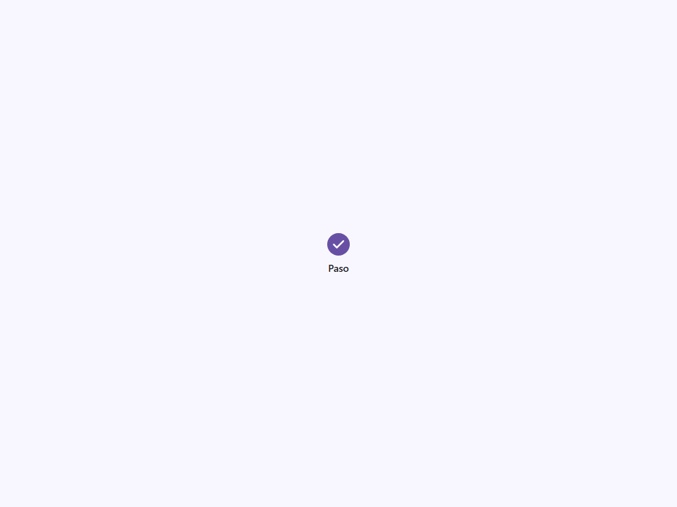
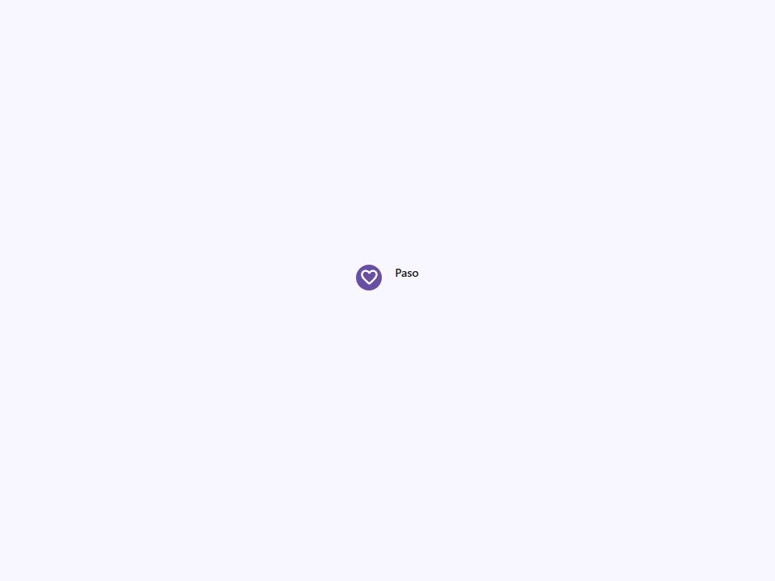

# Step

Componente Material Design 3 Step (Paso).

Un paso individual dentro de un `<moni-stepper>`. Los pasos muestran el progreso a través
de una secuencia de operaciones lógicas y numeradas.

**Referencia a la especificación M3:** `m3-docs/components/progress-indicators/specs.md` (Patrón Stepper)

**Anatomía y aspecto visual:**
Un paso renderiza un indicador circular que contiene ya sea su número de secuencia
(inyectado automáticamente por el stepper padre) o un icono personalizado. Debajo o
al lado del indicador (dependiendo de la `orientation` del padre), renderiza
el `title` (título) y un `description` (descripción) opcional.

**Gestión del estado:**
El `<moni-stepper>` padre calcula e inyecta automáticamente las propiedades `index`,
`active` y `completed` basándose en su estado actual.
- **Activo (Active):** Resaltado con el color primario, indicando el paso actual.
- **Completado (Completed):** Se muestra con un fondo primario sólido y un icono de
  marca de verificación (el estado `completed` anula el índice numérico).

- Tag: `moni-step`
- Clase: `MoniStep`
- Fuente: `src/components/moni-step.ts`

## Cuándo usarlo

Usa `moni-step` cuando la interfaz necesite el patrón que describe este componente. Antes de elegirlo, revisa sus estados, contenido permitido y comportamiento accesible; las capturas del final muestran el resultado real de cada variante.

## Uso básico

```html
<!-- Típicamente usado dentro de un stepper -->
<moni-stepper current="1">
  <moni-step title="Envío" description="Ingresar dirección"></moni-step>
  <moni-step title="Pago" description="Detalles de tarjeta de crédito"></moni-step>
  <moni-step title="Revisión" description="Confirmar pedido"></moni-step>
</moni-stepper>

<!-- Anulando el icono -->
<moni-step title="Hecho" icon="celebration"></moni-step>
```

## Ejemplo práctico con Tailwind CSS v4

Tailwind controla composición, ancho, espaciado y responsividad alrededor del Web Component. Moni UI conserva el aspecto interno mediante Shadow DOM y design tokens.

```html
<div class="mx-auto flex w-full max-w-md flex-col gap-4 p-6">
  <moni-step></moni-step>
</div>
```

No necesitas un plugin de Tailwind. En tu CSS v4 importa ambas capas una sola vez:

```css
@import "tailwindcss";
@import "@moni-labs/moni-ui/styles";

@theme {
  --font-sans: Inter, ui-sans-serif, system-ui, sans-serif;
}
```

Las utilities aplicadas directamente al tag afectan su caja anfitriona. No uses selectores Tailwind para asumir acceso al DOM interno; personaliza únicamente con los CSS Parts y Custom Properties públicos enumerados más abajo.

## Recomendaciones

- Usa `moni-step` para su propósito semántico; no lo sustituyas por un `div` estilizado.
- Aplica Tailwind al layout exterior. Para el interior del Shadow DOM usa las variables CSS y `::part()` documentados.
- Cuando el control muestre únicamente un icono, añade siempre un `aria-label` descriptivo.
- Mantén el estado de apertura en una única fuente de verdad y devuelve el foco al disparador al cerrar.
- Prueba los estados claro, oscuro, foco por teclado, deshabilitado y viewport móvil antes de publicar.

## Propiedades y atributos

| Atributo | Propiedad | Tipo | Default | Descripción |
|---|---|---|---|---|
| `title` | `title` | `string` | `''` | Define `title`. Conserva el tipo indicado y usa la propiedad JavaScript cuando el valor no sea una cadena. |
| `description` | `description` | `string` | `''` | Define `description`. Conserva el tipo indicado y usa la propiedad JavaScript cuando el valor no sea una cadena. |
| `active` | `active` | `boolean` | `false` | Indica si el elemento está activo. |
| `completed` | `completed` | `boolean` | `false` | Activa o desactiva el comportamiento `completed`. En HTML, la presencia del atributo significa `true`; omítelo para `false`. |
| `icon` | `icon` | `string` | `''` | Nombre de Material Symbol mostrado por el componente. |
| `index` | `index` | `number` | `0` | Define `index`. Conserva el tipo indicado y usa la propiedad JavaScript cuando el valor no sea una cadena. |
| `orientation` | `orientation` | `'horizontal' \| 'vertical'` | `'horizontal'` | Selecciona el valor de `orientation` entre las opciones documentadas. |

## Slots

Este componente no declara slots públicos.

## Eventos

No declara eventos propios.

## Métodos públicos

No expone métodos públicos adicionales.

## CSS Parts

- `step-indicator`: La insignia circular que contiene el número/icono.
- `title`: Parte interna personalizable.
- `description`: Parte interna personalizable.
- `dot`: Parte interna personalizable.
- `text`: Parte interna personalizable.

## CSS Custom Properties consumidas

- `--_stepper-gap`
- `--font`
- `--on-primary`
- `--on-surface`
- `--on-surface-variant`
- `--outline-variant`
- `--primary`
- `--surface-container`

## Referencia visual por variable

Cada imagen se genera con el componente real: cambia solo la variable indicada y mantiene estable el resto del escenario. Úsala para comparar estados, no como sustituto de la API.

### `title`

Define `title`. Conserva el tipo indicado y usa la propiedad JavaScript cuando el valor no sea una cadena.


### `description`

Define `description`. Conserva el tipo indicado y usa la propiedad JavaScript cuando el valor no sea una cadena.



### `active`

Indica si el elemento está activo.




### `completed`

Activa o desactiva el comportamiento `completed`. En HTML, la presencia del atributo significa `true`; omítelo para `false`.




### `icon`

Nombre de Material Symbol mostrado por el componente.


### `index`

Define `index`. Conserva el tipo indicado y usa la propiedad JavaScript cuando el valor no sea una cadena.


### `orientation`

Selecciona el valor de `orientation` entre las opciones documentadas.



