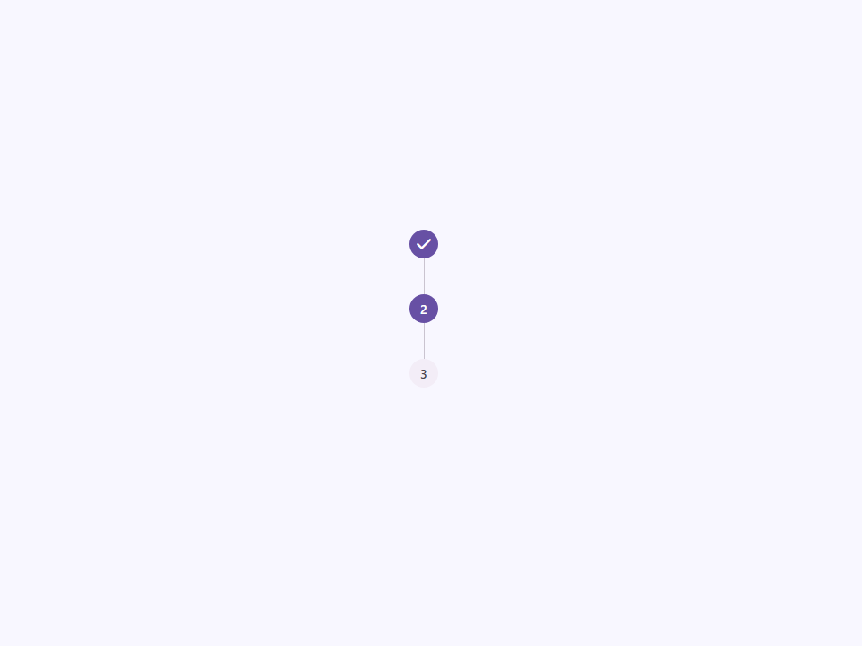
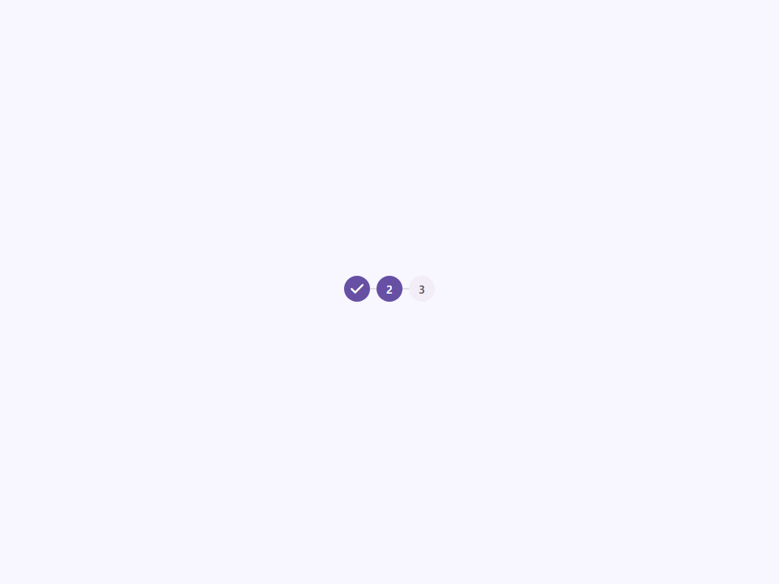

# Stepper

Componente Material Design 3 Stepper (Pasos/Progresión).

Un contenedor para una progresión lineal de elementos `<moni-step>`. Los steppers
transmiten el progreso a través de pasos numerados e indican la posición
actual del usuario dentro de un flujo.

**Referencia a la especificación M3:** `m3-docs/components/progress-indicators/specs.md`

**Orquestación:**
Este componente actúa como orquestador para sus hijos `<moni-step>` en los slots.
Cada vez que cambia la propiedad `current` o se añaden/eliminan hijos, el
stepper itera sobre todos los pasos hijos e inyecta su estado:
- Asigna el `index` secuencial (basado en 0) a cada paso.
- Establece `active=true` en el paso que coincide con el índice `current`.
- Establece `completed=true` en todos los pasos anteriores al índice `current`.

**Diseño visual:**
El stepper maneja el diseño (flex row o column basado en `orientation`)
y asegura que las líneas conectoras entre los pasos se rendericen correctamente a través de
pseudo-elementos CSS definidos en los estilos del `<moni-step>` hijo.

- Tag: `moni-stepper`
- Clase: `MoniStepper`
- Fuente: `src/components/moni-stepper.ts`

## Cuándo usarlo

Usa `moni-stepper` cuando la interfaz necesite el patrón que describe este componente. Antes de elegirlo, revisa sus estados, contenido permitido y comportamiento accesible; las capturas del final muestran el resultado real de cada variante.

## Uso básico

```html
<moni-stepper current="1" orientation="horizontal">
  <moni-step title="Paso 1"></moni-step>
  <moni-step title="Paso 2"></moni-step>
  <moni-step title="Paso 3"></moni-step>
</moni-stepper>

<script>
  const stepper = document.querySelector('moni-stepper');
  // Mover al siguiente paso
  stepper.current = 2;
</script>
```

## Ejemplo práctico con Tailwind CSS v4

Tailwind controla composición, ancho, espaciado y responsividad alrededor del Web Component. Moni UI conserva el aspecto interno mediante Shadow DOM y design tokens.

```html
<div class="mx-auto flex w-full max-w-md flex-col gap-4 p-6">
  <moni-stepper></moni-stepper>
</div>
```

No necesitas un plugin de Tailwind. En tu CSS v4 importa ambas capas una sola vez:

```css
@import "tailwindcss";
@import "@moni-labs/moni-ui/styles";

@theme {
  --font-sans: Inter, ui-sans-serif, system-ui, sans-serif;
}
```

Las utilities aplicadas directamente al tag afectan su caja anfitriona. No uses selectores Tailwind para asumir acceso al DOM interno; personaliza únicamente con los CSS Parts y Custom Properties públicos enumerados más abajo.

## Recomendaciones

- Usa `moni-stepper` para su propósito semántico; no lo sustituyas por un `div` estilizado.
- Aplica Tailwind al layout exterior. Para el interior del Shadow DOM usa las variables CSS y `::part()` documentados.
- Prueba los estados claro, oscuro, foco por teclado, deshabilitado y viewport móvil antes de publicar.

## Propiedades y atributos

| Atributo | Propiedad | Tipo | Default | Descripción |
|---|---|---|---|---|
| `orientation` | `orientation` | `'horizontal' \| 'vertical'` | `'horizontal'` | Selecciona el valor de `orientation` entre las opciones documentadas. |
| `current` | `current` | `number` | `0` | Define `current`. Conserva el tipo indicado y usa la propiedad JavaScript cuando el valor no sea una cadena. |

## Slots

- `default`: Elementos `<moni-step>`.

## Eventos

No declara eventos propios.

## Métodos públicos

No expone métodos públicos adicionales.

## CSS Parts

- `stepper`: Parte interna personalizable.

## CSS Custom Properties consumidas

- `--_stepper-gap`
- `--font`

## Referencia visual por variable

Cada imagen se genera con el componente real: cambia solo la variable indicada y mantiene estable el resto del escenario. Úsala para comparar estados, no como sustituto de la API.

### `orientation`

Selecciona el valor de `orientation` entre las opciones documentadas.




### `current`

Define `current`. Conserva el tipo indicado y usa la propiedad JavaScript cuando el valor no sea una cadena.


