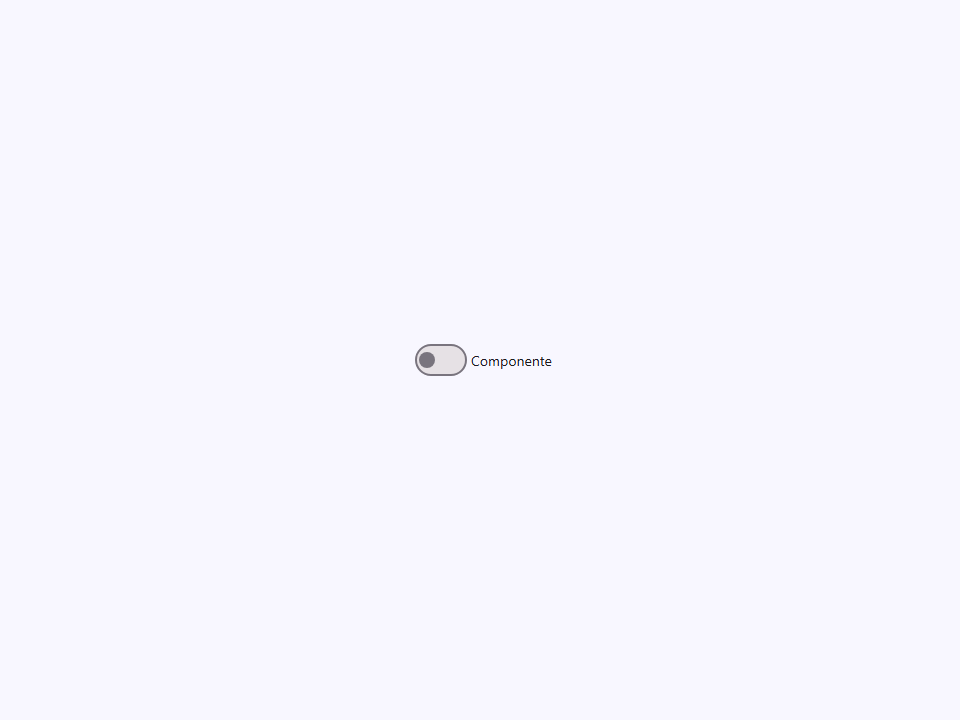
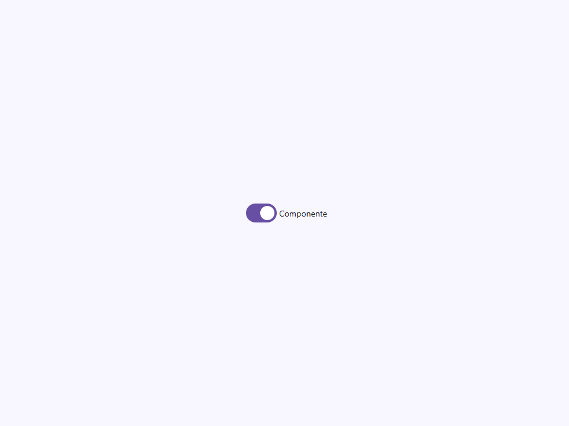
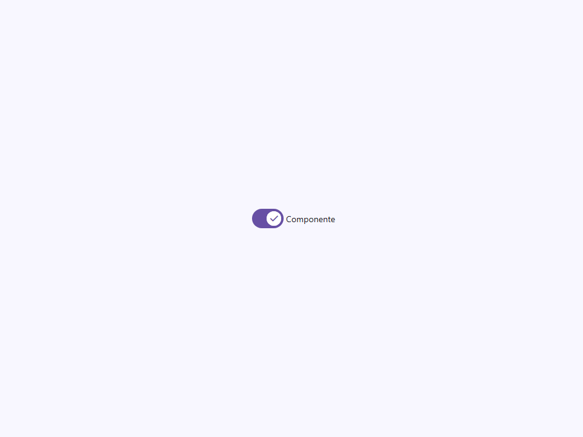

# Switch

Componente Material Design 3 Switch (Interruptor).

Los switches alternan el estado de una configuración individual entre encendido y apagado.
Son el equivalente binario encendido/apagado de una casilla de verificación (checkbox),
pero optimizados para alternar un solo estado en lugar de seleccionar de una lista.

**Referencia a la especificación M3:** `m3-docs/components/switch/specs.md`

**Medidas M3:**
- Pista (Track): 52dp × 32dp, borde de 2dp, forma de píldora con radio completo.
- Control (Thumb): 16dp no seleccionado → 24dp seleccionado → 28dp presionado.
- Capa de estado (State layer): ripple circular de 40dp en estados de hover/focus/pressed.
- Icono (opcional): icono de 16dp renderizado dentro del control (thumb) cuando `icon` está activado.

**Arquitectura visual:**
Al igual que `<moni-checkbox>`, el `<input type="checkbox" role="switch">` nativo
ocupa espacio real en el diseño pero está oculto visualmente mediante `opacity: 0`. Dos
pseudo-elementos de un `<span>` renderizan la pista (`::after`) y el control (`::before`).
Cuando `icon=true`, los elementos `<i>` renderizan los glifos `close` y `check` dentro
del control, y su visibilidad se alterna mediante CSS en base al estado verificado (checked).

- Tag: `moni-switch`
- Clase: `MoniSwitch`
- Fuente: `src/components/moni-switch.ts`

## Cuándo usarlo

Usa `moni-switch` cuando la interfaz necesite el patrón que describe este componente. Antes de elegirlo, revisa sus estados, contenido permitido y comportamiento accesible; las capturas del final muestran el resultado real de cada variante.

## Uso básico

```html
<moni-switch label="Modo oscuro" name="dark-mode"></moni-switch>
<moni-switch icon checked label="Notificaciones"></moni-switch>
<moni-switch unchecked-icon="visibility_off" checked-icon="visibility" label="Visibilidad"></moni-switch>

<script>
  document.querySelector('moni-switch').addEventListener('change', (e) => {
    console.log('activado:', e.target.checked);
  });
</script>
```

## Ejemplo práctico con Tailwind CSS v4

Tailwind controla composición, ancho, espaciado y responsividad alrededor del Web Component. Moni UI conserva el aspecto interno mediante Shadow DOM y design tokens.

```html
<div class="mx-auto flex w-full max-w-md flex-col gap-4 p-6">
  <moni-switch label="Ejemplo"></moni-switch>
</div>
```

No necesitas un plugin de Tailwind. En tu CSS v4 importa ambas capas una sola vez:

```css
@import "tailwindcss";
@import "@moni-labs/moni-ui/styles";

@theme {
  --font-sans: Inter, ui-sans-serif, system-ui, sans-serif;
}
```

Las utilities aplicadas directamente al tag afectan su caja anfitriona. No uses selectores Tailwind para asumir acceso al DOM interno; personaliza únicamente con los CSS Parts y Custom Properties públicos enumerados más abajo.

## Recomendaciones

- Usa `moni-switch` para su propósito semántico; no lo sustituyas por un `div` estilizado.
- Aplica Tailwind al layout exterior. Para el interior del Shadow DOM usa las variables CSS y `::part()` documentados.
- Durante una operación asíncrona combina el estado `loading` —si existe— con `disabled` para evitar envíos duplicados.
- En formularios controlados, sincroniza la propiedad `value` y escucha el evento documentado; no dependas solo del atributo inicial.
- Cuando el control muestre únicamente un icono, añade siempre un `aria-label` descriptivo.
- Prueba los estados claro, oscuro, foco por teclado, deshabilitado y viewport móvil antes de publicar.

## Propiedades y atributos

| Atributo | Propiedad | Tipo | Default | Descripción |
|---|---|---|---|---|
| `label` | `label` | `string` | `''` | Etiqueta de texto mostrada a la derecha del switch.  Cuando no está vacía, se renderiza como un span de texto con padding después de la pista. Cuando está vacía, se renderiza el slot por defecto, permitiendo etiquetas HTML personalizadas. |
| `checked` | `checked` | `boolean` | `false` | Indica si el switch está en el estado "encendido" (marcado/checked).  Cuando es `true`: - La pista se llena con el color `--primary`. - El control (thumb) crece de 16dp a 24dp y se desliza hacia el borde final (trailing). - El color del control cambia a `--on-primary`. |
| `disabled` | `disabled` | `boolean` | `false` | Cuando es `true`, el switch no es interactivo y se renderiza al 50% de opacidad. |
| `icon` | `icon` | `boolean` | `false` | Cuando es `true`, renderiza glifos de iconos dentro del control (thumb).  Utiliza ligaduras de Material Symbols: - Estado desmarcado (Unchecked): icono `close`. - Estado marcado (Checked): icono `check`.  El tamaño del icono (16dp) se establece a través de la propiedad CSS `--_thumb`. |
| `unchecked-icon` | `uncheckedIcon` | `string` | `''` | Material Symbol mostrado dentro del thumb cuando el switch está desactivado. Al definirlo se activa automáticamente el modo de iconos internos. Usa `close` como fallback cuando solo se establece el atributo booleano `icon`. |
| `checked-icon` | `checkedIcon` | `string` | `''` | Material Symbol mostrado dentro del thumb cuando el switch está activado. Al definirlo se activa automáticamente el modo de iconos internos. Usa `check` como fallback cuando solo se establece el atributo booleano `icon`. |
| `name` | `name` | `string` | `''` | Reenviado al atributo nativo `<input name>` para participar en formularios. |
| `value` | `value` | `string` | `''` | Reenviado al atributo nativo `<input value>`. El valor enviado en un formulario cuando este switch está marcado. |

## Slots

Este componente no declara slots públicos.

## Eventos

No declara eventos propios.

## Métodos públicos

No expone métodos públicos adicionales.

## CSS Parts

- `switch`: Parte interna personalizable.
- `label`: Parte interna personalizable.

## CSS Custom Properties consumidas

- `--_thumb`
- `--_track-h`
- `--_track-w`
- `--font`
- `--font-icon`
- `--on-primary`
- `--on-surface`
- `--on-surface-variant`
- `--outline`
- `--primary`
- `--speed2`
- `--surface-container-highest`

## Referencia visual por variable

Cada imagen se genera con el componente real: cambia solo la variable indicada y mantiene estable el resto del escenario. Úsala para comparar estados, no como sustituto de la API.

### `label`

Etiqueta de texto mostrada a la derecha del switch.

Cuando no está vacía, se renderiza como un span de texto con padding después de la pista.
Cuando está vacía, se renderiza el slot por defecto, permitiendo etiquetas HTML personalizadas.


### `checked`

Indica si el switch está en el estado "encendido" (marcado/checked).

Cuando es `true`:
- La pista se llena con el color `--primary`.
- El control (thumb) crece de 16dp a 24dp y se desliza hacia el borde final (trailing).
- El color del control cambia a `--on-primary`.




### `disabled`

Cuando es `true`, el switch no es interactivo y se renderiza al 50% de opacidad.




### `icon`

Cuando es `true`, renderiza glifos de iconos dentro del control (thumb).

Utiliza ligaduras de Material Symbols:
- Estado desmarcado (Unchecked): icono `close`.
- Estado marcado (Checked): icono `check`.

El tamaño del icono (16dp) se establece a través de la propiedad CSS `--_thumb`.




### `unchecked-icon`

Material Symbol mostrado dentro del thumb cuando el switch está desactivado.
Al definirlo se activa automáticamente el modo de iconos internos.
Usa `close` como fallback cuando solo se establece el atributo booleano `icon`.


### `checked-icon`

Material Symbol mostrado dentro del thumb cuando el switch está activado.
Al definirlo se activa automáticamente el modo de iconos internos.
Usa `check` como fallback cuando solo se establece el atributo booleano `icon`.


### `name`

Reenviado al atributo nativo `<input name>` para participar en formularios.


### `value`

Reenviado al atributo nativo `<input value>`.
El valor enviado en un formulario cuando este switch está marcado.


