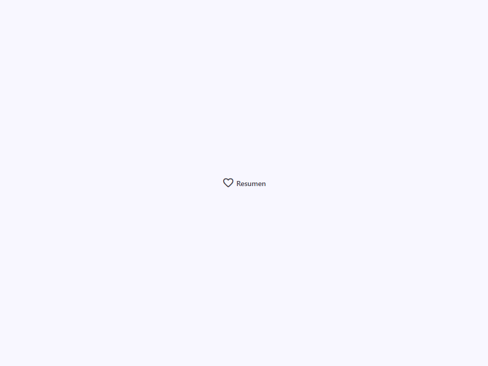
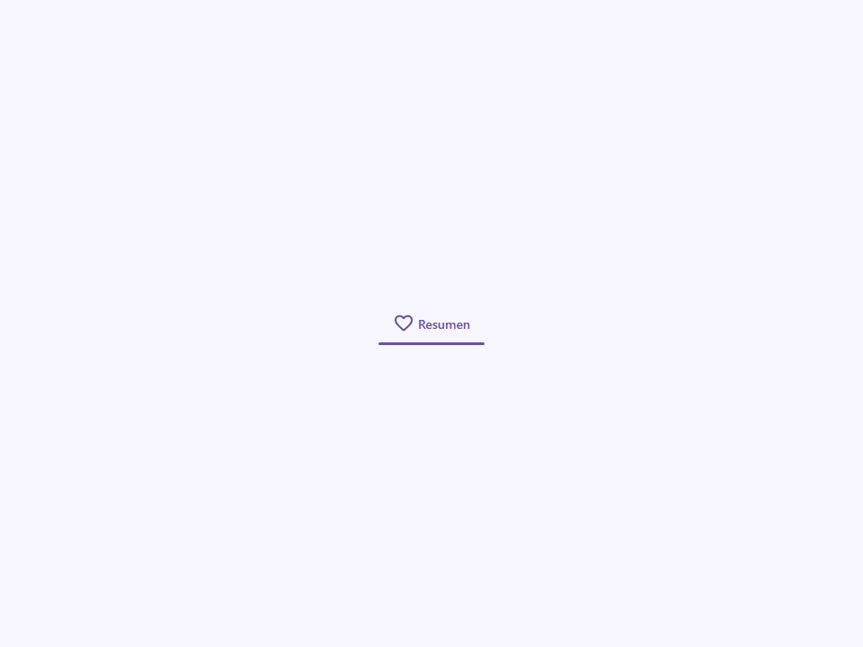

# Tab

Componente Material Design 3 Tab (Pestaña).

Un elemento interactivo de pestaña individual diseñado para ser colocado dentro de un
contenedor `<moni-tabs>`. Las pestañas organizan el contenido en diferentes pantallas,
conjuntos de datos y otras interacciones.

**Referencia a la especificación M3:** `m3-docs/components/tabs/specs.md`

**Diseño visual e interacción:**
Internamente se renderiza como un elemento `<a>` para soportar el comportamiento nativo
de enlace cuando se proporciona un `href`, pero se comporta visualmente como un botón de pestaña.
Muestra una etiqueta de texto y un icono opcional de Material. Si el `<moni-tabs>` padre tiene el
atributo `vertical` configurado, el diseño se ajusta automáticamente para apilar el icono
encima del texto.

**Estado:**
El atributo `active` resalta la pestaña, aplicando el color principal (primary) al
texto y renderizando la línea indicadora activa (manejado vía CSS en el contenedor
padre o mediante pseudo-elementos).

- Tag: `moni-tab`
- Clase: `MoniTab`
- Fuente: `src/components/moni-tab.ts`

## Cuándo usarlo

Usa `moni-tab` cuando la interfaz necesite el patrón que describe este componente. Antes de elegirlo, revisa sus estados, contenido permitido y comportamiento accesible; las capturas del final muestran el resultado real de cada variante.

## Uso básico

```html
<moni-tabs>
  <moni-tab active icon="home" label="Inicio"></moni-tab>
  <moni-tab icon="settings" label="Ajustes" href="/settings"></moni-tab>
</moni-tabs>
```

## Ejemplo práctico con Tailwind CSS v4

Tailwind controla composición, ancho, espaciado y responsividad alrededor del Web Component. Moni UI conserva el aspecto interno mediante Shadow DOM y design tokens.

```html
<div class="mx-auto flex w-full max-w-md flex-col gap-4 p-6">
  <moni-tab label="Ejemplo">Resumen</moni-tab>
</div>
```

No necesitas un plugin de Tailwind. En tu CSS v4 importa ambas capas una sola vez:

```css
@import "tailwindcss";
@import "@moni-labs/moni-ui/styles";

@theme {
  --font-sans: Inter, ui-sans-serif, system-ui, sans-serif;
}
```

Las utilities aplicadas directamente al tag afectan su caja anfitriona. No uses selectores Tailwind para asumir acceso al DOM interno; personaliza únicamente con los CSS Parts y Custom Properties públicos enumerados más abajo.

## Recomendaciones

- Usa `moni-tab` para su propósito semántico; no lo sustituyas por un `div` estilizado.
- Aplica Tailwind al layout exterior. Para el interior del Shadow DOM usa las variables CSS y `::part()` documentados.
- Cuando el control muestre únicamente un icono, añade siempre un `aria-label` descriptivo.
- Mantén el estado de apertura en una única fuente de verdad y devuelve el foco al disparador al cerrar.
- Prueba los estados claro, oscuro, foco por teclado, deshabilitado y viewport móvil antes de publicar.

## Propiedades y atributos

| Atributo | Propiedad | Tipo | Default | Descripción |
|---|---|---|---|---|
| `active` | `active` | `boolean` | `false` | Indica si el elemento está activo. |
| `icon` | `icon` | `string` | `''` | Nombre de Material Symbol mostrado por el componente. |
| `label` | `label` | `string` | `''` | Etiqueta visible y accesible del control. |
| `href` | `href` | `string` | `'#'` | Define `href`. Conserva el tipo indicado y usa la propiedad JavaScript cuando el valor no sea una cadena. |

## Slots

Este componente no declara slots públicos.

## Eventos

No declara eventos propios.

## Métodos públicos

No expone métodos públicos adicionales.

## CSS Parts

- `tab`: Parte interna personalizable.
- `icon`: Parte interna personalizable.
- `label`: Parte interna personalizable.

## CSS Custom Properties consumidas

- `--font`
- `--on-surface-variant`
- `--primary`
- `--speed2`

## Referencia visual por variable

Cada imagen se genera con el componente real: cambia solo la variable indicada y mantiene estable el resto del escenario. Úsala para comparar estados, no como sustituto de la API.

### `active`

Indica si el elemento está activo.




### `icon`

Nombre de Material Symbol mostrado por el componente.


### `label`

Etiqueta visible y accesible del control.



### `href`

Define `href`. Conserva el tipo indicado y usa la propiedad JavaScript cuando el valor no sea una cadena.


