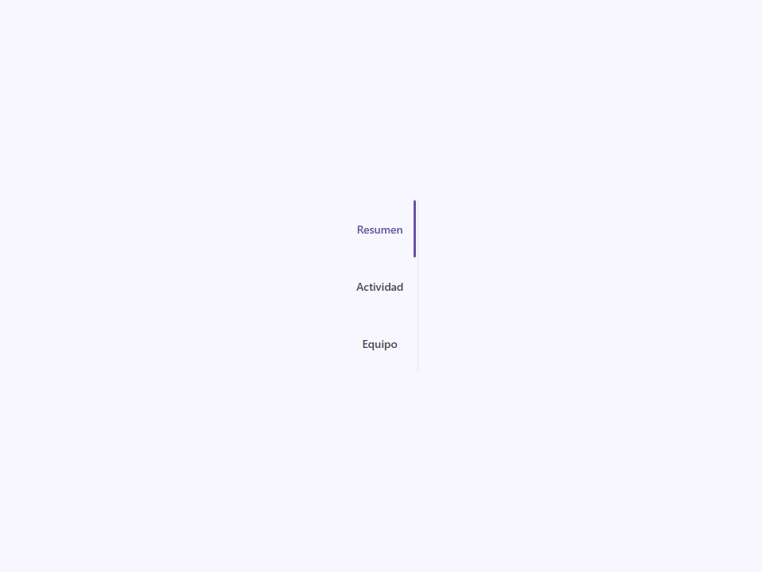
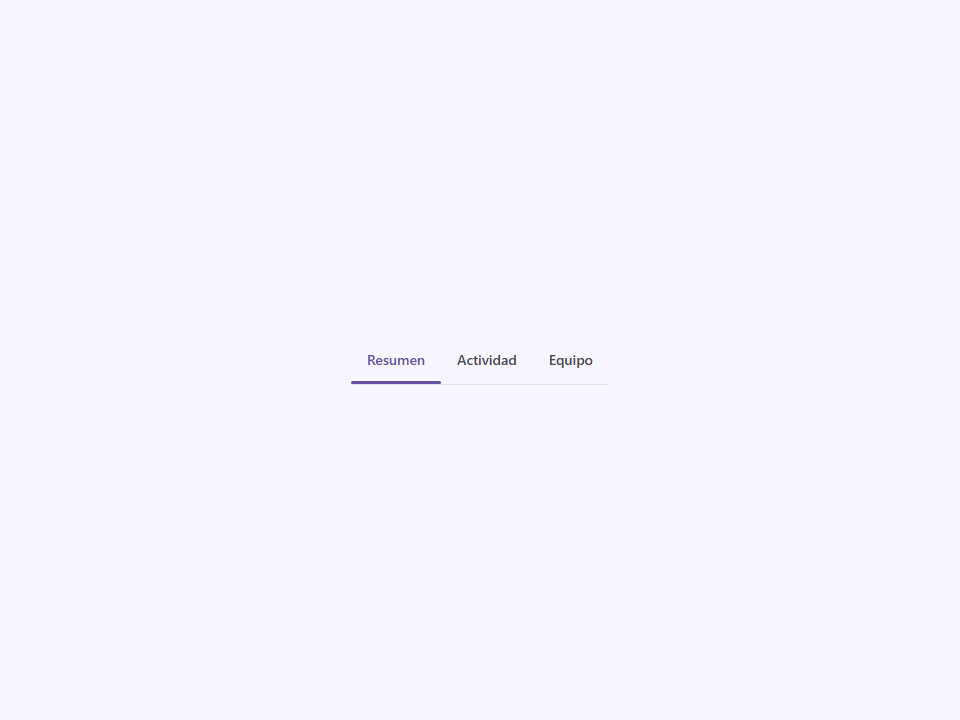
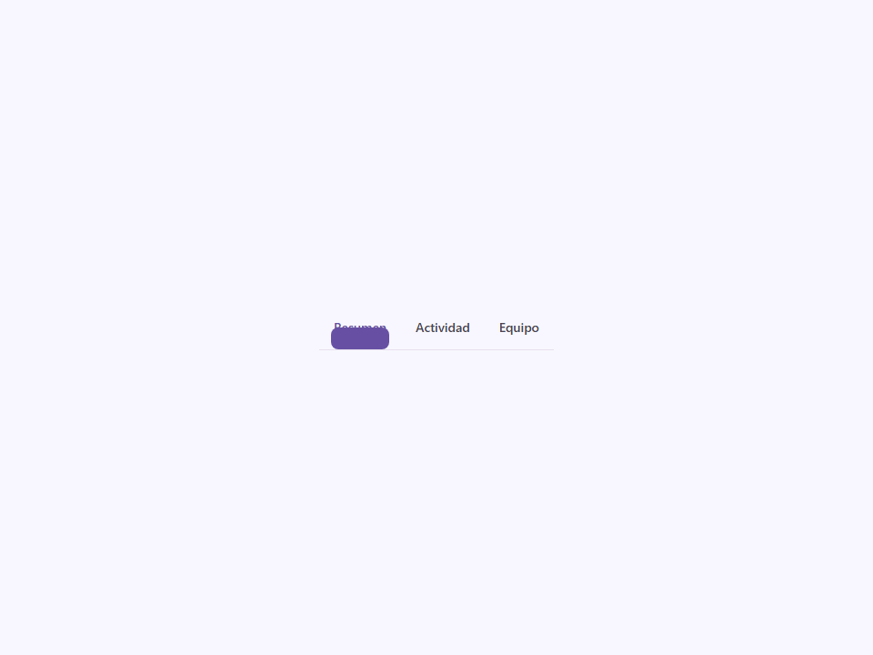
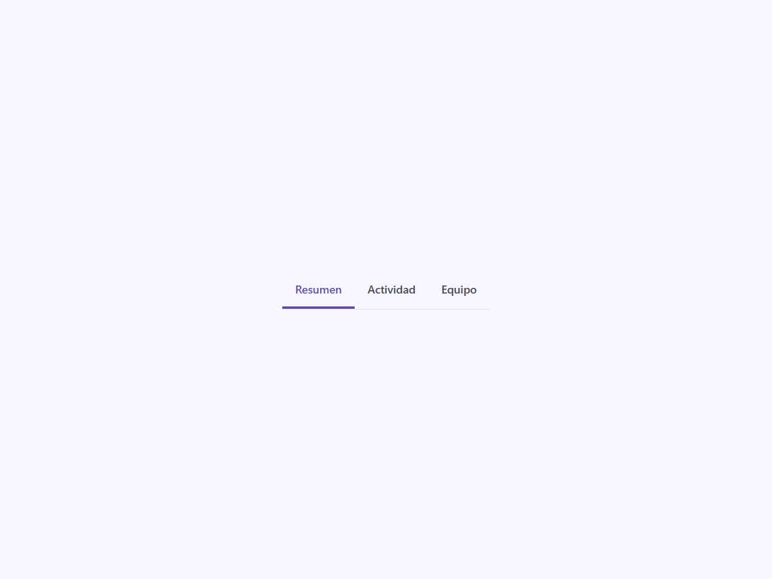

# Tabs

Componente Material Design 3 Tabs container (Contenedor de pestañas).

Un contenedor de navegación que agrupa múltiples elementos `<moni-tab>`. Las pestañas
organizan el contenido en categorías de alto nivel y permiten al usuario alternar
entre ellas.

**Referencia a la especificación M3:** `m3-docs/components/tabs/specs.md`

**Modos (Primario vs Secundario):**
- `primary` (por defecto): Usado para navegación de nivel superior en la jerarquía más alta,
  a menudo colocado directamente debajo de una barra de aplicación superior (top app bar).
  Abarcan todo el ancho y presentan un indicador activo prominente.
- `secondary`: Usado para jerarquías de contenido más profundas dentro de un área
  o página específica. Típicamente son más sutiles.

**Diseño y alineación:**
- `scrollable`: Si el número de pestañas excede el ancho del contenedor, esto
  habilita el desplazamiento horizontal (`overflow-x: auto`) en lugar de aplastarlas.
- `align`: Controla cómo se distribuyen las pestañas (`default` space-around,
  `left`, `center`, o `right`).
- `vertical`: Apila el icono sobre la etiqueta de texto dentro de las pestañas hijas.

**Indicador Activo:**
El atributo `indicator-size` permite personalizar el ancho del
indicador de subrayado activo (`default` se ajusta al contenido de la pestaña, `min` es estrecho, `max`
llena todo el ancho de la pestaña).

- Tag: `moni-tabs`
- Clase: `MoniTabs`
- Fuente: `src/components/moni-tabs.ts`

## Cuándo usarlo

Usa `moni-tabs` cuando la interfaz necesite el patrón que describe este componente. Antes de elegirlo, revisa sus estados, contenido permitido y comportamiento accesible; las capturas del final muestran el resultado real de cada variante.

## Uso básico

```html
<!-- Pestañas primarias, con desplazamiento (scrollable) -->
<moni-tabs scrollable>
  <moni-tab active label="Vuelos"></moni-tab>
  <moni-tab label="Viajes"></moni-tab>
  <moni-tab label="Explorar"></moni-tab>
</moni-tabs>

<!-- Pestañas secundarias, centradas con diseño vertical -->
<moni-tabs mode="secondary" align="center" vertical>
  <moni-tab active icon="video_camera_front" label="Video"></moni-tab>
  <moni-tab icon="photo_camera" label="Foto"></moni-tab>
</moni-tabs>
```

## Ejemplo práctico con Tailwind CSS v4

Tailwind controla composición, ancho, espaciado y responsividad alrededor del Web Component. Moni UI conserva el aspecto interno mediante Shadow DOM y design tokens.

```html
<div class="mx-auto flex w-full max-w-md flex-col gap-4 p-6">
  <moni-tabs></moni-tabs>
</div>
```

No necesitas un plugin de Tailwind. En tu CSS v4 importa ambas capas una sola vez:

```css
@import "tailwindcss";
@import "@moni-labs/moni-ui/styles";

@theme {
  --font-sans: Inter, ui-sans-serif, system-ui, sans-serif;
}
```

Las utilities aplicadas directamente al tag afectan su caja anfitriona. No uses selectores Tailwind para asumir acceso al DOM interno; personaliza únicamente con los CSS Parts y Custom Properties públicos enumerados más abajo.

## Recomendaciones

- Usa `moni-tabs` para su propósito semántico; no lo sustituyas por un `div` estilizado.
- Aplica Tailwind al layout exterior. Para el interior del Shadow DOM usa las variables CSS y `::part()` documentados.
- Prueba los estados claro, oscuro, foco por teclado, deshabilitado y viewport móvil antes de publicar.

## Propiedades y atributos

| Atributo | Propiedad | Tipo | Default | Descripción |
|---|---|---|---|---|
| `mode` | `mode` | `'primary' \| 'secondary'` | `'primary'` | Selecciona el valor de `mode` entre las opciones documentadas. |
| `scrollable` | `scrollable` | `boolean` | `false` | Activa o desactiva el comportamiento `scrollable`. En HTML, la presencia del atributo significa `true`; omítelo para `false`. |
| `vertical` | `vertical` | `boolean` | `false` | Activa o desactiva el comportamiento `vertical`. En HTML, la presencia del atributo significa `true`; omítelo para `false`. |
| `align` | `align` | `'default' \| 'left' \| 'center' \| 'right'` | `'default'` | Selecciona el valor de `align` entre las opciones documentadas. |
| `indicator-size` | `indicatorSize` | `'default' \| 'min' \| 'max'` | `'default'` | Selecciona el valor de `indicatorSize` entre las opciones documentadas. |

## Slots

- `default`: Elementos hijos `<moni-tab>`.

## Eventos

No declara eventos propios.

## Métodos públicos

No expone métodos públicos adicionales.

## CSS Parts

- `tabs`: Parte interna personalizable.

## CSS Custom Properties consumidas

- `--font`
- `--surface-variant`

## Referencia visual por variable

Cada imagen se genera con el componente real: cambia solo la variable indicada y mantiene estable el resto del escenario. Úsala para comparar estados, no como sustituto de la API.

### `mode`

Selecciona el valor de `mode` entre las opciones documentadas.


### `scrollable`

Activa o desactiva el comportamiento `scrollable`. En HTML, la presencia del atributo significa `true`; omítelo para `false`.


### `vertical`

Activa o desactiva el comportamiento `vertical`. En HTML, la presencia del atributo significa `true`; omítelo para `false`.




### `align`

Selecciona el valor de `align` entre las opciones documentadas.




### `indicator-size`

Selecciona el valor de `indicatorSize` entre las opciones documentadas.





