# Text Field

Componente Material Design 3 Text Field (Campo de texto).

Un campo de entrada con todas las funciones que envuelve un `<input>` nativo dentro de la
estructura de campo M3 (clase `.field` de `fieldStyles`). Soporta etiquetas flotantes,
variantes llenas (filled) y contorneadas (outlined), iconos iniciales/finales (leading/trailing),
texto de ayuda y estados de error.

**Referencia a la especificación M3:** `m3-docs/components/text-fields/specs.md`

**Arquitectura visual:**
Utiliza `fieldStyles` para toda la estructura CSS del campo. El contenedor del campo
es un `<div class="field [modifiers]">` que envuelve:
1. Icono inicial (leading) opcional.
2. Elemento `<input>` nativo.
3. `<label>` flotante (cuando se establece `label`).
4. Icono final (trailing) opcional o indicador de carga (spinner).
5. `<output>` para texto de ayuda/error.

**Sincronización de eventos:**
Emite `moni-input` en cada tipeo y `moni-change` al consolidar el valor (blur/enter).
El valor interno del componente (`this.value`) se mantiene sincronizado automáticamente.

- Tag: `moni-text-field`
- Clase: `MoniTextField`
- Fuente: `src/components/moni-text-field.ts`

## Cuándo usarlo

Usa `moni-text-field` cuando la interfaz necesite el patrón que describe este componente. Antes de elegirlo, revisa sus estados, contenido permitido y comportamiento accesible; las capturas del final muestran el resultado real de cada variante.

## Uso básico

```html
<moni-text-field
  label="Dirección de correo"
  type="email"
  name="email"
  icon="mail"
  variant="outlined"
  helper="Nunca compartiremos tu correo."
></moni-text-field>

<moni-text-field
  label="Monto"
  type="number"
  prefix="$"
  error
  error-text="El valor debe ser positivo"
></moni-text-field>
```

## Ejemplo práctico con Tailwind CSS v4

Tailwind controla composición, ancho, espaciado y responsividad alrededor del Web Component. Moni UI conserva el aspecto interno mediante Shadow DOM y design tokens.

```html
<div class="mx-auto flex w-full max-w-md flex-col gap-4 p-6">
  <moni-text-field label="Ejemplo"></moni-text-field>
</div>
```

No necesitas un plugin de Tailwind. En tu CSS v4 importa ambas capas una sola vez:

```css
@import "tailwindcss";
@import "@moni-labs/moni-ui/styles";

@theme {
  --font-sans: Inter, ui-sans-serif, system-ui, sans-serif;
}
```

Las utilities aplicadas directamente al tag afectan su caja anfitriona. No uses selectores Tailwind para asumir acceso al DOM interno; personaliza únicamente con los CSS Parts y Custom Properties públicos enumerados más abajo.

## Recomendaciones

- Usa `moni-text-field` para su propósito semántico; no lo sustituyas por un `div` estilizado.
- Aplica Tailwind al layout exterior. Para el interior del Shadow DOM usa las variables CSS y `::part()` documentados.
- Durante una operación asíncrona combina el estado `loading` —si existe— con `disabled` para evitar envíos duplicados.
- En formularios controlados, sincroniza la propiedad `value` y escucha el evento documentado; no dependas solo del atributo inicial.
- Cuando el control muestre únicamente un icono, añade siempre un `aria-label` descriptivo.
- Prueba los estados claro, oscuro, foco por teclado, deshabilitado y viewport móvil antes de publicar.

## Propiedades y atributos

| Atributo | Propiedad | Tipo | Default | Descripción |
|---|---|---|---|---|
| `name` | `name` | `string` | `''` | El nombre del input, enviado con los datos del formulario. |
| `label` | `label` | `string` | `''` | El texto de la etiqueta flotante. |
| `variant` | `variant` | `'filled' \| 'outlined' \| 'underlined'` | `'filled'` | Variante visual del campo de texto. |
| `size` | `size` | `'small' \| 'medium' \| 'large' \| 'extra'` | `'medium'` | Define las dimensiones del campo de texto. |
| `shape` | `shape` | `'round' \| 'no-round'` | `'no-round'` | Forma del radio del borde (border-radius) del campo. |
| `type` | `type` | `'text' \| 'password' \| 'email' \| 'number' \| 'tel' \| 'url' \| 'search' \| 'date' \| 'time' \| 'datetime-local' \| 'month' \| 'week' \| 'color'` | `'text'` | El tipo de input HTML nativo. |
| `icon` | `icon` | `string` | `''` | Nombre del icono inicial (leading) (Material Symbols). |
| `trailing-icon` | `trailingIcon` | `string` | `''` | Nombre del icono final (trailing) (Material Symbols). |
| `prefix` | `prefix` | `string` | `''` | Prefijo de texto corto mostrado antes del valor del input. |
| `suffix` | `suffix` | `string` | `''` | Sufijo de texto corto mostrado después del valor del input. |
| `suffix-button-icon` | `suffixButtonIcon` | `string` | `''` | Icono del botón interactivo ubicado al final del campo. |
| `suffix-button-label` | `suffixButtonLabel` | `string` | `'Acción del campo'` | Etiqueta accesible del botón suffix. |
| `helper` | `helper` | `string` | `''` | Texto de ayuda mostrado debajo del campo. |
| `error-text` | `errorText` | `string` | `''` | Texto de error mostrado debajo del campo cuando `error` es true. Sobrescribe el texto de ayuda. |
| `error` | `error` | `boolean` | `false` | Si es true, establece el campo en un estado de error. |
| `loading` | `loading` | `boolean` | `false` | Si es true, muestra un indicador de carga (progreso lineal/circular) al final. |
| `disabled` | `disabled` | `boolean` | `false` | Deshabilita el campo de texto. |
| `value` | `value` | `string` | `''` | El valor actual del input. |
| `placeholder` | `placeholder` | `string` | `''` | Texto de marcador de posición (placeholder) mostrado cuando el input está vacío y la etiqueta es flotante. |
| `required` | `required` | `boolean` | `false` | Marca el campo como obligatorio y lo integra en la validación del formulario. |
| `readonly` | `readonly` | `boolean` | `false` | Impide editar el valor sin sacarlo del envío ni atenuarlo como `disabled`. |
| `autocomplete` | `autocomplete` | `string` | `''` | Pista de autocompletado del navegador, por ejemplo `email` o `current-password`. |
| `inputmode` | `inputmode` | `string` | `''` | Teclado virtual a mostrar en móvil, por ejemplo `numeric` o `tel`. |
| `maxlength` | `maxlength` | `number \| null` | `null` | Máximo de caracteres aceptados. |
| `minlength` | `minlength` | `number \| null` | `null` | Mínimo de caracteres aceptados. |
| `min` | `min` | `string` | `''` | Valor mínimo para `number` y los tipos de fecha y hora. |
| `max` | `max` | `string` | `''` | Valor máximo para `number` y los tipos de fecha y hora. |
| `step` | `step` | `string` | `''` | Incremento para `number` y los tipos de fecha y hora. |
| `pattern` | `pattern` | `string` | `''` | Expresión regular que debe cumplir el valor. |
| `mask` | `mask` | `string` | `''` | Patrón Inputmask. Admite opcionales `[]`, grupos `()`, alternadores `\|`, cuantificadores `{n,m}` y los tokens `9`, `a`, `*` y `K` (RUT). |
| `mask-alias` | `maskAlias` | `string` | `''` | Alias integrado de Inputmask, por ejemplo `email`, `datetime`, `numeric`, `currency` o `ip`. |
| `mask-options` | `maskOptions` | `InputmaskOptions` | `{}` | Opciones avanzadas de Inputmask. También acepta JSON mediante el atributo `mask-options`. |

## Slots

Este componente no declara slots públicos.

## Eventos

- `suffix-click`: evento compuesto y burbujeante emitido por el componente.

## Métodos públicos

- `maskOption(name: string): unknown;` — Lee o actualiza opciones de la instancia activa.
- `maskOption(options: InputmaskOptions, noRemask?: boolean): InputmaskInstance | undefined;` — Método público maskOption.
- `maskOption(nameOrOptions: string | InputmaskOptions, noRemask = false): unknown` — Método público maskOption.
- `getEmptyMask(): string` — Método público getEmptyMask.
- `hasMaskedValue(): boolean` — Método público hasMaskedValue.
- `isMaskComplete(): boolean` — Método público isMaskComplete.
- `isMaskValid(value?: string): boolean` — Método público isMaskValid.
- `getMaskMetadata(): unknown` — Método público getMaskMetadata.
- `formatWithMask(value: string, metadata = false): string |` — Método público formatWithMask.
- `setMaskedValue(value: string): void` — Método público setMaskedValue.
- `removeMask(): void` — Método público removeMask.
- `checkValidity(): boolean` — Método público checkValidity.
- `reportValidity(): boolean` — Método público reportValidity.

## CSS Parts

- `field`: Parte interna personalizable.
- `input`: Parte interna personalizable.
- `label`: Parte interna personalizable.
- `helper`: Parte interna personalizable.
- `error-output`: El elemento `<output>` de error.
- `leading-icon`: Parte interna personalizable.
- `prefix`: Parte interna personalizable.
- `suffix`: Parte interna personalizable.
- `suffix-action`: Parte interna personalizable.
- `suffix-button`: Parte interna personalizable.
- `trailing-icon`: Parte interna personalizable.

## CSS Custom Properties consumidas

- `--_middle`
- `--on-surface-variant`
- `--primary`

## Referencia visual por variable

Cada imagen se genera con el componente real: cambia solo la variable indicada y mantiene estable el resto del escenario. Úsala para comparar estados, no como sustituto de la API.

### `name`

El nombre del input, enviado con los datos del formulario.


### `label`

El texto de la etiqueta flotante.


### `variant`

Variante visual del campo de texto.


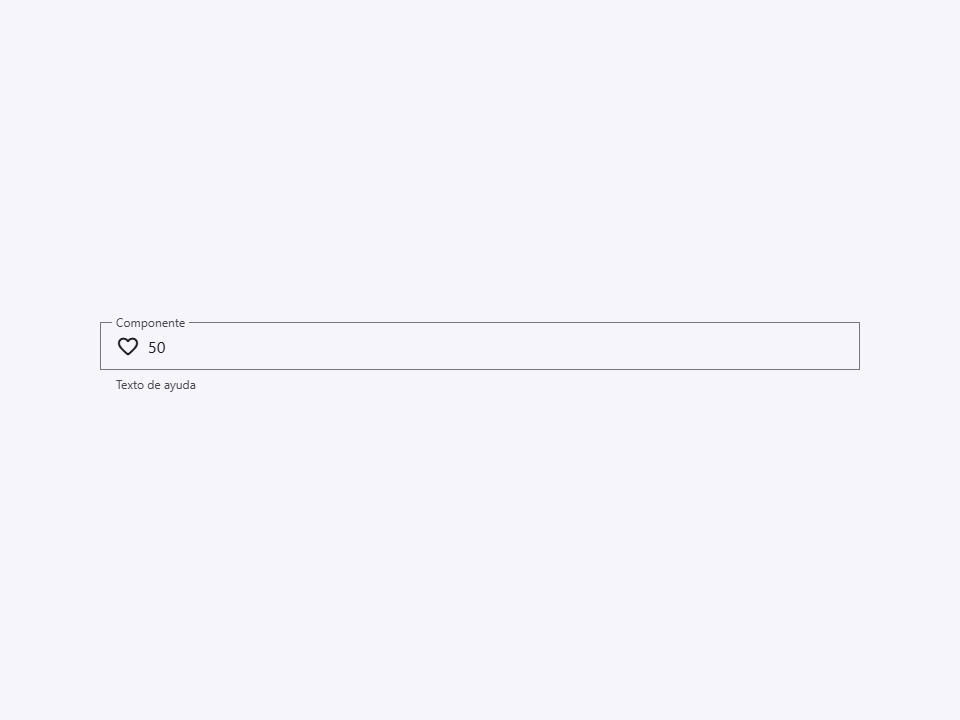

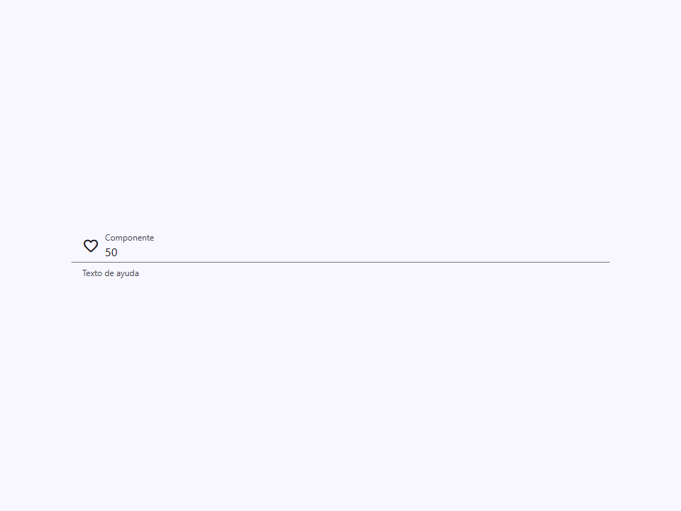

### `size`

Define las dimensiones del campo de texto.


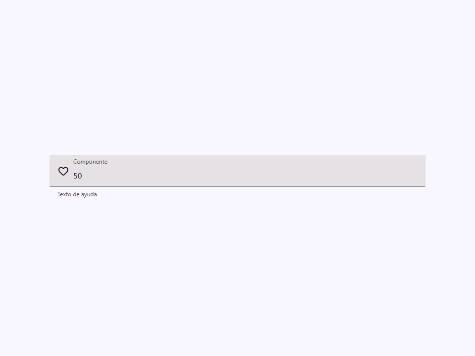

### `shape`

Forma del radio del borde (border-radius) del campo.

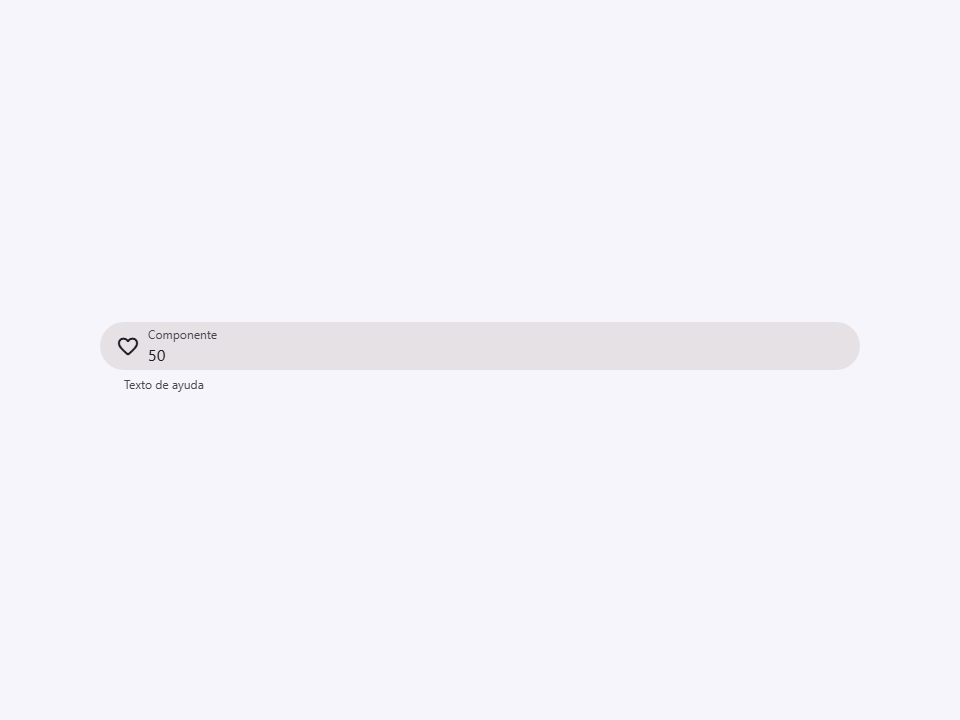


### `type`

El tipo de input HTML nativo.

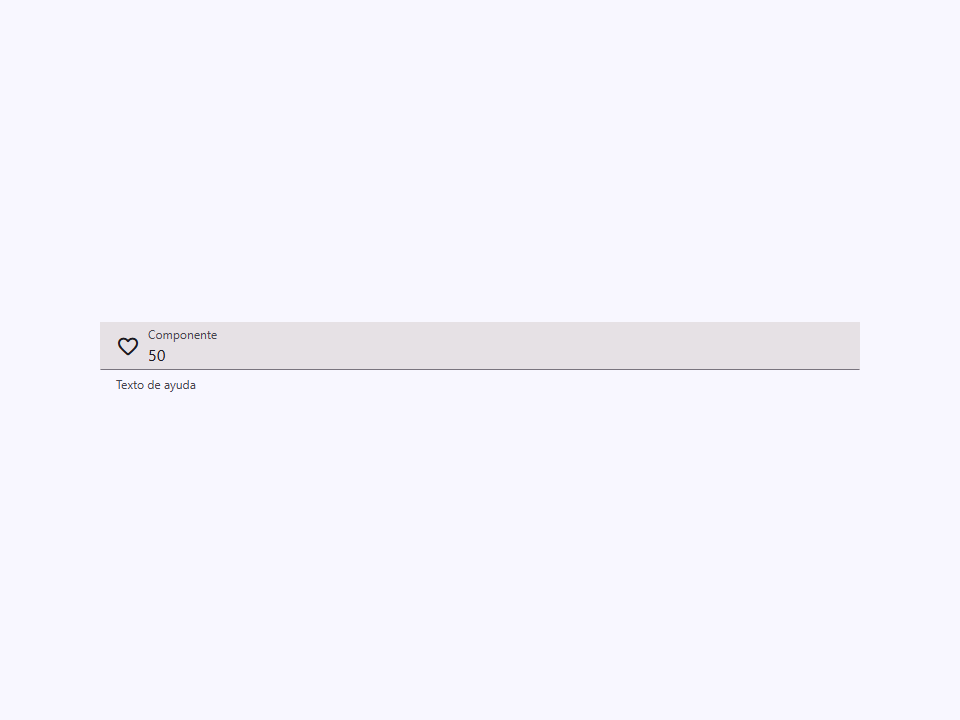

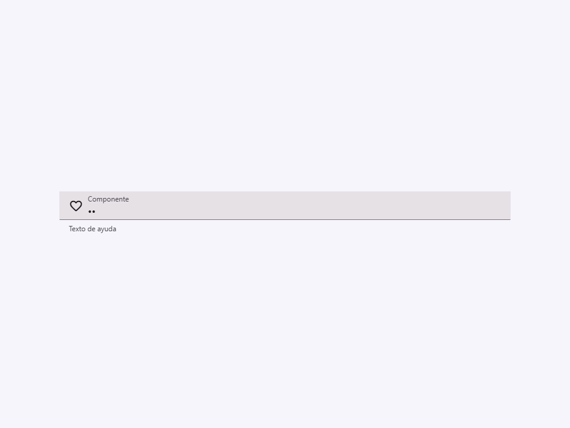


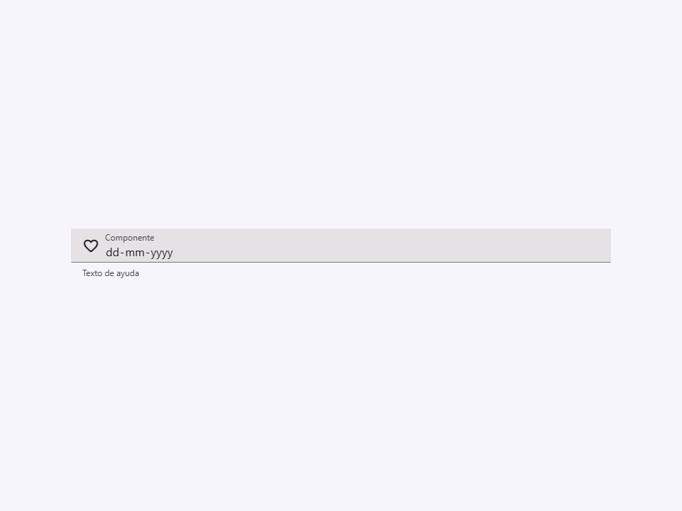

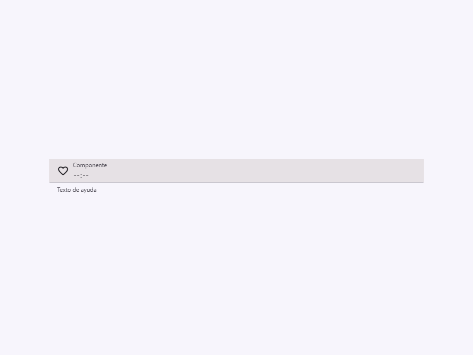

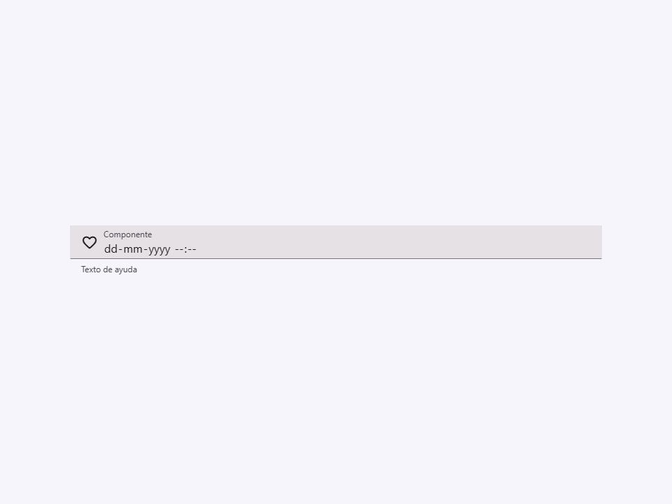

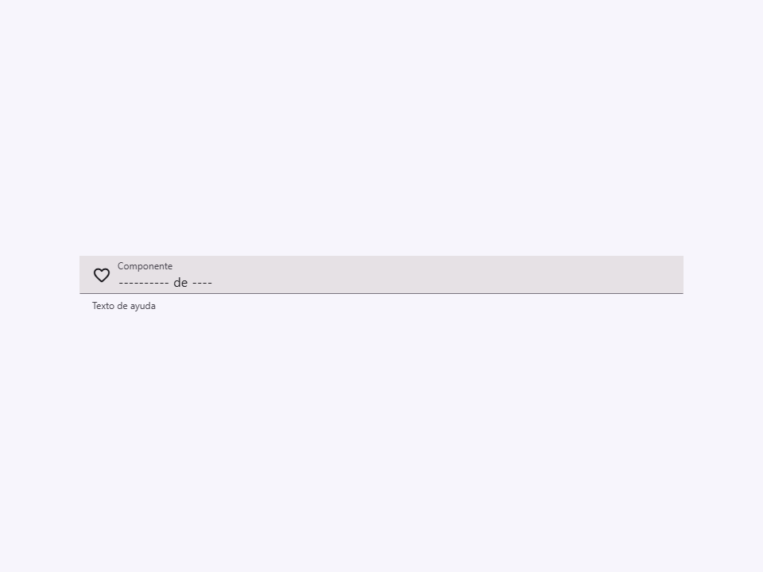

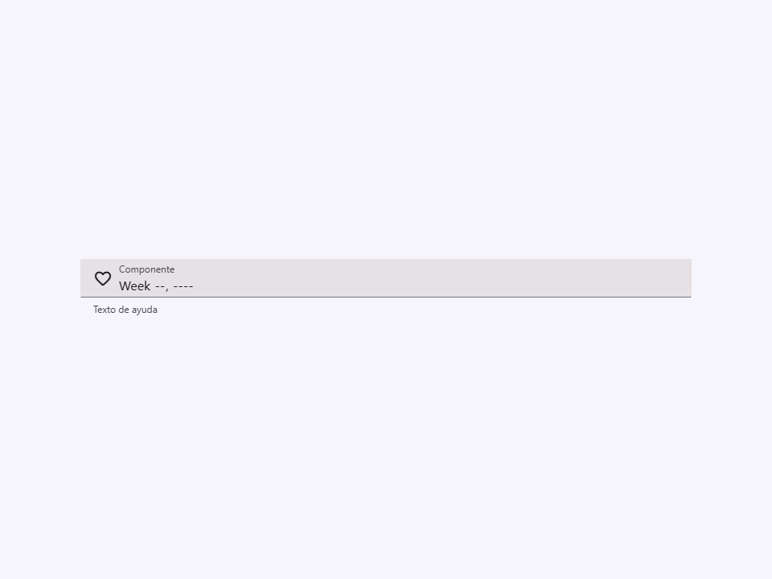


### `icon`

Nombre del icono inicial (leading) (Material Symbols).


### `trailing-icon`

Nombre del icono final (trailing) (Material Symbols).


### `prefix`

Prefijo de texto corto mostrado antes del valor del input.


### `suffix`

Sufijo de texto corto mostrado después del valor del input.


### `suffix-button-icon`

Icono del botón interactivo ubicado al final del campo.


### `suffix-button-label`

Etiqueta accesible del botón suffix.


### `helper`

Texto de ayuda mostrado debajo del campo.


### `error-text`

Texto de error mostrado debajo del campo cuando `error` es true.
Sobrescribe el texto de ayuda.


### `error`

Si es true, establece el campo en un estado de error.


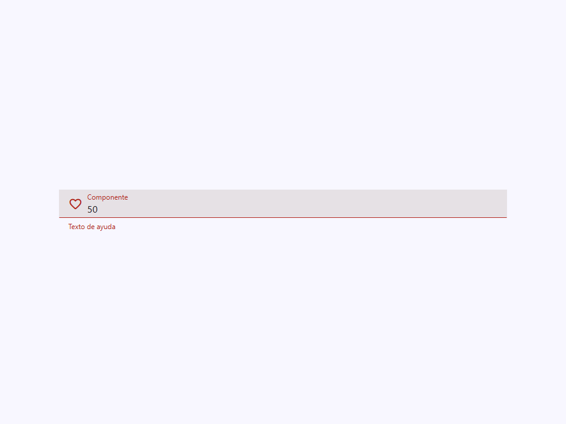

### `loading`

Si es true, muestra un indicador de carga (progreso lineal/circular) al final.


### `disabled`

Deshabilita el campo de texto.


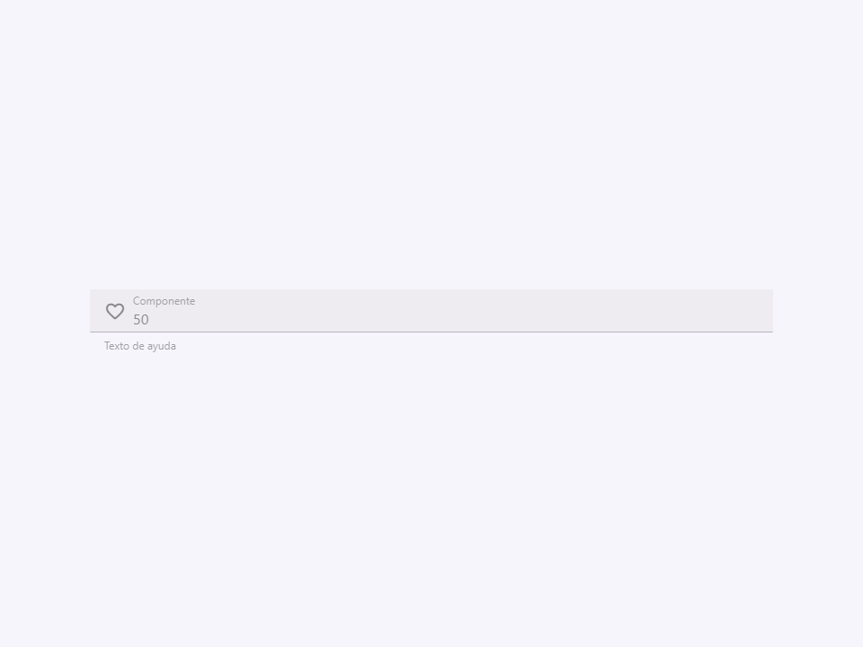

### `value`

El valor actual del input.


### `placeholder`

Texto de marcador de posición (placeholder) mostrado cuando el input está vacío y la etiqueta es flotante.


### `required`

Marca el campo como obligatorio y lo integra en la validación del formulario.


### `readonly`

Impide editar el valor sin sacarlo del envío ni atenuarlo como `disabled`.


### `autocomplete`

Pista de autocompletado del navegador, por ejemplo `email` o `current-password`.


### `inputmode`

Teclado virtual a mostrar en móvil, por ejemplo `numeric` o `tel`.


### `maxlength`

Máximo de caracteres aceptados.


### `minlength`

Mínimo de caracteres aceptados.


### `min`

Valor mínimo para `number` y los tipos de fecha y hora.


### `max`

Valor máximo para `number` y los tipos de fecha y hora.

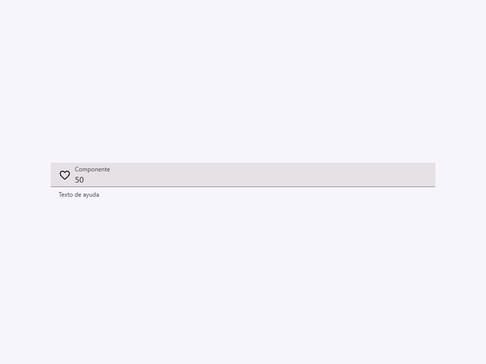

### `step`

Incremento para `number` y los tipos de fecha y hora.


### `pattern`

Expresión regular que debe cumplir el valor.


### `mask`

Patrón Inputmask. Admite opcionales `[]`, grupos `()`, alternadores `|`,
cuantificadores `{n,m}` y los tokens `9`, `a`, `*` y `K` (RUT).


### `mask-alias`

Alias integrado de Inputmask, por ejemplo `email`, `datetime`, `numeric`, `currency` o `ip`.


### `mask-options`

Opciones avanzadas de Inputmask. También acepta JSON mediante el atributo `mask-options`.


