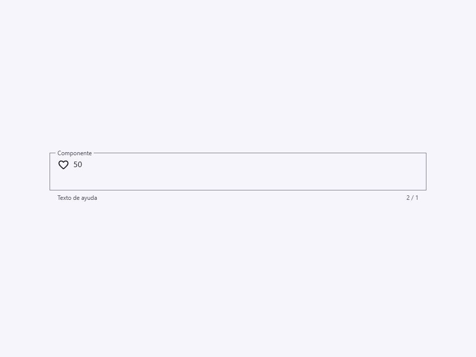
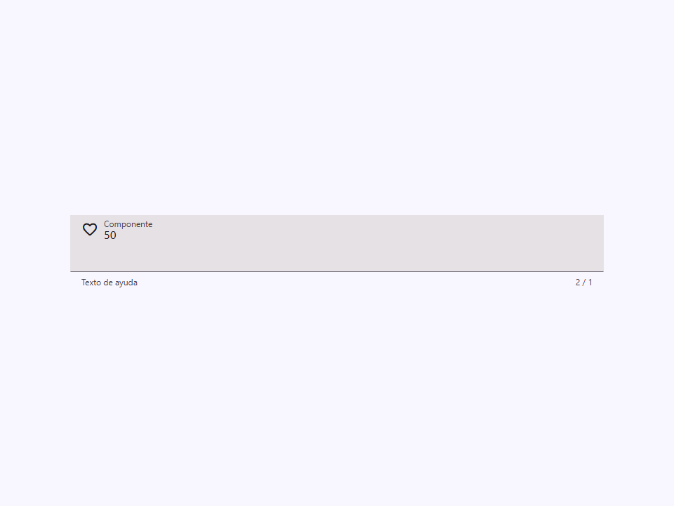
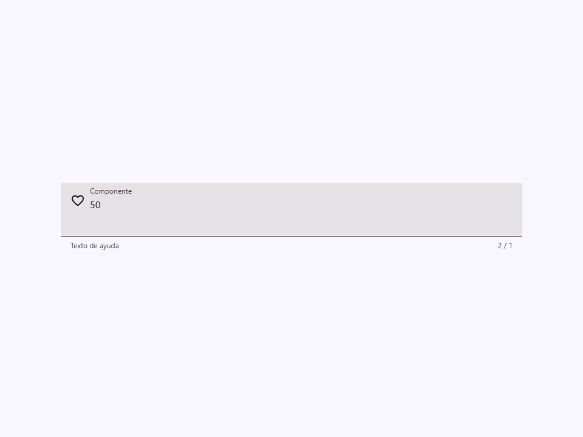
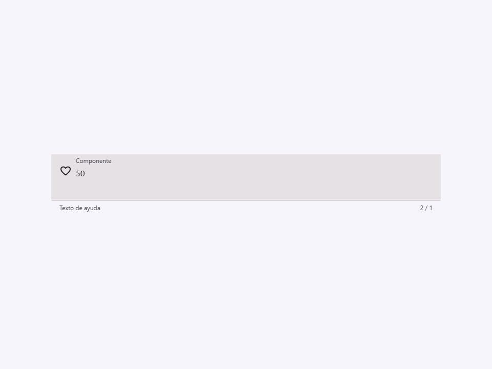
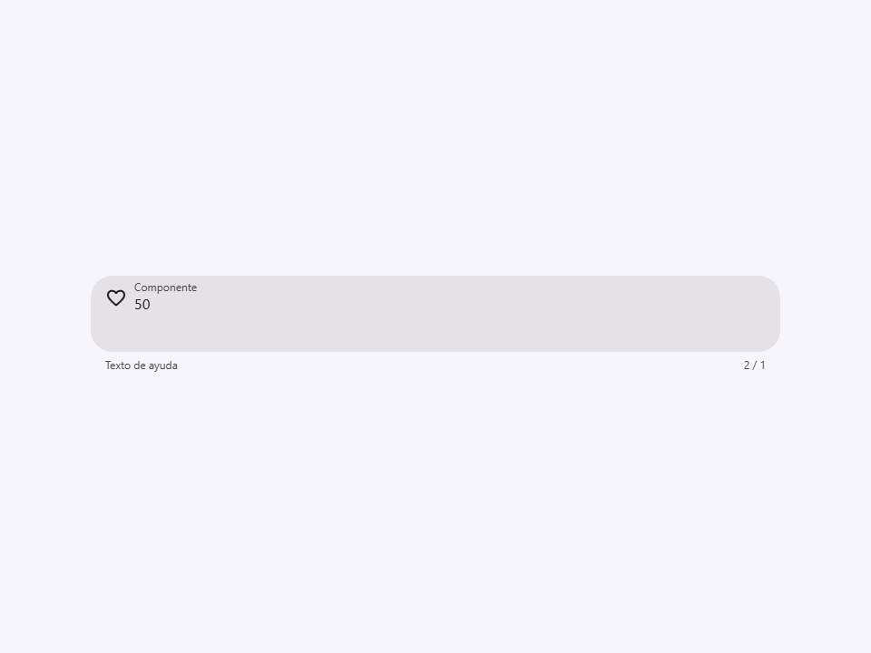
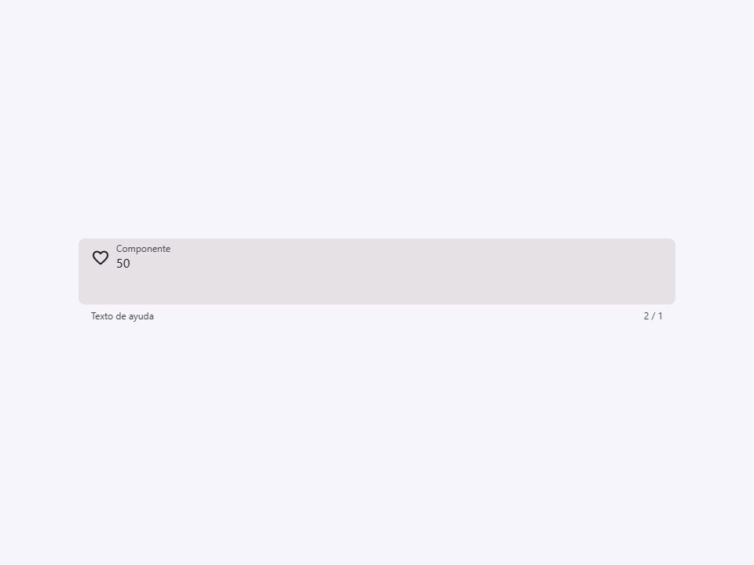
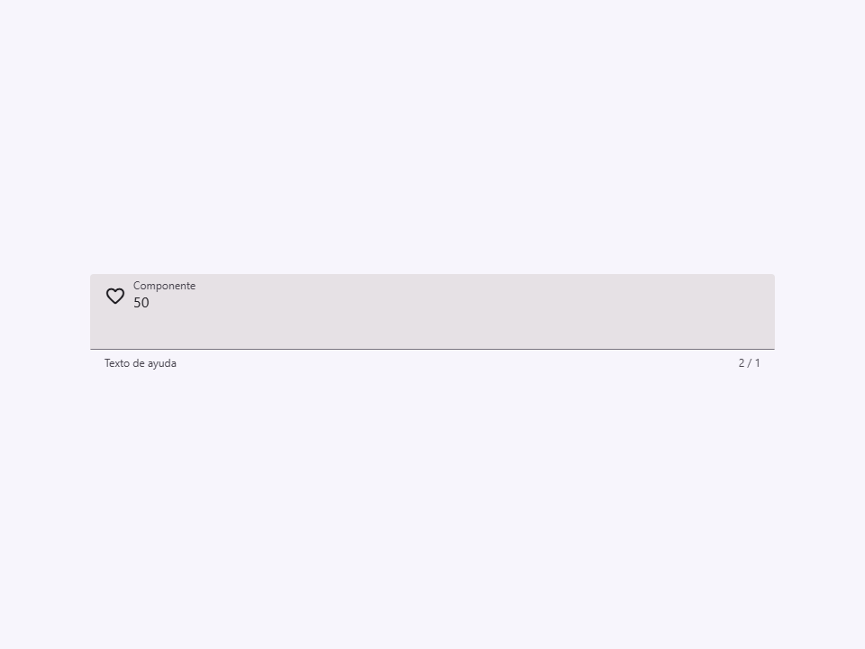
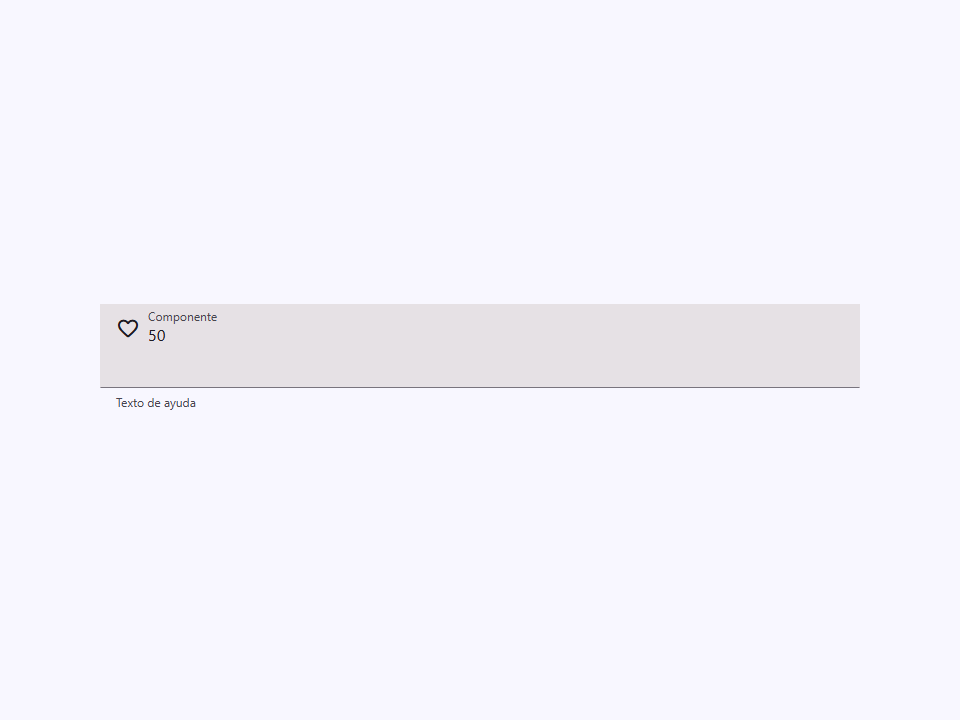
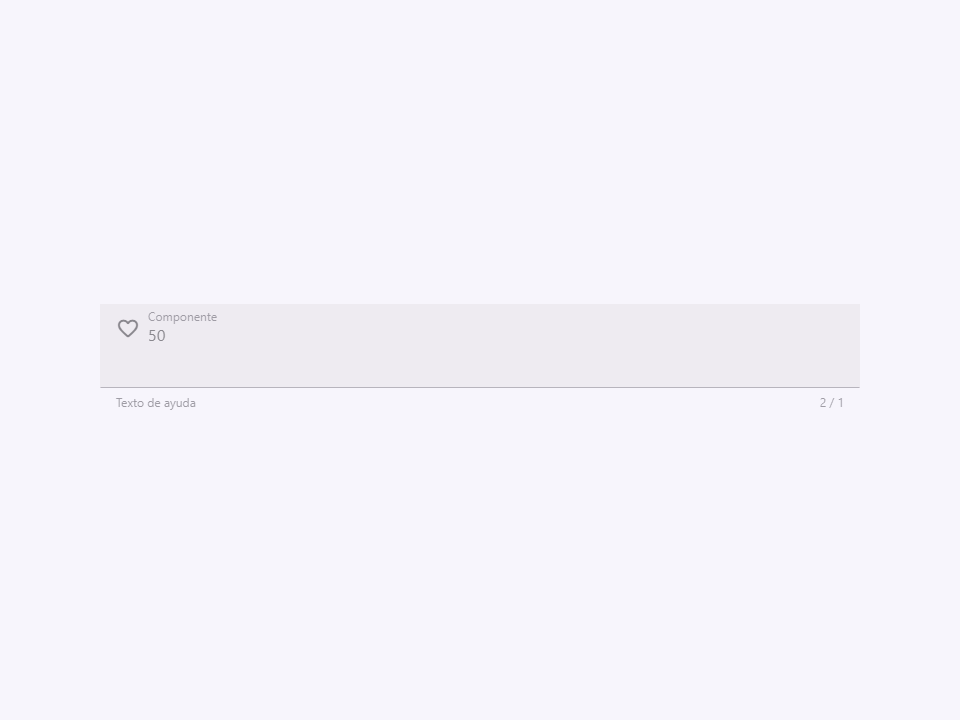
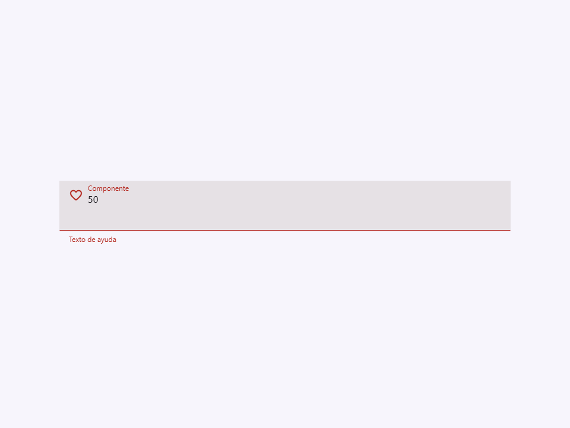

# Textarea

Componente Material Design 3 Textarea (Área de texto).

Un campo de entrada de texto multilínea diseñado para recolectar cantidades mayores de texto,
como comentarios, descripciones o mensajes.

**Referencia a la especificación M3:** `m3-docs/components/text-fields/specs.md`

**Arquitectura visual:**
Comparte exactamente el mismo contenedor `.field` y motor de estilos que
`<moni-text-field>`, pero internamente renderiza un `<textarea>` nativo en lugar
de un `<input>`. Esto asegura la consistencia visual en todos los elementos del formulario
en cuanto a etiquetas flotantes, texto de ayuda, estados de error e iconos.

**Contador de caracteres:**
Si se establece el atributo `maxlength`, el área de texto muestra automáticamente
un contador de caracteres (`{longitud actual} / {maxlength}`) ubicado en el
borde final (trailing) del área de texto de soporte (abajo a la derecha). Esto puede
suprimirse estableciendo el atributo `no-counter`.

**Gestión del estado:**
Este componente es puramente visual y representacional. Refleja los atributos
hacia el textarea nativo, pero NO adjunta listeners internos para `@input` o
`@change`. Los consumidores deben adjuntar listeners estándar del DOM directamente
a este elemento para capturar la entrada del usuario, tal como lo harían con un
textarea nativo.

- Tag: `moni-textarea`
- Clase: `MoniTextarea`
- Fuente: `src/components/moni-textarea.ts`

## Cuándo usarlo

Usa `moni-textarea` cuando la interfaz necesite el patrón que describe este componente. Antes de elegirlo, revisa sus estados, contenido permitido y comportamiento accesible; las capturas del final muestran el resultado real de cada variante.

## Uso básico

```html
<!-- Textarea llenado (filled) estándar -->
<moni-textarea label="Descripción" rows="4"></moni-textarea>

<!-- Textarea contorneado (outlined) con contador de caracteres -->
<moni-textarea
  variant="outlined"
  label="Biografía"
  maxlength="160"
></moni-textarea>
```

## Ejemplo práctico con Tailwind CSS v4

Tailwind controla composición, ancho, espaciado y responsividad alrededor del Web Component. Moni UI conserva el aspecto interno mediante Shadow DOM y design tokens.

```html
<div class="mx-auto flex w-full max-w-md flex-col gap-4 p-6">
  <moni-textarea label="Ejemplo"></moni-textarea>
</div>
```

No necesitas un plugin de Tailwind. En tu CSS v4 importa ambas capas una sola vez:

```css
@import "tailwindcss";
@import "@moni-labs/moni-ui/styles";

@theme {
  --font-sans: Inter, ui-sans-serif, system-ui, sans-serif;
}
```

Las utilities aplicadas directamente al tag afectan su caja anfitriona. No uses selectores Tailwind para asumir acceso al DOM interno; personaliza únicamente con los CSS Parts y Custom Properties públicos enumerados más abajo.

## Recomendaciones

- Usa `moni-textarea` para su propósito semántico; no lo sustituyas por un `div` estilizado.
- Aplica Tailwind al layout exterior. Para el interior del Shadow DOM usa las variables CSS y `::part()` documentados.
- Durante una operación asíncrona combina el estado `loading` —si existe— con `disabled` para evitar envíos duplicados.
- En formularios controlados, sincroniza la propiedad `value` y escucha el evento documentado; no dependas solo del atributo inicial.
- Cuando el control muestre únicamente un icono, añade siempre un `aria-label` descriptivo.
- Prueba los estados claro, oscuro, foco por teclado, deshabilitado y viewport móvil antes de publicar.

## Propiedades y atributos

| Atributo | Propiedad | Tipo | Default | Descripción |
|---|---|---|---|---|
| `name` | `name` | `string` | `""` | El nombre del textarea, enviado con los datos del formulario. |
| `label` | `label` | `string` | `""` | El texto de la etiqueta flotante. |
| `variant` | `variant` | `"filled" \| "outlined"` | `"filled"` | Variante visual del área de texto. |
| `size` | `size` | `"small" \| "medium" \| "large" \| "extra"` | `"medium"` | Define las dimensiones del área de texto. |
| `shape` | `shape` | `"round" \| "small-round" \| "square" \| "no-round"` | `"no-round"` | Forma del radio del borde (border-radius) del campo. |
| `icon` | `icon` | `string` | `""` | Nombre del icono inicial (leading) (Material Symbols). |
| `trailing-icon` | `trailingIcon` | `string` | `""` | Nombre del icono final (trailing) (Material Symbols). |
| `prefix` | `prefix` | `string` | `""` | Prefijo de texto corto mostrado antes del valor del input. |
| `suffix` | `suffix` | `string` | `""` | Sufijo de texto corto mostrado después del valor del input. |
| `rows` | `rows` | `number` | `3` | Número por defecto de líneas de texto visibles. |
| `autosize` | `autosize` | `boolean` | `false` | Hace que el textarea crezca y se reduzca según su contenido. |
| `max-rows` | `maxRows` | `number` | `0` | Número máximo de filas visibles cuando `autosize` está activo. Cero no impone límite. |
| `maxlength` | `maxlength` | `number \| null` | `null` | Número máximo de caracteres permitidos en el área de texto.
 También habilita la visualización del contador de caracteres a menos que `noCounter` sea true. |
| `required` | `required` | `boolean` | `false` | Marca el campo como obligatorio y lo integra en la validación del formulario. |
| `readonly` | `readonly` | `boolean` | `false` | Impide editar el valor sin sacarlo del envío ni atenuarlo como `disabled`. |
| `minlength` | `minlength` | `number \| null` | `null` | Mínimo de caracteres aceptados. |
| `autocomplete` | `autocomplete` | `string` | `""` | Pista de autocompletado del navegador. |
| `no-counter` | `noCounter` | `boolean` | `false` | Oculta la visualización del contador de caracteres cuando se establece `maxlength`. |
| `loading` | `loading` | `boolean` | `false` | Si es true, muestra un indicador de carga (progreso circular) al final. |
| `disabled` | `disabled` | `boolean` | `false` | Deshabilita el área de texto. |
| `helper` | `helper` | `string` | `""` | Texto de ayuda mostrado debajo del campo. |
| `error-text` | `errorText` | `string` | `""` | Texto de error mostrado debajo del campo cuando `error` es true.
 Sobrescribe el texto de ayuda. |
| `error` | `error` | `boolean` | `false` | Si es true, establece el campo en un estado de error. |
| `value` | `value` | `string` | `""` | El valor actual del área de texto. |
| `placeholder` | `placeholder` | `string` | `""` | Texto de marcador de posición (placeholder) mostrado cuando el textarea está vacío y la etiqueta es flotante. |

## Slots

Este componente no declara slots públicos.

## Eventos

No declara eventos propios.

## Métodos públicos

- `checkValidity(): boolean` — Método público checkValidity.
- `reportValidity(): boolean` — Método público reportValidity.

## CSS Parts

- `field`: Parte interna personalizable.
- `input`: Parte interna personalizable.
- `label`: Parte interna personalizable.
- `helper`: Parte interna personalizable.
- `counter`: Parte interna personalizable.
- `footer`: Parte interna personalizable.
- `leading-icon`: Parte interna personalizable.
- `prefix`: Parte interna personalizable.
- `suffix`: Parte interna personalizable.
- `trailing-icon`: Parte interna personalizable.

## CSS Custom Properties consumidas

No consume variables CSS propias.

## Referencia visual por variable

Cada imagen se genera con el componente real: cambia solo la variable indicada y mantiene estable el resto del escenario. Úsala para comparar estados, no como sustituto de la API.

### `name`

El nombre del textarea, enviado con los datos del formulario.


### `label`

El texto de la etiqueta flotante.


### `variant`

Variante visual del área de texto.




### `size`

Define las dimensiones del área de texto.








### `shape`

Forma del radio del borde (border-radius) del campo.








### `icon`

Nombre del icono inicial (leading) (Material Symbols).


### `trailing-icon`

Nombre del icono final (trailing) (Material Symbols).


### `prefix`

Prefijo de texto corto mostrado antes del valor del input.


### `suffix`

Sufijo de texto corto mostrado después del valor del input.


### `rows`

Número por defecto de líneas de texto visibles.


### `autosize`

Hace que el textarea crezca y se reduzca según su contenido.


### `max-rows`

Número máximo de filas visibles cuando `autosize` está activo. Cero no impone límite.


### `maxlength`

Número máximo de caracteres permitidos en el área de texto.
También habilita la visualización del contador de caracteres a menos que `noCounter` sea true.


### `required`

Marca el campo como obligatorio y lo integra en la validación del formulario.


### `readonly`

Impide editar el valor sin sacarlo del envío ni atenuarlo como `disabled`.


### `minlength`

Mínimo de caracteres aceptados.


### `autocomplete`

Pista de autocompletado del navegador.


### `no-counter`

Oculta la visualización del contador de caracteres cuando se establece `maxlength`.




### `loading`

Si es true, muestra un indicador de carga (progreso circular) al final.


### `disabled`

Deshabilita el área de texto.




### `helper`

Texto de ayuda mostrado debajo del campo.


### `error-text`

Texto de error mostrado debajo del campo cuando `error` es true.
Sobrescribe el texto de ayuda.


### `error`

Si es true, establece el campo en un estado de error.




### `value`

El valor actual del área de texto.


### `placeholder`

Texto de marcador de posición (placeholder) mostrado cuando el textarea está vacío y la etiqueta es flotante.


