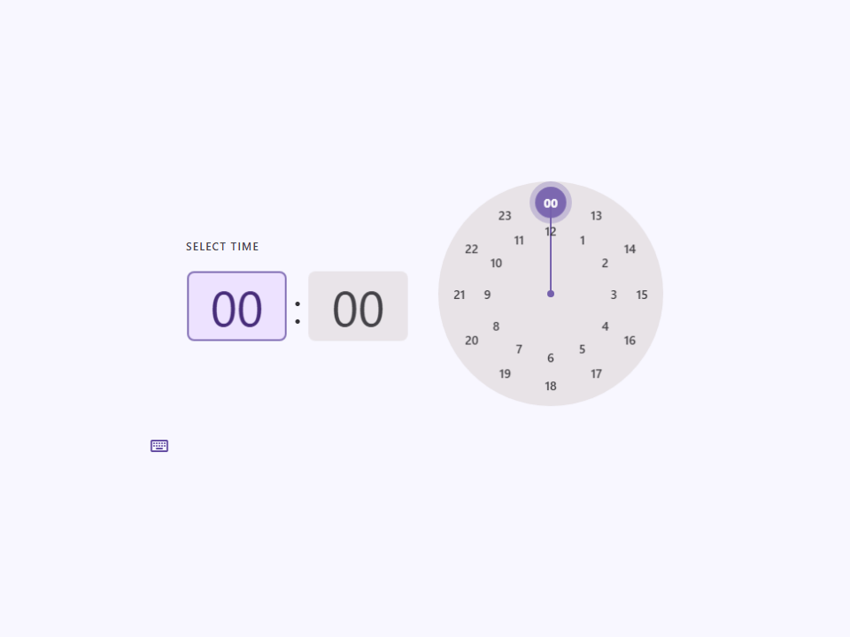
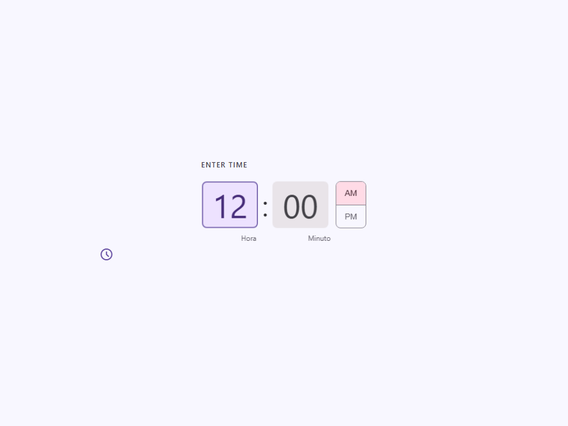
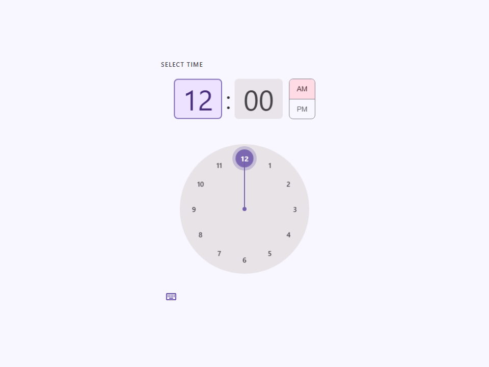
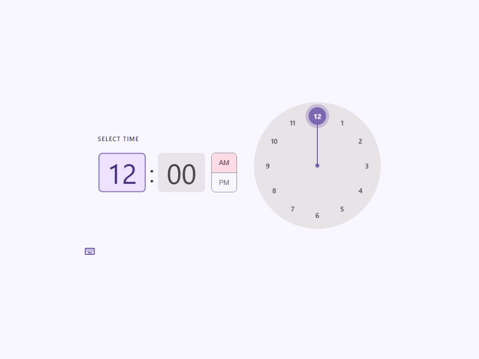
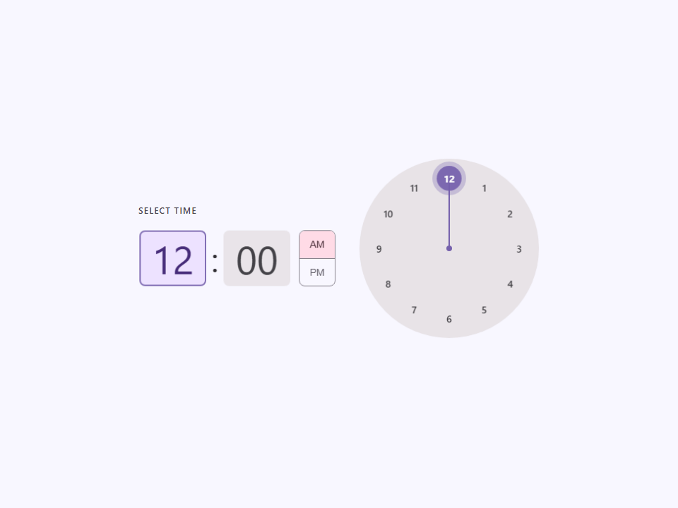
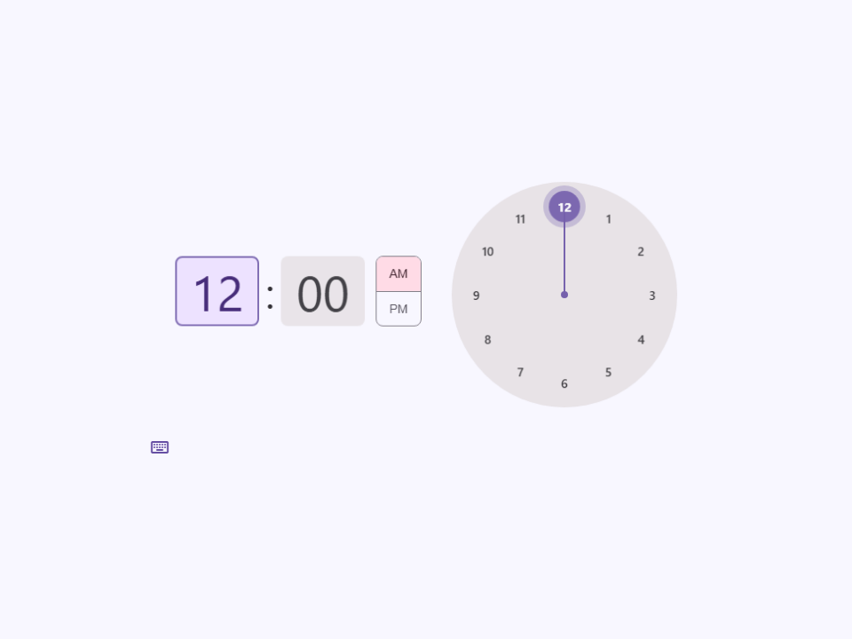
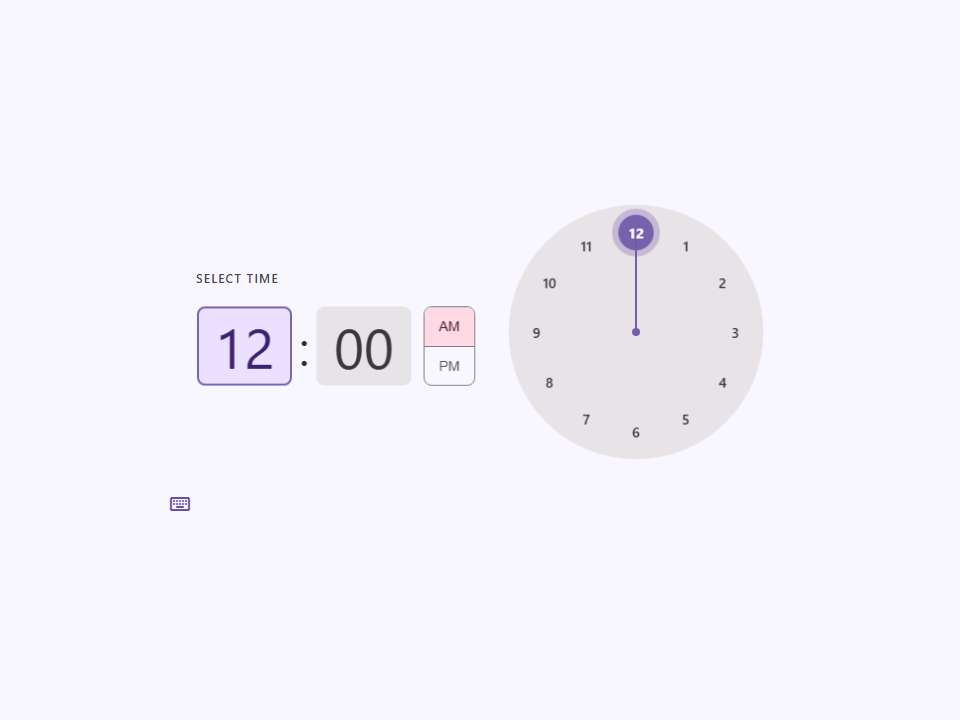

# Time Picker

Componente Material Design 3 Time Picker (Selector de hora).

Un control altamente interactivo que permite a los usuarios seleccionar una hora específica.
Proporciona dos modos de entrada distintos:
1. **Modo dial (analógico):** Una carátula de reloj interactiva donde los usuarios pueden arrastrar o hacer clic
   para seleccionar horas y minutos.
2. **Modo input (texto):** Entradas de texto estándar para una introducción precisa por teclado.

**Referencia a la especificación M3:** `m3-docs/components/time-pickers/specs.md`

**Formatos de hora y modos:**
- La propiedad `value` espera y siempre emite un string en formato de 24 horas
  (`HH:MM`, ej. `"14:30"`).
- Establecer `use-24-hour` configura la presentación visual para usar un
  reloj de 24 horas (anillos interior y exterior) y elimina el selector AM/PM. De lo contrario,
  utiliza un dial estándar de 12 horas con un selector AM/PM.

**Diseño responsivo:**
El atributo `orientation` configura el diseño. `vertical` apila la
visualización de la hora sobre la carátula del reloj, `horizontal` los coloca lado a lado,
y `auto` responde automáticamente al ancho del contenedor/viewport.

- Tag: `moni-time-picker`
- Clase: `MoniTimePicker`
- Fuente: `src/components/moni-time-picker.ts`

## Cuándo usarlo

Usa `moni-time-picker` cuando la interfaz necesite el patrón que describe este componente. Antes de elegirlo, revisa sus estados, contenido permitido y comportamiento accesible; las capturas del final muestran el resultado real de cada variante.

## Uso básico

```html
<!-- Formato 12 horas (AM/PM) -->
<moni-time-picker value="14:30"></moni-time-picker>

<!-- Formato 24 horas -->
<moni-time-picker use-24-hour value="14:30"></moni-time-picker>
```

## Ejemplo práctico con Tailwind CSS v4

Tailwind controla composición, ancho, espaciado y responsividad alrededor del Web Component. Moni UI conserva el aspecto interno mediante Shadow DOM y design tokens.

```html
<div class="mx-auto flex w-full max-w-md flex-col gap-4 p-6">
  <moni-time-picker></moni-time-picker>
</div>
```

No necesitas un plugin de Tailwind. En tu CSS v4 importa ambas capas una sola vez:

```css
@import "tailwindcss";
@import "@moni-labs/moni-ui/styles";

@theme {
  --font-sans: Inter, ui-sans-serif, system-ui, sans-serif;
}
```

Las utilities aplicadas directamente al tag afectan su caja anfitriona. No uses selectores Tailwind para asumir acceso al DOM interno; personaliza únicamente con los CSS Parts y Custom Properties públicos enumerados más abajo.

## Recomendaciones

- Usa `moni-time-picker` para su propósito semántico; no lo sustituyas por un `div` estilizado.
- Aplica Tailwind al layout exterior. Para el interior del Shadow DOM usa las variables CSS y `::part()` documentados.
- En formularios controlados, sincroniza la propiedad `value` y escucha el evento documentado; no dependas solo del atributo inicial.
- Prueba los estados claro, oscuro, foco por teclado, deshabilitado y viewport móvil antes de publicar.

## Propiedades y atributos

| Atributo | Propiedad | Tipo | Default | Descripción |
|---|---|---|---|---|
| `value` | `value` | `string` | `'00:00'` | Valor actual del control; usa la propiedad JavaScript para valores que deban conservar su tipo. |
| `use-24-hour` | `use24Hour` | `boolean` | `false` | Activa o desactiva el comportamiento `use24Hour`. En HTML, la presencia del atributo significa `true`; omítelo para `false`. |
| `mode` | `mode` | `'dial' \| 'input'` | `'dial'` | Selecciona el valor de `mode` entre las opciones documentadas. |
| `orientation` | `orientation` | `'vertical' \| 'horizontal' \| 'auto'` | `'auto'` | Selecciona el valor de `orientation` entre las opciones documentadas. |
| `hide-mode-toggle` | `hideModeToggle` | `boolean` | `false` | Activa o desactiva el comportamiento `hideModeToggle`. En HTML, la presencia del atributo significa `true`; omítelo para `false`. |
| `hide-headline` | `hideHeadline` | `boolean` | `false` | Activa o desactiva el comportamiento `hideHeadline`. En HTML, la presencia del atributo significa `true`; omítelo para `false`. |
| `hour-label` | `hourLabel` | `string` | `'Hora'` | Define `hourLabel`. Conserva el tipo indicado y usa la propiedad JavaScript cuando el valor no sea una cadena. |
| `minute-label` | `minuteLabel` | `string` | `'Minuto'` | Define `minuteLabel`. Conserva el tipo indicado y usa la propiedad JavaScript cuando el valor no sea una cadena. |

## Slots

Este componente no declara slots públicos.

## Eventos

- `change`: evento compuesto y burbujeante emitido por el componente.

## Métodos públicos

No expone métodos públicos adicionales.

## CSS Parts

No declara CSS Parts.

## CSS Custom Properties consumidas

- `--_display-size`
- `--active`
- `--ease-standard`
- `--font`
- `--on-primary`
- `--on-primary-container`
- `--on-surface`
- `--on-surface-variant`
- `--on-tertiary-container`
- `--outline`
- `--primary`
- `--primary-container`
- `--speed1`
- `--speed2`
- `--speed3`
- `--surface-container-highest`
- `--tertiary-container`

## Referencia visual por variable

Cada imagen se genera con el componente real: cambia solo la variable indicada y mantiene estable el resto del escenario. Úsala para comparar estados, no como sustituto de la API.

### `value`

Valor actual del control; usa la propiedad JavaScript para valores que deban conservar su tipo.


### `use-24-hour`

Activa o desactiva el comportamiento `use24Hour`. En HTML, la presencia del atributo significa `true`; omítelo para `false`.




### `mode`

Selecciona el valor de `mode` entre las opciones documentadas.




### `orientation`

Selecciona el valor de `orientation` entre las opciones documentadas.




### `hide-mode-toggle`

Activa o desactiva el comportamiento `hideModeToggle`. En HTML, la presencia del atributo significa `true`; omítelo para `false`.





### `hide-headline`

Activa o desactiva el comportamiento `hideHeadline`. En HTML, la presencia del atributo significa `true`; omítelo para `false`.




### `hour-label`

Define `hourLabel`. Conserva el tipo indicado y usa la propiedad JavaScript cuando el valor no sea una cadena.



### `minute-label`

Define `minuteLabel`. Conserva el tipo indicado y usa la propiedad JavaScript cuando el valor no sea una cadena.


