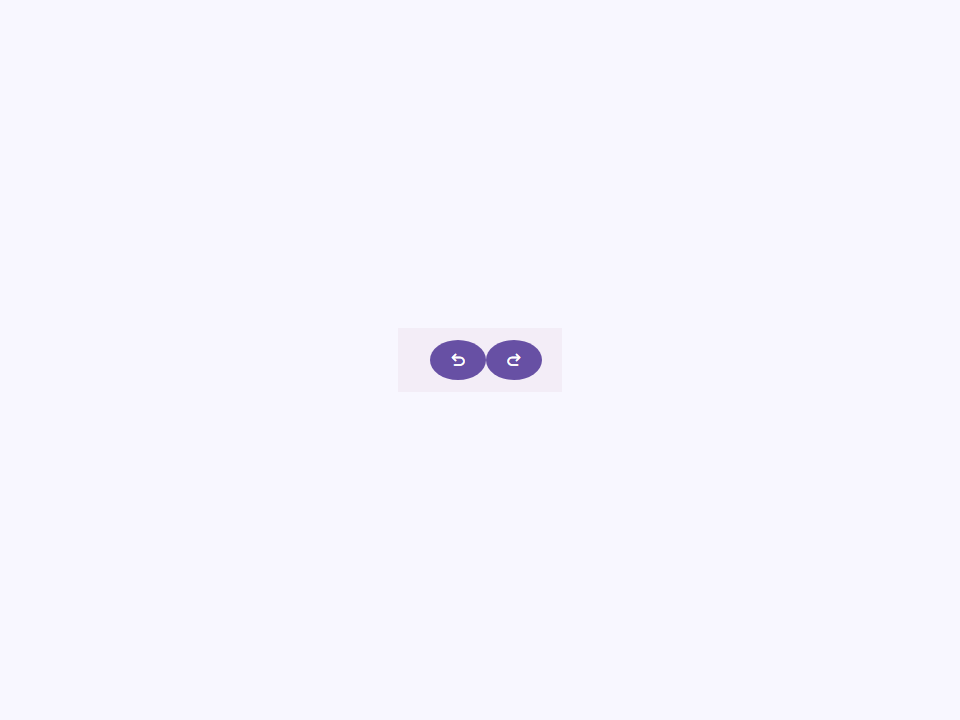

# Toolbar

Componente Material Design 3 Top App Bar (Barra de herramientas superior).

Las barras de aplicación superiores muestran información y acciones en la parte superior de una pantalla.
Se utilizan para identidad de marca, títulos de pantalla, navegación y acciones.

**Referencia a la especificación M3:** `m3-docs/components/top-app-bar/specs.md`

**Nota:** Esta es la barra de herramientas estándar de nivel superior. Para barras de navegación
inferiores (a menudo usadas en móviles), usa `<moni-app-bar>`.

**Variantes:**
- `standard` (por defecto): Una barra de ancho completo (altura de 64dp) que se asienta al ras
  contra la parte superior de la pantalla.
- `floating`: Una barra separada con un margen de 4dp y esquinas redondeadas de 8dp,
  que parece flotar sobre el contenido.

**Comportamiento de desplazamiento (scroll):**
Cuando el atributo `scroll` está presente, la barra de herramientas responde visualmente al
desplazamiento aumentando su elevación (sombra) y cambiando dinámicamente
su color de superficie para indicar profundidad sobre el contenido desplazado.

- Tag: `moni-toolbar`
- Clase: `MoniToolbar`
- Fuente: `src/components/moni-toolbar.ts`

## Cuándo usarlo

Usa `moni-toolbar` cuando la interfaz necesite el patrón que describe este componente. Antes de elegirlo, revisa sus estados, contenido permitido y comportamiento accesible; las capturas del final muestran el resultado real de cada variante.

## Uso básico

```html
<!-- Barra de herramientas estándar con navegación y acciones -->
<moni-toolbar title="Bandeja de entrada">
  <moni-icon-button slot="leading" icon="menu"></moni-icon-button>
  <moni-icon-button slot="trailing" icon="search"></moni-icon-button>
  <moni-icon-button slot="trailing" icon="more_vert"></moni-icon-button>
</moni-toolbar>

<!-- Barra de herramientas flotante con un FAB adjunto -->
<moni-toolbar type="floating" title="Notas">
  <moni-fab slot="action-button" icon="add"></moni-fab>
</moni-toolbar>
```

## Ejemplo práctico con Tailwind CSS v4

Tailwind controla composición, ancho, espaciado y responsividad alrededor del Web Component. Moni UI conserva el aspecto interno mediante Shadow DOM y design tokens.

```html
<div class="mx-auto flex w-full max-w-md flex-col gap-4 p-6">
  <moni-toolbar></moni-toolbar>
</div>
```

No necesitas un plugin de Tailwind. En tu CSS v4 importa ambas capas una sola vez:

```css
@import "tailwindcss";
@import "@moni-labs/moni-ui/styles";

@theme {
  --font-sans: Inter, ui-sans-serif, system-ui, sans-serif;
}
```

Las utilities aplicadas directamente al tag afectan su caja anfitriona. No uses selectores Tailwind para asumir acceso al DOM interno; personaliza únicamente con los CSS Parts y Custom Properties públicos enumerados más abajo.

## Recomendaciones

- Usa `moni-toolbar` para su propósito semántico; no lo sustituyas por un `div` estilizado.
- Aplica Tailwind al layout exterior. Para el interior del Shadow DOM usa las variables CSS y `::part()` documentados.
- Prueba los estados claro, oscuro, foco por teclado, deshabilitado y viewport móvil antes de publicar.

## Propiedades y atributos

| Atributo | Propiedad | Tipo | Default | Descripción |
|---|---|---|---|---|
| `type` | `type` | `'standard' \| 'floating'` | `'standard'` | Selecciona el valor de `type` entre las opciones documentadas. |
| `scroll` | `scrolled` | `boolean` | `false` | Activa o desactiva el comportamiento `scrolled`. En HTML, la presencia del atributo significa `true`; omítelo para `false`. |
| `title` | `title` | `string` | `''` | Define `title`. Conserva el tipo indicado y usa la propiedad JavaScript cuando el valor no sea una cadena. |

## Slots

- `default`: El texto del título o contenido central.
- `leading`: Icono/botón de navegación colocado en el extremo izquierdo.
- `trailing`: Iconos/botones de acción colocados en el extremo derecho.
- `action-button`: Un botón de acción flotante (FAB) anclado al lado derecho.

## Eventos

No declara eventos propios.

## Métodos públicos

No expone métodos públicos adicionales.

## CSS Parts

- `container`: Parte interna personalizable.
- `leading`: Parte interna personalizable.
- `title`: Parte interna personalizable.
- `trailing`: Parte interna personalizable.

## CSS Custom Properties consumidas

- `--font`
- `--on-surface`
- `--shadow1`
- `--shadow2`
- `--shadow3`
- `--speed2`
- `--surface-container`
- `--z-index-toolbar`

## Referencia visual por variable

Cada imagen se genera con el componente real: cambia solo la variable indicada y mantiene estable el resto del escenario. Úsala para comparar estados, no como sustituto de la API.

### `type`

Selecciona el valor de `type` entre las opciones documentadas.


### `scroll`

Activa o desactiva el comportamiento `scrolled`. En HTML, la presencia del atributo significa `true`; omítelo para `false`.


### `title`

Define `title`. Conserva el tipo indicado y usa la propiedad JavaScript cuando el valor no sea una cadena.


