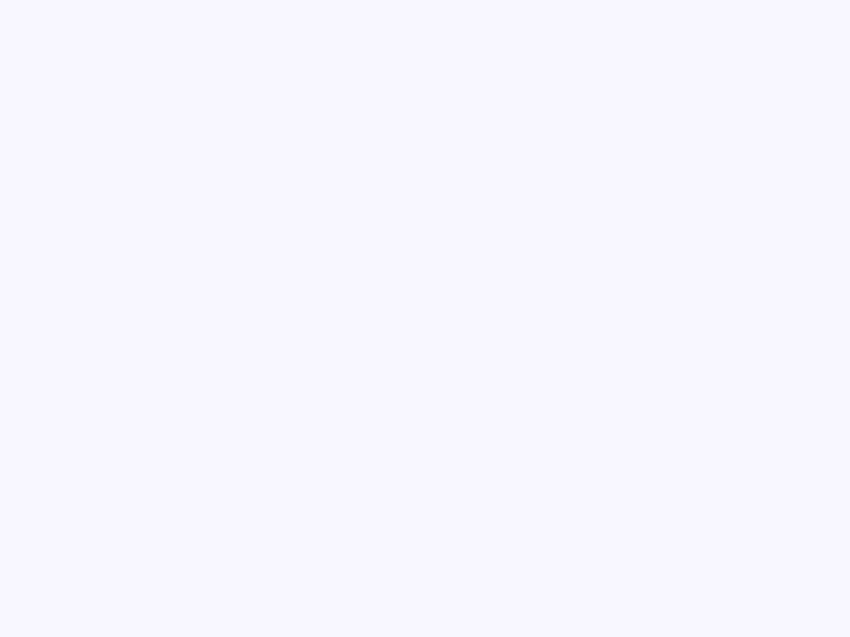
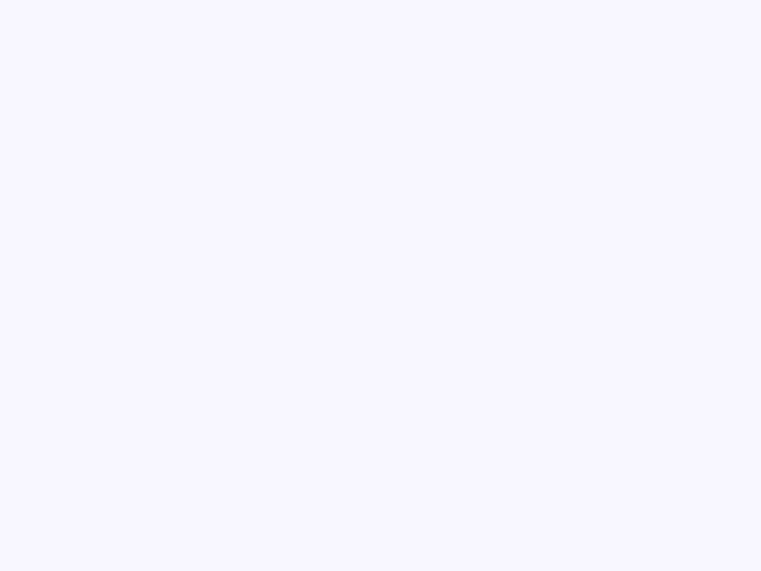
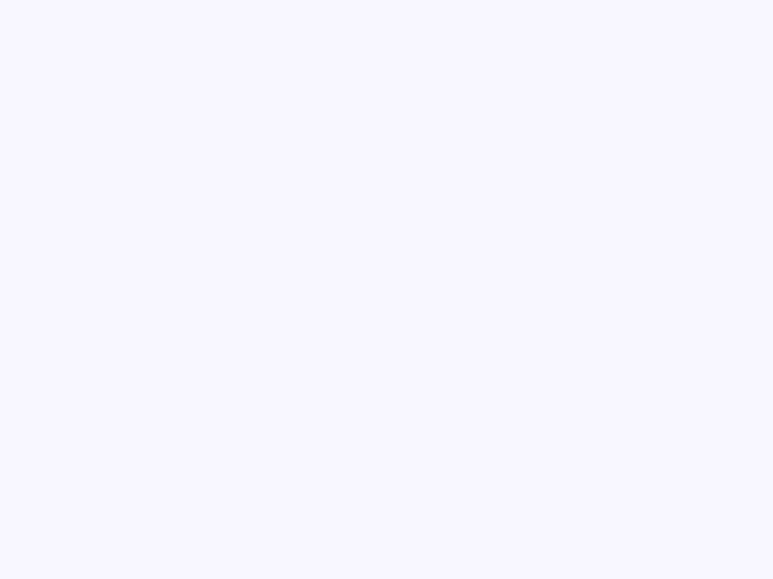
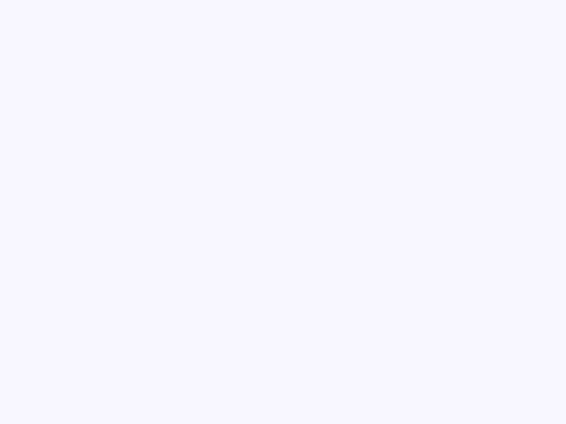
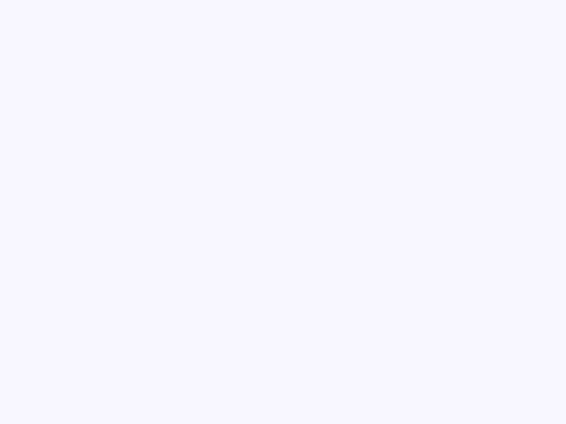
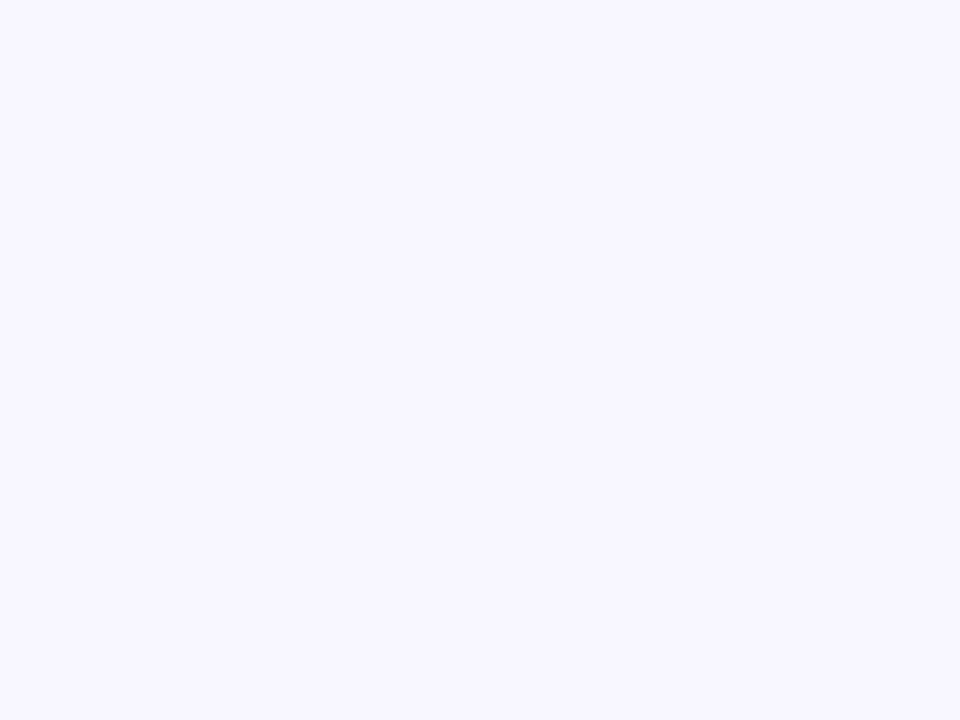
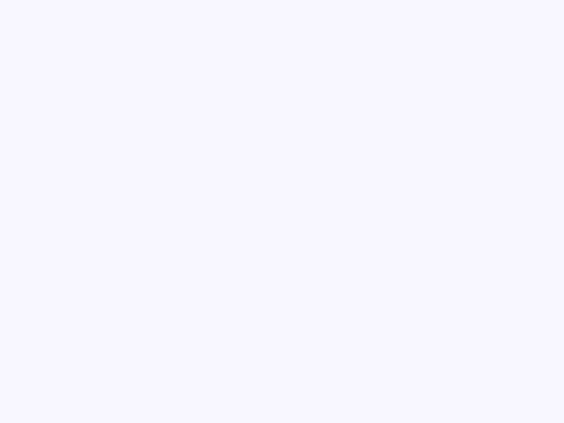
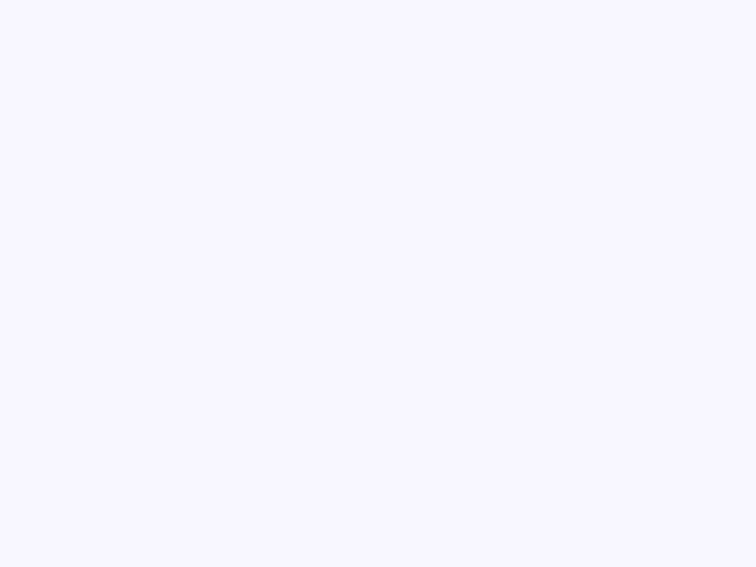
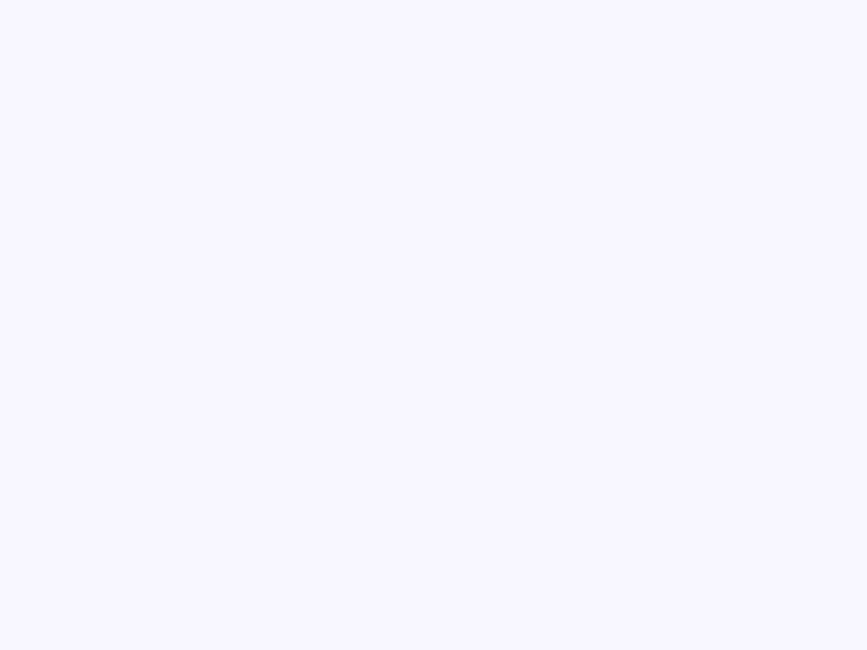

# Tooltip

Componente Material Design 3 Tooltip (Información sobre herramientas).

Los tooltips proporcionan etiquetas de texto contextual o contenido enriquecido que aparecen cuando
los usuarios pasan el cursor por encima, enfocan o tocan un elemento. Muestran información
complementaria que ayuda a los usuarios a entender los elementos de la interfaz sin
ocupar permanentemente espacio en la pantalla.

**Referencia a la especificación M3:** `m3-docs/components/tooltips/specs.md`

**Tipos:**
- **Plain** (por defecto) — Etiqueta solo de texto para descripciones simples (máx. 1 línea).
- **Rich** (atributo `rich`) — Contenido HTML que incluye texto formateado,
  enlaces e iconos. Los tooltips enriquecidos pueden contener múltiples líneas y enlaces de acción.

**Ubicaciones (Placements):**
- `top` (por defecto), `top-start`, `top-end`
- `bottom`, `bottom-start`, `bottom-end`

**Mecanismo de activación (Trigger):**
El tooltip usa `position: absolute` dentro del elemento padre. El padre
debe tener `position: relative` (establecido automáticamente vía `connectedCallback`).
Los eventos hover/focus en el padre activan los selectores CSS `:hover` y
`:focus-within` del tooltip, los cuales impulsan la transición de mostrar/ocultar.

**Accesibilidad:**
- El tooltip tiene `role="tooltip"`.
- Para accesibilidad por teclado, el padre debe tener `aria-describedby`
  apuntando al atributo `id` del tooltip. El componente expone un
  getter `tooltipId` para este propósito.
- La tecla `Escape` cierra los tooltips enriquecidos.

- Tag: `moni-tooltip`
- Clase: `MoniTooltip`
- Fuente: `src/components/moni-tooltip.ts`

## Cuándo usarlo

Usa `moni-tooltip` cuando la interfaz necesite el patrón que describe este componente. Antes de elegirlo, revisa sus estados, contenido permitido y comportamiento accesible; las capturas del final muestran el resultado real de cada variante.

## Uso básico

```html
<!-- Tooltip simple (Plain) -->
<button aria-describedby="save-tip">
  Guardar
  <moni-tooltip id="save-tip" text="Ctrl+S"></moni-tooltip>
</button>

<!-- Tooltip enriquecido (Rich) -->
<button>
  Filtrar
  <moni-tooltip rich position="bottom">
    <strong>Filtrar por fecha</strong>
    <p>Selecciona un rango de fechas para filtrar resultados.</p>
  </moni-tooltip>
</button>
```

## Ejemplo práctico con Tailwind CSS v4

Tailwind controla composición, ancho, espaciado y responsividad alrededor del Web Component. Moni UI conserva el aspecto interno mediante Shadow DOM y design tokens.

```html
<div class="mx-auto flex w-full max-w-md flex-col gap-4 p-6">
  <moni-tooltip><moni-button icon="info" aria-label="Más información"></moni-button></moni-tooltip>
</div>
```

No necesitas un plugin de Tailwind. En tu CSS v4 importa ambas capas una sola vez:

```css
@import "tailwindcss";
@import "@moni-labs/moni-ui/styles";

@theme {
  --font-sans: Inter, ui-sans-serif, system-ui, sans-serif;
}
```

Las utilities aplicadas directamente al tag afectan su caja anfitriona. No uses selectores Tailwind para asumir acceso al DOM interno; personaliza únicamente con los CSS Parts y Custom Properties públicos enumerados más abajo.

## Recomendaciones

- Usa `moni-tooltip` para su propósito semántico; no lo sustituyas por un `div` estilizado.
- Aplica Tailwind al layout exterior. Para el interior del Shadow DOM usa las variables CSS y `::part()` documentados.
- Prueba los estados claro, oscuro, foco por teclado, deshabilitado y viewport móvil antes de publicar.

## Propiedades y atributos

| Atributo | Propiedad | Tipo | Default | Descripción |
|---|---|---|---|---|
| `text` | `text` | `string` | `''` | Contenido de texto simple para mostrar. Utilizado cuando `rich` es falso. |
| `position` | `position` | `'top' \| 'top-start' \| 'top-end' \| 'bottom' \| 'bottom-start' \| 'bottom-end' \| 'left' \| 'right'` | `'top'` | Ubicación preferida relativa al ancla/activador. |
| `rotate-with-target` | `rotateWithTarget` | `boolean` | `false` | Si está activo, el tooltip conserva el ángulo visual del trigger. |
| `size` | `size` | `'' \| 'small' \| 'medium' \| 'large'` | `''` | Mapeo de tamaño opcional (usado por hojas de estilo internas para escalar fuente/relleno). |
| `rich` | `rich` | `boolean` | `false` | Si es true, cambia al modo de Tooltip Enriquecido (permite HTML/componentes en el slot por defecto). |

## Slots

- `default`: Contenido enriquecido para el cuerpo del tooltip (solo usado cuando `rich=true`).

## Eventos

No declara eventos propios.

## Métodos públicos

No expone métodos públicos adicionales.

## CSS Parts

- `tooltip`: Parte interna personalizable.

## CSS Custom Properties consumidas

- `--_anchor-name`
- `--_space`
- `--_tooltip-origin-x`
- `--_tooltip-origin-y`
- `--_tooltip-target-rotation`
- `--font`
- `--inverse-on-surface`
- `--inverse-surface`
- `--speed2`

## Referencia visual por variable

Cada imagen se genera con el componente real: cambia solo la variable indicada y mantiene estable el resto del escenario. Úsala para comparar estados, no como sustituto de la API.

### `text`

Contenido de texto simple para mostrar. Utilizado cuando `rich` es falso.


### `position`

Ubicación preferida relativa al ancla/activador.











### `rotate-with-target`

Si está activo, el tooltip conserva el ángulo visual del trigger.


### `size`

Mapeo de tamaño opcional (usado por hojas de estilo internas para escalar fuente/relleno).








### `rich`

Si es true, cambia al modo de Tooltip Enriquecido (permite HTML/componentes en el slot por defecto).




