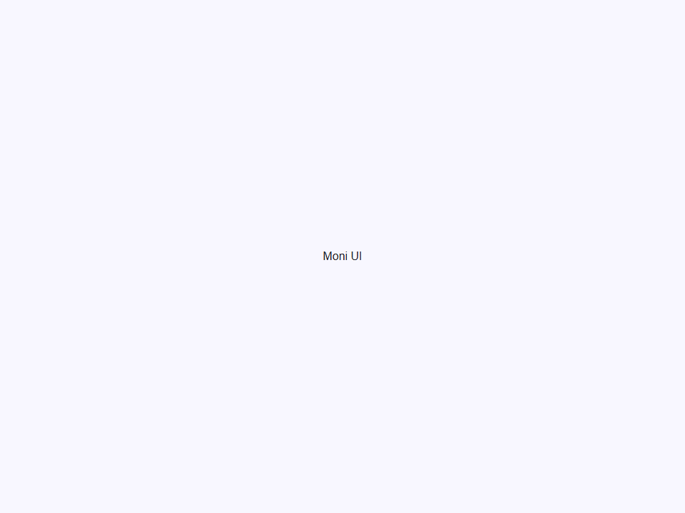
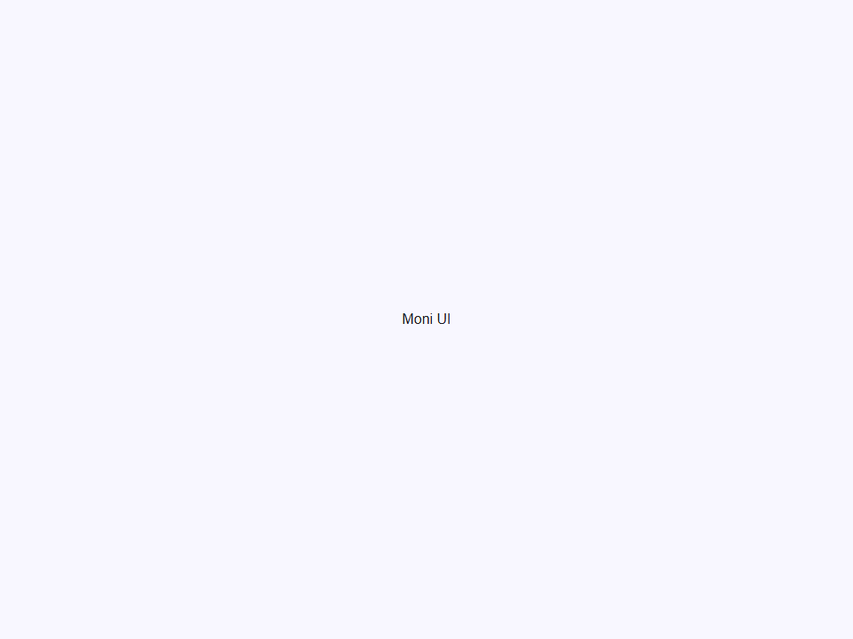
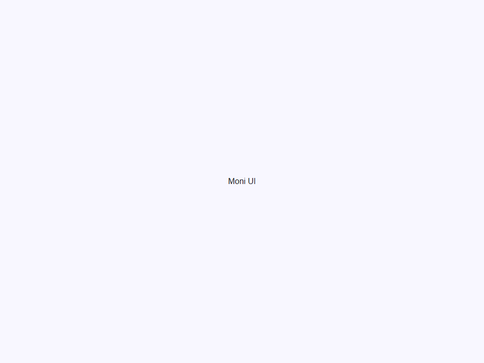

# Typography

Componente Material Design 3 Typography (Tipografía).

Un componente de texto especializado que aplica la escala tipográfica M3. Asegura
que la tipografía sea consistente, accesible y correctamente estilizada en toda la
aplicación sin requerir clases CSS manuales.

**Categorías de Escala Tipográfica:**
- `display`: El texto más grande en la pantalla, reservado para texto corto e importante
  o números. Funciona mejor en pantallas grandes. (Renderiza `<h1>` por defecto).
- `headline`: Texto de alto énfasis para encabezados primarios de página/sección.
  (Renderiza `<h2>` por defecto).
- `title`: Texto de énfasis medio utilizado para encabezados de diálogos o títulos
  de sección más pequeños. (Renderiza `<h3>` por defecto).
- `body`: Texto de párrafo estándar utilizado para contenido largo.
  (Renderiza `<p>` por defecto).
- `label`: Texto pequeño y utilitario usado para botones, leyendas y elementos
  de formulario. (Renderiza `<label>` por defecto).

Cada categoría soporta tres tamaños: `large`, `medium` y `small`.

**Etiquetas Semánticas:**
El componente selecciona automáticamente una etiqueta semántica HTML apropiada basada en
la variante. Puedes sobrescribir esto explícitamente configurando el atributo `as`
(ej., para renderizar un estilo `headline` pero usando una etiqueta `<span>` por razones
de SEO o estructurales).

- Tag: `moni-typography`
- Clase: `MoniTypography`
- Fuente: `src/components/moni-typography.ts`

## Cuándo usarlo

Usa `moni-typography` cuando la interfaz necesite el patrón que describe este componente. Antes de elegirlo, revisa sus estados, contenido permitido y comportamiento accesible; las capturas del final muestran el resultado real de cada variante.

## Uso básico

```html
<!-- Renderiza un <h1> con estilos display-large -->
<moni-typography variant="display" size="large">Texto Héroe</moni-typography>

<!-- Renderiza un <p> con estilos body-medium -->
<moni-typography variant="body">Texto de párrafo estándar.</moni-typography>

<!-- Sobrescribiendo la etiqueta semántica -->
<moni-typography variant="title" as="span">Título en línea</moni-typography>
```

## Ejemplo práctico con Tailwind CSS v4

Tailwind controla composición, ancho, espaciado y responsividad alrededor del Web Component. Moni UI conserva el aspecto interno mediante Shadow DOM y design tokens.

```html
<div class="mx-auto flex w-full max-w-md flex-col gap-4 p-6">
  <moni-typography></moni-typography>
</div>
```

No necesitas un plugin de Tailwind. En tu CSS v4 importa ambas capas una sola vez:

```css
@import "tailwindcss";
@import "@moni-labs/moni-ui/styles";

@theme {
  --font-sans: Inter, ui-sans-serif, system-ui, sans-serif;
}
```

Las utilities aplicadas directamente al tag afectan su caja anfitriona. No uses selectores Tailwind para asumir acceso al DOM interno; personaliza únicamente con los CSS Parts y Custom Properties públicos enumerados más abajo.

## Recomendaciones

- Usa `moni-typography` para su propósito semántico; no lo sustituyas por un `div` estilizado.
- Aplica Tailwind al layout exterior. Para el interior del Shadow DOM usa las variables CSS y `::part()` documentados.
- Prueba los estados claro, oscuro, foco por teclado, deshabilitado y viewport móvil antes de publicar.

## Propiedades y atributos

| Atributo | Propiedad | Tipo | Default | Descripción |
|---|---|---|---|---|
| `variant` | `variant` | `'display' \| 'headline' \| 'title' \| 'body' \| 'label'` | `'body'` | La categoría de la escala tipográfica M3 a aplicar. Dicta la lógica base de font-family, line-height, weight, y letter-spacing. |
| `size` | `size` | `'large' \| 'medium' \| 'small'` | `'medium'` | El tamaño dentro de la categoría de variante elegida. |
| `as` | `as` | `string \| null` | `null` | Sobrescribe la etiqueta semántica HTML por defecto (ej. 'h1', 'p', 'span')  que se asigna automáticamente basándose en la variante (`variant`). |
| `text` | `text` | `string` | `''` | Contenido de texto simple opcional. Típicamente usarías el slot por defecto en su lugar. |

## Slots

- `default`: El contenido de texto a mostrar.

## Eventos

No declara eventos propios.

## Métodos públicos

No expone métodos públicos adicionales.

## CSS Parts

- `text`: Parte interna personalizable.

## CSS Custom Properties consumidas

- `--font`

## Referencia visual por variable

Cada imagen se genera con el componente real: cambia solo la variable indicada y mantiene estable el resto del escenario. Úsala para comparar estados, no como sustituto de la API.

### `variant`

La categoría de la escala tipográfica M3 a aplicar.
Dicta la lógica base de font-family, line-height, weight, y letter-spacing.





### `size`

El tamaño dentro de la categoría de variante elegida.






### `as`

Sobrescribe la etiqueta semántica HTML por defecto (ej. 'h1', 'p', 'span') 
que se asigna automáticamente basándose en la variante (`variant`).


### `text`

Contenido de texto simple opcional. Típicamente usarías el slot por defecto en su lugar.


