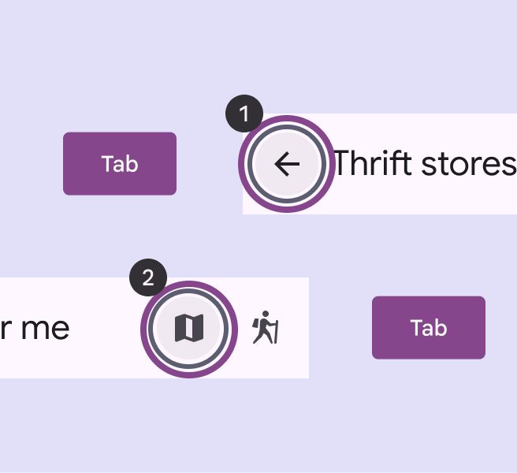
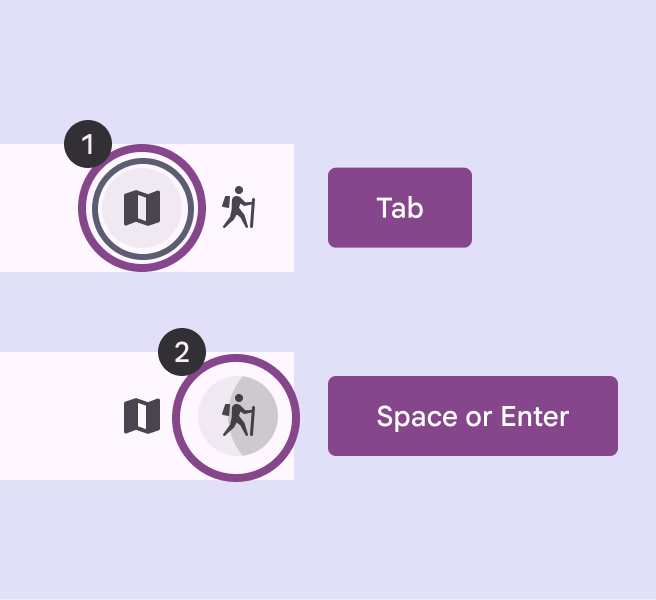
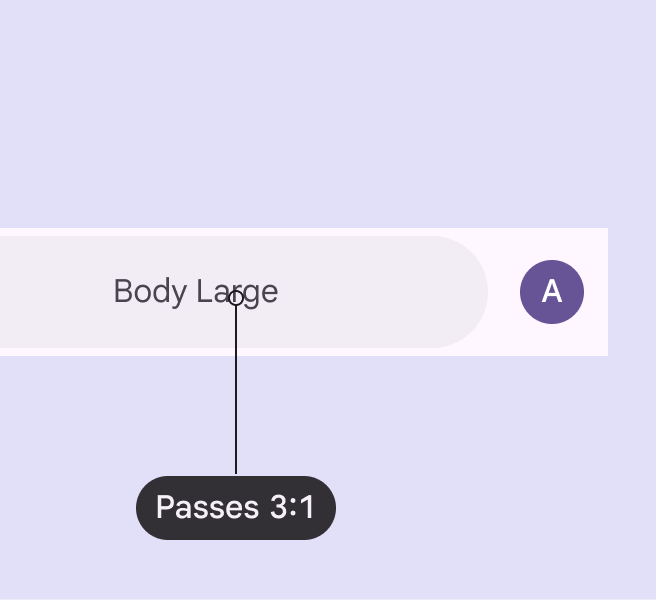
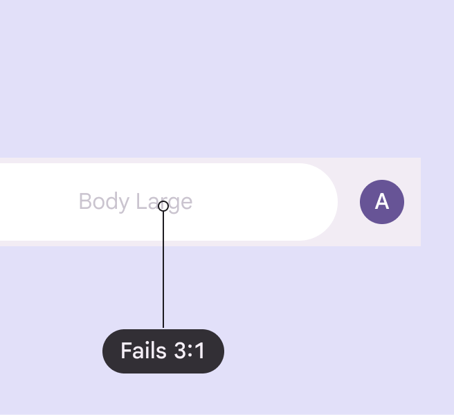
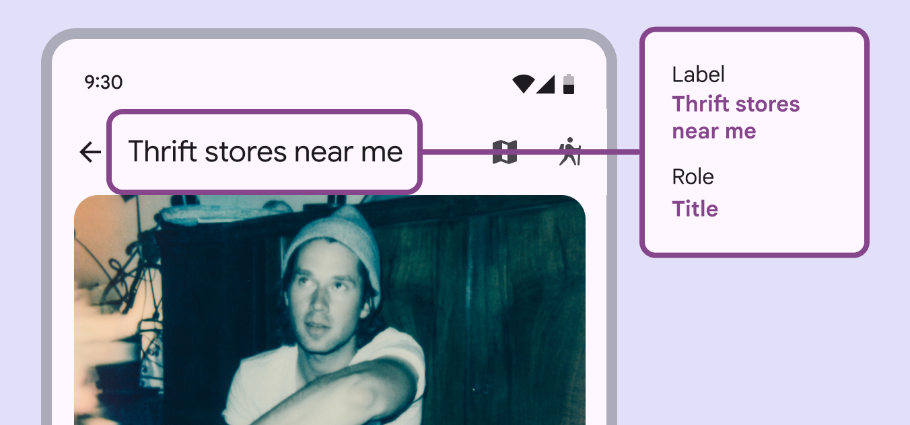
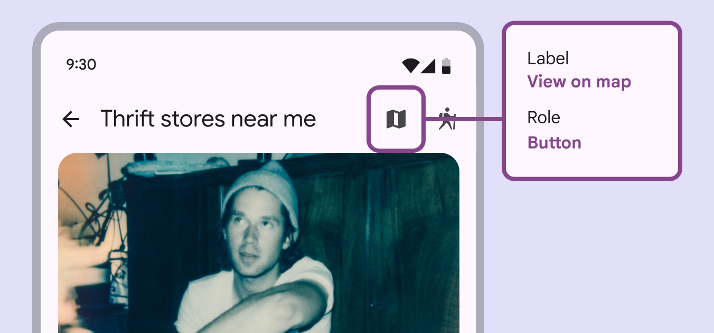

# App bars

App bars are placed at the top of the screen to help people navigate through a product.

## Use cases

People should be able to do the following using assistive technology:

- Understand what page they’re currently visiting
- Take actions or navigate to a new page destination
- Maintain access to app bar actions when the content is scrolled

## Interaction & style

### Touch

When tapping on an icon button, a touch ripple appears, indicating interaction feedback. Touch: Tap

### Cursor

When hovered, the hover state provides a visual cue to the user that the element is interactive. When clicked (in both active and inactive states), a ripple appears to indicate feedback. Cursor: Hover, Click

### Keyboard or switch

When navigating to an interactive element, a focus indicator appears to show that action can be taken. When the element is selected, an action is then performed. Interactive elements should have focus rings

### Initial focus

Focus should initially land on the leading button, since it’s the first interactive element of the app bar.

Use **Tabs** to navigate through interactive items

Use **Space** or **Enter** to activate actions

## Color

On search app bars, use the default color roles when possible.

- Search container: **surface container**
- Search label: **on surface variant**

On darker backgrounds, search bar containers can use the **surface bright** role to maintain strong visual contrast. If mapping to other color roles, make sure the text and container have 3:1 contrast to ensure readability.

check Do

Make sure search bars and their labels have at least 3:1 contrast. Use the default colors when possible.

close Don’t

Avoid using custom color roles for the search bar container and search label text. If custom roles are necessary, make sure they have contrast of at least 3:1.

## Keyboard navigation

<table style="width:100%" class="fr-table-selection-hover"><tbody><tr><th>Keys</th><td>Actions</td></tr><tr><th>Tab</th><td>Move focus to the next interactive element</td></tr><tr><th>Space or Enter</th><td>Activate the focused element</td></tr></tbody></table>

## Labeling elements

The accessibility label for a title should be the same as the content within the title. If needed, add additional context to the accessibility label to ensure users understand what page they’re on or what content is being shown. Screen readers will read the UI text followed by the component’s role.

An app bar’s accessibility label can incorporate its UI text as well as additional context

Label icon buttons according to their [accessibility guidelines](/m3/pages/icon-buttons/accessibility).

An icon button should be clearly labeled on the action it takes, like **View on map**

