# App bars

App bars are placed at the top of the screen to help people navigate through a product.

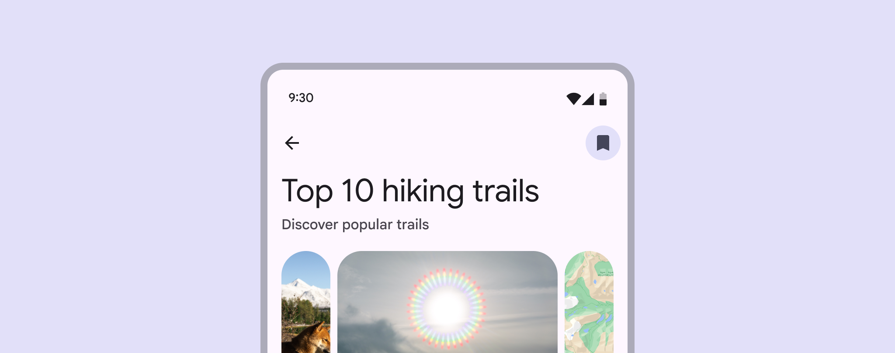

App bars show information about the page, key actions, and navigation actions like **Back** or **Menu**

## Usage

Use an app bar to provide content and actions related to the current page, such as page navigation actions, headlines, images, and 1–2 essential actions. The information and actions in the app bar should be contextual and specific to a page, but can also include global product controls, such as search or notifications.

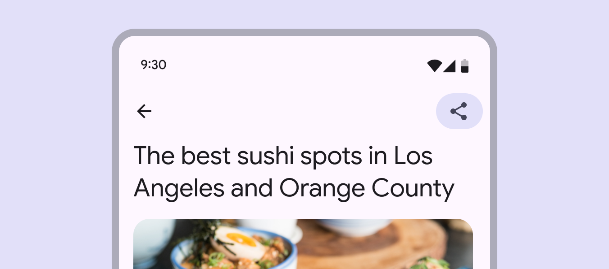

App bars provide content and actions related to the current page

App bars should only have one action, two if necessary. The primary action should alter or exit the entire page, like **Send**, **Save**, or **Edit**. If the product has many actions, place those in a toolbar [More on toolbars](/m3/pages/toolbars/overview). Avoid placing an overflow menu in the app bar when possible.

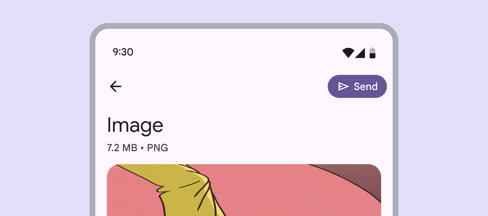

App bars can display one high visibility action to boost its prominence

To boost visibility of a primary action, change the style of the icon button to filled or tonal, and consider using a wide icon button. Avoid using multiple filled or tonal buttons.

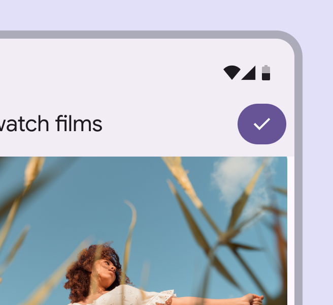

check Do

Use a filled or tonal button for important actions

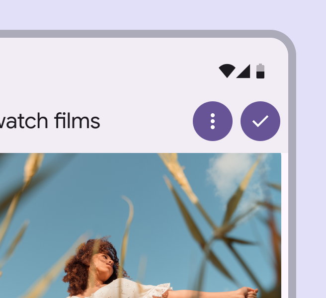

close Don’t

Don’t put multiple filled or tonal buttons in the app bar

The four variants of app bars are:

1. **Search app bar**
    Use on home pages when search is key to the product. 

2. **Small**
    Use in dense layouts or when a page is scrolled.

3. **Medium flexible**
    Use to display a larger headline. It can collapse into a small app bar on scroll.

4. **Large flexible**
    Use to emphasize the headline of the page.

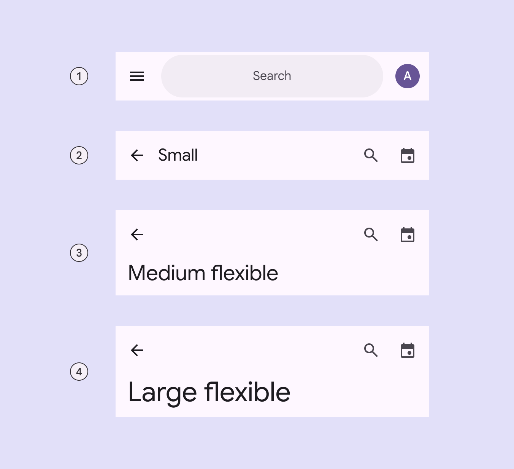

1. Search app bar
2. Small
3. Medium flexible
4. Large flexible

### Baseline app bars

There are two baseline app bars that are no longer recommended:

1. **Medium**
    Replace with medium flexible.

2. **Large**
    Replace with large flexible.

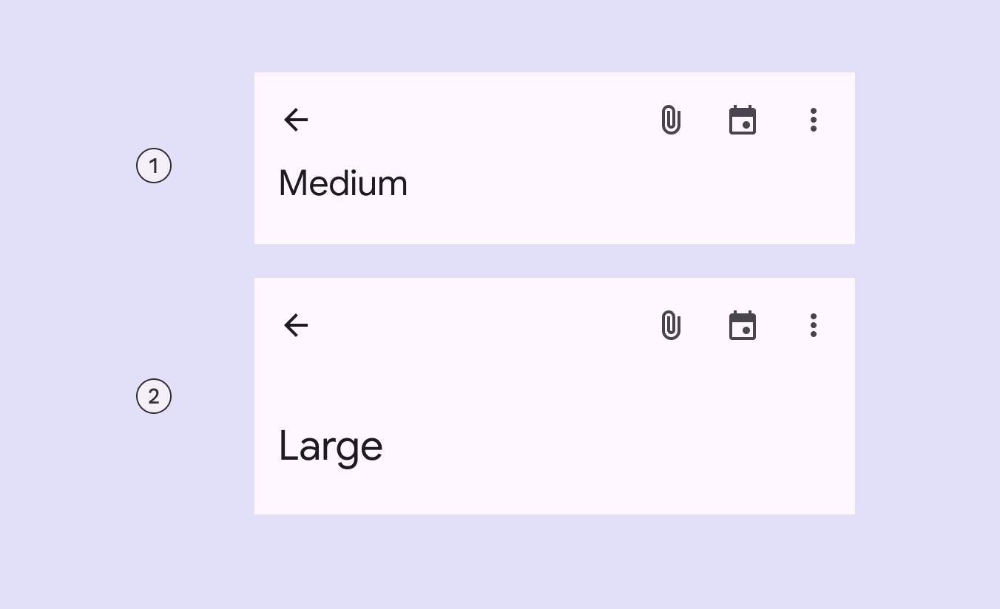

1. Medium
2. Large

## Search app bar

Use a search app bar to provide an emphasized entry-point to open the search view.

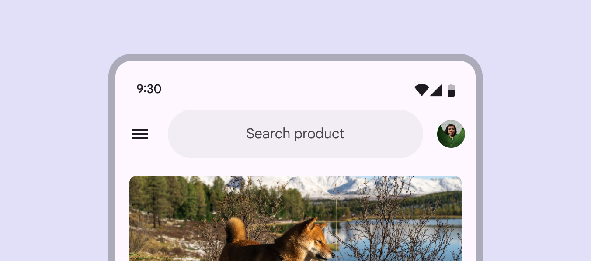

Search app bars have a search field instead of heading text

Search bars [More on search bars](/m3/pages/search/overview) should always include the word **Search**. They can use various capitalization styles depending on the product.

1. **Search**
2. Searching a specific area
    Example: **Search inbox**
3. Search \[Product\]
    Example: **Search Photos**

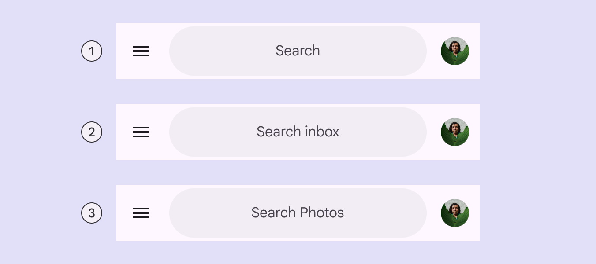

Use proper capitalization depending on what’s being searched

### Buttons in search app bar

In addition to a trailing avatar, search app bars can have up to two trailing icons on mobile. Trailing icons can be placed inside or outside the search bar. 

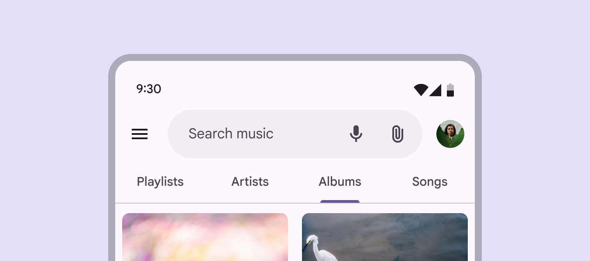

Put the most used actions on the left and least used on the right

The leading element of a search app bar can be used for a product’s logo to brand the app’s overall experience. This logo can be purely cosmetic, or can trigger an action like returning to the home screen or refreshing it. Avoid using a logo to open an expanded navigation rail .

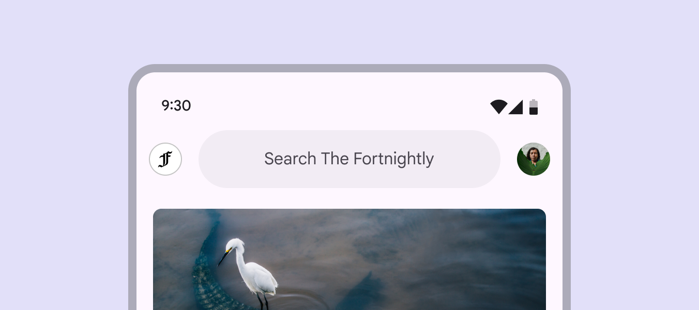

The leading element can be a product logo

Don’t use more than two trailing icon buttons with an avatar. If more actions are needed, place them in a toolbar [More on toolbars](/m3/pages/toolbars/overview) instead.

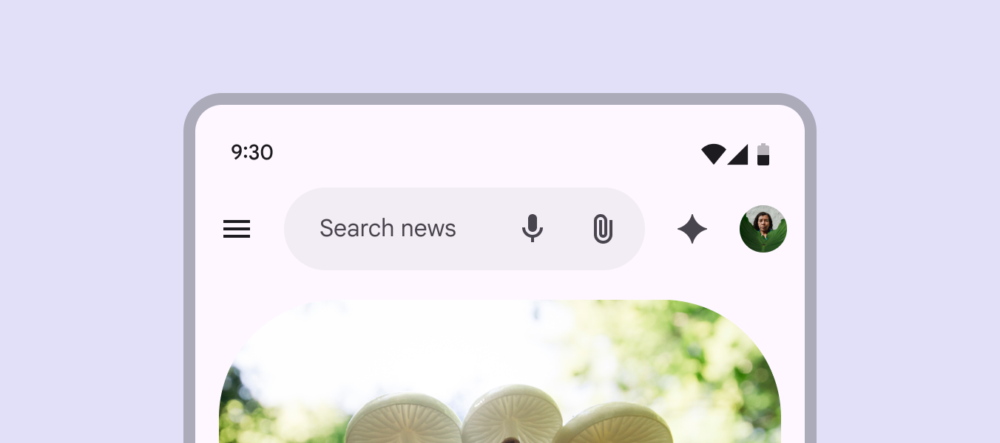

close Don’t

Don’t use three icons and an avatar in a search app bar

### Large screens

The search app bar dynamically adapts to available width. There should be up to four trailing icons on larger screens.

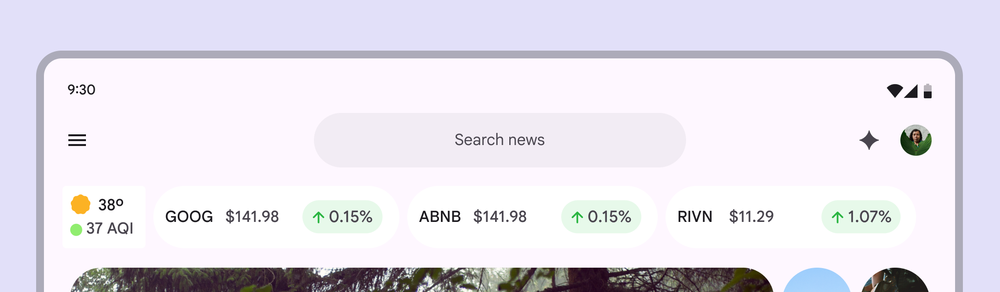

Increased horizontal space on larger screens allows for up to four trailing icons.

### Alternate color options

By default, search containers in app bars use the **surface container** color to distinguish it from the app background. If the background is darker, use a lighter container color on the search bar, like **surface bright**. When choosing alternate colors, make sure the search text and container have at least 3:1 contrast for readability.

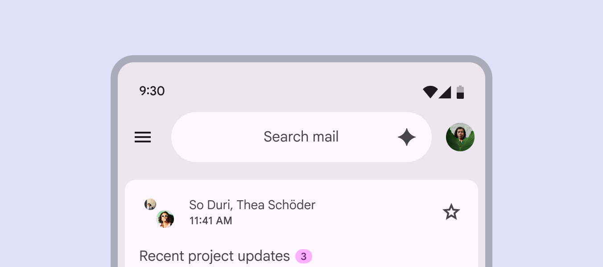

Search app bars can use different colors, like **surface bright**, for improved contrast with surrounding elements

## Anatomy

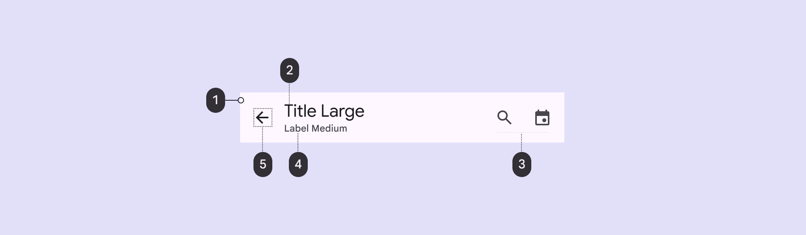

1. Container
2. Headline
3. Trailing icons
4. Subtitle
5. Leading button

### Container

The app bar container holds all information and actions at the top of a screen, including navigation icons, headlines, and buttons. Avoid changing the position or shape of the container.

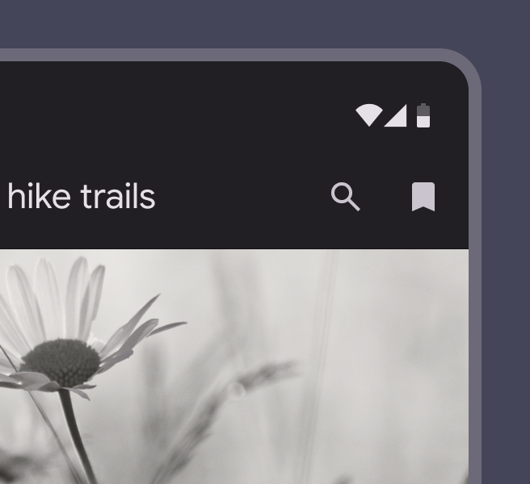

check Do

Use straight corners for app bars

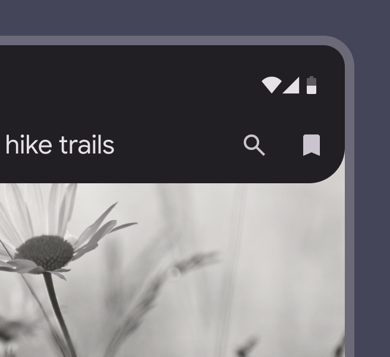

close Don’t

Don’t use curved shapes. This implies that the container can expand upon interaction. Always use the default height of the app bar, and make it span the full width of the window. 

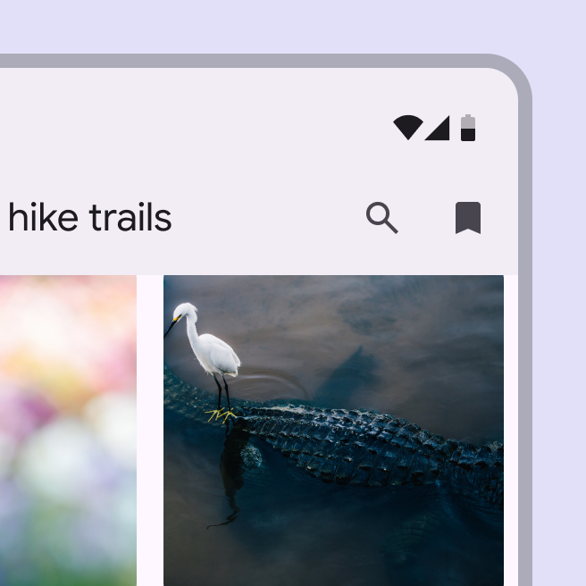

check Do

Default heights were chosen to ensure readability of on-screen elements

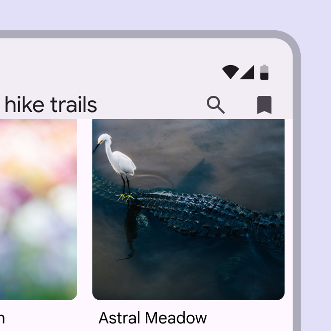

close Don’t

Don't make an app bar shorter than its default height

### Adding logos

Image logos can be used in app bars to bolster brand identity or visual appeal. The image should be high quality and pertinent, and shouldn’t disrupt the app bar's functionality.

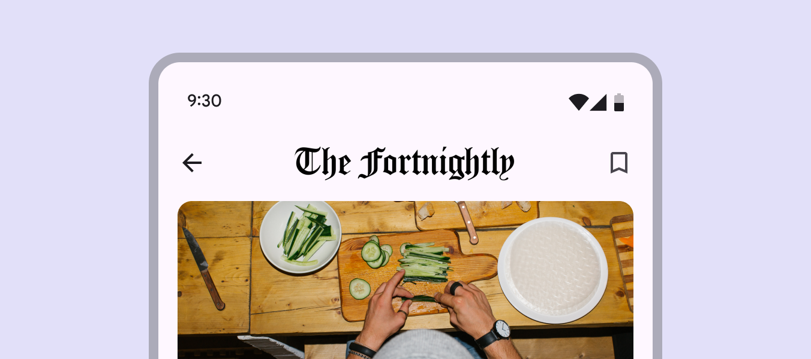

Image logos can replace all text in small app bars, and appear above the text in other app bars

### Leading button

The leading button should be used for navigating the product. It typically is one of the following:

- A menu icon, which opens a modal expanded navigation rail
- A back arrow, which returns to the previous screen

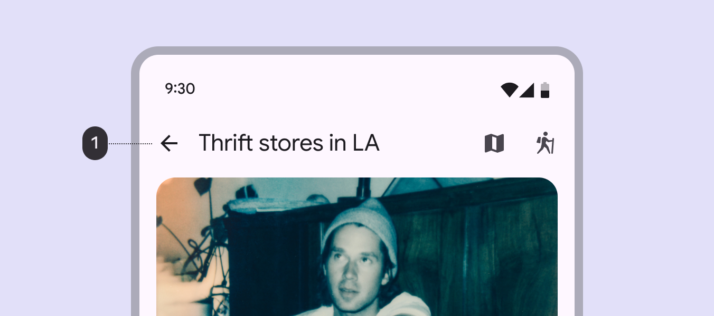

1. Leading **Back** button

### Headline

The headline can describe:

- The current page
- The current section
- The product

Headline text should be brief enough to easily fit in the app bar. In medium flexible and large flexible app bars, the headline can wrap to a second line. Don’t truncate the headline text.

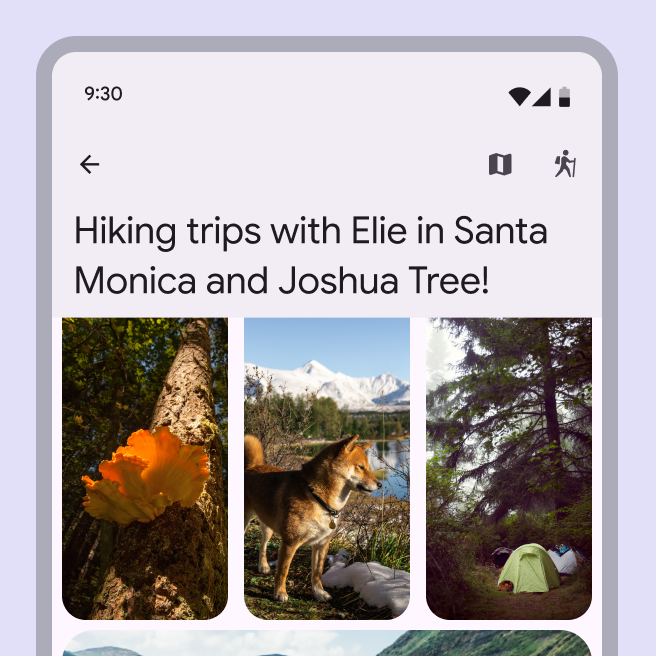

check Do

If headline text is long, use a medium flexible or large flexible app bar and wrap the headline to two lines maximum

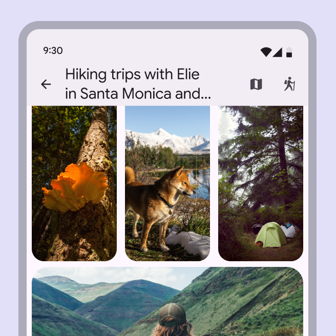

close Don’t

Don’t wrap text in a small app bar

Headlines can be aligned to the leading edge or centered. The headline’s typography size and style change depending on the app bar variant.

Headline typography style for each app bar

1. Search: Body large
2. Small: Title large
3. Medium flexible: Headline medium
4. Large flexible: Display small

### Subtitle

Subtitles can add additional context to a page. These can be leading-aligned or center-aligned with the headline text.

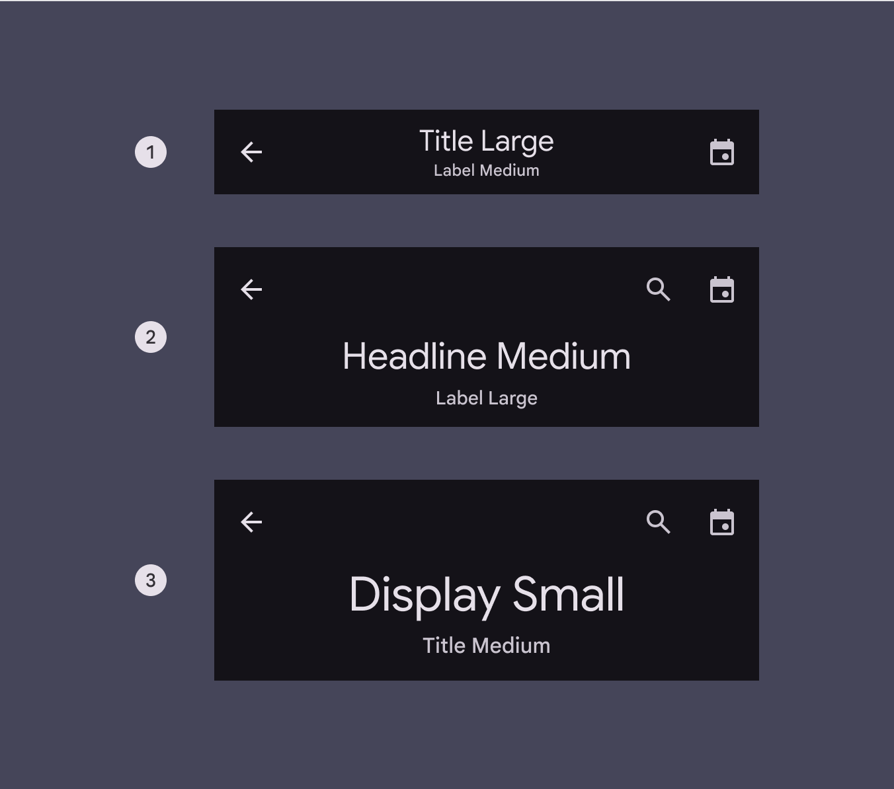

Subtitle typography style for each app bar:

1. Small: Label medium
2. Medium flexible: Label large
3. Large flexible: Title medium

### Trailing icon buttons

Up to two icon buttons can be placed after the headline, aligned to the trailing edge of the app bar. Place most-used actions closest to the leading edge. Avoid using these buttons to open a menu with more actions. If more actions are needed, place them in a toolbar [More on toolbars](/m3/pages/toolbars/overview) instead. If changing the icon button color style to filled or tonal, only use one icon button.

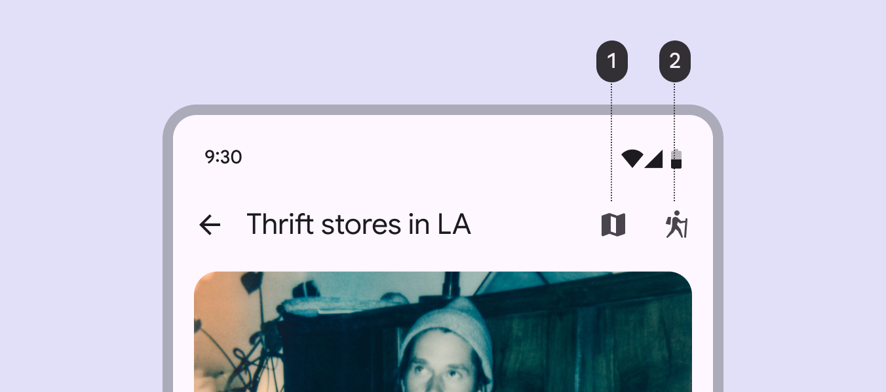

Put the most used actions on the left and least used on the right

Use filled icons when possible for the best visibility. Outlined icons can also be used, particularly for unselected toggle buttons [More on buttons](/m3/pages/common-buttons/overview).

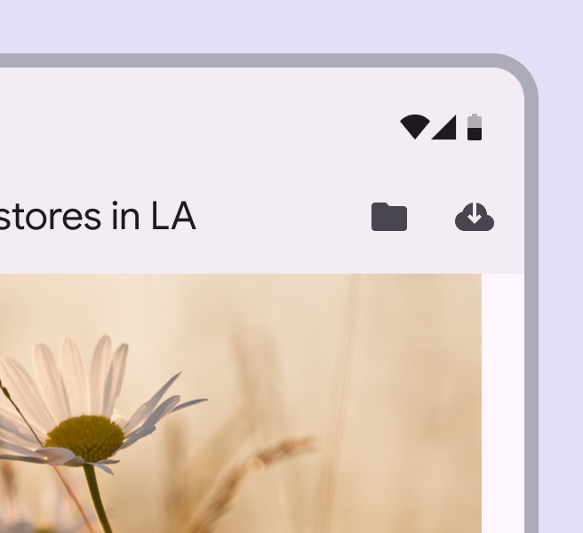

check Do

Use filled icons for clear, visible actions

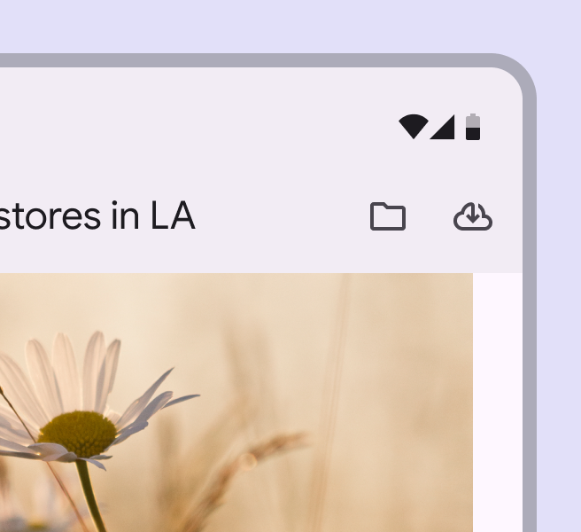

exclamation Caution

Outlined icons can be used as needed, or when using toggle buttons

## Adaptive design

Adaptive design allows an interface to respond or change based on context, such as the user, device, and usage. [More on adaptive design](/m3/pages/layout-overview/adaptive-design)

### Resizing

The width of the app bar container responds to the view or device width. It should always span 100% of the window width. The app bar’s container responds to always fill the window width

Resizing may cause actions at the trailing edge of the app bar to collapse into an overflow menu at smaller window sizes. These actions become visible again at larger sizes. Actions at the trailing edge collapse into an overflow menu

The search container of the search app bar should fill 100% of the space between leading and trailing app bar elements until it reaches 312dp. Then, it should only grow further to fill 50% of that space. The search field adapts to the amount of space between other elements in the app bar

### Presentation

The app bar automatically supports right-to-left (RTL) languages by aligning the layout of elements to the leading and trailing edges of the container. This means that in RTL languages, the layout of the app bar is mirrored.

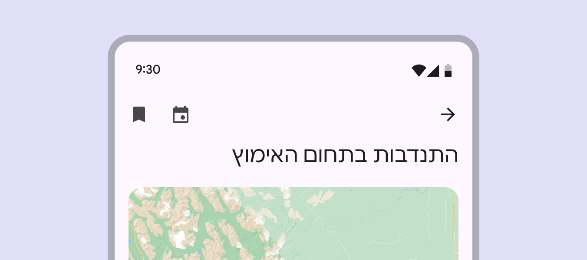

The app bar’s layout is mirrored for right-to-left (RTL) languages

## Behavior

### Scrolling

App bars should initially be the same color as the background, then fill with a contrasting color on scroll to provide visual separation from the background. The app bar can remain on a page at all times, or can hide and reappear when scrolling. Upon scrolling, an app bar container fills with contrasting color to create a visual separation

To focus more on body content, consider setting the app bar container to be transparent on scroll. This allows the buttons to float above the content. Make sure icon buttons have a container fill. Consider using narrow-width icon buttons [More on icon buttons](/m3/pages/icon-buttons/overview) for actions, like **Back**, to reduce the amount of space they take up. Upon scrolling, an app bar container remains transparent and actions inside become filled icon buttons

Selecting the search bar should open the search view [More on search view](/m3/pages/search/overview) component. When selected, a search app bar opens a search view

When scrolled, **medium flexible** and **large flexible** app bars can transform into **small** app bars. They should remain small until the page is scrolled back to the top. Don’t transform app bars into a **search app bar**. The app bar can hide when scrolling up and reveal when scrolling down

Medium and large flexible app bars can use the compress effect to transform into small app bars when scrolled

