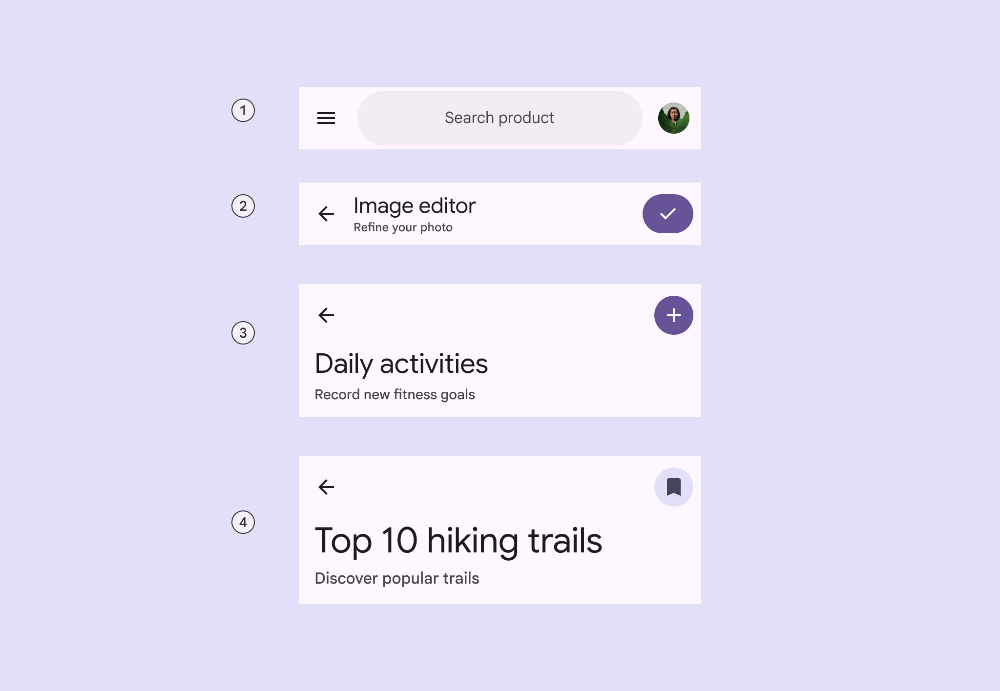
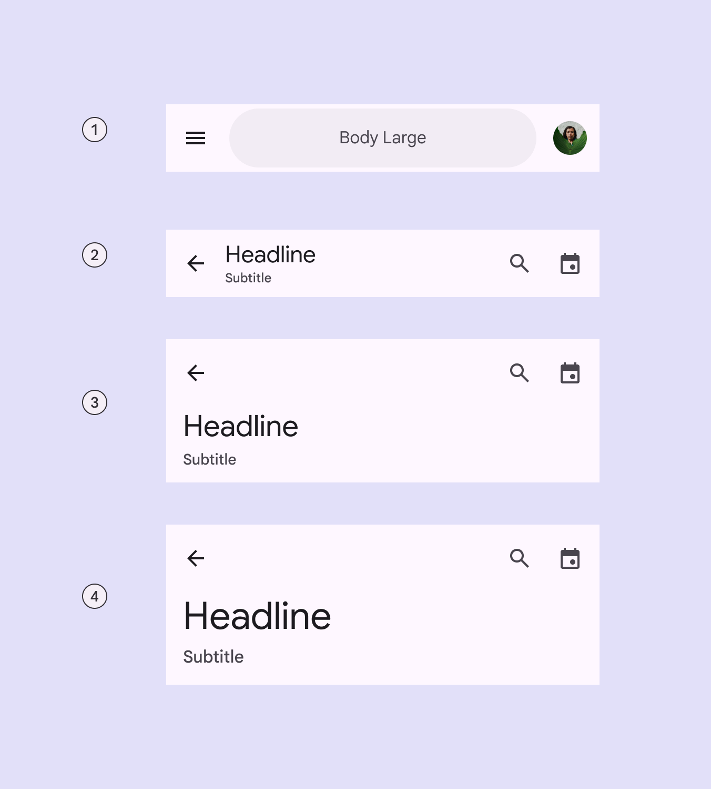
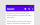
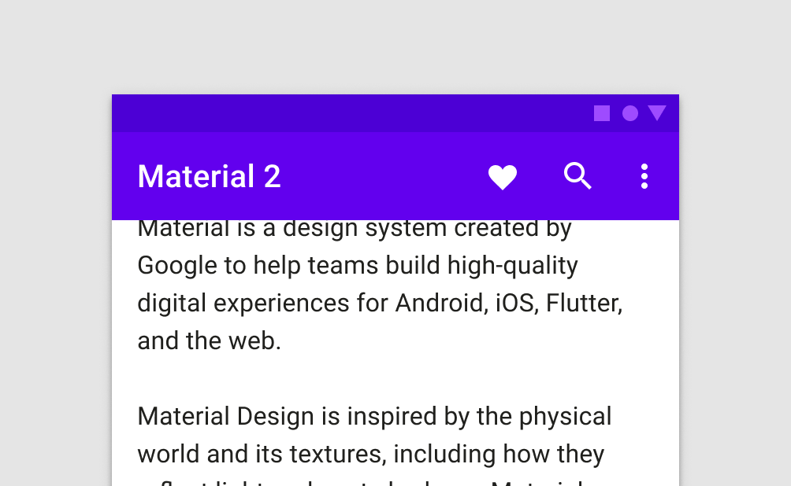
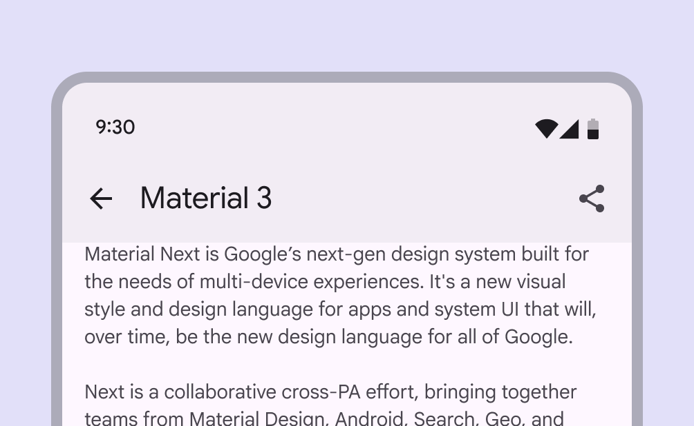

# App bars

App bars are placed at the top of the screen to help people navigate through a product.

- Focus on describing the current page and provide 1–2 essential actions
- Displays labels and page navigation controls at the top of the page. (Use a toolbar [More on toolbars](/m3/pages/toolbars/overview) to display page actions)
- Four variants: Search app bar, small, medium flexible, large flexible
- On scroll, apply a fill color to separate from body content
- Can animate on and off screen with another bar of controls, like a row of chips [More on chips](/m3/pages/chips/overview)

1. Search app bar
2. Small
3. Medium flexible
4. Large flexible

## Availability & resources

| Type | Resource | Status |
| --- | --- | --- |
| Design | [Design Kit (Figma)](https://www.figma.com/community/file/1035203688168086460) | Available |
| Implementation |  | Available |
| Implementation | [Jetpack Compose](https://developer.android.com/develop/ui/compose/components/app-bars?hl=en) | Available |
| Implementation | [Jetpack Compose: Expressive](https://developer.android.com/reference/kotlin/androidx/compose/material3/package-summary#AppBarRow\(kotlin.Function1,androidx.compose.ui.Modifier,kotlin.Function1\)) | Available |
| Implementation |  | Available |
| Implementation |  | Available |

## M3 Expressive update

**May 2025**
The new **search app bar** supports icons inside and outside the search bar, and centered text. It opens the [search view](/m3/pages/search/overview) component when selected. The new **medium flexible** and **large flexible** app bars come with significant improvements, and should replace **medium** and **large** app bars, which are no longer recommended. The **small** app bar is updated with the same flexible improvements. 

[More on M3 Expressive](https://m3.material.io/blog/building-with-m3-expressive)

Variants and naming:

- Renamed component from **top app bar** to **app bar**
- Added **search app bar**
- **Medium** and **large** app bars are no longer recommended
- Added **medium flexible** and **large flexible** app bars with:

    - Reduced overall height
    - Larger title text
    - Subtitle
    - Left- and center-aligned text options
    - Text wrapping
    - More flexible elements for imagery and filled buttons
- Added features to **small** app bar:

    - Subtitle
    - Center-aligned text option
    - More flexible elements for imagery and filled buttons

1. Search app bar
2. Small
3. Medium flexible
4. Large flexible

## Differences from M2

- Color: New color mappings and compatibility with dynamic color
- On scroll: No drop shadow, instead a color fill creates separation from content
- Typography: Larger default text
- Layout: Smaller default height

M2: Elevation and a drop shadow raise the top app bar when content is present underneath

M3: On scroll, a color fill overlay separates the app bar from the content beneath

