# App bars

App bars are placed at the top of the screen to help people navigate through a product.

## Variants

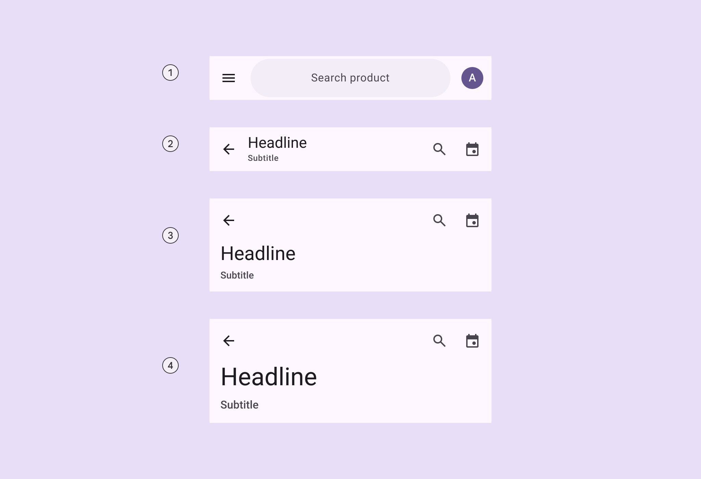

1. Search app bar
2. Small
3. Medium flexible
4. Large flexible

### Baseline variants

The baseline M3 **medium** and **large** app bars are no longer recommended in M3 Expressive, and should be replaced with **medium flexible** and **large flexible** app bars, which are similar visually, but have multi-line support, a shorter height, and can contain a wide variety of elements, like images. [Jump to baseline app bar specs](/m3/pages/app-bars/specs#faec9baf-140f-41dc-8b88-2792e90d9d5d)

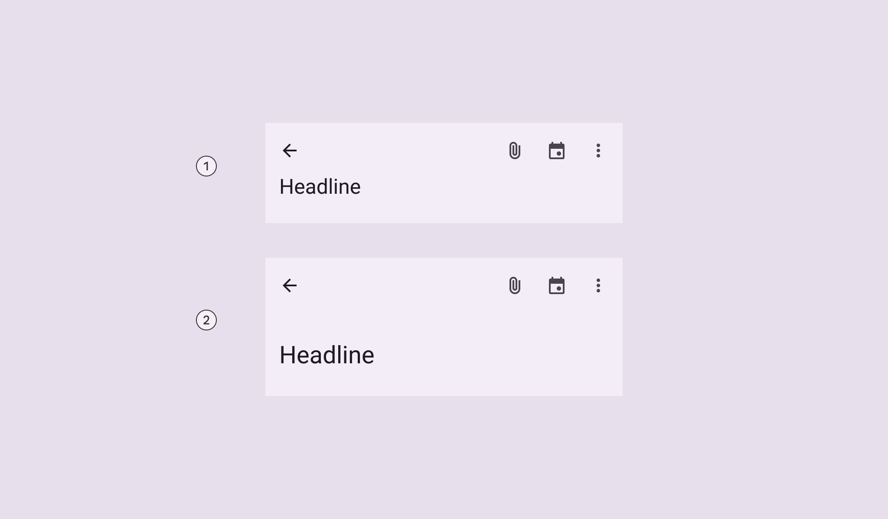

Baseline variants

1. Medium
2. Large

|
Variant

 |

M3

 |

M3 Expressive

 |
| --- | --- | --- |
|

Search app bar

 |

\--

 |

Available

 |
|

Small

 |

Available

 |

Available

 |
|

Center-aligned

 |

Available

 |

Merged into **small**. Use centered-text configuration.

 |
|

Medium (baseline)

 |

Available

 |

Not recommended. Use **medium flexible**

 |
|

Medium flexible

 |

\--

 |

Available

 |
|

Large (baseline)

 |

Available

 |

Not recommended. Use **large flexible**

 |
|

Large flexible

 |

\--

 |

Available

 |

## Configurations

### Text alignment

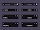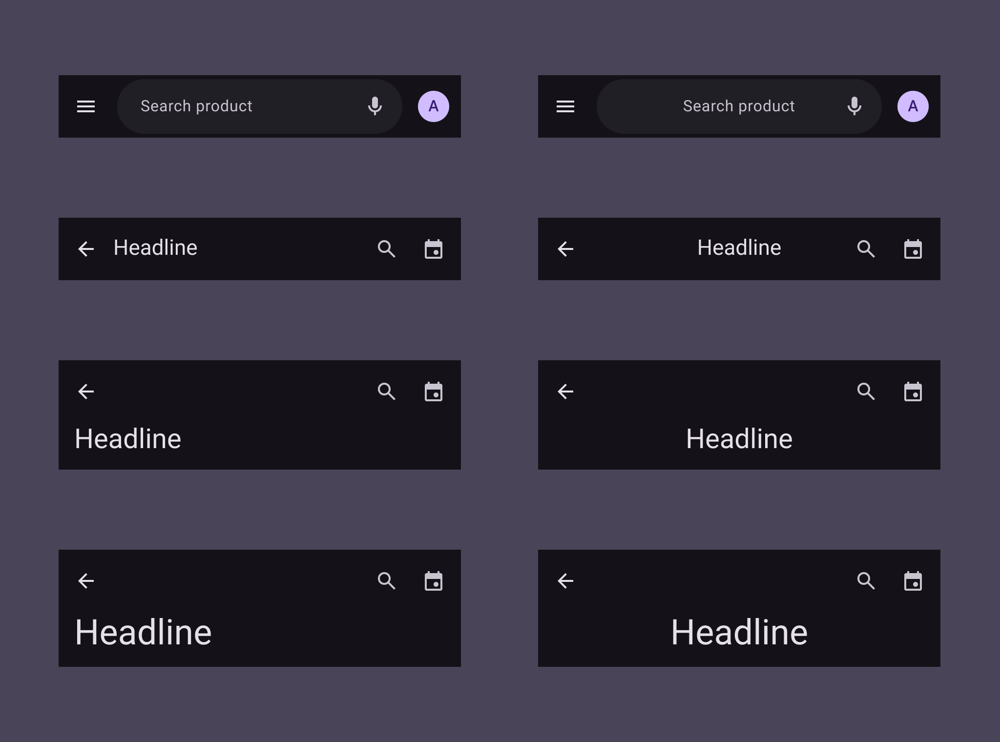

Text labels, including supporting text, can be aligned to the leading edge or centered

|
Category

 |

Configuration

 |

M3

 |

M3 Expressive

 |
| --- | --- | --- | --- |
|

Text alignment

 |

Leading edge (default)

 |

Available

 |

Available

 |
|

Centered

 |

\--

 |

Available

 |

## Tokens & specs

Select a token set to view in the table's menu. App bar token sets are organized into a common token set, and size-specific tokens. [Learn about design tokens](/m3/pages/design-tokens/overview)

```
App bar - CommonTokenValueColorSpacingShapeSize
```

```
App bar - CommonTokenValueColorSpacingShapeSize
```

```
App bar - CommonTokenValueColorSpacingShapeSize
```

```
App bar - Common
```

```
App bar - Common
```

```
App bar - Common
```

```
App bar - Common
```

App bar - Common

Token

Value

Color

Spacing

Shape

Size

### Search component tokens & specs

The default Search lets people enter a keyword or phrase to get relevant information. More on search [More on search](/m3/pages/search/overview) component tokens are used in the search app bar.

```
Search - View
```

```
Search - View
```

```
Search - View
```

```
Search - View
```

Search - View

Token

Default, Light

Search view container surface tint layer color

md.comp.search-view.container.surface-tint-layer.color

#6750A4

Color

Layout and Text

## Anatomy

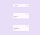

1. Container
2. Leading button
3. Trailing elements
4. Headline
5. Subtitle

App bars can be customized to include:

- An image or logo
- A subtitle
- A filled icon button

Avoid customizing the size of the heading and subtitle, or adding too many actions. 

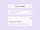

The app bar can have different layouts depending on which elements are shown

### Search

The search app bar can include trailing actions inside and outside the search bar. When the search bar is selected, it should open the search view [More on search view](/m3/pages/search/overview) component.


1. Container
2. Leading icon button
3. Hinted search text
4. Trailing icon or avatar
5. Search container

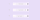

1. A leading element and a trailing element outside search
2. A leading element, a trailing element inside search, and a trailing element outside search
3. A leading element and two trailing elements outside search

### Image 

An image can be placed in the app bar. In small app bars, this can replace the label text.


Images can be added to app bars and can replace label text on small app bars

### Filled trailing icon button

The app bar's trailing icon buttons can be replaced with a single, primary, or tonal filled icon button in default or wide sizes. 

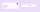

The trailing icons can be configured to be a single filled icon button

### Subtitle

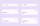

The medium flexible and large flexible app bars hug the text contents, so they are taller when a subtitle is visible

1. Small
2. Small with subtitle
3. Medium flexible
4. Medium flexible with subtitle
5. Large flexible
6. Large flexible with subtitle

## Color

Color values are implemented through design tokens. For design, this means working with color values that correspond with tokens. For implementation, a color value will be a token that references a value. [Learn more about design tokens](/m3/pages/design-tokens/overview)

All app bars share the same color roles. On scroll, the container changes color to **surface container**.

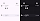

App bar color roles used for light and dark themes:

1. Surface
2. On surface
3. On surface variant
4. On surface
5. On surface variant
6. Surface container (on scroll)

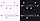

Search app bar color roles used for light and dark themes:

1. Surface
2. On surface variant
3. On surface variant
4. On surface variant
5. Surface container
6. Surface container
7. Surface container highest

### Scroll states

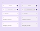

The app bar changes color when flat or on scroll. The search bar can also change color on scroll.

1. Flat
2. On scroll

## Measurements

### Search app bar


Search app bar padding and size measurements

### Small app bar

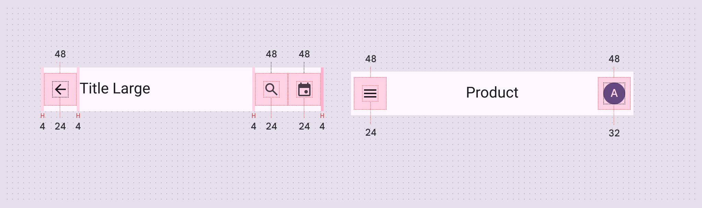

Small app bar padding and size measurements

### Medium flexible app bar

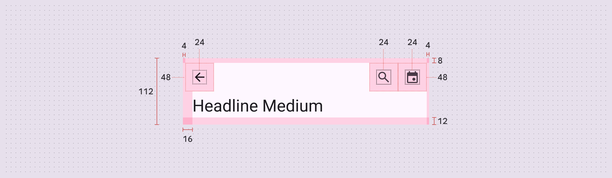

Medium flexible app bar padding and size measurements

### Large flexible app bar

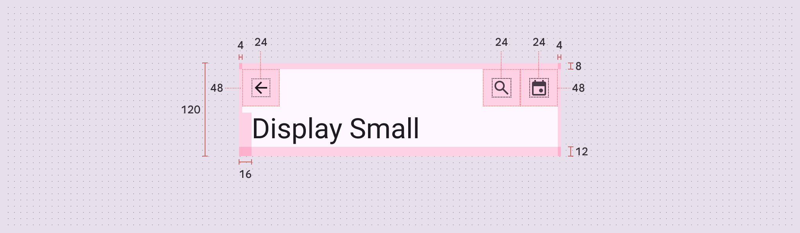

Large flexible app bar padding and size measurements

* * *

## Baseline app bars

The **medium** and **large** app bars are no longer recommended in M3 Expressive. Use the **medium flexible** and **large flexible** app bars in their place.

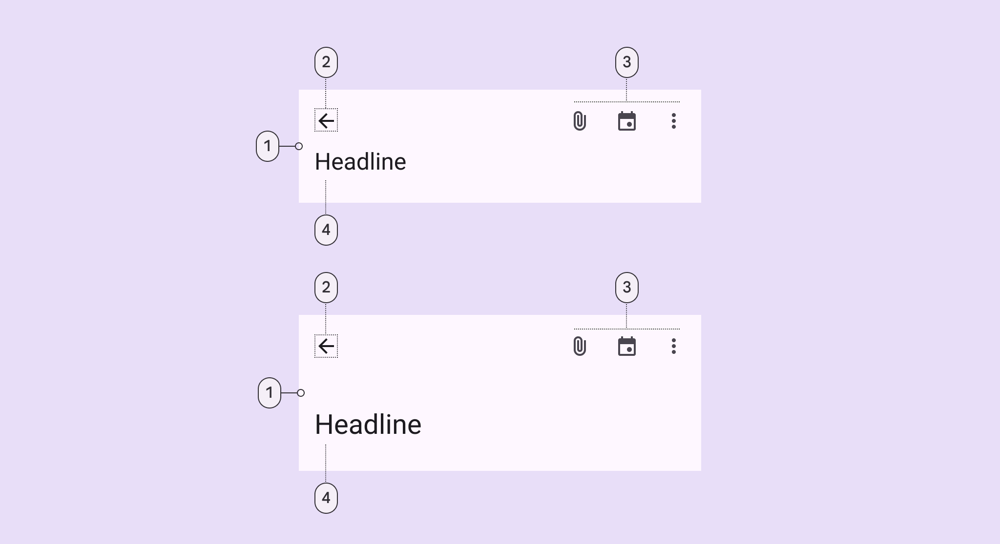

Medium and large app bars have the same elements:

1. Container
2. Leading button
3. Trailing icons
4. Headline

### Tokens & specs

Select a token set to view in the table's menu. Baseline app bar token sets are organized into medium, large, and older baseline token sets. [Learn about design tokens](/m3/pages/design-tokens/overview)

```
App bar - Size - Medium (baseline)TokenValueApp bar medium container heightmd.comp.app-bar.medium.container.height112dpApp bar medium title fontmd.comp.app-bar.medium.title.fontAaApp bar medium icon button sizemd.comp.app-bar.medium.icon.size24dpApp bar medium subtitle fontmd.comp.app-bar.medium.subtitle.fontAa
```

```
App bar - Size - Medium (baseline)TokenValueApp bar medium container heightmd.comp.app-bar.medium.container.height112dpApp bar medium title fontmd.comp.app-bar.medium.title.fontAaApp bar medium icon button sizemd.comp.app-bar.medium.icon.size24dpApp bar medium subtitle fontmd.comp.app-bar.medium.subtitle.fontAa
```

```
App bar - Size - Medium (baseline)TokenValueApp bar medium container heightmd.comp.app-bar.medium.container.height112dpApp bar medium title fontmd.comp.app-bar.medium.title.fontAaApp bar medium icon button sizemd.comp.app-bar.medium.icon.size24dpApp bar medium subtitle fontmd.comp.app-bar.medium.subtitle.fontAa
```

```
App bar - Size - Medium (baseline)
```

```
App bar - Size - Medium (baseline)
```

```
App bar - Size - Medium (baseline)
```

```
App bar - Size - Medium (baseline)
```

App bar - Size - Medium (baseline)

Token

Value

App bar medium container height

md.comp.app-bar.medium.container.height

112dp

App bar medium title font

md.comp.app-bar.medium.title.font

Aa

App bar medium icon button size

md.comp.app-bar.medium.icon.size

24dp

App bar medium subtitle font

md.comp.app-bar.medium.subtitle.font

Aa

### Color

Color values are implemented through design tokens. For designers, this means working with color values that correspond with tokens. In implementation, a color value will be a token that references a value. [Learn more about design tokens](/m3/pages/design-tokens/overview)

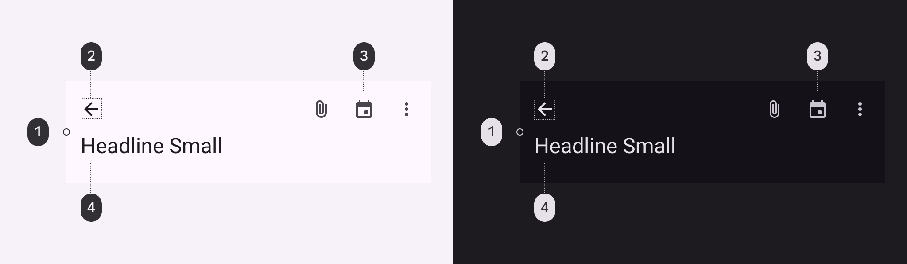

Medium top app bar color roles used for light and dark schemes:

1. Surface
2. On surface
3. On surface
4. On surface variant

### Measurements

#### Medium app bar

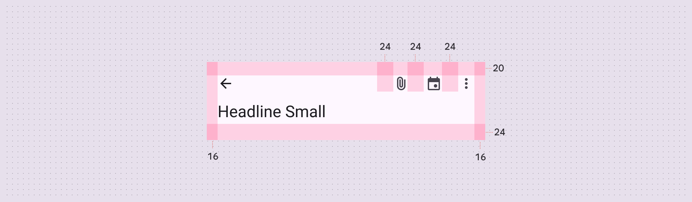

Medium app bar padding and size measurements

#### Large app bar

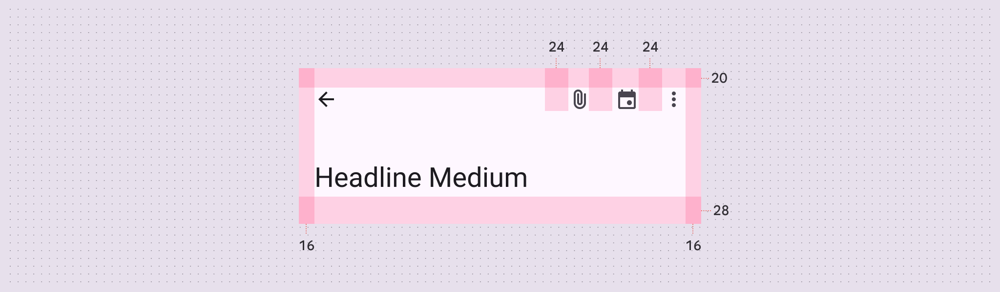

Large app bar padding and size measurements

