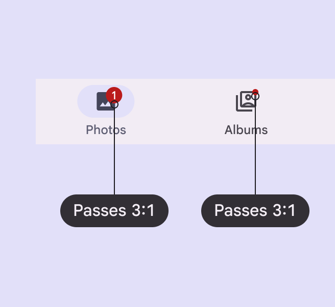
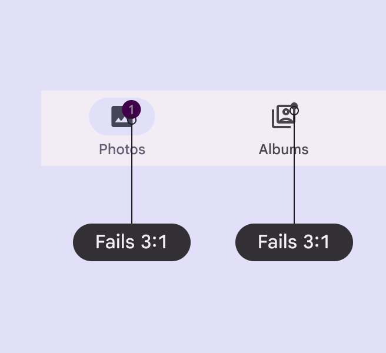
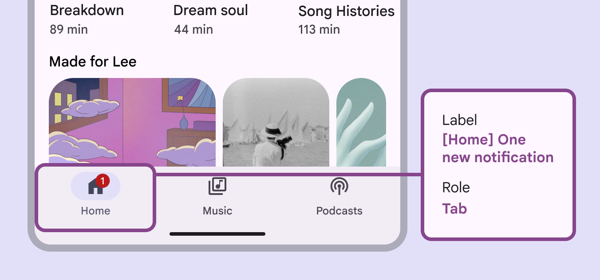
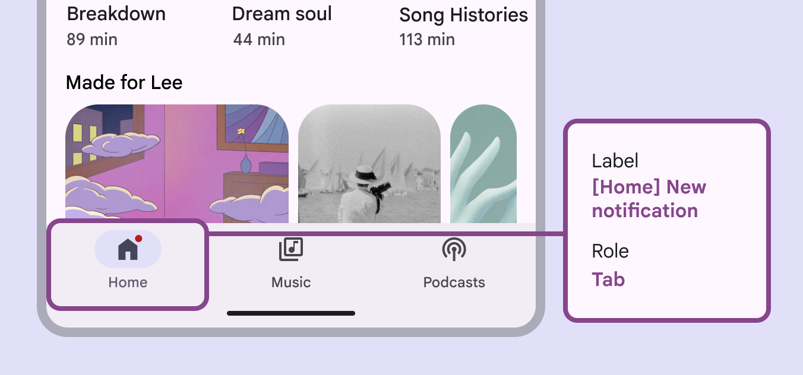

# Badges

Badges show notifications, counts, or status information on navigation items and icons

## Use cases

People should be able to use assistive technology to:

- Understand the dynamic information conveyed in badges, such as counts or labels
- Address badge announcements by selecting corresponding navigation destinations

## Interaction & style

Badges are most commonly used within other components, such as navigation bar [More on navigation bars](/m3/pages/navigation-bar/overview), navigation rail [More on navigation rails](/m3/pages/navigation-rail/overview), app bars [More on app bars](/m3/pages/app-bars/overview), and tabs [More on tabs](/m3/pages/tabs/overview). When a badge is used to indicate an unread notification, the badge gets hidden once it's selected.

## Visual indicators

Badges use a color intended to stand out against labels, icons, and navigation elements. Use the default color mapping to avoid color conflict issues.

check Do

Badges must use default color with at least 3:1 contrast

close Don’t

Avoid using custom color roles for the badge container and label text. If custom roles are necessary, make sure they have contrast of at least 3:1.

## Labeling elements

The accessibility [More on accessibility](/m3/pages/overview/principles) label for a badge item will be read after its navigation destination. Any numerical badges will have their number read, while non-counting badges will simply announce **New notification**.

Numerical badges will have their number read

Non-counting badges will simply announce **New notification**

